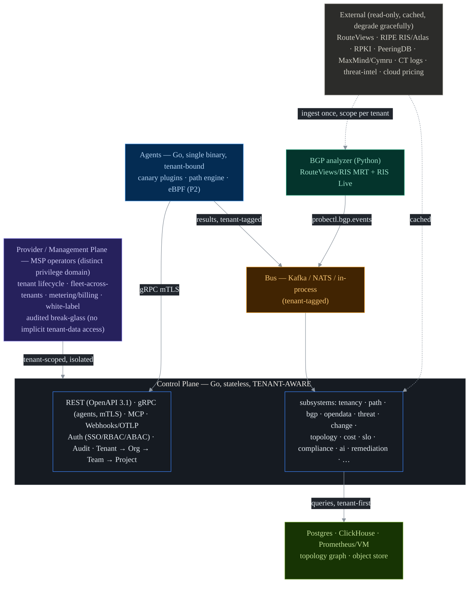

```
                 _               _   _
 _ __  _ __ ___ | |__   ___  ___| |_| |
| '_ \| '__/ _ \| '_ \ / _ \/ __| __| |
| |_) | | | (_) | |_) |  __/ (__| |_| |
| .__/|_|  \___/|_.__/ \___|\___|\__|_|
|_|        see everything · send nothing
```

[](https://github.com/imfeelingtheagi/probectl/actions/workflows/ci.yml)
[](https://github.com/imfeelingtheagi/probectl/tags)
[](https://goreportcard.com/report/github.com/imfeelingtheagi/probectl)


Self-hosted, source-available, multi-tenant **network observability platform**.
probectl unifies five observability planes — active/synthetic testing, BGP/routing
intelligence, flow analytics, device telemetry, and eBPF host/L7 — into one
**OpenTelemetry-native** control plane, with an AI assistant for cross-plane
root-cause analysis, a native security/threat layer, change-aware topology, and
cost/SLO intelligence. Telemetry **never leaves the operator's network**.

One codebase serves two operating modes: **sovereign single-tenant** (a regulated
or air-gapped org self-hosts; the deployment *is* the tenant) and
**multi-tenant / provider** (an MSP self-hosts once and serves many hard-isolated,
white-labeled tenants). The single-tenant install is just the one-tenant case —
there is no separate code path. **Tenant is the outermost scope and security
boundary** on every record, agent, query, metric, event, and object.

> **Status: Phases 0–3 complete, plus the editions and Enterprise tracks.** All
> five observability planes are shipped, alongside cross-plane AI root-cause
> analysis, an MCP server, change-aware topology + what-if, a security/threat
> layer (TLS posture + NDR-lite), cost/SLO/compliance, RUM/carbon/chaos, and the
> multi-tenant provider/MSP plane (hard isolation, white-label, metering, BYOK,
> governance) — plus the Enterprise track: FIPS 140-3 mode, multi-region HA,
> supportability, and guarded (proposal-only, human-gated) remediation.
> Compose + Helm are **HTTPS-by-default**. The license is intentionally **`TBD`** —
> **source-available, not open source (yet)** (the open-core / reseller boundary is
> an open decision).

## Capabilities

The five observability planes:

| Plane | What it covers |
|---|---|
| **Active / synthetic** | canaries (ICMP/TCP/UDP/HTTP/DNS/…), ECMP/MPLS-aware path discovery, browser-synthetic checks, endpoint digital-experience monitoring |
| **BGP / routing** | RouteViews + RIPE RIS ingestion, route/path analysis, RPKI validity, a collective internet-outage view |
| **Flow analytics** | NetFlow / sFlow / IPFIX into ClickHouse, with per-tenant anomaly detection |
| **Device telemetry** | SNMP polling + gNMI streaming, folded into the topology graph |
| **eBPF host / L7** | service map + L7 visibility, observation-only (the Retina model) |

Intelligence, security, and platform layers built across the planes:

| Layer | What it does |
|---|---|
| **AI assistant** | cross-plane RCA grounded in correlated incidents, natural-language semantic query, AI test authoring, and an **MCP server** (read-only tools + a proposal-only remediation tool) — all **tenant- then RBAC-scoped**, with a fully air-gapped local-model path |
| **Topology** | a versioned, change-aware dependency graph with **what-if** impact simulation |
| **Security / threat** | TLS/cert posture + NDR-lite, **confidence-scored detections** (a signal exported to your SIEM — never an inline IPS) |
| **Cost / SLO** | FinOps egress-cost attribution, an OpenSLO engine, and segmentation/compliance validation with evidence |
| **Guarded remediation** | the AI **proposes** a fix grounded in RCA + a dry-run; a human **approves**; probectl **never executes** — proposal-only, blast-radius-limited, fully audited |
| **Multi-tenancy** | tenant is the outermost boundary; **pooled / siloed / hybrid** isolation, selectable per deployment and per tenant |
| **Provider / MSP plane** | tenant lifecycle, fleet-across-tenants, per-tenant metering + quotas, white-label branding, and audited break-glass (no implicit access to tenant telemetry) |
| **Sovereignty & crypto** | no phone-home, mTLS/SPIFFE agent identity, envelope encryption, per-tenant **BYOK**, per-tenant export + verifiable erasure, and an optional **FIPS 140-3** build |

## Architecture



Agents (each bound to one tenant) run probes and push tenant-tagged results onto
the bus; control-plane consumers persist to the stores and build incidents +
topology, all scoped by `tenant_id`; the API, UI, AI, and MCP query the unified
stores **within the caller's tenant first, then RBAC**. The provider plane spans
tenants for operations only — never for silent data access. Deep-dive diagrams
live in **[`docs/architecture.md`](docs/architecture.md)**.

## Editions

The full five-plane platform — all observability, the AI assistant, security/threat,
topology, cost/SLO, and single-tenant self-hosting — is **core, and free**.
Commercial code lives in a **publicly-readable `ee/` tree** (the fence is the
license + trademark, not source secrecy) and is gated at runtime by an
**offline-verifiable, signed license** that **never phones home**. **Enterprise**
adds the FIPS build, BYOK/governance, multi-region HA, and guarded remediation;
**Provider/MSP** adds the management plane, hard tenant isolation, metering/billing,
and white-label. Unlicensed commercial features are simply hidden (no lockware).
See **[`docs/editions.md`](docs/editions.md)**.

## Quickstart (run it)

Bring up the control plane **over HTTPS** with a bundled Postgres (a self-signed
cert is generated on first boot):

```sh
cp deploy/compose/.env.example deploy/compose/.env     # set PROBECTL_ENVELOPE_KEY etc.
docker compose -f deploy/compose/probectl.yml up -d
docker compose -f deploy/compose/probectl.yml cp control:/certs/ca.crt ./ca.crt
curl --cacert ./ca.crt https://localhost:8443/readyz
```

The API is HTTPS-only (no plaintext port). Full guide, real certificates, SSO, and
the Kubernetes/Helm path: **[`docs/install.md`](docs/install.md)**; day-2
operation (audit, roles, SSO): **[`docs/admin.md`](docs/admin.md)**.

## Build from source

Prerequisites: **Go 1.26+**, **Docker** (with Buildx) for the dev stack and
images, and **Python 3.12+** for the analyzer tooling.

```sh
make build          # build all binaries into ./bin
make test           # unit tests across the workspace
make lint           # gofmt + go vet + golangci-lint, and ruff + black
make compose-up     # start the dev dependency stack (Postgres/Kafka/ClickHouse/Prometheus)
make run            # run probectl-control locally
make help           # list every target
```

## Repository layout

```
cmd/            # binaries: probectl-control, probectl-agent, probectl-ebpf-agent,
                #           probectl-endpoint, probectl (CLI)
internal/       # subsystem packages (control, tenancy, path, bgp, crypto, ai, ...)
ee/             # commercial tree (provider plane, white-label, metering, BYOK,
                #   remediation) — publicly readable; core never imports it
pkg/            # shared, public libraries
proto/          # protobuf schemas (gRPC + bus) — buf-managed
analyzer/       # Python BGP analyzer
migrations/     # sequential, idempotent SQL migrations
web/            # frontend (React + Vite + TypeScript, themeable design tokens)
deploy/         # compose (dev stack), helm, terraform, docker, gitops
docs/           # configuration, development, architecture, runbooks
test/           # integration harness (separate Go module)
```

## Documentation

| Topic | Doc |
|---|---|
| Install & deploy (compose / Helm / air-gapped) | [`docs/install.md`](docs/install.md) |
| Day-2 admin (audit, roles, SSO) | [`docs/admin.md`](docs/admin.md) |
| Architecture deep-dives | [`docs/architecture.md`](docs/architecture.md) |
| Every config key | [`docs/configuration.md`](docs/configuration.md) |
| Editions & licensing model | [`docs/editions.md`](docs/editions.md) |
| Tenant isolation (pooled/siloed/hybrid) | [`docs/isolation.md`](docs/isolation.md) |
| Provider / MSP plane | [`docs/provider-plane.md`](docs/provider-plane.md) |
| AI RCA · semantic query · MCP | [`docs/ai-rca.md`](docs/ai-rca.md) · [`docs/ai-query.md`](docs/ai-query.md) · [`docs/mcp.md`](docs/mcp.md) |
| Guarded remediation (policy) | [`docs/remediation.md`](docs/remediation.md) |
| FIPS / hardening · multi-region HA · BYOK | [`docs/hardening.md`](docs/hardening.md) · [`docs/multi-region.md`](docs/multi-region.md) · [`docs/byok.md`](docs/byok.md) |
| Development & CI | [`docs/development.md`](docs/development.md) |
| Vulnerability disclosure | [`SECURITY.md`](SECURITY.md) |

## Contributing

Read [`CONTRIBUTING.md`](CONTRIBUTING.md). Work proceeds one sprint at a time;
commits follow **Conventional Commits** and reference their sprint + requirement
IDs. The canonical product/engineering specs (`CLAUDE.md`, the PRD, and the
sprint plan) are internal and are kept in the private working folder — they are
**not committed** to this repository.

## License

**Source-available — not open source (yet).** The source is published to be read,
audited, and self-hosted, but it is **not** released under an OSI-approved
open-source license, and **no open-source rights are granted at this time**.

The license is intentionally **[`TBD`](LICENSE)**: the open-core / reseller
boundary is still an open decision, with a Business Source License (BSL)–family,
open-core model intended (a core that may open over time; commercial use of the
provider/MSP and Enterprise features reserved). Until a grant is added here, treat
the code as **all rights reserved**.
