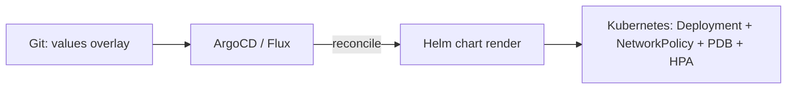

# deploy/gitops/

GitOps manifests for reconciling probectl from Git. The hardened Helm chart
(`deploy/helm/probectl`) is the unit of deployment; these manifests wire it into
ArgoCD or Flux so a `git push` is the only deploy action — no `kubectl apply`,
`helm install`, or click-ops.

```
deploy/gitops/
├── argocd/application.yaml                 # ArgoCD Application
└── flux/{gitrepository,helmrelease}.yaml   # Flux source + HelmRelease
```

These manifests are structurally validated in CI (`make gitops-gate`, run by the
`helm-gate` job), so a broken reference manifest fails the build. The deep dive —
how Terraform, GitOps, and the chart hardening fit together — is
[`docs/iac-gitops.md`](../../docs/iac-gitops.md).

## Config-as-code

The declarative probectl config IS the Helm values: `control.*`, `oidc.*`,
`database.url`, and `control.extraEnv` map to `PROBECTL_*` env via the chart's
ConfigMap; the size profiles (`values-{small,medium,large}.yaml`) and
`values-multitenant.yaml` are the reference overlays. Put your chosen overlay in
Git, point Argo/Flux at it, and the cluster converges.



## Secrets (never in Git)

The manifests reference `secrets.existingSecret` rather than inlining the envelope
key / DB DSN / OIDC secret. Manage that Secret with **Sealed Secrets** or the
**External Secrets Operator** (sourced from Vault / a cloud KMS), so no plaintext
credential is ever committed. The chart refuses to render without an envelope key
(no default credentials), and is HTTPS-by-default.

## ArgoCD

```bash
kubectl apply -f deploy/gitops/argocd/application.yaml
```

Edit `repoURL`, `valueFiles` (the size profile), and the `ingress.host` /
`secrets.existingSecret` parameters. `syncPolicy.automated` with `prune` +
`selfHeal` makes the cluster self-correcting; `CreateNamespace=true` and
`ServerSideApply=true` are set.

## Flux

```bash
kubectl apply -f deploy/gitops/flux/gitrepository.yaml
kubectl apply -f deploy/gitops/flux/helmrelease.yaml
```

Edit the GitRepository `url` and the HelmRelease `values` (or `valuesFrom` a
ConfigMap holding a full size profile). `install.createNamespace` and the
upgrade/install `remediation.retries` give automatic rollback on a failed
reconcile.

## Stand-up

A clean stand-up is: pre-create the `probectl-secrets` Secret → apply the GitOps
manifest → the controller renders the chart and applies the namespace,
Deployment, Service, hardened ingress, NetworkPolicy/PDB/HPA, and the migrations
init-container. Rolling upgrades and rollback are then driven by the same Git
source — change the chart version or values in Git and the controller reconciles.

A converged sync is a running control plane, not yet a useful one — data appears
once agents are deployed and reporting. Continue with
[`docs/getting-started.md`](../../docs/getting-started.md) and
[`docs/deploying-agents.md`](../../docs/deploying-agents.md).
