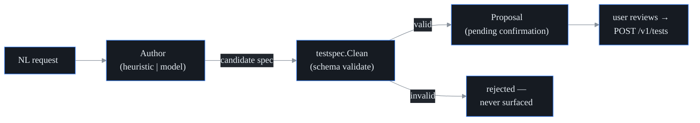

# AI test authoring + auto-discovery (S26)

probectl turns a natural-language request into a synthetic-test config, and mines
observed telemetry to propose monitorable targets — both **propose-only**: nothing
is created until a human confirms (CLAUDE.md §7 guardrail 8). It drives
time-to-first-insight down.

## One schema, validated before display

Every test config — typed in the UI, authored from natural language, or
discovered — validates against the **canonical schema** (`internal/testspec`), so
a config that is valid in one place is valid everywhere. An authored or discovered
config is **always schema-checked before it is surfaced**; an invalid one is never
shown for confirmation (S26 watch-out).

## Authoring (NL → config)

The default author is a deterministic, **air-gapped heuristic**: it extracts a
target + type from the request (URLs, IPs, hostnames, ports, and a few well-known
services — so "check Salesforce login" yields an HTTP test to login.salesforce.com).
When a model is configured (the S24 model config), a **model-backed** author
handles open-ended requests — and its output is still schema-checked, so a
malformed answer is rejected, not shown.

`POST /v1/ai/author` `{prompt}` → a `TestProposal`. It NEVER creates the test; the
user applies it via `POST /v1/tests`.

## Auto-discovery

`POST /v1/ai/discover` mines the tenant's observed telemetry for monitorable
targets that have no test: it suggests a test type (by port/kind), **thresholds
low-signal noise**, **dedups against existing tests**, ranks, and caps the result.
Today it sources targets from incidents; the eBPF service map, flows,
BGP-monitored prefixes, and DNS plug into the same `Observation` input as those
sources are wired. Proposals only.

## Surface

The Targets page hosts the **review-and-apply** flow: an "Author with AI" box
(describe → proposal → Create) and a "Suggested to monitor" list (Add). Nothing is
created without confirmation. Both routes require `test.write`.

## Out of scope

Auto-applying tests; remediation (S-EE5). Richer discovery sources arrive with the
eBPF / flow / BGP / DNS wiring.
