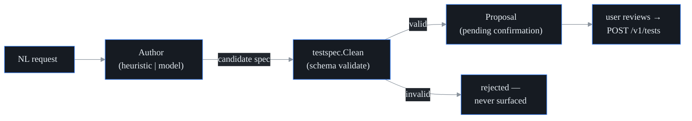

# AI test authoring and auto-discovery

## What it is

Two ways to get from "I want to monitor this" to a configured synthetic test
*without* hand-writing config:

- **Authoring** — you type a request in plain English ("monitor the Salesforce
  login page", "ping 9.9.9.9 from every site"), and probectl proposes a ready-to-go
  test config.
- **Auto-discovery** — probectl mines the telemetry it has *already observed* for
  things worth monitoring that have no test yet, and proposes those too.

Both are strictly **propose-only**: probectl never creates a test on its own. It
hands you a candidate; you review it and click create. This is the platform's
human-gated rule applied to authoring — an AI (or a discovery heuristic, or a
prompt-injection riding in observed telemetry) can at most *suggest* a test, never
make one. The point is to shrink time-to-first-monitor, not to take the wheel.

## One schema, validated before you ever see it

Every test config in probectl — whether you typed it in the UI, authored it from
natural language, or it came from discovery — is the same canonical type,
`testspec.Spec` (`internal/testspec`). That single source of truth means a config
that's valid in one place is valid everywhere.

The load-bearing rule: **an authored or discovered config is schema-validated
*before* it's surfaced for confirmation.** The authoring engine
(`internal/ai/author/author.go`) always runs the candidate through
`testspec.Clean` and only returns it if it passes:

```go
clean, err := testspec.Clean(spec)
if err != nil {
    return Proposal{}, fmt.Errorf("%w: the authored config was invalid (%v)", ErrCannotAuthor, err)
}
```

So an invalid config — including a malformed answer from a language model — is
*rejected*, never shown to you as something to approve. You can't accidentally
create garbage because garbage never reaches the review step.

## Authoring: natural language to config



There are two authors behind the same interface (`author.Proposer`), and which one
runs depends on your config:

- **The heuristic author (default, air-gapped).** A deterministic parser that
  needs no model and makes no network call (`HeuristicAuthor`). It pulls a target
  and a test type out of your words: URLs become `http` tests, IPs become `icmp`
  (or `tcp`/`udp` if you mention a port), hostnames default to a web check unless
  you say "dns"/"resolve" or "ping", and a small list of well-known services is
  recognised by name — so "check Salesforce login" yields an `http` test to
  `login.salesforce.com`. If it can't find a host, IP, or URL, it returns a clear
  "could not derive a test" error telling you to include one — or configure a
  model.
- **The model-backed author (when a model is configured).** When
  `PROBECTL_AI_MODEL_PROVIDER` points at a model, a `ModelAuthor` handles
  open-ended requests the heuristic can't. It asks the model for strict JSON, and
  the engine schema-validates that answer exactly like any other — so a malformed
  or invalid model response is rejected, not shown.

Because the model-backed author can send your prompt to a remote model, it rides
the **same egress gate** as remote-model RCA: per-tenant consent, redaction, and
audit (`docs/ai-egress.md`). A remote authoring call for a tenant that hasn't
consented is denied — and the air-gapped heuristic still works for everyone.

**API:** `POST /v1/ai/author` with body `{prompt}` → a `Proposal` (the spec plus a
short rationale and which author produced it). It **never creates the test**; you
apply the returned spec via `POST /v1/tests`. Each authoring call is recorded in
the tenant's tamper-evident audit log as `ai.author` (the proposed type + target,
never the prompt's secrets) — proposing is a data-access action like any other.

## Auto-discovery: mine what's already observed

`POST /v1/ai/discover` looks at the tenant's own observed telemetry and proposes
monitorable targets that currently have *no* test (`internal/ai/author/discovery.go`,
handler in `internal/control/authoring.go`). It:

- **suggests a test type** from what it saw (port 443 → `http` over https, port 53
  → `dns`, a bare IP → `icmp`, and so on);
- **thresholds low-signal noise** so it doesn't propose every stray packet;
- **dedups against your existing tests** (a discovered `host:443` is recognised as
  already covered by an existing `https://host` test);
- **ranks and caps** the result so you get a short, high-value list.

Today the discovery input is **incident targets** — already-correlated signals, so
even a single occurrence is worth proposing. The eBPF service map, flows,
BGP-monitored prefixes, and DNS feed the *same* `Observation` input as those
sources get wired, so discovery gets richer without changing the propose-only
contract. (A bare CIDR is deliberately *not* proposed as a synthetic test — a
prefix is BGP-monitored, not pinged.)

## Surface

The Targets page hosts the review-and-apply flow: an "Author with AI" box (describe
→ proposal → Create) and a "Suggested to monitor" list (Add). **Nothing is created
without your confirmation.** Both routes require the `test.write` permission.

## What it deliberately does not do

- **It never auto-applies a test.** Authoring and discovery both stop at a
  proposal; creation is a separate, authenticated, human action.
- **It never surfaces an invalid config.** Schema validation happens *before*
  display, on every path.
- **It does not do remediation.** Creating monitoring is not the same as changing
  the network — that's the separate, human-gated remediation path
  (`docs/remediation.md`).

## See also

- `docs/ai-rca.md` — the RCA assistant and the shared model configuration.
- `docs/ai-egress.md` — the consent/redaction/audit gate the model-backed author rides.
- `docs/configuration.md` — the `PROBECTL_AI_*` model keys.
