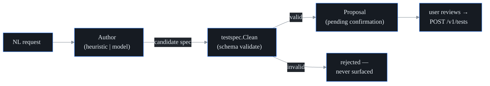

# AI test authoring and auto-discovery

## What it is

A **synthetic test** — probectl calls them **canaries** — is a small scripted
check that runs on a schedule: an agent sends real probe traffic at a target (a
ping, an HTTP request, a DNS lookup) and records whether it worked and how long
it took. Hand-writing its configuration (the **config**) means knowing the right
test type, the exact target form, the interval, the timeout. This page covers the
two ways to get from "I want to monitor this" to a configured synthetic test
*without* hand-writing config:

- **Authoring** — you type a request in plain English ("monitor the Salesforce
  login page", "ping 9.9.9.9 from every site"), and probectl proposes a ready-to-go
  test config.
- **Auto-discovery** — probectl mines the telemetry it has *already observed* —
  the endpoints, traffic, and incidents it has seen — for things worth monitoring
  that have no test yet, and proposes those too.

Both produce a **proposal** — a complete, validated config pending *your*
confirmation — and both are strictly **propose-only**: probectl never creates a
test on its own. It hands you a candidate; you review it and click create — an assistant
that fills in the whole form and hands you the pen, but never signs. This is the
platform's human-gated rule applied to authoring — an AI (or a discovery
heuristic, or a **prompt injection** — adversarial instructions smuggled into text
a system reads, here riding in observed telemetry) can at most *suggest* a test,
never make one. The point is to shrink time-to-first-monitor, not to take the
wheel.

## One schema, validated before you ever see it

A **schema** is the canonical shape of a piece of data: which fields exist and
which values are legal. Every test config in probectl — whether you typed it in
the UI, authored it from natural language, or it came from discovery — is the
same canonical type, `testspec.Spec` (`internal/testspec`): a name, a test type,
a target, an interval, a timeout, optional params, an enabled flag. That single
source of truth means a config that's valid in one place is valid everywhere —
there is no entrance to the platform with a different customs form.

**Schema validation** is checking a candidate against that shape and rejecting
anything that doesn't fit. The load-bearing rule: **an authored or discovered
config is schema-validated *before* it's surfaced for confirmation.** The
authoring engine (`internal/ai/author/author.go`) always runs the candidate
through `testspec.Clean` and only returns it if it passes:

```go
clean, err := testspec.Clean(spec)
if err != nil {
    return Proposal{}, fmt.Errorf("%w: the authored config was invalid (%v)", ErrCannotAuthor, err)
}
```

`Clean` is two steps. *Normalize* tidies the candidate — trims whitespace,
lowercases the type, and fills the platform defaults (60-second interval,
3-second timeout) where none were given. *Validate* then enforces the rules — a
name of 1–200 characters, a test type the platform actually runs, a target for
every probe type that needs one, an interval between 1 second and a day, a
timeout between 1 and 300 seconds.

So an invalid config — including a malformed answer from a language model — is
*rejected*, never shown to you as something to approve. Validation is the
bouncer at the door of the review queue: you can't accidentally create garbage
because garbage never reaches the review step.

## Authoring: natural language to config



There are two authors behind the same interface (`author.Proposer` — anything
that turns a prompt into a candidate spec plus a one-line rationale), and which
one runs depends on your config:

- **The heuristic author (default, air-gapped).** A **heuristic** is a fixed,
  hand-written rule of thumb, and **air-gapped** means it works with zero
  network access: this is a deterministic parser — same input, same output,
  every time — that needs no model and makes no network call (`HeuristicAuthor`).
  Think of a receptionist with a phrase book: fast, predictable, and never calls
  anyone outside the building. It pulls a target and a test type out of your
  words, checking in a fixed order (URL, then IP, then hostname, then known
  service name): URLs become `http` tests, IPs become `icmp` (or `tcp`/`udp` if
  you mention a port), hostnames default to a web check unless you say
  "dns"/"resolve" or "ping", and a small list of well-known services is
  recognised by name — so "check Salesforce login" yields an `http` test to
  `login.salesforce.com`. Explicit intent beats incidental words: "ping 9.9.9.9
  from every site" is an `icmp` test, because "ping" is a reachability verb and
  "site" is just scenery. If it can't find a host, IP, or URL, it returns a
  clear "could not derive a test" error telling you to include one — or
  configure a model.
- **The model-backed author (when a model is configured).** An **LLM** (large
  language model) is the kind of AI that reads and writes free text, so it can
  interpret intent a fixed parser can't. When `PROBECTL_AI_MODEL_PROVIDER`
  points at a model, a `ModelAuthor` handles open-ended requests the heuristic
  can't. It asks the model for strict JSON — the system prompt pins the exact
  field set and restricts the type to `icmp`, `tcp`, `udp`, `dns`, or `http` —
  strips any stray code fences from the reply, and the engine schema-validates
  that answer exactly like any other — so a malformed or invalid model response
  is rejected, not shown. The model's output is treated as untrusted input, not
  as instructions.

Because the model-backed author can send your prompt to a remote model, it rides
the **same egress gate** as remote-model RCA (**egress** is data leaving your
network; **RCA** is the root-cause-analysis assistant): per-tenant consent,
redaction, and audit (`docs/ai-egress.md`). A remote authoring call for a tenant
that hasn't consented is denied — a local loopback model passes the gate
untouched, since nothing leaves the host — and the air-gapped heuristic still
works for everyone.

**API:** `POST /v1/ai/author` with body `{prompt}` (1–2000 characters) → a
`Proposal` (the spec plus a short rationale and which author produced it). A
request no author can satisfy returns a 422 with guidance; a model outage
returns "temporarily unavailable" — never a half-built config. It **never
creates the test**; you apply the returned spec via `POST /v1/tests`. Each
authoring call is recorded in the tenant's tamper-evident **audit log** — the
append-only who-did-what record — as `ai.author` (the proposed type + target,
never the prompt's secrets) — proposing is a data-access action like any other.

## Auto-discovery: mine what's already observed

`POST /v1/ai/discover` looks at the tenant's own observed telemetry (a
**tenant** is one isolated customer space in probectl — discovery never reads
outside the caller's) and proposes monitorable targets that currently have *no*
test (`internal/ai/author/discovery.go`, handler in
`internal/control/authoring.go`). Your network already shows you which rooms are
in use; discovery points at the ones with no smoke detector. It:

- **suggests a test type** from what it saw (port 443 → `http` over https, port
  80 → `http`, port 53 → `dns`, a bare IP → `icmp`, any other port → `tcp` — or
  `udp` when the traffic was — and so on);
- **thresholds low-signal noise** — an observation below a minimum sighting
  count (default 2) is ignored — so it doesn't propose every stray packet;
- **dedups against your existing tests** by reducing every target to its bare
  lowercase hostname (scheme, port, and path stripped) — so a discovered
  `host:443` is recognised as already covered by an existing `https://host`
  test;
- **ranks and caps** the result — each candidate scores by how often it was
  seen, with a bonus for the well-known service ports (443/80/53), then the list
  is sorted and capped (default 20) — so you get a short, high-value list. Every
  surviving candidate has already passed the same `testspec.Clean` validation as
  everything else.

Today the discovery input is **incident targets** — an **incident** is an
already-correlated cluster of signals (probectl has decided several symptoms are
one event), so the handler lowers the sighting threshold to one: even a single
occurrence is worth proposing. The eBPF service map (who-talks-to-whom, observed
at the kernel), flows, BGP-monitored prefixes, and DNS feed the *same*
`Observation` input as those sources get wired, so discovery gets richer without
changing the propose-only contract. (A bare **CIDR** — a whole address range
like `10.0.0.0/8` — is deliberately *not* proposed as a synthetic test: a prefix
is BGP-monitored, not pinged.)

## Surface

A **surface** is where a capability shows up for users. The Targets page hosts
the review-and-apply flow: an "Author with AI" box (describe → proposal →
Create) and a "Suggested to monitor" list (Add). **Nothing is created without
your confirmation.** Both routes require the `test.write` permission — the same
right you'd need to create a test by hand, checked after the tenant boundary —
so someone who can't create tests can't generate proposals either.

## What it deliberately does not do

- **It never auto-applies a test.** Authoring and discovery both stop at a
  proposal; creation is a separate, authenticated, human action. This is what
  keeps a prompt injection, a confused model, or an over-eager heuristic
  harmless: the worst outcome is a proposal you decline.
- **It never surfaces an invalid config.** Schema validation happens *before*
  display, on every path — there is no "approve now, fix later" state.
- **It does not do remediation.** Creating monitoring is not the same as
  changing the network — that's the separate, human-gated remediation path
  (`docs/remediation.md`).

## See also

- `docs/ai-quickstart.md` — the task-ordered walkthrough of the whole AI surface.
- `docs/ai-rca.md` — the RCA assistant and the shared model configuration.
- `docs/ai-egress.md` — the consent/redaction/audit gate the model-backed author rides.
- `docs/configuration.md` — the `PROBECTL_AI_*` model keys.
