# AI RCA + natural-language query (S24)

probectl's AI assistant answers a natural-language question — *"why is X slow for
Y?"* — with a **cited, RBAC-scoped root cause** grounded in the network's own
signals. It is a primary product surface (PRD §6), not just an API, and it is
**sovereign-capable**: **the default engine is not an LLM** — it is a
deterministic, in-process heuristic synthesizer that runs fully air-gapped,
with no network and no phone-home. Wiring up a real model (local Ollama/vLLM,
or OpenAI/Anthropic-compatible endpoints) is an explicit opt-in via
`PROBECTL_AI_MODEL_PROVIDER` (provider table below).

This is the first PR of a design-led, multi-PR sprint: it establishes
correctness, citations, RBAC scoping, the model abstraction, feedback capture,
and the surface's trust cues. Later PRs iterate the *experience* (streaming, how
evidence reads, the proposal/gating affordance).

## The pipeline

```mermaid
%%{init: {'theme':'base','themeVariables':{'background':'#0d1117','primaryColor':'#161b22','primaryTextColor':'#e6edf3','primaryBorderColor':'#3b82f6','lineColor':'#8b949e','secondaryColor':'#21262d','tertiaryColor':'#0d1117','clusterBkg':'#161b22','clusterBorder':'#30363d','fontFamily':'ui-monospace, SFMono-Regular, Menlo, monospace'},'flowchart':{'curve':'basis','nodeSpacing':55,'rankSpacing':55,'padding':12}}}%%
flowchart LR
  Q["NL question<br/>(+ optional subject)"] --> P["Planner<br/>(deterministic probectl code)"]
  P -->|"typed S23 queries"| E["S23 query engine<br/>tenant FIRST, then RBAC"]
  E -->|"tenant + RBAC-scoped rows"| G["Evidence<br/>(citable, per-plane)"]
  G --> M["ModelAdapter.Synthesize<br/>(no tools — synthesis only)"]
  M -->|"structured findings"| C["Citation integrity<br/>(drop unresolved cites)"]
  C --> A["Answer<br/>root cause · confidence · findings · evidence"]

  subgraph sources["Evidence sources (tenant-scoped)"]
    INC["Incidents (S17)"]
    MET["Metrics"]
    EVT["Events / flows"]
    TOP["Topology (S30)"]
  end
  E --- sources
```

1. **Plan (deterministic).** A `HeuristicPlanner` turns the question into a set of
   typed S23 queries: it extracts the subject (host / IP / CIDR / node), a time
   window, and selects which planes to gather from based on the question's
   language. The planner is probectl code, **not the model** — so untrusted text can
   never widen the query scope.
2. **Gather (tenant-first, then RBAC).** Each planned query runs through the S23
   engine, which enforces the **tenant boundary first, then the caller's RBAC**.
   Domains the caller may not read (`ErrForbidden`) or that aren't configured
   (`ErrNoSource`) are skipped — an answer is grounded only in what the caller is
   permitted to see. The rows become **Evidence**, each with a stable id and a
   plane.
3. **Synthesize (no tools).** The evidence + question go to a `ModelAdapter`. The
   model only writes prose over the evidence — it is **never handed tools** or the
   ability to act, so even hostile evidence content (prompt injection) cannot
   drive behaviour. It returns a *structured* answer (findings, each citing
   evidence ids).
4. **Citation integrity.** The pipeline drops any finding whose citations don't
   resolve to real gathered evidence — so a hallucinated reference can never reach
   the user, regardless of which model produced it. If nothing grounded survives,
   the answer is an honest **"insufficient evidence"** rather than a guess.

## Two-level security boundary

The assistant inherits the S23 contract: **tenant boundary first, then RBAC,
enforced at the query layer — never relying on the model to self-censor**
(CLAUDE.md §7 guardrails 1 & 5). A `Query` has no tenant field; the tenant comes
from the authenticated principal, so a question is incapable of crossing tenants
by construction. An integration test proves tenant A's answer never contains
tenant B's signals.

## Model adapters

| Provider    | Path                                   | Notes                                            |
| ----------- | -------------------------------------- | ------------------------------------------------ |
| `builtin`   | in-process, deterministic              | **default**, air-gapped, no network; the oracle the golden-set tests assert against |
| `ollama`    | local Ollama / vLLM (`/api/chat`)      | the first-class sovereign path; loopback may be `http` |
| `openai`    | OpenAI-compatible `/v1/chat/completions` | OpenAI, Azure, vLLM, LM Studio…                 |
| `anthropic` | Anthropic `/v1/messages`               |                                                  |

Every remote adapter dials over **hardened TLS with certificate validation**; a
non-loopback `http` endpoint is refused (guardrail 12). The built-in synthesizer
ranks evidence by cause-likelihood (plane) × severity × recency, names the
top-ranked signal as the probable root cause, and corroborates with the rest —
each finding citing real evidence by construction.

## Surface (web)

The **Ask (AI)** page (built on the S8a design system) is an ask box plus a
trust-cued answer: the root cause with a **confidence** badge, a **provenance**
line (which model, how many signals), **findings** with citation chips that link
to the **evidence**, and a thumbs up/down **feedback** control. It says so plainly
when the evidence is insufficient.

## API

- `POST /v1/ai/ask` — `{question, subject?}` → a cited `Answer`. Requires the
  `ai.query` permission; evidence is further scoped per domain by the caller's
  read permissions.
- `POST /v1/ai/feedback` — `{answer_id, rating: up|down, comment?}` → 204. Stored
  tenant-scoped (RLS) and audited.

Both actions are written to the audit log (data-access actions — guardrail 7).

## Out of scope (later sprints / PRs)

AI test authoring (S26); guarded remediation *execution* (S-EE5 — the surface
where proposals will render is designed here); the MCP exposure of these tools
(S25); model-assisted planning, answer streaming, and richer evidence reading
(later S24 PRs). Additional evidence sources (metrics / events / topology) plug
into the existing `Source` interfaces as their query adapters land.
