# AI root-cause analysis and natural-language query

## What it is

probectl's AI assistant answers a plain-English question — *"why is checkout slow
for the EU region?"* — with a **cited, permission-scoped root cause**, grounded in
the network's own signals. You ask in words; you get back a probable cause, a
confidence level, and a list of findings where every claim links to a real,
underlying signal you're allowed to see.

It's a primary product surface (the **Ask (AI)** page in the UI), not just an API.
Two properties make it unusual:

- **It is sovereign-capable: the default "engine" is not an LLM.** Out of the box,
  RCA runs a deterministic, in-process synthesizer (`builtin`) — no network call,
  no phone-home, fully air-gapped. It works on day one with zero external
  dependencies.
- **Connecting a real model is an explicit opt-in.** You can point it at a local
  Ollama/vLLM (still on your own hardware) or a cloud provider, via
  `PROBECTL_AI_MODEL_PROVIDER`. Sending data off-box is gated — see
  `docs/ai-egress.md`.

## The pipeline

```mermaid
%%{init: {'theme':'base','themeVariables':{'background':'#0d1117','primaryColor':'#161b22','primaryTextColor':'#e6edf3','primaryBorderColor':'#3b82f6','lineColor':'#8b949e','secondaryColor':'#21262d','tertiaryColor':'#0d1117','clusterBkg':'#161b22','clusterBorder':'#30363d','fontFamily':'ui-monospace, SFMono-Regular, Menlo, monospace'},'flowchart':{'curve':'basis','nodeSpacing':55,'rankSpacing':55,'padding':12}}}%%
flowchart LR
  Q["NL question<br/>(+ optional subject)"] --> P["Planner<br/>(deterministic probectl code)"]
  P -->|"typed queries"| E["Semantic query engine<br/>tenant FIRST, then RBAC"]
  E -->|"tenant + RBAC-scoped rows"| G["Evidence<br/>(citable, per-plane)"]
  G --> M["ModelAdapter.Synthesize<br/>(no tools — synthesis only)"]
  M -->|"structured findings"| C["Citation integrity<br/>(drop unresolved cites)"]
  C --> A["Answer<br/>root cause · confidence · findings · evidence"]

  subgraph sources["Evidence sources (tenant-scoped)"]
    INC["Incidents (wired today)"]
    CHG["Change events (wired today)"]
    MET["Metrics (pluggable seam)"]
    TOP["Topology (pluggable seam)"]
  end
  E --- sources
```

The four steps, and the guardrail each one buys you:

1. **Plan (deterministic).** A `HeuristicPlanner` (`internal/ai/planner.go`) turns
   the question into a set of typed queries. It extracts the subject (host / IP /
   CIDR / hostname / URL — or you can pin one explicitly), picks a time window
   (default: the last hour), and selects which planes to gather from based on
   keywords in the question ("loss"/"latency" → metrics + topology;
   "bgp"/"route"/"hijack" → events; "deploy"/"config" → change events; and so on).
   The planner is **probectl code, never the model** — so untrusted question text
   can't widen the query scope. A vague question simply broadens across planes; a
   question with no anchor won't dump the whole topology graph.

2. **Gather (tenant first, then RBAC).** Each planned query runs through the
   semantic query engine (`docs/ai-query.md`), which enforces the **tenant boundary
   first, then per-domain RBAC**. Planes the caller can't read (`ErrForbidden`) or
   that aren't configured in this deployment (`ErrNoSource`) are skipped — so an
   answer is grounded *only* in what this caller is permitted to see. Each row
   becomes a piece of **Evidence** with a stable ID and a plane label.

3. **Synthesize (a model with no tools).** The question plus the gathered evidence
   go to a `ModelAdapter`. The model's *only* job is to write prose over evidence
   it's handed — it is **never given tools** and **cannot issue its own queries or
   take actions**. So even hostile evidence content (a prompt-injection payload
   riding in a log line) can't drive behaviour: the worst it can do is produce a
   claim that the next step throws away. The model returns a *structured* answer —
   findings, each citing evidence IDs — not free text.

4. **Citation integrity (the trust backstop).** The pipeline
   (`internal/ai/rca.go`) drops any finding whose citations don't resolve to real
   gathered evidence. A hallucinated reference can never reach you, no matter which
   model produced it. The **root cause headline itself must also be grounded**: an
   uncited or fake-cited root cause is rejected and replaced with a grounded
   fallback, and confidence drops to low. If nothing grounded survives, the answer
   is an honest **"insufficient evidence"** rather than a guess.

A small but important detail: evidence IDs (`E<random>-1`, `E<random>-2`, …) carry
a per-request random prefix. Because the IDs aren't predictable, injected text in a
log line can't pre-write a citation to an ID that will exist later — a fabricated
"see E5" won't match the real, randomized IDs of this run.

## The security boundary is inherited, not re-implemented

The assistant doesn't have its own isolation logic — it inherits the query layer's
contract: **tenant boundary first, then RBAC, enforced at the query layer, never
by asking the model to self-censor.** Because the `Query` type has no tenant field
(see `docs/ai-query.md`), a question is *incapable* of crossing tenants. An
end-to-end test (`TestAIAskGroundedCitedAndTenantScoped`,
`internal/control/ai_integration_test.go`) proves it against a real Postgres:
tenant A's incident becomes cited evidence in tenant A's answer, while tenant B
asking the *same question* gets an honest "insufficient evidence" — never tenant
A's signals.

## Evidence sources: what's wired today

The analyzer gathers evidence through the query engine's pluggable sources. In the
shipped control plane (`buildEngine` in `internal/control/ai.go`), two are wired:

- **Incidents** (the `entities` domain) — each correlated incident contributes
  itself *plus* its cross-plane signals, individually citable. Incidents are the
  richest RCA evidence because they're already correlated across planes, so the
  planner always includes them.
- **Change events** (the `events` domain) — the "what changed?" evidence that lets
  RCA cite a likely deploy/config/routing change (see `docs/change-intel.md`).

The **metrics** and **topology** sources are real interfaces with no production
adapter wired yet; they plug into the same seams as their query adapters land. So
today's answers are grounded primarily in incidents and changes — the architecture
is ready for the rest without touching the pipeline or the security model.

## Model adapters

The synthesis backend is pluggable (`internal/ai/model.go`, `model_http.go`):

| Provider    | Wire path                                 | Notes                                                                 |
| ----------- | ----------------------------------------- | --------------------------------------------------------------------- |
| `builtin`   | in-process, deterministic                 | **the default** — air-gapped, no network; also the deterministic baseline the CI RCA eval harness (`internal/ai/eval`, a fixed labeled scenario set run through the real pipeline) scores against |
| `ollama`    | local Ollama / vLLM (`/api/chat`)         | the first-class sovereign path; a loopback endpoint may be plain `http` |
| `openai`    | OpenAI-compatible `/v1/chat/completions`  | OpenAI, Azure OpenAI, vLLM, LM Studio, …                              |
| `anthropic` | Anthropic `/v1/messages`                  | Claude models                                                          |

Every **remote** adapter dials over a hardened, certificate-validating TLS client
(`crypto.HardenedHTTPClient`); a non-loopback endpoint that isn't `https` is
**refused at startup** (the platform's TLS-everywhere guardrail). Plain `http` is
allowed only to loopback, for a co-located local model.

The built-in synthesizer (`internal/ai/model_builtin.go`) is worth understanding
because it's the default and the safety net: it ranks evidence by
**cause-likelihood (which plane) × severity × recency**, names the top-ranked
signal as the probable root cause, and corroborates with the rest. A change or a
routing event outranks a latency metric, because a metric is usually a *symptom*
and a change is usually a *cause*. Every finding it emits cites real evidence by
construction — it literally cannot hallucinate, because it only ever points at rows
it was given.

## Surface (web)

The **Ask (AI)** page is an ask box plus a trust-cued answer: the root cause with a
**confidence** badge, a **provenance** line (which model answered, how many signals
it used), **findings** with citation chips that jump to the underlying
**evidence**, and a thumbs-up/down **feedback** control. When the evidence doesn't
support a conclusion, it says so plainly instead of inventing one.

## API

- `POST /v1/ai/ask` — body `{question, subject?}` → a cited `Answer`. Requires the
  `ai.query` permission; the evidence is then *further* scoped per plane by the
  caller's read permissions, so two users with different RBAC can ask the same
  question and correctly get differently-grounded answers.
- `POST /v1/ai/feedback` — body `{answer_id, rating: up|down, comment?}` → `204`.
  Also requires `ai.query`. Stored tenant-scoped (row-level security) and audited.

Both actions are written to the tenant's tamper-evident audit log as `ai.ask` and
`ai.feedback` (they are data-access actions). RCA is also rate-limited two ways: a
process-wide concurrency backstop returns `429` (so a burst can't exhaust the
control plane) and the per-tenant fairness budget wraps the whole analysis
(`docs/fairness.md`).

For reproducibility (or a dispute about "what did the AI tell us that day?"),
`PROBECTL_AI_PERSIST_ANSWERS` (default `false`) stores each full cited answer
tenant-scoped, together with the model name and a hash of the AI configuration
that produced it, pruned past `PROBECTL_AI_ANSWER_RETENTION` (default 90 days).
Persistence is best-effort and never blocks or alters the answer.

## What it deliberately does not do

- **It does not let the model touch the network or take actions.** No tools, no
  agentic loop. Remediation is a separate, human-gated, proposal-only path
  (`docs/remediation.md`).
- **It does not trust the model for isolation or truth.** Tenant + RBAC are
  enforced before the model sees anything; citation integrity is checked after.
  Swapping models cannot weaken either guarantee.
- **It does not phone home by default.** The default engine is fully local; any
  remote model is opt-in and gated (`docs/ai-egress.md`).

## See also

- `docs/ai-query.md` — the semantic query engine RCA is built on.
- `docs/ai-egress.md` — what leaves the network when you connect a remote model.
- `docs/ai-authoring.md` — turning natural language into test configs (propose-only).
- `docs/mcp.md` — exposing RCA and queries to external AI clients as MCP tools.
