# AI root-cause analysis and natural-language query

## What it is

**Root-cause analysis (RCA)** is the work of taking a pile of symptoms — alerts
firing, graphs sagging, users complaining — and naming the one underlying event
that explains them. probectl's AI assistant does this on demand: it answers a
plain-English question — *"why is checkout slow for the EU region?"* — with a
**cited, permission-scoped root cause**, grounded in the network's own signals.
You ask in words; you get back a probable cause, a confidence level, and a list
of findings where every claim links to a real, underlying signal you're allowed
to see. A **citation** works like a footnote: each statement points at the
specific evidence record behind it, so you can check. "Permission-scoped" means
the answer is built only from data your account may read.

It's a primary product surface (the **Ask (AI)** page in the UI), not just an API.
Two properties make it unusual:

- **It is sovereign-capable: the default "engine" is not an LLM.** An **LLM**
  (large language model) is the kind of AI that reads and writes text — and using
  one usually means sending your data to somebody's API. Out of the box, RCA
  instead runs a deterministic, in-process synthesizer (`builtin`):
  *deterministic* meaning the same question over the same evidence always
  produces the same answer, and *in-process* meaning it's ordinary probectl code
  running inside the control plane — no network call, no phone-home (no traffic
  back to any vendor), fully air-gapped (it works on a machine with no internet
  path at all). It works on day one with zero external dependencies — which is
  the whole meaning of "sovereign-capable": nothing ever *requires* data to leave
  infrastructure you control.
- **Connecting a real model is an explicit opt-in.** You can point it at a local
  Ollama/vLLM (self-hosted LLM servers — still on your own hardware) or a cloud
  provider, via `PROBECTL_AI_MODEL_PROVIDER`. Sending data off-box is gated — see
  `docs/ai-egress.md`.

One stance runs through everything below: the model is the *least* trusted
component in the pipeline — useful for fluent prose, never relied on for truth
or for isolation.

## The pipeline: four steps, four guarantees

Every question takes the same four-step path, whichever model is configured.



```mermaid
%%{init: {'theme':'base','themeVariables':{'background':'#0d1117','primaryColor':'#161b22','primaryTextColor':'#e6edf3','primaryBorderColor':'#3b82f6','lineColor':'#8b949e','secondaryColor':'#21262d','tertiaryColor':'#0d1117','clusterBkg':'#161b22','clusterBorder':'#30363d','fontFamily':'ui-monospace, SFMono-Regular, Menlo, monospace'},'flowchart':{'curve':'basis','nodeSpacing':55,'rankSpacing':55,'padding':12}}}%%
flowchart LR
  Q["NL question<br/>(+ optional subject)"] --> P["Planner<br/>(deterministic probectl code)"]
  P -->|"typed queries"| E["Semantic query engine<br/>tenant FIRST, then RBAC"]
  E -->|"tenant + RBAC-scoped rows"| G["Evidence<br/>(citable, per-plane)"]
  G --> M["ModelAdapter.Synthesize<br/>(no tools — synthesis only)"]
  M -->|"structured findings"| C["Citation integrity<br/>(drop unresolved cites)"]
  C --> A["Answer<br/>root cause · confidence · findings · evidence"]

  subgraph sources["Evidence sources (tenant-scoped)"]
    INC["Incidents (wired today)"]
    CHG["Change events (wired today)"]
    MET["Metrics (pluggable seam)"]
    TOP["Topology (pluggable seam)"]
  end
  E --- sources
```

The four steps, and the guardrail each one buys you:

1. **Plan (deterministic).** First, probectl decides *which data could answer
   this question* — and no model is consulted for that decision. A
   **planner** is the component that turns free text into **typed queries**:
   structured query values with fixed fields (which data family, which subject,
   which time window), not strings an AI composed. The `HeuristicPlanner`
   (`internal/ai/planner.go`) extracts the subject (host / IP / CIDR — an IP
   range — / hostname / URL, or you can pin one explicitly), picks a time window
   (default: the last hour), and selects which planes to gather from based on
   keywords in the question — a **plane** being one family of network evidence,
   such as performance metrics, routing events, or change records
   ("loss"/"latency" → metrics + topology; "bgp"/"route"/"hijack" → events;
   "deploy"/"config" → change events; and so on). The planner is **probectl code,
   never the model** — so untrusted question text can't widen the query scope.
   Think of it as a switchboard with a fixed set of lines, not an operator who
   can be sweet-talked into dialing anywhere. A vague question simply broadens
   across planes; a question with no anchor won't dump the whole topology graph
   (the live map of what connects to what).

2. **Gather (tenant first, then RBAC).** Each planned query runs through the
   semantic query engine (`docs/ai-query.md`) — the platform's single shared read
   layer — which enforces the **tenant boundary first, then per-domain RBAC**. A
   **tenant** is one organization's hard-isolated space on a shared platform;
   **RBAC** (role-based access control) is the permission layer inside it that
   says which roles may read which data. Planes the caller can't read
   (`ErrForbidden`) or that aren't configured in this deployment (`ErrNoSource`)
   are skipped — so an answer is grounded *only* in what this caller is permitted
   to see. Each row that comes back becomes a piece of **Evidence** with a stable
   ID and a plane label; those IDs are the only things any later claim will be
   allowed to cite.

3. **Synthesize (a model with no tools).** The question plus the gathered
   evidence go to a `ModelAdapter` — the swappable synthesis backend ("Model
   adapters" below). **Synthesis** means composing prose from supplied material,
   and that is the model's *only* job: to write prose over evidence it's handed.
   It is **never given tools** (in LLM systems,
   a "tool" is a function the model may call to fetch data or act on the world)
   and **cannot issue its own queries or take actions**. Picture a writer locked
   in a room with a stack of photocopies: they can describe what's on the desk,
   but can't leave to fetch another file or pull a lever. So even hostile
   evidence content (a prompt-injection payload riding in a log line —
   attacker-written text crafted so an LLM mistakes data for instructions) can't
   drive behaviour: the worst it can do is produce a claim that the next step
   throws away. The model returns a *structured* answer — findings, each citing
   evidence IDs — not free text.

4. **Citation integrity (the trust backstop).** LLMs sometimes *hallucinate*:
   they state things, fluently, that were never in their input. This step makes
   that survivable. The pipeline (`internal/ai/rca.go`) drops any finding whose
   citations don't resolve to real gathered evidence — a fact-checking editor who
   walks every footnote back to its source before publication. A hallucinated
   reference can never reach you, no matter which model produced it. The **root
   cause headline itself must also be grounded**: an uncited or fake-cited root
   cause is rejected and replaced with a grounded fallback, and confidence drops
   to low. If nothing grounded survives, the answer is an honest **"insufficient
   evidence"** rather than a guess.

A small but important detail: evidence IDs (`E<random>-1`, `E<random>-2`, …) carry
a per-request random prefix. Because the IDs aren't predictable, injected text in a
log line can't pre-write a citation to an ID that will exist later — a fabricated
"see E5" won't match the real, randomized IDs of this run. It's a raffle ticket
numbered at draw time: you can't print a winning ticket yesterday for a number
that's only assigned today.

## The security boundary is inherited, not re-implemented

The first question to ask of any "AI that can read your network data" is: what
stops it from reading somebody else's? probectl's answer is that the assistant
doesn't have its own isolation logic to get wrong — it inherits the query layer's
contract: **tenant boundary first, then RBAC, enforced at the query layer, never
by asking the model to self-censor.** Because the `Query` type has no tenant field
(see `docs/ai-query.md`), a question is *incapable* of crossing tenants: the
tenant comes from the authenticated caller, and there is no field in which to
request a different one. That last clause is the load-bearing one — a model can be
confused or manipulated by its input; a struct field that doesn't exist cannot.

An end-to-end test (`TestAIAskGroundedCitedAndTenantScoped`,
`internal/control/ai_integration_test.go`) proves it against a real Postgres:
tenant A's incident becomes cited evidence in tenant A's answer, while tenant B
asking the *same question* gets an honest "insufficient evidence" — never tenant
A's signals.

## Evidence sources: what's wired today

The analyzer never reads a datastore directly. It gathers evidence through the
query engine's pluggable **sources** — small per-plane adapters the control plane
plugs into the engine at startup — so the pipeline stays identical no matter
where the data physically lives. In the shipped control plane (`buildEngine` in
`internal/control/ai.go`), two are wired:

- **Incidents** (the `entities` domain) — an incident is probectl's correlated
  record of one problem, already stitched together from signals across planes.
  Each correlated incident contributes itself *plus* its cross-plane signals,
  individually citable. Incidents are the richest RCA evidence because they're
  already correlated across planes, so the planner always includes them.
- **Change events** (the `events` domain) — the "what changed?" evidence that lets
  RCA cite a likely deploy/config/routing change (see `docs/change-intel.md`).

The **metrics** and **topology** sources are real interfaces with no production
adapter wired yet; they plug into the same seams as their query adapters land. So
today's answers are grounded primarily in incidents and changes — the
architecture is ready for the rest without touching the pipeline or the security
model: a new source only widens what answers can cite, never how citations are
checked.

## Model adapters

A **model adapter** is the thin piece of glue that speaks one provider's wire
protocol: every adapter receives the same input (question + evidence) and must
return the same structured, citing answer — only the HTTP shape differs, which is
why swapping one never changes the trust model. The synthesis backend is
pluggable (`internal/ai/model.go`, `model_http.go`):

| Provider    | Wire path                                 | Notes                                                                 |
| ----------- | ----------------------------------------- | --------------------------------------------------------------------- |
| `builtin`   | in-process, deterministic                 | **the default** — air-gapped, no network; also the deterministic baseline the CI RCA eval harness (`internal/ai/eval`, a fixed labeled scenario set run through the real pipeline) scores against |
| `ollama`    | Ollama's native API (`/api/chat`)         | the first-class sovereign path; a loopback endpoint may be plain `http` |
| `openai`    | OpenAI-compatible `/v1/chat/completions`  | OpenAI, Azure OpenAI, **vLLM**, LM Studio, …                          |
| `anthropic` | Anthropic `/v1/messages`                  | Claude models (`x-api-key` required)                                   |

Two terms in that table carry the security weight. **TLS** (Transport Layer
Security) is the encryption-and-identity protocol behind `https` — it both hides
traffic and, via certificate validation, proves you're talking to the server you
intended. **Loopback** is an address where traffic never leaves the machine.
Every **remote** adapter dials over a hardened, certificate-validating TLS client
(`crypto.HardenedHTTPClient`); a non-loopback endpoint that isn't `https` is
**refused at startup** (the platform's TLS-everywhere guardrail). Plain `http` is
allowed only to loopback, for a co-located local model. Refusing at startup,
rather than failing at query time, means a plaintext misconfiguration can never
serve even one answer.

### The builtin engine: a librarian, not an author

The built-in synthesizer (`internal/ai/model_builtin.go`) is worth understanding
because it's the default and the safety net. It is a librarian, not an author: it
can sort the books it was handed and put the most relevant one in your hands, but
it cannot write a new book. Mechanically, it ranks evidence by
**cause-likelihood (which plane) × severity × recency**, names the top-ranked
signal as the probable root cause, and corroborates with the rest. The
cause-likelihood weighting encodes one piece of operator judgment: a change or a
routing event outranks a latency metric, because a metric is usually a *symptom*
and a change is usually a *cause*. Every finding it emits cites real evidence by
construction — it literally cannot hallucinate, because it only ever points at
rows it was given. What you trade away against an LLM is prose fluency; what you
keep is determinism, groundedness, and zero egress.

### Copy-paste recipes

`PROBECTL_AI_MODEL_ENDPOINT` is always the **base URL** — the adapter appends its
wire path from the table above. Loopback endpoints (`127.0.0.1` / `localhost` /
`::1`) are treated as **local**: no egress acknowledgment, no tenant consent.
Anything else is **remote** and additionally needs the two-gate enablement chain
in [`ai-egress.md`](ai-egress.md).

**Air-gapped default — nothing to set.** With no `PROBECTL_AI_*` keys at all, Ask
runs the deterministic builtin synthesizer. This is the shipped posture.

**Ollama on the same host (sovereign, no consent needed):**

```sh
ollama pull llama3.1            # any model you've pulled works
PROBECTL_AI_MODEL_PROVIDER=ollama \
PROBECTL_AI_MODEL_ENDPOINT=http://127.0.0.1:11434 \
PROBECTL_AI_MODEL_NAME=llama3.1 \
  ./bin/probectl-control
```

**vLLM on the same host** — there is deliberately **no `vllm` provider**: vLLM
serves the OpenAI-compatible API, so you use the `openai` adapter pointed at it.
vLLM's default port is 8000; `PROBECTL_AI_MODEL_TOKEN` stays unset unless your
vLLM enforces auth:

```sh
vllm serve mistralai/Mistral-7B-Instruct-v0.3        # OpenAI-compatible on :8000
PROBECTL_AI_MODEL_PROVIDER=openai \
PROBECTL_AI_MODEL_ENDPOINT=http://127.0.0.1:8000 \
PROBECTL_AI_MODEL_NAME=mistralai/Mistral-7B-Instruct-v0.3 \
  ./bin/probectl-control
```

**OpenAI (remote — consent chain required):** the token comes from your provider's
console and should be a secret *reference*, never a literal in unit files
([`secrets.md`](secrets.md)):

```sh
PROBECTL_AI_MODEL_PROVIDER=openai \
PROBECTL_AI_MODEL_ENDPOINT=https://api.openai.com \
PROBECTL_AI_MODEL_NAME=gpt-4o-mini \
PROBECTL_AI_MODEL_TOKEN=vault:ai/openai#key \
PROBECTL_AI_EGRESS_ACK=yes-send-tenant-data-to-the-remote-model \
  ./bin/probectl-control
# …then consent each tenant — see ai-egress.md "Turning it on".
```

**Anthropic (remote — consent chain required):** same shape; the adapter sends the
required `x-api-key` header for you:

```sh
PROBECTL_AI_MODEL_PROVIDER=anthropic \
PROBECTL_AI_MODEL_ENDPOINT=https://api.anthropic.com \
PROBECTL_AI_MODEL_NAME=<model-id-from-your-provider> \
PROBECTL_AI_MODEL_TOKEN=vault:ai/anthropic#key \
PROBECTL_AI_EGRESS_ACK=yes-send-tenant-data-to-the-remote-model \
  ./bin/probectl-control
```

**Azure OpenAI** rides the `openai` recipe with your deployment's base URL.

## The surface: the Ask (AI) page

The **Ask (AI)** page is an ask box plus a trust-cued answer — "trust-cued"
meaning built so you can judge *how much* to believe at a glance: the root cause
with a **confidence** badge, a **provenance** line (which model answered, how
many signals it used — provenance is "where this answer came from"),
**findings** with citation chips that jump to the underlying
**evidence**, and a thumbs-up/down **feedback** control. When the evidence
doesn't support a conclusion, it says so plainly instead of inventing one.

## API

Two routes carry the whole feature, and both require the same permission:

- `POST /v1/ai/ask` — body `{question, subject?}` → a cited `Answer`. Requires the
  `ai.query` permission; the evidence is then *further* scoped per plane by the
  caller's read permissions, so two users with different RBAC can ask the same
  question and correctly get differently-grounded answers.
- `POST /v1/ai/feedback` — body `{answer_id, rating: up|down, comment?}` → `204`.
  Also requires `ai.query`. Stored tenant-scoped (row-level security — the
  database itself filters every row by tenant) and audited.

Both actions are written to the tenant's tamper-evident audit log as `ai.ask` and
`ai.feedback` (they are data-access actions; "tamper-evident" means a later edit
to the log would be detectable). RCA is also rate-limited two ways: a
process-wide concurrency backstop returns `429` (so a burst can't exhaust the
control plane) and the per-tenant fairness budget wraps the whole analysis
(`docs/fairness.md`).

For reproducibility (or a dispute about "what did the AI tell us that day?"),
`PROBECTL_AI_PERSIST_ANSWERS` (default `false`) stores each full cited answer
tenant-scoped, together with the model name and a hash of the AI configuration
that produced it, pruned past `PROBECTL_AI_ANSWER_RETENTION` (default 90 days).
Persistence is best-effort and never blocks or alters the answer.

## What it deliberately does not do

- **It does not let the model touch the network or take actions.** No tools, no
  agentic loop (the pattern where a model acts, observes the result, and acts
  again). Remediation is a separate, human-gated, proposal-only path
  (`docs/remediation.md`).
- **It does not trust the model for isolation or truth.** Tenant + RBAC are
  enforced before the model sees anything; citation integrity is checked after.
  Swapping models cannot weaken either guarantee.
- **It does not phone home by default.** The default engine is fully local; any
  remote model is opt-in and gated (`docs/ai-egress.md`).

## See also

- `docs/ai-query.md` — the semantic query engine RCA is built on.
- `docs/ai-egress.md` — what leaves the network when you connect a remote model.
- `docs/ai-authoring.md` — turning natural language into test configs (propose-only).
- `docs/mcp.md` — exposing RCA and queries to external AI clients as MCP tools.
