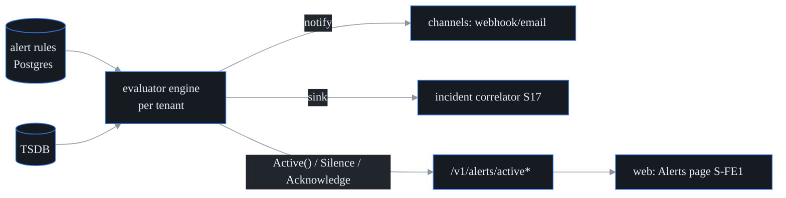

# Alerting (S16 engine · S-FE1 surface)

Two halves, one truth:

- **Alert rules** (durable config, Postgres): threshold or baseline conditions
  over any TSDB metric, with debounce (`for_n`), renotify cadence, severity,
  and delivery channels (HMAC-signed webhook / email). CRUD at `/v1/alerts`
  (RBAC `alert.read` / `alert.write`).
- **Active alerts** (engine truth, in-memory per evaluator): what is firing
  RIGHT NOW. The evaluator engine is the single source of truth — the API and
  the web surface only render its state and forward operator actions; nothing
  is derived client-side.

## Active-alert API

| Route | Perm | Meaning |
| --- | --- | --- |
| `GET /v1/alerts/active` | `alert.read` | Every firing series for the caller's tenant, with operator state. `evaluator_running=false` distinguishes "quiet" from "not evaluating". |
| `POST /v1/alerts/active/silence` | `alert.write` | `{fingerprint, duration_minutes}` — suppress notifications until the deadline (0 clears; max 7 days). |
| `POST /v1/alerts/active/ack` | `alert.write` | `{fingerprint}` — record the caller as owning the alert. |

Each firing series carries an opaque `fingerprint` (the rule + label-set
identity) — the handle for actions. Both actions are tenant-scoped (the
caller's tenant selects its own evaluator engine; an unknown tenant fails
closed), audited (`alert.silence` / `alert.acknowledge` in the tamper-evident
log), and return the engine's updated view.

## Semantics (operator contract)

- **Silence** suppresses channel notifications *and* the incident sink for one
  series until the deadline. The series keeps evaluating and stays visibly
  firing (badged as silenced). Resolve clears the silence and still sends the
  recovery notification.
- **Acknowledge** is bookkeeping: who has seen/owns it. Evaluation and
  delivery are unchanged; the ack clears on resolve.
- A new firing episode never inherits the previous episode's silence/ack.
- **Restart caveat:** firing state re-derives on the next evaluation after a
  control-plane restart, but silences/acks are engine-resident and are lost.
  Durable silences (stored the way rules are) are a noted follow-up.

## The web surface (S-FE1)

`/alerts` on the S8a shell: the active-alert table (state + severity filters,
detail with silence/acknowledge actions) over the rule table (create/edit/
delete with threshold/baseline forms). Built entirely from S8a components and
design tokens (WCAG 2.2 AA gate covers it); the active list polls the engine
every 15s and every action re-renders from the engine's response.

## Testing

`go test ./internal/alert ./internal/control` covers the engine state machine
(episode start, silence suppression incl. renotify windows + expiry, resolve
clearing operator state, fail-closed errors) and the handlers (RBAC perms,
tenant fail-closed, 404/422/503 paths). `cd web && npx vitest run` covers the
surface: list + filters, silence/ack rendering engine truth, rule create,
tenant scoping (no client-side tenant selection), evaluator-off honesty, and
the axe a11y pass.
