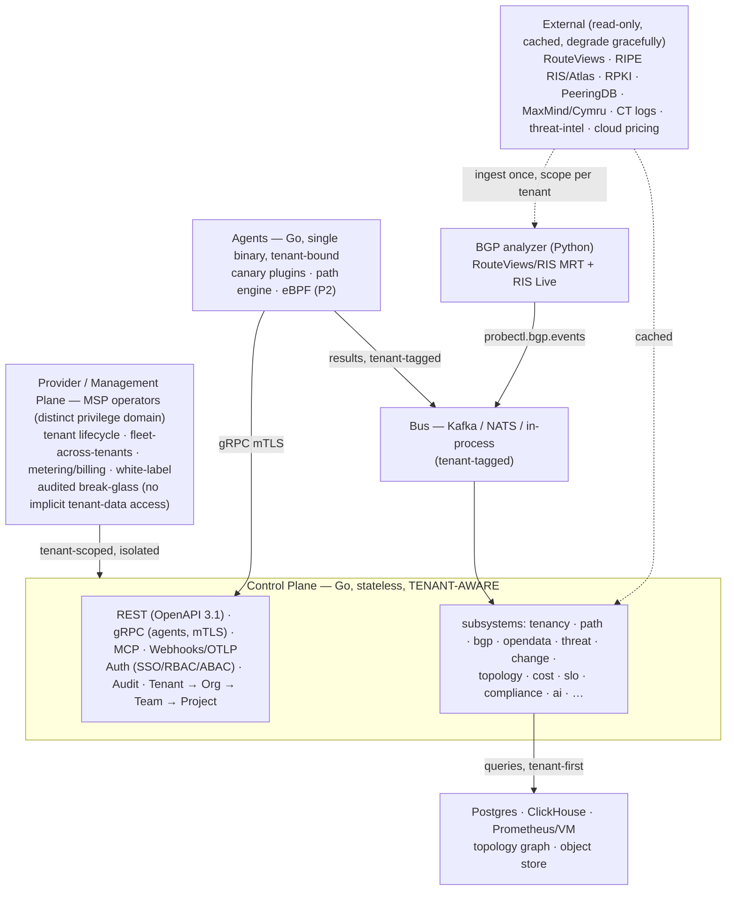
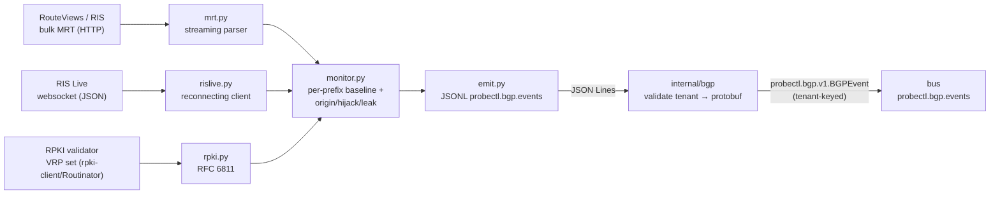
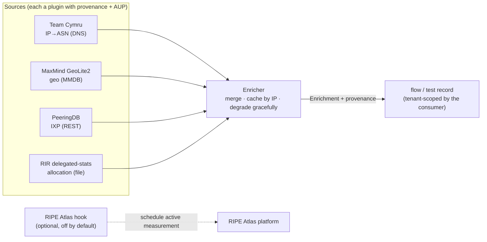
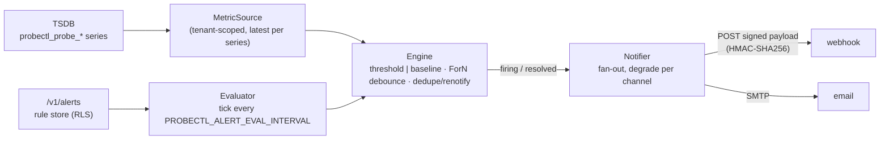
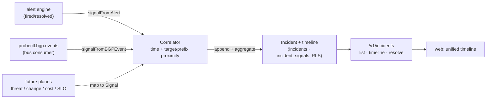
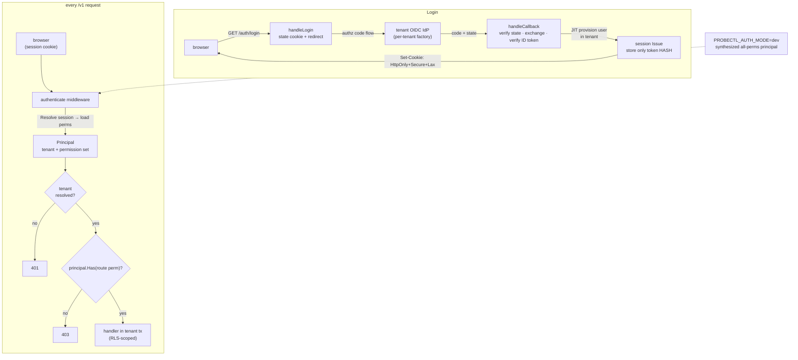
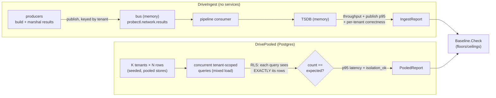

# Architecture (seed)

This is a seed document. The authoritative architecture and product spec
(`CLAUDE.md`, `probectl-PRD-v0.5.md`) are internal and kept in the private working
folder — **not committed** to this repo. This file is filled out as the
subsystems land; the canonical **tenant-scoped data model** is documented here in
**S2**.

## Shape

Data flows agents → bus (tenant-tagged) → control-plane consumers → stores, all
scoped by `tenant_id`; the API/UI/AI/MCP query the unified stores **within the
caller's tenant first, then RBAC**.

## First principles (enforced from S0)

- **Tenant is the outermost scope and security boundary.** Every tenant-owned
  record, message, metric, and object is `tenant_id`-scoped at the storage/query
  layer — never application code alone. A cross-tenant isolation test is a
  permanent CI gate (`cross-tenant-isolation`).
- **OpenTelemetry-native.** Signal schemas map to OTel resource + network
  semantic conventions from first emission (S6), so OTLP/OBI is exposure (S22),
  not a retrofit.
- **Self-hosted, no phone-home.** No outbound telemetry on by default.
- **Crypto is abstracted** behind `internal/crypto` (FIPS-swappable, S3); **mTLS**
  everywhere agent↔control-plane; **TLS on every listener**.
- **Observe-only / human-gated** remediation; threat detection is a **signal**,
  not an inline IPS.

See `CLAUDE.md §3–§7` (internal) for the full architecture, stack decisions, and
security guardrails.

## Component map

Each `internal/<subsystem>` package carries a one-line purpose and the sprint
that implements it (see the package `doc.go` files). `docs/runbooks/` holds
operational runbooks as services reach GA.

## Tenant-scoped data model (S2)

Tenancy is the outermost scope and security boundary on every tenant-owned record
(F50). The hierarchy is **Tenant → Organization → Team → Project**; identity, RBAC,
audit, and the placeholder planes all hang off a tenant.

| Table | Scope | Notes |
| ----- | ----- | ----- |
| `tenants` | global registry | the outermost entity; provider-managed; no `tenant_id`, no RLS |
| `organizations`, `teams`, `projects` | tenant-owned | the hierarchy; each carries `tenant_id` + a parent FK |
| `users`, `service_accounts` | tenant-owned | per-tenant identity |
| `permissions` | global catalog | the grantable action set (same for every tenant) |
| `roles`, `role_permissions`, `role_bindings` | tenant-owned | RBAC foundation (enforcement in S18) |
| `provider_operators`, `break_glass_grants` | global / provider | the provider privilege domain — operators are NOT tenant users |
| `audit_events` | tenant-owned | per-tenant hash chain, append-only |
| `provider_audit_events` | global / provider | the separate provider / break-glass hash chain |
| `agents`, `tests`, `results` | tenant-owned | placeholders, fleshed out in S4–S7 |

Every tenant-owned table carries a **non-null `tenant_id`** with an index from its
first migration — never retrofitted.

### Pooled isolation (F52-pooled): a missing check cannot leak

Two layers enforce isolation, so an application bug cannot cause a cross-tenant
read (PRD §3.2):

1. **Storage layer — Row-Level Security.** Every tenant-owned table has RLS
   `ENABLE`d and `FORCE`d, with a policy keyed on the `probectl.tenant_id` GUC. When
   the GUC is unset the policy matches no rows (fail closed). Even a raw
   `SELECT * FROM organizations` returns only the current tenant's rows.
2. **Query layer — the tenancy choke point.** `tenancy.InTenant(ctx, pool, fn)` is
   the only way to obtain a tenant-scoped querier. It opens a transaction,
   `SET LOCAL ROLE probectl_app` (a `NOSUPERUSER`/`NOBYPASSRLS` role, so RLS applies
   even from a privileged session), and sets the GUC — then runs `fn`.

`probectl_app` holds least-privilege DML (audit is append-only: no UPDATE/DELETE).
The application's Postgres login role must be able to assume `probectl_app` — a
superuser always can; otherwise `GRANT probectl_app TO <login_role>`. A cross-tenant
isolation test is a permanent CI gate.

### Provider plane & break-glass (F51)

Provider operators are a distinct privilege domain — not tenant users. Managing a
tenant grants no read access to its telemetry; that requires a time-bounded,
consented, **separately audited** `break_glass_grant`. Provider repositories use
the pool directly (global tables); break-glass data access goes through `InTenant`
for the target tenant and is recorded on the provider audit stream.

### Audit (F23-foundation)

Two append-only, hash-chained streams — the tenant stream (`audit_events`, one
chain per tenant) and the provider stream (`provider_audit_events`). Each record
chains over the previous record's hash via `internal/crypto`, so tampering,
reordering, or deletion breaks verification (`internal/audit` Verify).

## Agent transport (S4)

Agents connect to the control plane over **gRPC + mTLS** (`internal/agenttransport`,
`probectl.agent.v1.AgentService`: Register / Attest / Heartbeat / StreamConfig /
StreamResults). The server requires and verifies a client certificate; the agent's
tenant and id are read from its certificate's tenant-bound SPIFFE identity
(`spiffe://probectl/tenant/<t>/agent/<a>`), never from the request body — so an agent
is bound to exactly one tenant and registration persists tenant-attributed (F50).
The proto lives under `proto/probectl/agent/v1/` (versioned, additive-only).

## Agent runtime (S5)

`probectl-agent` (`cmd/probectl-agent`, `internal/agent`) is a single, multi-arch,
DB-free binary. A plugin **host** runs compiled-in canaries (`internal/canary`:
the `Canary` interface + a no-op plugin; real probes from S7) on a schedule into a
disk-backed, bounded **store-and-forward buffer** (append-only framed log,
compacted on drain). A **forwarder** registers, heartbeats, and drains the buffer
to the control plane over mTLS, reconnecting with backoff. Probing runs
independently of connectivity, so results accumulate during an outage and drain
on reconnect (at-least-once); every buffered/emitted result is stamped with the
agent's tenant + id.

## Result pipeline (S6)

A result travels agent → gRPC `StreamResults` → control-plane ingest
(`internal/agenttransport`) → result bus (`internal/bus`) → consumer
(`internal/pipeline`) → time-series writer (`internal/store/tsdb`). The wire
payload is the canonical OTel-aligned result (`proto/probectl/result/v1`), whose
attribute names follow OTel resource + network semantic conventions from first
emission (the discipline S22 later *exposes* as OTLP/OBI rather than retrofits;
see [`otel-mapping.md`](otel-mapping.md)).

**Tenant integrity at ingest:** the control plane overwrites the result's
`tenant_id`/`agent_id` with the identity from the verified mTLS certificate before
publishing, and keys the bus message by tenant — a result can never be attributed
to another tenant by a malformed or hostile payload (CLAUDE.md §7 guardrails 1
and 5). The bus has a **memory** mode (in-process, the lightweight <5-agent
default) and a **kafka** mode behind one interface; the writer has a **memory**
mode and a **prometheus** remote-write mode (Prometheus/VictoriaMetrics). The
consumer converts each result to `probectl_probe_*` series labeled by
`tenant_id`/`agent_id`/`canary_type`/`server_address`; tenant scoping at read time
(S23) enforces isolation at the TSDB, which has no row-level security of its own.

## Network tests & agent-to-agent (S7–S8)

Probes are compiled-in `Canary` plugins (`internal/canary`): `icmp` (loss/latency/
jitter, S7), `tcp` (connect latency) + `udp` (echo round-trip) agent-to-server
tests (S8), `dns` (resolver/trace + DNSSEC, S12), and `http` (availability +
timing breakdown + TLS capture, S13). All share one latency-stats core and emit
through the S6 pipeline.

**Agent-to-agent** (S8) measures between two registered agents, **brokered by the
control plane** (`internal/a2a`). The broker assigns roles, rendezvouses the
responder's listen endpoint to the initiator, and hands each agent its task when
it polls (`PollCoordination`/`ReportEndpoint`); all broker state is tenant-scoped
(an agent only ever gets its own tasks, and only a session's responder may report
an endpoint — guardrail 1). The measurement is TWAMP-lite (T1 send, T2/T3
responder recv/send, T4 recv), giving round-trip plus **forward and reverse
one-way delay**; one-way delays assume NTP-synced clocks across hosts. Results
from both agents flow through the same result pipeline into the TSDB.

## DNS tests (S12)

The `dns` canary (`internal/canary/dns.go`) queries DNS over **UDP, TCP, DoT, or
DoH** in two modes. In **resolver** mode it sends one query and reports resolution
time, answer count, rcode, and an answer summary; in **trace** mode it performs an
**iterative delegation walk** from the root hints (`dnstrace.go`), following
`NS`/glue referrals to the authoritative server and recording the delegation chain.
DoT verifies the resolver certificate; DoH is RFC 8484 `application/dns-message`
over HTTPS (guardrail 12 — outbound TLS validated, response treated as untrusted).

**DNSSEC validation (`dnssec.go`) verifies the zone's signature, not the AD bit.**
`verifyRRSIG` is a pure check — given the answer RRset, its `RRSIG`s, and the zone
`DNSKEY`s it returns `secure` (a matching-keytag signature inside its validity
window that verifies), `insecure` (no RRSIG — the zone is unsigned), or `bogus`
(signatures present but none verify: tampered, expired, or wrong key). The network
wrapper fetches the signer zone's `DNSKEY` when it isn't already in the response;
chain-to-root anchoring is a later refinement. A bogus verdict fails the probe, so
forged answers are caught rather than trusted. The crypto lives entirely inside
`miekg/dns`, keeping the FIPS crypto-abstraction guard green (guardrail 3). The
pure validator is fixture-tested with locally signed RRsets (secure / expired /
tampered / no-key); in-process DNS servers cover the resolver, DoH, and DNSSEC
paths hermetically, with skip-safe live DoT + trace tests.

## HTTP server tests (S13)

The `http` canary (`internal/canary/http.go`) measures HTTP(S) availability with a
per-phase **response-time breakdown** captured via `net/http/httptrace`
(`httptrace.go`): DNS, TCP connect, TLS handshake, time-to-first-byte, and total,
plus status, content length, and throughput. Availability is decided by an
`expect_status` matcher (codes / `Nxx` classes / ranges). The resolved peer IP is
recorded as `network.peer.address`, the join key that **correlates an HTTP result
to path/traceroute data** for the same destination (S10) without re-running a
trace inside every probe.

On HTTPS it **captures the TLS handshake** — version, cipher, and the leaf
certificate's subject/issuer/validity/SANs plus the chain shape and a
cert-expiry-days metric — as the forward contract the **S27 TLS-posture plane**
consumes (sprint watch-out: capture now, analyze later). To capture the chain
*even when it is invalid*, the canary sets `InsecureSkipVerify` and performs the
standard chain + hostname verification **itself** in `VerifyConnection` (honoring a
`ca_file` trust anchor), so an expired or untrusted cert still fails the probe
while its details are attached for posture review. All crypto stays in
`crypto/tls` + `crypto/x509` (FIPS-swappable; guardrail 3). Integration tests run a
local HTTPS server through the required cases — success, 5xx, slow/timeout, and
expired-cert (asserting the cert is captured despite the failure) — using
`internal/crypto` to mint the test CA and (expired) leaf certs.

## Path discovery (S10)

`internal/path` is the ECMP/MPLS-aware path engine — the substrate for the hero
path visualization (S11). It runs **Paris-style traceroutes**: each trace fixes a
flow identifier so a load-balancing router keeps that trace on one stable path,
and different identifiers explore the ECMP branches. In ICMP mode the flow
identifier is a **forced ICMP checksum** — the engine solves a 2-byte payload
"balance" word so the checksum field equals a chosen value while the packet stays
valid, so ECMP hashing is stable per flow. In TCP mode the flow is the fixed
5-tuple. It detects **MPLS label stacks** (RFC 4884/4950) quoted on Time Exceeded
responses, and merges `TraceCount` per-flow traces into one multi-path `Path`:
each TTL is a hop whose multiple responders are **ECMP branches**, with per-node
RTT/loss + MPLS and the **links** observed within individual flows (no adjacency
is inferred across an unresponsive `*` hop).

A full per-hop trace needs **raw sockets** (`CAP_NET_RAW`) to read intermediate
Time Exceeded; unprivileged, the datagram-ICMP path still discovers the
destination. The correctness of the checksum trick, the MPLS parsing, and the
multi-path merge is covered by fixtures; a loopback trace is the live test.

Path data is high-cardinality time-series, so it is stored in **ClickHouse**
(`internal/store/pathstore`) — a `memory` store for the lightweight mode/tests and
a `clickhouse` adapter that reads/writes hop/link rows over ClickHouse's **HTTP
interface** (no native-driver dependency), partitioned by `tenant_id` so path
data never crosses a tenant.

## Path visualization (S11)

The **path-viz data API** is `GET /v1/tests/{id}/path` (the latest stored path
for a test) + `POST /v1/tests/{id}/path` (run a discovery now and store it); both
are tenant-scoped through the test lookup, and the discoverer is injectable
(default `path.Run`) so it is testable without a network. Path discovery runs
from the control plane for now (operator-triggered); an agent-vantage scheduler
is a later refinement.

The **hero UI** (`web/src/viz`) renders the merged multi-path on the S8a design
system: a pure `layoutPath` places hops in TTL columns with ECMP branches stacked
and links from observed adjacencies; the SVG `PathGraph` draws nodes colored by
loss (the lossy hop stands out), MPLS markers, hover/focus tooltips, and
keyboard-operable nodes that open a per-hop drill-down — backed by a
visually-hidden hop table so assistive tech gets the same data. A **loss-by-hop**
sparkline pinpoints where drops occur. Layout is O(nodes+links) for dense graphs;
animation respects `prefers-reduced-motion`.

## BGP / routing intelligence (S14)

The BGP plane is the one probectl component written in **Python** (`analyzer/`) —
the language with the richest BGP/MRT tooling — bridged into the Go control plane
by `internal/bgp`. The analyzer ingests **public** collector data (no customer
router peering): RouteViews/RIPE-RIS **MRT** dumps and the **RIS Live** websocket.
It does per-prefix AS-path monitoring with **origin-change / possible-hijack /
possible-leak** detection and **RPKI** (RFC 6811) validation, and emits
`probectl.bgp.events`.

**Streaming, never buffered.** `mrt.py` is a bounds-checked RFC 6396 reader that
yields one route at a time (TABLE_DUMP_V2 RIB + BGP4MP UPDATE), so a multi-gigabyte
dump never materializes a full RIB in memory (S14 watch-out). A malformed record
is logged and skipped, not fatal. RIS Live's parsing core is transport-agnostic
(replayable in tests); the live client owns the reconnect/backoff loop.

**Detection is a signal, not an action** (guardrail 9). Each event carries a
confidence and severity and is tunable/suppressible; probectl never acts on routing.
Rules: an origin differing from the last sighting → `origin_change` (with old/new
origin + AS path); an origin outside the configured allow-list → `possible_hijack`
(a more-specific is a higher-confidence sub-prefix hijack); a configured
no-transit AS appearing mid-path → `possible_leak`; an RFC 6811-invalid
announcement → `rpki_invalid`. A down/absent RPKI source degrades to `unknown`
rather than breaking analysis (guardrail 10).

**The seam is a stable JSON schema.** The analyzer emits events as JSON Lines (the
dependency-light, language-neutral contract); `internal/bgp` is the bridge that
parses each line, **fails closed on any event missing a `tenant_id`** (tenant is
the outermost scope — F50/guardrail 1), translates it to the canonical
`probectl.bgp.v1.BGPEvent` protobuf, and publishes it on the bus **keyed by tenant**.
External BGP data is ingested **once** and scoped per tenant by each tenant's
monitoring configuration. RouteViews/RIS are open data; their AUP (and per-source
provenance) is tracked for MSP/commercial resale, not for single-tenant OSS use.

## Open-data enrichment (S15)

`internal/opendata` annotates an IP with internet-wide context — ASN, geo, IXP
presence, and RIR allocation — drawn from public datasets, without probectl owning
any measurement fleet. It is a **pluggable** framework: each `Source` implements
`Enrich(ctx, addr, *Enrichment)`, and the `Enricher` runs an IP through every
enabled source and merges the result.

**Shared once, scoped per tenant.** Open data is **not** tenant-owned: the Enricher
is tenant-agnostic and returns plain data the caller attaches to a tenant-scoped
record, so the tenant boundary is enforced where enrichment is *stored*, not in
this package (PRD §3). Sources are registered in order, so an ASN-providing source
(Team Cymru) runs before one keyed on the ASN (PeeringDB, which looks up IXP
presence for `e.ASN`).

**Graceful degradation is the contract.** A source that is disabled, errors, times
out, or even panics is logged, marked `degraded`/`disabled` in `Enricher.Status()`,
and skipped — enrichment returns a partial result and **a failing dataset never
breaks a core path** (S15 Done-when). Each contributing source records
`Provenance` (name + license + attribution + fields) on the `Enrichment`, and its
**AUP** (license, commercial-use permission, attribution) travels on the
`Descriptor` — the matrix in [`opendata-aup.md`](opendata-aup.md) that gates MSP
resale. Every external fetch is over TLS with certificate validation and treated
as untrusted (guardrails 10, 12); per-IP and per-dataset caching shields
rate-limited upstreams. MaxMind GeoLite2 is operator-supplied (not shipped);
RIPE Atlas is an optional active-measurement hook, off (fail-closed) by default.

## Alerting engine (S16)

`internal/alert` evaluates **threshold** and **baseline (anomaly)** rules over the
time-series the result pipeline writes, and delivers firing/resolved
notifications to **webhook** and **email** channels. Rules are tenant-owned and
CRUD'd via `/v1/alerts`.

**Two rule types.** A *threshold* rule fires when an aggregated value crosses a
bound (`gt`/`lt`/…); a *baseline* rule fires when a value deviates from its recent
rolling mean by more than N standard deviations — and **warms up on cold start**
(no firing until the window is full — S16 watch-out). Evaluation is **per series**
(per label set), so one rule covers many targets independently.

**Storm avoidance.** State advances `ok → pending → firing`: a `for_n` debounce
requires N consecutive breaches before firing, and while firing the engine
**dedupes** (notifies once, then re-notifies only every `renotify_seconds`),
emitting a single `resolved` notification on recovery.

**Channels + delivery.** The `Notifier` fans an alert out to a rule's channels and
**degrades per channel** — one failing/misconfigured channel never blocks the
others. The **webhook** channel POSTs a stable JSON payload (`probectl.alert.v1`)
over TLS and, when a secret is set, signs the body with **HMAC-SHA256** (via
`internal/crypto`, FIPS-swappable) in `X-Probectl-Signature` so the receiver can
verify the sender. The **email** channel sends via SMTP behind an injectable
sender. Webhook secrets are **redacted (`***`) from API responses** (a follow-up
envelope-encrypts them at rest — guardrail 6).

**Wiring.** The control plane runs a background `Evaluator` that ticks every
`PROBECTL_ALERT_EVAL_INTERVAL`, loading each tenant's enabled rules through the RLS
choke point and querying the TSDB **scoped to that tenant** (it can never read
another tenant's metrics). The current wiring evaluates the default tenant over
the in-process TSDB; a multi-tenant fan-out and a Prometheus query backend are
follow-ups (the loop disables itself gracefully when no in-process query backend
is available). Alerts are signals — probectl notifies, it does not act on the
network.

## Incident timeline + correlation (S17)

`internal/incident` is the cross-plane triage home: related signals from any plane
group into a single **Incident** with a coherent, time-ordered **timeline**.

**Extensible by construction (S17 watch-out).** A `Signal` is a generic envelope —
free-form `plane` and `kind`, a `target`/`prefix` for correlation, and an
arbitrary `attributes` map — so a new plane contributes by mapping its native
event onto a Signal (`signalFromAlert`, `signalFromBGPEvent`); neither the
`incident` package nor the schema (`incident_signals.attributes` is jsonb) changes.
The control plane already feeds the **network** plane (alert firings, via an engine
sink) and the **BGP** plane (a `probectl.bgp.events` bus consumer).

**Correlation grouping.** `Correlator.Ingest` places a signal into an open incident
when it is both *close in time* (within `PROBECTL_INCIDENT_WINDOW` of the incident's
activity) and *related in target* — the same target, an IP inside the other's
prefix (either direction), or overlapping prefixes. That cross-plane join is the
core move: a network loss alert for `192.0.2.10` and a BGP possible-hijack for
`192.0.2.0/24` land in **one** incident because the IP is inside the prefix. No
match opens a new incident. An incident's severity is the max of its signals;
`AppendSignal` updates last-seen/severity/count atomically in the tenant
transaction.

**Tenancy + scope.** Incidents are tenant-owned (RLS); the correlator fails closed
on a signal with no tenant and only ever groups a tenant's own signals (guardrail
1). This is the *foundation* — AI RCA (S24), and the change (S29) and threat (S42)
overlays attach as additional signal planes onto the same model.

## SSO & RBAC (S18)

`internal/auth` is the identity + access foundation: **OIDC SSO**, server-side
**sessions**, and **RBAC** over the S2 role model. It enforces the **two-level
boundary** — resolve the **tenant first**, then check RBAC — on every `/v1` path.

**Sessions (guardrail 6).** A session token is high-entropy random; only its
**hash** is persisted (`sessions`, a global table looked up before any tenant
context, since the row reveals the tenant). The cookie is **HttpOnly + SameSite=Lax**
and **Secure** on HTTPS. Hashing + the RNG go through `internal/crypto` (FIPS
enabler) — `auth` imports no crypto primitive, so the import guard stays green; ID
token verification lives inside go-oidc / go-jose.

**Per-tenant IdP.** A `ProviderFactory.For(tenant)` resolves the OIDC provider for
a tenant — the seam for a tenant's own SSO. S18 ships the env-configured default;
a login always resolves to exactly one tenant. Provider/MSP operators authenticate
into the **provider domain** (S-T1), never into tenant data here.

**RBAC.** Each route in the `apiRoute` table carries a required **permission key**;
`requirePermission` returns **401** unauthenticated / **403** unauthorized *before*
the handler. Effective permissions are loaded **per request** from the user's role
bindings (RLS-scoped), so grants/revokes are immediate. New users are provisioned
with **no roles** (secure default). The AI/MCP query layer (S24) reuses the same
Principal — tenant first, then RBAC.

## Load/perf harness (S18a)

`internal/perf` is the reusable load/perf harness — a **cheap, repeatable
baseline** checked in at GA (M6), not a soak. It left-shifts the core pipeline's
scaling assumptions (and pooled-tenancy cost) so a regression is caught in CI
rather than at the final scale gate (S48). Two pure drivers exercise the core
path; the recorded numbers + thresholds live in
[`perf-baseline.md`](perf-baseline.md).

**Ingest baseline** measures end-to-end throughput + publish latency on the
lightweight path and asserts every result is ingested with its series tagged by
the right tenant. **Pooled multi-tenant** runs tenant-scoped queries concurrently
across many tenants sharing the pooled Postgres stores and asserts isolation
under load — every query must return exactly its tenant's rows — plus a bounded
p95 (the first place a pooled-cardinality or RLS-cost problem surfaces, guardrail
1). `Baseline` holds the generous floors/ceilings the CI `perf-smoke` job
asserts; the harness is the engine S48 (full L/XL gate) and S-T7 (fairness)
extend.

## Synthetic result views (S-FE5)

The canary pipeline flattens results into TSDB series, but each result's
per-type DETAIL (DNS rcode/answers/DNSSEC, the HTTP dns→connect→tls→ttfb
waterfall, the ICMP/TCP/UDP latency families + loss) lives in its metrics +
attributes. A latest-result read model (`internal/control.LatestResults`, fed
by its own consumer group on `probectl.network.results`) retains the newest
full result per (tenant, type, target, agent) — tenant-partitioned, bounded,
newest-wins — and serves it at `GET /v1/results/latest` (RBAC `test.read`;
`collector_running` honesty flag). The Targets & Tests screen renders it per
type: an HTTP waterfall, a DNS resolution breakdown, a shared latency/loss
view for ICMP/TCP/UDP, and a named-field fallback for future types — no test
type renders as raw JSON. History stays in the TSDB; this is the latest-only
detail view.
