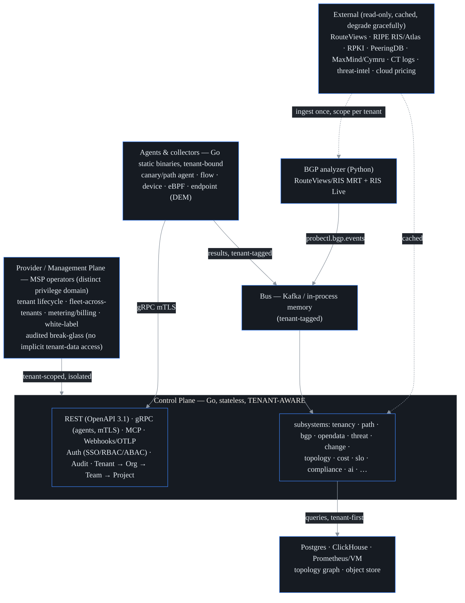
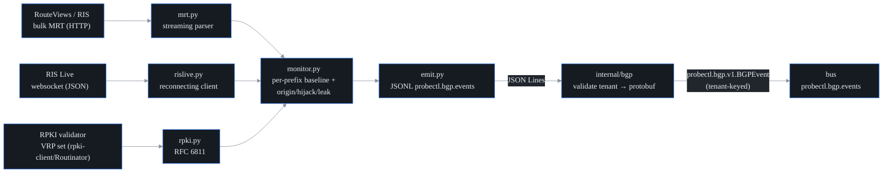
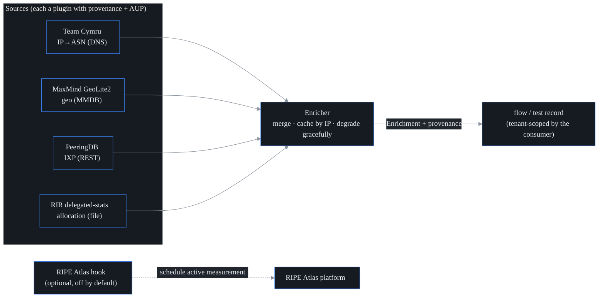
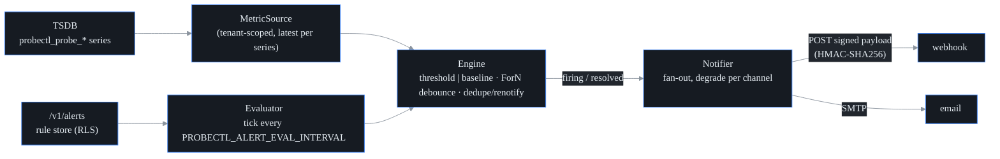
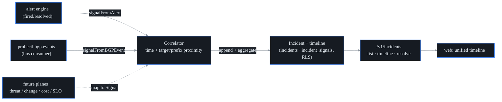
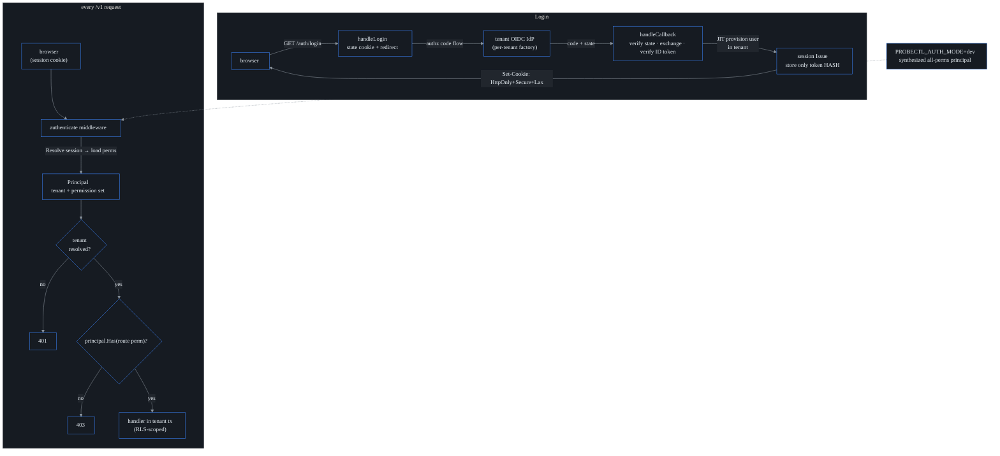
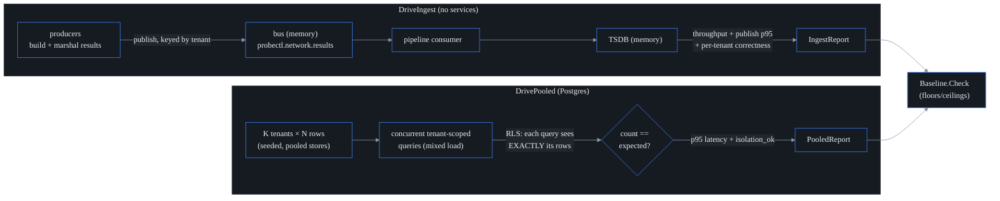

# Architecture

This is the in-repo map of how probectl is built and, just as importantly, *why
it is shaped that way*. Read it top to bottom and you get the mental model; jump
to a section and you get the real mechanism — package names, wire formats, the
guardrail each piece serves.

The single idea that explains almost every decision below: **a tenant is the
outermost boundary in the system, enforced underneath the application code, not
on top of it.** Everything else — the bus, the stores, the AI layer, the
provider plane — is arranged so that a forgotten check cannot leak one tenant's
data to another. Keep that in mind and the rest follows.

## Shape

**Reading the diagram:** an agent probes the network, ships each result onto the
bus *stamped with its tenant*, a control-plane consumer persists it and folds it
into incidents/topology, and then the API, UI, AI, and MCP server read the
unified stores — always **filtering to the caller's tenant first, then applying
that user's role permissions (RBAC)**. The external feeds on the right (route
collectors, geo data, threat intel) are pulled in *once*, shared, and then
attributed per tenant when stored — probectl owns no measurement fleet of its
own.

### Producers and consumers — and why "no producers = no data"

The single most important operational fact for a new reader: **the control plane
is the *consumer*, and the agents/collectors are the *producers*.** The control
plane produces no observations of its own — it does not probe, sniff, poll, or
peer with anything. It only **receives, stores, correlates, and serves** the data
that producers ship in. (The one thing it triggers itself is operator-initiated
path discovery; see [Path visualization](#path-visualization). Everything else
arrives from a producer.)

The practical consequence: **a brand-new control plane with nothing attached is
an empty system — by design, not by fault.** It will start, serve a healthy UI
and API, pass its own health checks, and show *zero* network data, because
nothing is observing the network yet. Data appears only once you attach
producers. So the first question when a fresh install "shows nothing" is never
"is the control plane broken?" — it is "what's producing?"

The producers are the binaries under `cmd/probectl-*` (deploy configs and the
full how-to live in [`deploying-agents.md`](deploying-agents.md)):

| Producer | What it observes | How it ships data in |
| --- | --- | --- |
| `probectl-agent` (canary/synthetic + path engine) | active ICMP/TCP/UDP/DNS/HTTP probes and traceroutes it runs itself | **streams over gRPC/mTLS** to the control plane (`StreamResults`); the control plane re-publishes onto the bus as `probectl.network.results` |
| `probectl-flow-agent` | passive NetFlow v5/v9, IPFIX, sFlow v5 exporter datagrams | **publishes to the bus** as `probectl.flow.events` |
| `probectl-device-agent` | SNMP (v2c/v3) + gNMI/OpenConfig device telemetry | **publishes to the bus** as `probectl.device.metrics` |
| `probectl-ebpf-agent` | zero-instrumentation L3/L4 host flows + service map (Linux) | **publishes to the bus** as `probectl.ebpf.flows` |
| `probectl-endpoint` (DEM) | last-mile experience on a user's device (WiFi, gateway, ISP path, browser timings) | **publishes to the bus** as `probectl.endpoint.results` |

Note the two shapes of "ships data in." The **canary agent streams** over its
tenant-bound mTLS gRPC link (`internal/agenttransport`, the
`probectl.agent.v1.AgentService` service — see [Agent transport](#agent-transport)),
and the control plane is the thing that puts that result on the bus. The
**flow/device/eBPF/endpoint collectors publish directly to the bus** themselves
(`internal/bus`). Either way the rule from the diagram holds: every record is
stamped with its tenant before a consumer ever sees it.

This is *not* the same thing as the external feeds on the right of the diagram
(RouteViews/RIS, RPKI, MaxMind, threat-intel). Those are read-only *enrichment*
data the control plane pulls in to annotate what producers observe — they are
context, not observations of your network. The Python BGP analyzer
([BGP / routing intelligence](#bgp--routing-intelligence)) sits in that camp: it
reads public collector data and emits `probectl.bgp.events`, but it is not
watching your network either. So even with every external feed reachable, "no
producers = no data" still holds for your own traffic.

To see the whole producer → consumer → UI loop come alive end-to-end on one
machine, walk through [`getting-started.md`](getting-started.md); to choose and
deploy producers for a real environment, see
[`deploying-agents.md`](deploying-agents.md).

## First principles

These are the rules that shaped the build. They are non-negotiable, and the
sections below are concrete instances of them.

- **A tenant is the outermost scope and the security boundary.** Every
  tenant-owned record, bus message, metric series, and object key is scoped by
  `tenant_id` *at the storage/query layer* — in Postgres Row-Level Security and
  ClickHouse row policies — never in handler code alone. The reasoning: handler
  code has bugs; a `WHERE tenant_id = ?` you forgot to write leaks data, but a
  database that *physically refuses* to return another tenant's rows does not. A
  cross-tenant isolation test is a permanent CI gate (the `cross-tenant-isolation`
  job).
- **OpenTelemetry-native.** probectl ingests and exports OpenTelemetry (OTLP);
  see [`otlp.md`](otlp.md). Result and event schemas are modeled on OTel resource
  + network semantic conventions *from the first line of code that emits them*,
  so exposing OTLP later is just surfacing the schema, not retrofitting it.
  (Traces/logs are kept bounded for correlation — probectl is deliberately not an
  APM/tracing product.)
- **Self-hosted, never phones home.** No outbound telemetry is on by default. The
  operator's network data stays in the operator's network.
- **Crypto is abstracted behind `internal/crypto`.** Handlers and services never
  call a crypto primitive directly. The payoff: a FIPS 140-3 validated module can
  be compiled in without touching business logic. mTLS secures every
  agent↔control-plane link; every listener serves TLS.
- **Remediation is observe-only and human-gated; threat detection is a signal,
  not an inline IPS.** probectl tells you what is wrong and, at most, proposes a
  fix a human approves — it never silently acts on the network.

## Tenant-scoped data model

This is the foundation the rest of the system stands on. The hierarchy is
**Tenant → Organization → Team → Project**: a tenant is the hard isolation
boundary (one customer of an MSP, or the single org in a sovereign install),
and orgs/teams/projects are how that tenant subdivides itself internally.
Identity, RBAC, audit, and every data plane hang off a tenant.

| Table | Scope | Notes |
| ----- | ----- | ----- |
| `tenants` | global registry | the outermost entity; provider-managed; has no `tenant_id` and no RLS — it *is* the registry of tenants |
| `organizations`, `teams`, `projects` | tenant-owned | the hierarchy; each carries `tenant_id` + a parent foreign key |
| `users`, `service_accounts` | tenant-owned | per-tenant identity |
| `permissions` | global catalog | the grantable action set, identical for every tenant |
| `roles`, `role_permissions`, `role_bindings` | tenant-owned | the RBAC foundation |
| `provider_operators`, `break_glass_grants` | global / provider | the provider privilege domain — operators are **not** tenant users |
| `audit_events` | tenant-owned | per-tenant hash chain, append-only |
| `provider_audit_events` | global / provider | the separate provider / break-glass hash chain |
| `agents`, `tests`, `results` | tenant-owned | the telemetry tables the planes below populate |

Every tenant-owned table carries a **non-null `tenant_id`** with an index from
its very first migration — it is never bolted on afterward. (See the migrations
in `migrations/`, e.g. `0002_tenancy_core.sql`.)

### Pooled isolation: why a forgotten check still cannot leak

"Pooled" means many tenants share the same physical Postgres tables, told apart
by `tenant_id`. The obvious worry: one mistyped query and tenant A reads tenant
B. probectl makes that impossible with **two independent layers** — so a bug in
either one is caught by the other.

1. **Storage layer — Postgres Row-Level Security (RLS).** Every tenant-owned
   table has RLS `ENABLE`d and `FORCE`d, with a policy keyed on a per-transaction
   setting, `probectl.tenant_id`. If that setting is unset, the policy matches
   *zero* rows — it fails closed. Even a raw `SELECT * FROM organizations` with no
   `WHERE` clause returns only the current tenant's rows, because the database
   itself rewrites the query.
2. **Query layer — the tenancy choke point.** `tenancy.InTenant(ctx, pool, fn)`
   (`internal/tenancy/tenancy.go`) is the *only* way to get a tenant-scoped
   database handle. It opens a transaction, runs `SET LOCAL ROLE probectl_app` —
   a role created `NOSUPERUSER`/`NOBYPASSRLS`, so RLS applies even when the
   connection logged in as a superuser — then sets the `probectl.tenant_id`
   setting, and only then runs your code.

`probectl_app` also holds *least-privilege* DML: audit tables grant no
UPDATE/DELETE, so even buggy code cannot rewrite history. The application's login
role must be able to assume `probectl_app` (a superuser always can; otherwise
`GRANT probectl_app TO <login_role>`).

### Provider plane and break-glass

Provider operators (the MSP staff running the platform) are a *separate privilege
domain* from tenant users. The crucial rule: **running a tenant grants zero read
access to that tenant's telemetry.** To actually read a tenant's data, an
operator needs a `break_glass_grant` that is time-bounded, consented to by the
tenant, and recorded on a *separate* audit stream. Ordinary provider queries use
a dedicated Postgres role with no grant on telemetry tables at all; break-glass
reads go through `InTenant` for the target tenant and are audited per access. See
[`provider-plane.md`](provider-plane.md).

### Audit: two tamper-evident streams

There are two append-only, hash-chained logs: the **tenant** stream
(`audit_events`, one hash chain per tenant) and the **provider** stream
(`provider_audit_events`, for operator and break-glass actions). Each record
chains over the previous record's hash via `internal/crypto`, so deleting,
reordering, or editing any entry breaks the chain and `internal/audit`'s `Verify`
detects it. The two streams are kept separate so provider activity can never hide
inside tenant logs, or vice versa.

## Agent transport

Agents talk to the control plane over **gRPC with mutual TLS**
(`internal/agenttransport`; the service is `probectl.agent.v1.AgentService` with
`Register` / `Attest` / `Heartbeat` / `StreamResults`, plus the
`PollCoordination` / `ReportEndpoint` pair that brokers agent-to-agent
measurement — see [Network tests and agent-to-agent](#network-tests-and-agent-to-agent)).
The server demands and verifies a client certificate, and reads the agent's
**tenant and id from that certificate's SPIFFE identity** —
`spiffe://probectl/tenant/<t>/agent/<a>` — never from the request body. That
single design choice binds an agent to exactly one tenant cryptographically: a
compromised or malicious agent cannot claim to be in a different tenant, because
it would need that tenant's certificate.

One more RPC, `StreamConfig`, exists in the schema but is an **explicit deny**:
config push is deliberately not a shipped capability (agents load their own
config), and the stub returns an error rather than silently doing nothing — see
[`adr/config-push.md`](adr/config-push.md). The proto lives under
`proto/probectl/agent/v1/` and is versioned, additive-only.

## Agent runtime

`probectl-agent` (`cmd/probectl-agent`, `internal/agent`) is one static,
multi-arch, database-free binary. Inside it:

- A plugin **host** runs the compiled-in canaries (`internal/canary`) on a
  schedule, writing each result into a disk-backed, bounded **store-and-forward
  buffer** (an append-only framed log, compacted when drained).
- A **forwarder** registers, heartbeats, and drains that buffer to the control
  plane over mTLS, reconnecting with backoff on failure.

The point of the buffer: **probing is decoupled from connectivity.** If the
control plane is unreachable, the agent keeps measuring; results pile up locally
and drain on reconnect (at-least-once delivery). Every buffered and emitted
result is stamped with the agent's tenant and id.

## Result pipeline

A result's journey: agent → gRPC `StreamResults` → control-plane ingest
(`internal/agenttransport`) → result bus (`internal/bus`) → consumer
(`internal/pipeline`) → time-series writer (`internal/store/tsdb`). The wire
payload is the canonical OTel-aligned result (`proto/probectl/result/v1`), whose
attribute names follow OTel resource + network semantic conventions — see
[`otel-mapping.md`](otel-mapping.md).

**Tenant integrity at ingest is the load-bearing detail.** Before publishing, the
control plane *overwrites* the result's `tenant_id`/`agent_id` with the identity
from the verified mTLS certificate, and keys the bus message by tenant. So a
malformed or hostile payload can never get itself attributed to another tenant —
the cryptographic identity always wins over the bytes on the wire.

Two pieces are pluggable behind one interface each, so the same code runs from a
laptop to a cluster: the bus has a **memory** mode (in-process — the lightweight
default for tiny deployments, roughly under five agents) and a **kafka** mode;
the writer has a **memory** mode and a **prometheus** remote-write mode
(Prometheus/VictoriaMetrics). The consumer converts each result into
`probectl_probe_*` time-series labeled by
`tenant_id`/`agent_id`/`canary_type`/`server_address`. Because a TSDB has no
row-level security of its own, tenant isolation there is enforced by always
scoping reads to a `tenant_id` label at query time.

## Network tests and agent-to-agent

Probes are compiled-in `Canary` plugins (`internal/canary`): `icmp`
(loss/latency/jitter), `tcp` (connect latency) and `udp` (echo round-trip)
agent-to-server tests, `dns` (resolver/trace + DNSSEC), and `http` (availability +
timing breakdown + TLS capture). They all share one latency-statistics core and
emit through the result pipeline above.

**Agent-to-agent** measurement runs between two registered agents but is
**brokered by the control plane** (`internal/a2a`) — the agents never need to
discover each other directly. The broker assigns roles, relays the responder's
listen endpoint to the initiator, and hands each agent its task when it polls
(`ReportEndpoint` and the polling API). All broker state is tenant-scoped: an
agent only ever receives its own tasks, and only a session's responder may report
an endpoint. The measurement itself is TWAMP-lite (`internal/canary/a2a.go`):
four timestamps T1–T4 yield round-trip = (T4−T1)−(T3−T2), forward one-way = T2−T1,
and reverse one-way = T4−T3. The one-way figures assume the two hosts' clocks are
NTP-synced. Both agents' results flow through the same pipeline into the TSDB.

## DNS tests

The `dns` canary (`internal/canary/dns.go`) queries DNS over **UDP, TCP, DoT
(DNS-over-TLS), or DoH (DNS-over-HTTPS)** in two modes. In **resolver** mode it
sends one query and reports resolution time, answer count, response code, and an
answer summary. In **trace** mode it performs an **iterative delegation walk**
from the root hints (`dnstrace.go`) — starting at the root, following `NS`/glue
referrals down to the authoritative server, and recording the full delegation
chain (the same thing `dig +trace` does, but instrumented). DoT verifies the
resolver's certificate; DoH is RFC 8484 `application/dns-message` over HTTPS, with
outbound TLS validated and the response treated as untrusted input.

**DNSSEC validation (`dnssec.go`) verifies the zone's signature, not the AD bit.**
`verifyRRSIG` is a pure check — given the answer RRset, its `RRSIG`s, and the zone
`DNSKEY`s it returns `secure` (a matching-keytag signature inside its validity
window that verifies), `insecure` (no RRSIG — the zone is unsigned), or `bogus`
(signatures present but none verify: tampered, expired, or wrong key). The network
wrapper fetches the signer zone's `DNSKEY` when it isn't already in the response;
chain-to-root anchoring is a later refinement. A bogus verdict fails the probe, so
forged answers are caught rather than trusted. The crypto lives entirely inside
`miekg/dns`, keeping the FIPS crypto-abstraction guard green (guardrail 3). The
pure validator is fixture-tested with locally signed RRsets (secure / expired /
tampered / no-key); in-process DNS servers cover the resolver, DoH, and DNSSEC
paths hermetically, with skip-safe live DoT + trace tests.

## HTTP server tests

The `http` canary (`internal/canary/http.go`) measures HTTP(S) availability and,
crucially, *where the time went*: a per-phase **response-time breakdown** captured
via Go's `net/http/httptrace` (`httptrace.go`) — DNS, TCP connect, TLS handshake,
time-to-first-byte, and total — plus status, content length, and throughput.
Availability is decided by an `expect_status` matcher (exact codes, `Nxx` classes
like `2xx`, or ranges). The resolved peer IP is recorded as
`network.peer.address`; that field is the **join key** that lets an HTTP result be
correlated to path/traceroute data for the same destination, without paying to
re-run a traceroute inside every HTTP probe.

On HTTPS the canary **captures the TLS handshake**: version, cipher, and the leaf
certificate's subject/issuer/validity/SANs, plus the chain shape and a
cert-expiry-days metric. This is captured now and analyzed later by the TLS-posture
plane (see [`tls-observability.md`](tls-observability.md)). The subtle part:
to capture the certificate chain **even when it is invalid**, the canary sets
`InsecureSkipVerify` and then performs the standard chain + hostname verification
*itself* in `VerifyConnection` (honoring a `ca_file` trust anchor). So an expired
or untrusted cert still **fails the probe** — you are not silently trusting bad
certs — while its details are still attached for posture review. All crypto stays
in `crypto/tls` + `crypto/x509` (FIPS-swappable). Integration tests stand up a
local HTTPS server and walk the required cases — success, 5xx, slow/timeout, and
expired-cert (asserting the cert is captured despite the failure) — minting the
test CA and expired leaf with `internal/crypto`.

## Path discovery

`internal/path` is the ECMP/MPLS-aware path engine, and the substrate for the
hero path visualization. The problem it solves: modern networks load-balance
across many equal-cost paths (ECMP), so a naive traceroute gives you a smeared,
incoherent picture. The engine runs **Paris-style traceroutes** — each trace
*fixes a flow identifier* so that a load-balancing router keeps that one trace on
a single stable path, and varying the identifier deliberately explores the
different ECMP branches.

The clever bit is how the flow is fixed in ICMP mode: a **forced ICMP checksum**.
The engine solves for a 2-byte payload "balance" word so that the checksum field
comes out equal to a chosen value while the packet stays valid — which keeps ECMP
hashing stable per flow. In TCP mode the flow is just the fixed 5-tuple. The
engine also detects **MPLS label stacks** (RFC 4884/4950) quoted back on Time
Exceeded responses, and merges several per-flow traces into one multi-path `Path`:
each TTL becomes a hop whose multiple responders are ECMP branches, with per-node
RTT/loss and MPLS, and the **links** observed *within* individual flows. It never
infers an adjacency across an unresponsive `*` hop — an honest gap stays a gap.

A complete per-hop trace needs **raw sockets** (`CAP_NET_RAW`) to read the
intermediate Time Exceeded messages; without that privilege, the datagram-ICMP
fallback still finds the destination but not every hop. The checksum trick, the
MPLS parsing, and the multi-path merge are fixture-tested; a loopback trace is the
live test.

Path data is high-cardinality time-series, so it lives in **ClickHouse**
(`internal/store/pathstore`): a `memory` store for the lightweight mode and tests,
and a `clickhouse` adapter that reads/writes hop and link rows over ClickHouse's
**HTTP interface** (no native-driver dependency), partitioned by `tenant_id` so
path data never crosses a tenant boundary.

## Path visualization

The data API is two routes: `GET /v1/tests/{id}/path` returns the latest stored
path for a test, and `POST /v1/tests/{id}/path` runs a discovery now and stores
it. Both are tenant-scoped through the test lookup, and the discoverer is
injectable (default `path.Run`) so the handlers are testable without touching the
network. Discovery currently runs from the control plane (operator-triggered); an
agent-vantage scheduler is a future refinement.

The **hero UI** (`web/src/viz`) renders the merged multi-path on the design
system: a pure `layoutPath` function places hops in TTL columns with ECMP branches
stacked and links drawn from observed adjacencies, and an SVG `PathGraph` colors
nodes by loss (so the lossy hop visually jumps out), draws MPLS markers, and
offers hover/focus tooltips. Nodes are keyboard-operable and open a per-hop
drill-down, backed by a visually-hidden hop table so screen readers get the same
data. A **loss-by-hop** sparkline pinpoints where drops start. Layout is linear in
nodes + links even for dense graphs, and animation respects
`prefers-reduced-motion`.

## BGP / routing intelligence

The BGP plane is the one probectl component written in **Python** (`analyzer/`),
because Python has the richest BGP/MRT tooling; it is bridged into the Go control
plane by `internal/bgp`. It ingests **public** collector data — RouteViews/RIPE-RIS
**MRT** dumps and the **RIS Live** websocket — and never peers with a customer's
routers. It does per-prefix AS-path monitoring with **origin-change /
possible-hijack / possible-leak** detection and **RPKI** (RFC 6811) validation,
and emits `probectl.bgp.events`.

**Streaming, never buffered.** `mrt.py` is a bounds-checked RFC 6396 reader that
yields one route at a time (TABLE_DUMP_V2 RIB + BGP4MP UPDATE), so a
multi-gigabyte dump is never loaded into memory as a whole RIB. A malformed record
is logged and skipped, not fatal. RIS Live's parsing core is transport-agnostic
(so it can be replayed in tests), and the live client owns the reconnect/backoff
loop.

**Detection is a signal, not an action.** Each event carries a confidence and
severity and is tunable and suppressible; probectl never acts on routing. The
rules: an origin differing from the last sighting → `origin_change` (with old/new
origin + AS path); an origin outside the configured allow-list →
`possible_hijack` (a more-specific prefix being a higher-confidence sub-prefix
hijack); a configured no-transit AS appearing mid-path → `possible_leak`; an RFC
6811-invalid announcement → `rpki_invalid`. If the RPKI source is down or absent,
validation degrades to `unknown` rather than breaking the whole analysis.

**The seam between Python and Go is a stable JSON schema.** The analyzer emits
events as JSON Lines — a dependency-light, language-neutral contract — and
`internal/bgp` is the bridge that parses each line, **fails closed on any event
missing a `tenant_id`** (tenant is the outermost scope), translates it to the
canonical `probectl.bgp.v1.BGPEvent` protobuf, and publishes it on the bus keyed
by tenant. External BGP data is ingested **once** and then scoped per tenant by
each tenant's monitoring configuration. RouteViews/RIS are open data; their
acceptable-use terms and per-source provenance are tracked for MSP/commercial
resale, and are irrelevant to single-tenant self-hosted use.

## Open-data enrichment

`internal/opendata` annotates an IP with internet-wide context — ASN, geo, IXP
presence, and RIR allocation — drawn from public datasets, without probectl owning
any measurement fleet. It is a **pluggable** framework: each `Source` implements
`Enrich(ctx, addr, *Enrichment)`, and the `Enricher` runs an IP through every
enabled source and merges the result.

**Shared once, scoped per tenant.** Open data is deliberately **not** tenant-owned:
the `Enricher` is tenant-agnostic and returns plain data that the *caller* attaches
to a tenant-scoped record. The tenant boundary is therefore enforced where the
enrichment is *stored*, not in this package. Sources run in registration order, so
an ASN-providing source (Team Cymru) runs before one that keys off the ASN
(PeeringDB, which looks up IXP presence for the discovered `e.ASN`).

**Graceful degradation is the whole contract.** A source that is disabled, errors,
times out, or even panics is logged, marked `degraded`/`disabled` in
`Enricher.Status()`, and skipped — enrichment returns a *partial* result and **a
failing dataset never breaks a core path**. Each contributing source records its
`Provenance` (name, license, attribution, fields) on the `Enrichment`, and its
acceptable-use terms (license, commercial-use permission, attribution) travel on
the `Descriptor` — the matrix in [`opendata-aup.md`](opendata-aup.md) that gates
MSP resale. Every external fetch is over TLS with certificate validation and the
response is treated as untrusted; per-IP and per-dataset caching shields
rate-limited upstreams. MaxMind GeoLite2 is operator-supplied (not shipped), and
RIPE Atlas is an optional active-measurement hook, off (fail-closed) by default.

## Alerting engine

`internal/alert` evaluates **threshold** and **baseline (anomaly)** rules over the
time-series the result pipeline writes, and delivers firing/resolved
notifications to **webhook** and **email** channels. Rules are tenant-owned and
CRUD'd via `/v1/alerts`.

**Two rule types.** A *threshold* rule fires when an aggregated value crosses a
bound (`gt`/`lt`/…). A *baseline* (anomaly) rule fires when a value deviates from
its recent rolling mean by more than N standard deviations — and it **warms up on
cold start**, refusing to fire until the window is full, so a fresh deployment
does not alarm on its first few samples. Evaluation is **per series** (per label
set), so a single rule independently covers many targets.

**Storm avoidance.** State advances `ok → pending → firing`: a `for_n` debounce
requires N consecutive breaches before firing, and while firing the engine
**dedupes** — it notifies once, then re-notifies only every `renotify_seconds`,
and emits a single `resolved` notification on recovery. This is what keeps a
flapping target from generating a thousand pages.

**Channels and delivery.** The `Notifier` fans an alert out to a rule's channels
and **degrades per channel** — one failing or misconfigured channel never blocks
the others. The **webhook** channel POSTs a stable JSON payload
(`probectl.alert.v1`) over TLS and, when a secret is set, signs the body with
**HMAC-SHA256** (via `internal/crypto`) in an `X-Probectl-Signature` header, so
the receiver can verify the sender. The **email** channel sends via SMTP behind an
injectable sender. Webhook secrets are **redacted (`***`) from API responses**.

**Wiring and current limits.** The control plane runs a background `Evaluator`
that ticks every `PROBECTL_ALERT_EVAL_INTERVAL`, loading each tenant's enabled
rules through the RLS choke point and querying the TSDB *scoped to that tenant*
(so it can never read another tenant's metrics). Today's wiring evaluates the
default tenant over the in-process TSDB; a full multi-tenant fan-out and a
Prometheus query backend are follow-ups, and the loop disables itself gracefully
when no in-process query backend is available. Alerts are signals — probectl
notifies, it does not act on the network.

## Incident timeline and correlation

`internal/incident` is the cross-plane triage home: related signals from any plane
group into a single **Incident** with a coherent, time-ordered **timeline**.

**Extensible by construction.** A `Signal` is a generic envelope — a free-form
`plane` and `kind`, a `target`/`prefix` for correlation, and an arbitrary
`attributes` map. A new plane contributes simply by mapping its native event onto
a Signal (`signalFromAlert`, `signalFromBGPEvent`); neither the `incident` package
nor the schema changes, because `incident_signals.attributes` is a `jsonb` column.
The control plane already feeds the **network** plane (alert firings, via an engine
sink) and the **BGP** plane (a `probectl.bgp.events` bus consumer).

**The core move — correlation grouping.** `Correlator.Ingest` places a signal into
an open incident when it is both *close in time* (within `PROBECTL_INCIDENT_WINDOW`
of the incident's activity) and *related in target* — the same target, an IP
inside the other's prefix (in either direction), or overlapping prefixes. This
cross-plane join is the payoff of the whole design: a network loss alert for
`192.0.2.10` and a BGP possible-hijack for `192.0.2.0/24` land in **one** incident
because the IP is inside the prefix, so an operator sees a single correlated story
instead of two disconnected alerts. No match opens a new incident. An incident's
severity is the max of its signals, and `AppendSignal` updates
last-seen/severity/count atomically inside the tenant transaction.

**Tenancy and scope.** Incidents are tenant-owned (RLS); the correlator fails
closed on a signal with no tenant and only ever groups a tenant's own signals.
This is the *foundation* the higher planes build on — AI root-cause analysis, and
the change and threat overlays, all attach as additional signal planes onto this
same incident model.

## SSO and RBAC

`internal/auth` is the identity and access foundation: **OIDC single sign-on**,
server-side **sessions**, and **RBAC** over the role model from the data model
above. It enforces the **two-level boundary** — resolve the **tenant first**, then
check RBAC — on every `/v1` path.

**Sessions.** A session token is high-entropy random, and only its **hash** is
persisted in the `sessions` table — a global table, looked up *before* any tenant
context is established, because the row is what reveals which tenant the session
belongs to. The cookie is **HttpOnly + SameSite=Lax**, and **Secure** on HTTPS.
Hashing and the RNG go through `internal/crypto`, so `auth` imports no crypto
primitive directly and the import guard stays satisfied; ID-token verification
lives inside the go-oidc / go-jose libraries.

**Per-tenant IdP.** A `ProviderFactory.For(tenant)` resolves the OIDC provider for
a given tenant — the seam that lets a tenant bring its own SSO. The shipped
default is env-configured, and a login always resolves to exactly one tenant.
Provider/MSP operators authenticate into the *provider domain* instead, never into
tenant data here.

**RBAC.** Each route carries a required **permission key**, and
`requirePermission` returns **401** when unauthenticated and **403** when
unauthorized — *before* the handler runs. Effective permissions are loaded **per
request** from the user's role bindings (RLS-scoped), so a grant or revoke takes
effect immediately. New users are provisioned with **no roles** (the secure
default — you opt in to access, you do not opt out). The AI and MCP query layer
reuses this same `Principal`: tenant first, then RBAC.

## Load/perf harness

`internal/perf` is a reusable load/perf harness — a **cheap, repeatable baseline**
that runs in CI, not a long-running soak. Its job is to catch a scaling regression
(including the cost of pooled tenancy) early in CI rather than at the final scale
gate. Two pure drivers exercise the core path, and the recorded numbers and
thresholds live in [`perf-baseline.md`](perf-baseline.md).

**Ingest baseline** measures end-to-end throughput and publish latency on the
lightweight path, and asserts every result is ingested with its series tagged by
the right tenant. **Pooled multi-tenant** runs tenant-scoped queries concurrently
across many tenants sharing the pooled Postgres stores, and asserts isolation
*under load* — every query must return exactly its own tenant's rows — plus a
bounded p95. This is the first place a pooled-cardinality or RLS-cost problem
would surface. `Baseline` holds the generous floors and ceilings that the CI
`perf-smoke` job asserts; the larger L/XL scale gate and the fairness work both
build on this same harness (see [`scale-gate.md`](scale-gate.md)).

## Synthetic result views

The pipeline flattens results into TSDB series for trends, but each result's
*per-type detail* (a DNS response code/answers/DNSSEC verdict, an HTTP
DNS→connect→TLS→TTFB waterfall, an ICMP/TCP/UDP latency-and-loss family) lives in
its metrics and attributes. To show that detail without scanning history, a
latest-result read model (`internal/control.LatestResults`, fed by its own
consumer group on `probectl.network.results`) keeps the newest full result per
(tenant, type, target, agent) — tenant-partitioned, bounded, newest-wins — and
serves it at `GET /v1/results/latest` (requires the `test.read` permission, with a
`collector_running` honesty flag). The Targets & Tests screen renders that per
type: an HTTP waterfall, a DNS resolution breakdown, a shared latency/loss view
for ICMP/TCP/UDP, and a named-field fallback for future types — so **no test type
ever renders as raw JSON**. History stays in the TSDB; this is the latest-only
detail view.
