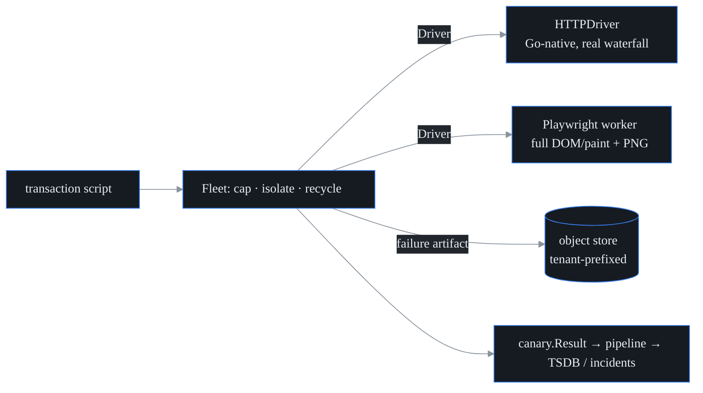

# Browser / transaction synthetic (S36 · F15)

probectl runs **scripted multi-step transactions** — a login, a checkout — and
reports per-step timings, a page-load **waterfall**, DOM/paint timings, and a
**failure screenshot**. It's the heaviest canary, so it runs as a managed worker
fleet that caps concurrency, isolates each run, and recycles workers.



## Two drivers, one contract

Both implement the same `Script → Result` contract (`internal/browser.Driver`):

| | **HTTPDriver** (default) | **Playwright worker** |
| - | ------------------------ | --------------------- |
| Runtime | Go-native, no browser | headless Chromium (`browser-worker/`) |
| Waterfall | real per-request (DNS/connect/TLS/TTFB/total) | real per-resource |
| DOM/paint timings | – | yes |
| Screenshot | the failed page's HTML/body | a visual PNG |
| Runs | anywhere (incl. air-gapped, CI) | needs the Playwright image |

The HTTPDriver makes transaction monitoring available everywhere and is fully
unit-tested; the Playwright worker adds true rendering. Pick per deployment.

## Transaction script format

JSON (the test-definition contract, `internal/browser/script.go`):

```json
{
  "name": "login",
  "start_url": "https://app.example/login",
  "steps": [
    {"action": "goto"},
    {"action": "fill",   "selector": "[name=username]", "field": "username", "value": "alice"},
    {"action": "fill",   "selector": "[name=password]", "field": "password", "value": "secret"},
    {"action": "click",  "selector": "button[type=submit]"},
    {"action": "assert_text",   "value": "Welcome"},
    {"action": "assert_status", "status": 200}
  ]
}
```

Actions: `goto`, `fill`, `click`, `submit`, `wait_text`, `assert_text`,
`assert_status`, `screenshot`. The browser driver uses `selector`; the HTTP driver
uses `field` (form field) + `url` (submit target).

## Result fields

Per run (`internal/browser/result.go`): `success`/`error`, `total_ms`, `steps[]`
(name/action/success/duration), `waterfall[]` (url/method/status + DNS/connect/
TLS/TTFB/total), `dom` (DOMContentLoaded/load/first-paint/FCP), and a `screenshot`
reference. The run maps to the canonical `canary.Result` (type `browser`) so it
flows through the same pipeline → TSDB / incident path as every other canary;
timings become metrics, the screenshot key an attribute.

## Fleet: isolation, concurrency, recycling

Because browser workers are CPU/memory-heavy, the `Fleet` (`fleet.go`):

- **caps concurrency** — a worker pool of `MaxConcurrency`; extra runs block;
- **isolates each run** — a `RunTimeout` context; for the Playwright worker, a
  timeout kills the worker process (`exec.CommandContext`);
- **recycles workers** — after `RecycleAfter` runs or any failed run, the driver
  is `Close()`d and rebuilt (bounds leaks, restarts a crashed browser);
- **degrades safely** — a panicking run is caught and the worker recycled.

## Screenshots → object store

A failure artifact is uploaded to the pluggable **object store**
(`internal/objectstore`: filesystem default, S3/MinIO behind the same interface)
under a **tenant-prefixed key** (`tenant/<id>/browser/<script>-<ts>.png`), so
artifacts are tenant-isolated (F50). Successful runs store nothing by default
(bounds storage); enable `StoreOnSuccess` to keep them. Apply object-lifecycle /
retention at the store.

## Deploy

The Playwright worker ships as `browser-worker/` (a `Dockerfile` on the official
Playwright image, run as non-root `pwuser`). Scale the worker fleet horizontally,
away from the control plane. CI runs the worker's real-browser smoke (a scripted
login vs a local app) inside the Playwright image.

## Notes

- **Architecture choice:** the script format, result model, object-store upload,
  and fleet isolation/concurrency/recycling live in Go (`internal/browser`, fully
  tested); rendering is delegated to the Playwright worker over the `ExecDriver`
  contract — keeping browsers out of the single-binary agent.
- **Out of scope:** real-user monitoring (RUM, S47b) and endpoint browser-session
  capture (S37). Some sites detect headless browsers; configure a realistic UA /
  context for those.
