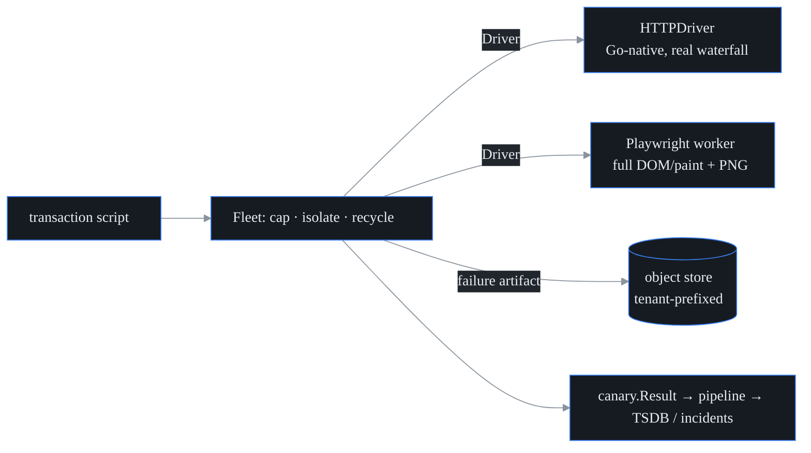

# Browser / transaction synthetic

> **Status: ROADMAP — not yet wired (ARCH-010).** The browser/transaction
> synthetic engine (`internal/browser`) and the Playwright worker exist as
> components, but no canary type is registered that drives them, so you cannot
> schedule a browser synthetic today: there is no `browser` entry in the canary
> registry and the agent has no plugin that executes one. This document
> describes the intended design, not shipped behavior. Wiring it (registering
> the canary type and the worker dispatch path) is tracked under ARCH-010 and is
> deferred behind the higher-priority ingest/registration work; the bigger lift
> here (a managed browser worker fleet) is why it trails the A2A wiring. Until
> then, treat everything below as the plan of record.

## What it is

This is the **canary** (probectl's name for one scheduled synthetic test type)
that drives a **scripted multi-step transaction** — a login, a checkout — and
reports per-step timings, a page-load **waterfall** (the per-request timing
ladder: when each resource's DNS lookup, connection, TLS handshake, and first
byte happened — a Gantt chart of the page load), **DOM/paint timings** (when the
browser finished building the page's element tree, and when it put the first
pixels on screen), and a **screenshot when it fails**. It's the heaviest test
type (running a real browser is expensive), so it runs as a managed worker fleet
that caps how many run at once, isolates each run, and recycles workers.



## Two drivers, one contract

Both drivers implement the same `Script → Result` contract (the
`internal/browser.Driver` interface), so you can pick per deployment without
changing anything else:

| | **HTTPDriver** (default) | **Playwright worker** |
| - | ------------------------ | --------------------- |
| Runtime | Go-native, no browser | headless Chromium (`browser-worker/`) |
| Waterfall | real, per request (DNS / connect / TLS / TTFB / total) | real, per resource |
| DOM/paint timings | – | yes |
| Screenshot | the failed page's HTML body | a visual PNG |
| Runs | anywhere (incl. air-gapped, CI) | needs the Playwright image |

(**Playwright** is the browser-automation framework the worker is built on — it
drives a real Chrome engine from code; **headless** Chromium is that engine run
without a visible window.) The two drivers are a table read versus a full dress
rehearsal: the HTTPDriver *reads the script* as raw HTTP — every request,
timing, and status real, nothing rendered; the Playwright worker *stages it* in
a real browser, adding what only rendering can show (DOM/paint timings, a
visual screenshot). The HTTPDriver makes transaction monitoring available
*everywhere* and is fully unit-tested; the Playwright worker adds true rendering
on top. The browser rendering is delegated to a separate worker process (over
the `ExecDriver` contract) precisely to keep a whole browser *out* of probectl's
single-binary agent.

## Transaction script format

A script is JSON, parsed and validated by `internal/browser/script.go`:

```json
{
  "name": "login",
  "start_url": "https://app.example/login",
  "steps": [
    {"action": "goto"},
    {"action": "fill",   "selector": "[name=username]", "field": "username", "value": "alice"},
    {"action": "fill",   "selector": "[name=password]", "field": "password", "value": "secret"},
    {"action": "click",  "selector": "button[type=submit]"},
    {"action": "assert_text",   "value": "Welcome"},
    {"action": "assert_status", "status": 200}
  ]
}
```

The full action vocabulary: `goto`, `fill`, `click`, `submit`, `wait_text`,
`assert_text`, `assert_status`, `screenshot`. The two drivers read the fields
they each need — the browser driver uses `selector` (a DOM element), the HTTP
driver uses `field` (a form field name) plus `url` (the submit target).

## Result fields

Each run produces a `Result` (`internal/browser/result.go`): `success`/`error`,
`total_ms`, `steps[]` (each with name / action / success / duration),
`waterfall[]` (each request's url / method / status plus DNS / connect / TLS /
TTFB / total), `dom` (DOMContentLoaded / load / first-paint / first-contentful-
paint), and a `screenshot` reference. The run is then mapped onto the canonical
`canary.Result` (type `browser`), so it flows through the *same* pipeline → TSDB
/ incident path as every other canary: timings become metrics, and the
screenshot key becomes an attribute.

## Fleet: isolation, concurrency, recycling

Because browser workers are CPU- and memory-heavy, the `Fleet`
(`internal/browser/fleet.go`):

- **caps concurrency** — a worker pool of `MaxConcurrency`; extra runs block
  until a worker is free;
- **isolates each run** — a `RunTimeout` context bounds every run (default 60s);
  for the Playwright worker, a timeout *kills the worker process* (via
  `exec.CommandContext`);
- **recycles workers** — after `RecycleAfter` runs, or after any failed run, the
  driver is `Close()`d and rebuilt (this bounds resource leaks and restarts a
  crashed browser);
- **degrades safely** — a panicking run is caught and the worker recycled,
  rather than taking the fleet down.

## Screenshots → object store

A failure artifact is uploaded to the pluggable **object store** — a key → blob
store: `Put` bytes under a string key, `Get` them back (`internal/objectstore`)
— under a **tenant-prefixed key**
(`tenant/<id>/browser/<script>-<ts>.png`), so one tenant's artifacts are
isolated from another's at the storage layer (siloed tenants get their own
prefix via isolation routing; a routing failure stores nothing — fail closed).
Two implementations ship today: **filesystem** (the default) and **in-memory**
(tests). The store is a deliberately small `Store` interface
(`Put`/`Get`/`Stat`/`List`/`DeletePrefix`), so an S3 / MinIO backend can slot
in behind it — pluggable by design, but **not shipped yet**; don't plan a
deployment around S3 support that isn't there.

Successful runs store nothing by default (to bound storage); set
`StoreOnSuccess` to keep them. Object-lifecycle / retention policy is applied at
the store itself.

## Deploy

The Playwright worker ships as `browser-worker/` — a `Dockerfile` built on the
official Playwright image (Chromium + OS deps preinstalled), run as the image's
non-root `pwuser`. The worker reads one Script as JSON on stdin and writes the
Result as JSON on stdout (the process's standard input and output pipes — no
listening port, no API surface); the fleet owns concurrency, isolation, and
recycling.
Scale the worker fleet horizontally, separately from the control plane. CI runs
the worker's real-browser smoke test (a scripted login against a local app)
inside the Playwright image. For the surrounding stack — bringing up the control
plane and bus, and the per-producer deployment journeys — start at
[`getting-started.md`](getting-started.md) and
[`deploying-agents.md`](deploying-agents.md).

## Notes

- **Integration status (honest).** What ships today is the complete transaction
  *engine*: the script format, both drivers, the fleet, the artifact store, the
  worker image, and the mapping onto the canonical `canary.Result` (type
  `browser`) — all CI-tested, including a real-browser smoke in the Playwright
  image. What is *not* wired yet: the shipped agent's canary registry
  (`noop`/`icmp`/`tcp`/`udp`/`dns`/`http`/`voice`) does not register a `browser`
  type, so transaction scripts are not yet schedulable as ordinary tests from
  the control plane. The consuming side is already browser-aware (the RUM
  convergence engine counts `browser` among its web-facing synthetic types), so
  results flow end-to-end the moment that registration lands.
- **Architecture choice.** The script format, result model, object-store upload,
  and fleet isolation/concurrency/recycling all live in Go (`internal/browser`,
  fully tested); only rendering is delegated to the external Playwright worker.
  This is what keeps browsers out of the single-binary agent.
- **Out of scope.** Real-user monitoring ([`rum.md`](rum.md)) and endpoint
  browser-session capture are separate features. Note that some sites detect
  headless browsers; for those, configure a realistic user-agent / browser
  context.
