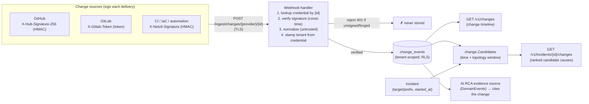

# Change intelligence + change-to-incident correlation (S29 · F39)

netctl ingests **change events** — deploys, config/route changes, IaC applies,
commits — from signed webhooks, normalizes them into one model, keeps a per-tenant
**change timeline**, and **correlates** recent changes to incidents so the AI RCA
can answer the question that resolves most outages: **"what changed?"**

A change event is **context**, not an incident: a deploy is a *candidate cause*,
surfaced and ranked, never auto-raised as an alert.

## Security model (the webhook is an inbound attack surface)

Webhooks feed the RCA, so every inbound delivery is treated as **untrusted** and
must clear all of these before anything is stored (CLAUDE.md §7 guardrail 12):

- **TLS** — the API (and the shipped deploys) are HTTPS-only.
- **Per-provider signature verification** — the provider's HMAC (GitHub/netctl) or
  shared token (GitLab) is verified in **constant time** against the webhook's
  secret. An **unsigned or forged** delivery is rejected with `401` **before**
  normalization, so a forged change can never reach the timeline or RCA.
- **Tenant binding** — the tenant is taken from the **verified credential**, never
  from the (untrusted) payload. One tenant therefore cannot inject another tenant's
  change events: it would need that tenant's webhook secret (HMAC fails) and the
  payload has no tenant field to spoof.
- **Size-limited, validated parse** — bodies are capped (1 MiB) and malformed
  entries are dropped.

All cryptographic checks route through `internal/crypto` (`crypto.Verify`,
`crypto.ConstantTimeEqual`) so a FIPS module swaps in cleanly (guardrail 3).

## Pipeline



## The ChangeEvent model

Every source is normalized onto one record (`internal/change.Event`): an
`id`, `source`, `kind` (`deploy`/`config`/`route`/`iac`/`commit`/`release`/`other`),
`title`/`summary`, a correlation **`target`** (host/service/IP) and/or **`prefix`**
(CIDR), `actor`, `ref` (commit/deploy id), `url`, free-form `attributes`, and
`occurred_at`. `target`/`prefix` are the anchors that tie a change to an incident.

## Providers & signatures

| Provider | `provider` | Signature header | Scheme | Events normalized |
| -------- | ---------- | ---------------- | ------ | ----------------- |
| **netctl / CI / IaC** | `generic` | `X-Netctl-Signature: sha256=<hmac>` | HMAC-SHA256 | netctl change schema (a single object, an array, or `{"events":[…]}`) |
| **GitHub** | `github` | `X-Hub-Signature-256: sha256=<hmac>` | HMAC-SHA256 | `push` → commit; `deployment`/`deployment_status` → deploy |
| **GitLab** | `gitlab` | `X-Gitlab-Token: <token>` | shared token (constant-time) | `Push Hook` → commit; `Deployment Hook` → deploy |

The **generic** provider is the path for network-automation / CI / Terraform /
Atlantis: it accepts netctl's schema and carries an explicit correlation `target`
or `prefix`, so a deploy can be tied to the host or netblock it touched. GitHub /
GitLab demonstrate heterogeneous normalization; a deploy's `environment_url` host
becomes the correlation target.

### Sending a generic change

```
POST /ingest/changes/generic/<webhook-id>
X-Netctl-Signature: sha256=<hmac-sha256(secret, body)>

{"kind":"deploy","title":"deploy payments-api to prod",
 "target":"api.example.com","actor":"ci","ref":"abc123"}
```

A verified delivery returns `202 Accepted` with the count ingested.

## Correlation (avoid drowning in changes)

`change.Candidates` scores recent changes as candidate causes of an incident,
combining **topology proximity** (exact target > IP-in-prefix > overlapping prefix)
with **time proximity** (closer to the incident scores higher), and considers only
changes within the window *before* the incident (plus a 5-minute skew grace for
clock differences across sources — the S29 watch-out). A change that neither
matches a targeted incident nor falls in the window is **dropped**, so the RCA is
fed the few likely causes, not every change.

`GET /v1/incidents/{id}/changes` returns the ranked candidates for an incident.

## Feeding the RCA

Change events are wired as the AI engine's **events evidence source**. The planner
already routes deploy/config/routing questions ("what changed?", "any recent
deploy?") to the events domain, so the RCA retrieves the relevant change for the
question's subject and **cites it** — within the caller's tenant and RBAC scope
(the unified-query two-level boundary). Reads require the `change.read` permission;
the AI path requires `events.read` + `ai.query`.

## Configuration

Webhooks are configured by the operator (mirroring the OTLP token model). Each
entry maps a public webhook **id** (the URL selector) to a tenant + provider +
secret.

| Variable | Default | Description |
| -------- | ------- | ----------- |
| `NETCTL_CHANGE_WEBHOOKS` | (none) | comma-separated `id:tenant:provider:secret` credentials. The secret is the last field (so it may contain `:`, not `,`) — use URL-safe (hex/base64) secrets. |
| `NETCTL_CHANGE_CORRELATION_WINDOW` | `24h` | how far before an incident a change is considered a candidate cause |

The webhook **id** is a non-secret URL selector; the **secret** is the HMAC key /
shared token. Provision a distinct id + secret per tenant. Secrets are runtime
config (inject from a secret manager) — never commit them.

## Security guardrails upheld

- **Untrusted + signature-verified + TLS + tenant-scoped** ingestion; a forged or
  unsigned event is rejected before normalization (§12).
- **Tenant binding** to the verified credential — cross-tenant injection is
  structurally impossible (§1).
- **Confidence over auto-action** — changes are context fed to RCA, not alarms; no
  remediation (§8).
- **FIPS crypto abstraction** — HMAC + constant-time compare route through
  `internal/crypto` (§3).
- **Audited** — each ingest appends a tenant audit event (`change.ingest`).

## Out of scope (deferred)

Self-service webhook registration (DB-backed, envelope-encrypted secrets) for
multi-tenant/MSP; bus publication of `netctl.change.events` for cross-plane replay;
non-webhook collectors (BGP-derived route-change collector, network config-diff) —
the `Provider` normalizer is the extension seam for these. Topology what-if is S43.
