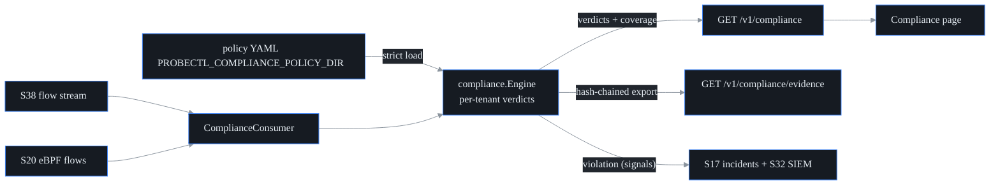

# Compliance / segmentation validation (S46, F43)

probectl proves segmentation the only way observability honestly can: the
operator DECLARES the intended segmentation (PCI zones, zero-trust intents),
and probectl validates it against **observed** traffic — eBPF (S20) and flow
(S38) reality — flagging violations with flow evidence and exporting
**audit-grade** PCI/NIST/zero-trust evidence.

The non-negotiable honesty contract (the S46 watch-out):

> **Observed ≠ intended.** A pair with no observed traffic is *not* proven
> blocked. probectl never emits the word "compliant" — the strongest claim is
> *"no violations observed, with the stated coverage"*. And probectl
> **validates, never enforces** (no blocking, ever — guardrail 9).

## Declaring policy

Policies are YAML in `PROBECTL_COMPLIANCE_POLICY_DIR` (strictly validated;
a malformed file fails startup — a boundary the operator believes is
validated must actually be):

```yaml
name: pci-segmentation
zones:
  - name: cde
    cidrs: ["10.10.0.0/16"]
  - name: corp
    cidrs: ["10.20.0.0/16"]
  - name: dmz
    cidrs: ["192.0.2.0/24"]
rules:
  - id: corp-to-cde
    description: Corporate systems must never reach the cardholder data environment.
    from: corp
    to: cde
    bidirectional: true
    frameworks:
      pci-dss: "Req 1.3 — network segmentation of the CDE"
      nist-800-207: "ZT tenet 3 — per-session least-privilege access"
  - id: dmz-to-cde-db
    from: dmz
    to: cde
    ports: [5432, 3306]          # scope the prohibition to database ports
    frameworks:
      pci-dss: "Req 1.3.6 — no untrusted access to CHD storage"
```

Rules are **forbidden intents** (zone → zone, optionally port-scoped,
optionally bidirectional). `frameworks` maps each rule onto audit language —
PCI DSS, NIST SP 800-207 zero-trust, or any custom framework tag — and rides
into every result and evidence record.

## Verdict semantics

| Verdict | Meaning |
|---|---|
| `violation` | forbidden traffic WAS observed (counted, timestamped, with bounded flow samples as evidence) |
| `observed_clean` | traffic between the zones WAS observed and none of it matched the forbidden scope |
| `not_observed` | NO traffic between the zones was observed — **not proof of isolation** |

Violations raise `compliance.segmentation_violation` signals (plane
`compliance`, critical) into the incident pipeline and the SIEM — once per
rule per episode.

## Coverage (never claim beyond what's observed)

Every response and every evidence export carries the coverage block: which
planes actually reported (flow / eBPF), observation counts and time range,
how many declared zones have observed endpoints, and explicit caveats
("quiet zones are NOT proven isolated"; "absence of traffic is not proof of
blocking"). An auditor sees exactly what was and wasn't watched.

## Audit-grade evidence

`GET /v1/compliance/evidence` (audit read) exports a self-verifying JSON
document (`probectl-compliance-evidence/v1`): timestamped, per-rule records
with framework mappings and violation samples, **hash-chained** via the
internal crypto provider — any post-export tampering breaks
`VerifyEvidence` (the tamper test flips one violation count and the chain
fails). Coverage caveats are embedded in the document itself.



## Configuration

| Variable | Default | Purpose |
|---|---|---|
| `PROBECTL_COMPLIANCE_ENABLED` | `true` | the validator + consumers (local-only) |
| `PROBECTL_COMPLIANCE_POLICY_DIR` | (none) | segmentation policy YAML directory (empty = zero policies, honestly reported) |

Out of scope by design: enforcement/blocking (validation only) and
config-based *intended* segmentation analysis (probectl judges observed
traffic; firewall-config analysis is a different product).
