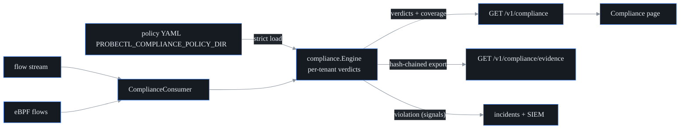

# Compliance / segmentation validation

## What this is

A firewall config says what traffic is *supposed* to be blocked. This feature
checks what your network is *actually* doing — and tells an auditor the
difference, honestly.

probectl proves segmentation the only way an observability tool truthfully can:
the operator **declares** the intended segmentation (PCI cardholder zones,
zero-trust intents), and probectl validates those declarations against
**observed** traffic — the eBPF and flow records the platform already collects.
It flags violations with the actual flow evidence and exports **audit-grade**
PCI/NIST/zero-trust evidence.

It lives in `internal/compliance/` (the policy model in `policy.go`, the
validator in `validator.go`, the evidence export in `evidence.go`) and is wired
into the control plane in `internal/control/complianceapi.go`.

### The honesty contract you must understand first

> **Observed ≠ intended.** A zone pair with *no observed traffic* is **not**
> proven blocked — it might just be quiet. probectl therefore **never emits the
> word "compliant"**; the strongest claim it will make is *"no violations
> observed, with the stated coverage."* And probectl **validates, never
> enforces** — it does not block anything, ever (one of probectl's
> [non-negotiables](../CONTRIBUTING.md#non-negotiables)).

This is the whole philosophy. An auditor who is told "compliant" when probectl
merely *didn't see* any traffic has been misled. So the engine is built to
distinguish "we watched and it was clean" from "we never saw anything here,"
and to say so out loud.

## Declaring policy

Policies are YAML files in `PROBECTL_COMPLIANCE_POLICY_DIR`. They are validated
**strictly** (unknown YAML fields are rejected via `KnownFields(true)`), and a
malformed file **fails startup** — a boundary the operator believes is being
validated must actually be validated, not silently skipped (`LoadDir` in
`policy.go`).

```yaml
name: pci-segmentation
zones:
  - name: cde
    cidrs: ["10.10.0.0/16"]
  - name: corp
    cidrs: ["10.20.0.0/16"]
  - name: dmz
    cidrs: ["192.0.2.0/24"]
rules:
  - id: corp-to-cde
    description: Corporate systems must never reach the cardholder data environment.
    from: corp
    to: cde
    bidirectional: true
    frameworks:
      pci-dss: "Req 1.3 — network segmentation of the CDE"
      nist-800-207: "ZT tenet 3 — per-session least-privilege access"
  - id: dmz-to-cde-db
    from: dmz
    to: cde
    ports: [5432, 3306]          # scope the prohibition to database ports
    frameworks:
      pci-dss: "Req 1.3.6 — no untrusted access to CHD storage"
```

The pieces:

- **Zones** are named address spaces (CIDR sets). When probectl sees a flow, it
  resolves each endpoint to the **longest-prefix-matching** zone (`zoneOf`), so
  a more specific `/24` wins over a broader `/16`.
- **Rules are forbidden intents** — "traffic from zone A to zone B should not
  happen." A rule is directional by default; set `bidirectional: true` to
  forbid both directions, or `ports: [...]` to scope the prohibition to specific
  destination ports (empty = all ports).
- **`frameworks`** maps each rule onto audit language — PCI DSS, NIST SP 800-207
  zero-trust, or any custom framework tag. That mapping rides into every result
  and every evidence record, so the export speaks the auditor's vocabulary.

## Verdict semantics

For each rule, the validator produces one of three verdicts (`Results` in
`validator.go`):

| Verdict | Meaning |
|---|---|
| `violation` | forbidden traffic **was** observed (counted, timestamped, with bounded flow samples as evidence) |
| `observed_clean` | traffic between the zones **was** observed, and none of it matched the forbidden scope |
| `not_observed` | **no** traffic between the zones was observed — **not proof of isolation** |

The distinction between `observed_clean` and `not_observed` is the honesty
contract in action. `observed_clean` means "we were watching that path and saw
only allowed traffic." `not_observed` means "we have no visibility into that
path" — which is emphatically *not* the same as "that path is blocked."

A `violation` raises a `compliance.segmentation_violation` signal (plane
`compliance`, severity `critical`) into the incident pipeline and the SIEM —
**once per rule per episode** (the `alerted` latch in `ruleState`), so a
persistent breach doesn't spam a fresh alert on every packet.

## Coverage: never claim beyond what was observed

Every API response and every evidence export carries a **coverage block**
(`CoverageFor` in `validator.go`) describing exactly what was watched:

- which planes actually reported (`flow_observed`, `ebpf_observed`),
- the observation count and time range,
- how many declared zones actually had observed endpoints
  (`zones_seen` / `zones_total`),
- and explicit caveats baked in as notes — e.g. *"quiet zones are NOT proven
  isolated"* and *"absence of traffic is not proof of blocking."*

So an auditor reading the output sees, in the document itself, the boundary
between what probectl confirmed and what it simply couldn't see.

## Audit-grade evidence

`GET /v1/compliance/evidence` (RBAC `audit.read`) exports a **self-verifying**
JSON document (format version `probectl-compliance-evidence/v1`). It contains
timestamped, per-rule records with their framework mappings and violation
samples, and the records are **hash-chained**: each record's hash covers its
own canonical content **plus the previous record's hash** (`recordHash` in
`evidence.go`), and the document ends with the final chain head.

Why a hash chain? So tampering is detectable. If anyone edits a single
violation count after export, `VerifyEvidence` re-walks the chain, the hashes
stop matching, and verification fails (the test for this flips one violation
count and watches the chain break). The coverage caveats are embedded *inside*
the signed document, so they cannot be quietly dropped either.

The hashing goes through the internal crypto provider (`crypto.Default.Hash`),
never a raw primitive — the same FIPS-swappable abstraction the rest of probectl
uses (all crypto routes through `internal/crypto`).



All validator state is **per tenant** (`tenantState` in `validator.go`), and
the consumer drops any flow without a `tenant_id` (tenant isolation is the
outermost boundary — see
[`security/tenant-isolation.md`](security/tenant-isolation.md)). The
`GET /v1/compliance` endpoint (RBAC `threat.read`) also returns a
`compliance_running` flag so a caller can tell whether the validator is
actually wired.

## Configuration

| Variable | Default | Purpose |
|---|---|---|
| `PROBECTL_COMPLIANCE_ENABLED` | `true` | the validator + consumers (local-only) |
| `PROBECTL_COMPLIANCE_POLICY_DIR` | (none) | segmentation policy YAML directory (empty = zero policies, honestly reported) |

## Out of scope by design

- **Enforcement / blocking** — this is validation only; probectl never sits
  inline.
- **Config-based *intended* segmentation analysis** — probectl judges *observed*
  traffic. Statically analyzing firewall configs to predict what *would* be
  blocked is a different product.
- **Certification claims** — probectl generates *evidence* (verdicts, coverage,
  the hash-chained export). It does not and cannot make you "PCI certified" or
  "SOC 2 compliant"; only your assessor can. Treat the export as input to an
  audit, not the audit's conclusion.

## Related compliance rights (separate features)

Two adjacent obligations auditors ask about are **core (deliberately free)**
features that live elsewhere, not in this validator:

- **Per-tenant data export** — `GET /v1/lifecycle/export` (permission
  `lifecycle.export`; add `?redact=true` for a PII-masked bundle, see
  [`governance.md`](governance.md)).
- **Verifiable deletion / offboarding** — cross-store erasure with a
  recomputable attestation.

Both are walked end-to-end in
[`runbooks/tenant-offboarding.md`](runbooks/tenant-offboarding.md).
