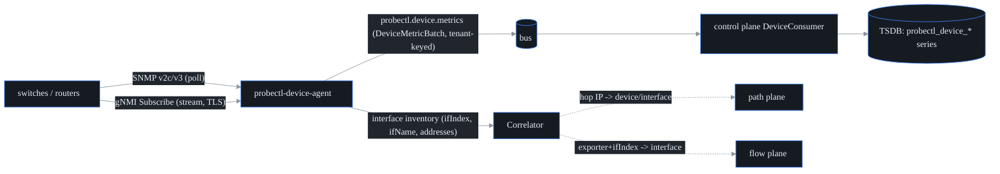

# Device / streaming telemetry (S39, F18) — SNMP + gNMI

The device plane is probectl's interface/health layer (the LibreNMS plane):
`probectl-device-agent` polls devices over SNMP (v2c/v3) and subscribes to
gNMI/OpenConfig streams, normalizes both into one `DeviceMetric`, and publishes
to the bus; the control plane lands the samples in the TSDB where alerts, the
AI query engine, and dashboards see them like every other series.



## One model, two transports

SNMP and gNMI emit the SAME metric names, so everything downstream is
transport-agnostic:

| Metric | Source (SNMP) | Source (gNMI/OpenConfig) | Unit |
| --- | --- | --- | --- |
| `probectl.device.uptime.seconds` | sysUpTime | — | seconds |
| `probectl.device.if.oper.status` | IF-MIB ifOperStatus | `state/oper-status` | 1 up / 0 not |
| `probectl.device.if.speed.mbps` | ifHighSpeed | — | Mbps |
| `probectl.device.if.{in,out}.octets` | ifHC{In,Out}Octets | `state/counters/{in,out}-octets` | octets (cumulative) |
| `probectl.device.if.{in,out}.{errors,discards}` | ifTable | `state/counters/...` | packets |
| `probectl.device.cpu.utilization` | hrProcessorLoad (avg) | — | percent |
| `probectl.device.memory.{used,total}.bytes` | hrStorageTable (RAM row) | — | bytes |
| `probectl.device.sensor.temperature.celsius` | ENTITY-SENSOR (opt-in) | — | °C |

In the TSDB the names become `probectl_device_*` with labels
`tenant_id, agent_id, device, device_name, source, if_index, if_name`.

**MIB variance** is handled by graceful degradation: every table walk fails
independently — a device without HOST-RESOURCES simply yields no CPU/memory
metrics; only an unreachable/misauthenticated system group fails the poll.

## Correlation (path/flow ↔ device)

Each SNMP poll also builds an interface inventory (ifIndex, ifName, and the
addresses from ipAddrTable). The `device.Correlator` joins the other planes on:

- **path hop → interface**: a traceroute responder IP matches an interface
  address (or the management address → device-level match);
- **flow → interface**: a flow record's (exporter address, ifIndex) matches the
  exporting device's named interface — turning "ifIndex 7" into "core-sw1 eth7".

## Credentials (the S41 seam)

Config references credentials by **name**; secrets are resolved at runtime
through `device.CredentialSource` and are never logged (redacted Stringers) or
stored in config/git. The default provider reads the environment:

```
PROBECTL_DEVICE_CRED_<NAME>_COMMUNITY      # SNMP v2c
PROBECTL_DEVICE_CRED_<NAME>_USERNAME       # SNMP v3 / gNMI metadata auth
PROBECTL_DEVICE_CRED_<NAME>_AUTH_PROTO     # sha (default) | sha256 | sha512 | md5
PROBECTL_DEVICE_CRED_<NAME>_AUTH_PASS
PROBECTL_DEVICE_CRED_<NAME>_PRIV_PROTO     # aes (default) | aes256 | des
PROBECTL_DEVICE_CRED_<NAME>_PRIV_PASS
PROBECTL_DEVICE_CRED_<NAME>_PASSWORD       # gNMI metadata auth
```

S41 (secrets integration) plugs Vault/CyberArk/cloud KMS into the same seam
without touching device config. An unresolvable credential name **fails closed**
at startup. SNMPv3 USM auth/priv algorithms run inside the SNMP library
(protocol-mandated, like a TLS handshake); note for FIPS deployments that
SNMPv3 MD5/DES are not FIPS-approved — prefer SHA-2 + AES, or gNMI over TLS.

## gNMI transport security

gNMI dials **TLS with certificate verification** by default (system roots, or a
private CA via `ca_file`). Verification is never disabled (CLAUDE.md §7
guardrail 12). `plaintext: true` exists as an explicit lab-only opt-in and is
loudly logged. Username/password (when set on the credential) ride gRPC
metadata per the gNMI convention.

## Configuration

See `deploy/agent/probectl-device-agent.example.yml` for the YAML form and
`docs/configuration.md` for every key. Quick start against one switch:

```bash
export PROBECTL_DEVICE_TENANT=t-acme
export PROBECTL_DEVICE_TARGET=192.0.2.1 PROBECTL_DEVICE_TRANSPORT=snmpv2c
export PROBECTL_DEVICE_CREDENTIAL=core-ro
export PROBECTL_DEVICE_CRED_CORE_RO_COMMUNITY=public
./bin/probectl-device-agent
```

## Testing

- The poller/normalizer is table-driven against canned-PDU fakes (healthy
  device, degraded MIBs, unreachable) and the gNMI client runs against an
  in-process mock target (bufconn) — both in `go test ./internal/device/...`.
- `TestSNMPIntegration` drives the REAL SNMP client against a live target
  (snmpsim or lab gear) when `PROBECTL_TEST_SNMP_TARGET` is set; CI wires a
  snmpsim container for it.
- The correlation contract (hop IP ↔ interface, flow exporter+ifIndex ↔
  interface) is pinned by `TestCorrelatorHopToInterface` /
  `TestCorrelatorFlowToInterface`.
