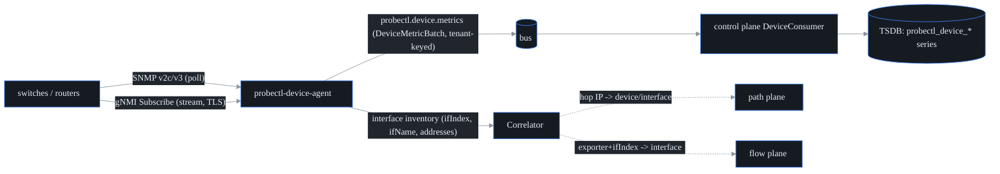

# Device / streaming telemetry — SNMP + gNMI

## What it is

The **device plane** is probectl's "how are the switches and routers themselves
doing?" layer — the interface counters, link states, CPU, memory, and
temperatures that a tool like LibreNMS watches. A network can look healthy from
the *outside* (your synthetic probes pass) while a switch is quietly dropping
packets on one port or running hot. This plane reads that truth straight from
the gear.

One agent, `probectl-device-agent`, talks to network devices two ways and turns
both into one shape:

- **SNMP** (v2c or v3) — the agent *polls*: every interval it asks the device a
  list of questions ("what's your uptime? how many bytes has port 7 sent?").
- **gNMI / OpenConfig** — the agent *subscribes*: the device *streams* updates as
  they change, over a gRPC channel.

Either way, both transports are normalized into a single `DeviceMetric` with the
**same metric names**, published to the bus, and landed in the time-series
database (TSDB) by the control plane — where alerts, the AI query engine, and
dashboards see them exactly like every other series.



## How it works — one model, two transports

The trick that keeps everything downstream simple: **SNMP and gNMI emit the same
metric names**, so an alert rule or dashboard never has to care which transport
fed it. (Source of truth: `internal/device/model.go`.)

| Metric | Source (SNMP) | Source (gNMI/OpenConfig) | Unit |
| --- | --- | --- | --- |
| `probectl.device.uptime.seconds` | sysUpTime | — | seconds |
| `probectl.device.if.oper.status` | IF-MIB ifOperStatus | `state/oper-status` | 1 up / 0 not |
| `probectl.device.if.speed.mbps` | ifHighSpeed | — | Mbps |
| `probectl.device.if.{in,out}.octets` | ifHC{In,Out}Octets | `state/counters/{in,out}-octets` | octets (cumulative) |
| `probectl.device.if.{in,out}.{errors,discards}` | ifTable | `state/counters/...` | packets |
| `probectl.device.cpu.utilization` | hrProcessorLoad (avg) | — | percent |
| `probectl.device.memory.{used,total}.bytes` | hrStorageTable (RAM row) | — | bytes |
| `probectl.device.sensor.temperature.celsius` | ENTITY-SENSOR (opt-in) | — | °C |

These names live in the `probectl.device.*` namespace deliberately. probectl maps
its signals onto OpenTelemetry semantic conventions wherever a standard exists,
but **no OTel convention covers network-device telemetry**, so this is one of the
few places probectl owns the names. In the TSDB they become `probectl_device_*`
with labels `tenant_id, agent_id, device, device_name, source, if_index,
if_name` (`source` is `snmp` or `gnmi`).

**Why one model matters:** a counter like "interface 7 out-octets" should look
identical whether a 15-year-old switch coughed it up over SNMP or a modern box
streamed it over gNMI. Unifying at the *metric* layer means the rest of the
platform — alerting, AI, correlation — is written once.

### Graceful degradation over MIB variance

Not every device exposes every table. A cheap access switch may have no
HOST-RESOURCES MIB (so no CPU/memory), or no sensor table. probectl handles this
with **independent, best-effort table walks**: each walk fails on its own, so a
device that lacks HOST-RESOURCES simply yields no CPU/memory samples — the rest
still flow. Only an unreachable or mis-authenticated device (the system group
itself fails) fails the whole poll. You get partial truth instead of an all-or-
nothing error.

## Correlation — tying device interfaces to the other planes

A device interface is the join point between planes. Each SNMP poll also builds
an **interface inventory**: for every interface, its `ifIndex`, `ifName` (falling
back to `ifDescr`), and the IP addresses from `ipAddrTable`. The
`device.Correlator` then joins the other planes on it:

- **path hop → interface**: a traceroute responder IP matches an interface
  address (or the device's management address gives a device-level match) — so a
  slow hop in a path test becomes "this hop is `core-sw1`".
- **flow → interface**: a flow record's `(exporter address, ifIndex)` pair
  matches the exporting device's named interface — turning the opaque
  "ifIndex 7" in a flow export into "`core-sw1` eth7".

This is what lets a cross-plane incident say *"the path test slowed at the same
interface where the flow plane sees a traffic spike and the device plane sees
rising discards"* — one interface, three views.

## Credentials — referenced by name, never stored

Device credentials (SNMP communities, SNMPv3 passphrases, gNMI passwords) are
secrets, and probectl treats them like the guardrails demand: **config files
reference a credential by *name* only** — the secret material itself is resolved
at runtime through `device.CredentialSource` and is **never written to config or
git, and never logged** (the `Credential` type's `String()`/`GoString()` render
as `credential(redacted)`).

The default source reads the environment. For a credential named `core-ro`
(uppercased, with `-`/`.` mapped to `_`):

```text
PROBECTL_DEVICE_CRED_<NAME>_COMMUNITY      # SNMP v2c
PROBECTL_DEVICE_CRED_<NAME>_USERNAME       # SNMP v3 / gNMI metadata auth
PROBECTL_DEVICE_CRED_<NAME>_AUTH_PROTO     # sha (default) | sha256 | sha512 | md5
PROBECTL_DEVICE_CRED_<NAME>_AUTH_PASS
PROBECTL_DEVICE_CRED_<NAME>_PRIV_PROTO     # aes (default) | aes256 | des
PROBECTL_DEVICE_CRED_<NAME>_PRIV_PASS
PROBECTL_DEVICE_CRED_<NAME>_PASSWORD       # gNMI metadata auth
```

A credential name that resolves to *nothing* **fails closed at startup** — a
typo can't silently downgrade you to an unauthenticated poll; the agent refuses
to start instead. The named-credential seam is also the integration point for a
real secrets backend (Vault, CyberArk, a cloud KMS) plugging in later without
touching any device config.

A note for **FIPS deployments**: the SNMPv3 USM auth/privacy algorithms run
inside the SNMP library — they are protocol-mandated, exactly like a TLS
handshake, not a probectl crypto path. SNMPv3's older MD5 and DES options are not
FIPS-approved, so prefer SHA-2 + AES, or use gNMI over TLS.

## gNMI transport security

gNMI dials **TLS with certificate verification on by default** — using the system
root store, or a private CA via `ca_file`. Verification is **never disabled** in
a normal path (a core guardrail: every outbound channel validates certs). A
`plaintext: true` knob exists strictly as a lab-only opt-in, and when set it is
**loudly logged** so it can never hide in production. When a credential sets a
username/password, it rides gRPC metadata per the gNMI convention.

## Configuration

See [`deploying-agents.md`](deploying-agents.md) for where the device agent
sits in the producer catalog (placement, service files, the full
producer-to-first-data path), `deploy/agent/probectl-device-agent.example.yml`
for the YAML form, and [`configuration.md`](configuration.md) for every key.
Quick start against one switch:

```bash
export PROBECTL_DEVICE_TENANT=t-acme
export PROBECTL_DEVICE_TARGET=192.0.2.1 PROBECTL_DEVICE_TRANSPORT=snmpv2c
export PROBECTL_DEVICE_CREDENTIAL=core-ro
export PROBECTL_DEVICE_CRED_CORE_RO_COMMUNITY=public
./bin/probectl-device-agent
```

## Testing

- The poller/normalizer is table-driven against canned-PDU fakes (a healthy
  device, degraded MIBs, an unreachable device), and the gNMI client runs against
  an in-process mock target over bufconn — both in `go test ./internal/device/...`.
- `TestSNMPIntegration` drives the **real** SNMP client against a live target
  (snmpsim or lab gear) when `PROBECTL_TEST_SNMP_TARGET` is set; CI wires a
  snmpsim container for it.
- The correlation contract (hop IP ↔ interface, flow exporter+ifIndex ↔
  interface) is pinned by `TestCorrelatorHopToInterface` and
  `TestCorrelatorFlowToInterface`.
