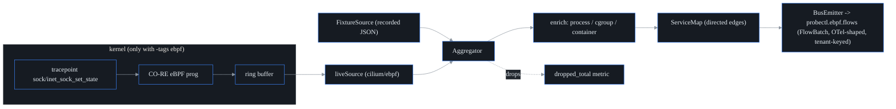

# eBPF host agent (S20)

The **probectl-ebpf-agent** provides zero-instrumentation **L3/L4 flow capture** and
a **live service map** — the shared host/L4 substrate later reused by the
security, segmentation, and cost planes (F11). It is **observe-only**: it loads
only observation programs and never enforcement (CLAUDE.md §7 guardrail 8). It
builds directly on the S19a feasibility spike — read
[`ebpf-feasibility.md`](ebpf-feasibility.md) for the kernel/CO-RE coverage matrix
and the go/no-go that shaped this design.

## Architecture — userspace core + a gated kernel loader

The agent is split so the bulk runs and is tested anywhere, kernel or not. A
pure-Go **userspace core** (the flow/service-edge model, the aggregator,
process/cgroup enrichment, the capability probe, the OTel mapping, and the bus
emitter) drives a pluggable **flow `Source`**. The live `Source` — a CO-RE eBPF
program loaded via `cilium/ebpf` into a ring buffer — is compiled in **only under
`-tags ebpf`**. Live TLS-plaintext (sslsniff) capture is additionally
**off by default and triple-gated** (U-003 + EBPF-001): it runs only with
`l7_capture_enabled: true` AND `l7_capture_consent_tenant` matching the
agent's bound tenant AND a non-empty `l7_capture_scope` workload allowlist
(`pid:<n>` / `exe:/abs/path` / `cgroup:/abs/cgroup-dir` — container/pod
scoping is the cgroup form). The allowlist is enforced **in the kernel**:
uprobes on a shared libssl fire for every process that maps it, so the BPF
program checks `scope_tgids`/`scope_cgroups` before copying a byte — a
non-allowlisted process's plaintext never enters the ring buffer, and
host-wide capture is not expressible. `exe:` entries are re-resolved
against /proc every 10s, so restarts/new workers of an opted-in binary
stay in scope.

Redaction is layered (EBPF-002): the kernel **capture window**
(`l7_capture_kernel_window`, default 1024 bytes; the policy map's zero
default is length-only, fail-closed) bounds how much plaintext per chunk
may transit the ring at all — body bytes past it never leave kernel
space — then payload bodies are zeroed at the ring-buffer → user-space
boundary on the only surviving copy (`l7_capture_redaction: headers`, the
default; http2/grpc call extraction is degraded under redaction by
design). `length` mode captures no payload bytes at all (traffic shape
only — chunk direction + true size via `DataEvent.Size`; nothing to
parse, so no L7 calls). Parser byte-counts reflect the captured window;
`DataEvent.Size` carries the true chunk size. Every other build
uses the **`FixtureSource`** (recorded flows),
which is also the no-kernel CI path.



This split is deliberate (see `ebpf-feasibility.md` §3): the build host needs
`clang`, but the **target host needs only a BTF kernel + `CAP_BPF`**, and most CI
runners / macOS laptops can load no eBPF at all. The `-tags ebpf` files are a
separate, off-by-default compilation unit, so the default `make build` and CI
need **no eBPF toolchain and no extra dependency**.

## Capture limitations (measured, not hidden)

- **IPv6 (U-073):** `l4flow` captures **IPv4 only** today; non-IPv4 sockets
  are filtered in-kernel. The blind spot is **measurable** — a per-CPU BPF
  counter is summed and surfaced as `filtered_non_ipv4_total` in the agent's
  flush telemetry, so an IPv6-heavy host shows a rising count rather than
  silent gaps. IPv6 capture is roadmapped (`docs/roadmap.md`): the
  tracepoint already carries the family; it needs the 16-byte address path
  and the wider event struct.
- **Go `crypto/tls` (U-074):** the L7 capture uprobes attach to the system
  libssl (OpenSSL/BoringSSL/GnuTLS). **Go programs do not use libssl** —
  they ship their own TLS — so Go-process TLS plaintext is **not captured**.
  This is a known, documented gap (`docs/ebpf-feasibility.md` §7): the
  established technique disassembles the Go binary for `RET` offsets and
  tracks the goroutine ABI — a meaningfully more brittle path, roadmapped
  separately. L4 flow + the service map still see Go processes; only their
  L7 plaintext is out of scope.

## Tuning & kernel lockdown

`ring_buffer_bytes` (config / `PROBECTL_EBPF_RING_BUFFER_BYTES`) sizes the
kernel ring buffer for the live source; it is rounded at load to a valid
power-of-two page multiple (default 16 MiB). Raise it on high-flow hosts to
reduce ring-buffer-full drops (the `dropped` counter surfaces them).

**Kernel lockdown:** if the kernel runs in lockdown **confidentiality** mode,
`bpf()` is blocked even with `CAP_BPF` — the capability probe reports this
explicitly (`lockdown="confidentiality"`, mode unavailable) and a load attempt
returns a clear message rather than a bare `EPERM` (U-075). Boot without
`lockdown=confidentiality` (integrity mode is fine) to run the agent.

## Kernel-matrix CI (U-021)

The `ebpf-kernel-matrix` ci job LOADS and ATTACHES every BPF program on real
LTS kernels (digest-pinned `ghcr.io/cilium/ci-kernels` images) under QEMU via
`vimto` (`go test -exec`), running the live smoke: l4flow tracepoint attach,
sslsniff uprobe attach (consented + scoped, U-003/EBPF-001), one full agent
flush cycle, with the U-014 digest verification on the load path. The matrix
(EBPF-008): **5.15** and **6.6** on x86_64, **6.6 on arm64** (native
`ubuntu-24.04-arm` runner — vimto does not emulate cross-arch), and a
**hardened entry** that raises kernel lockdown to INTEGRITY inside the
ephemeral VM (`TestLiveHardenedLockdownIntegrity`, gated on
`PROBECTL_TEST_SET_LOCKDOWN`) and proves load+attach still works there while
the probe reports the mode truthfully (confidentiality is the blocking mode,
U-075; the test skips loudly if the ci-kernel lacks the lockdown LSM — a
secure-boot distro-kernel image is the remaining [needs infra] extension).
Bump the matrix when adopting a new LTS; the table above documents the
runtime capability matrix.

## Installing (U-016)

**Kubernetes** — the `deploy/helm/probectl-agent` chart deploys the agent as
a DaemonSet with the privilege contract declared in the artifact: drop ALL +
`CAP_BPF`/`CAP_PERFMON` (set `capabilityMode: legacy` for 5.4–5.7 kernels →
`CAP_SYS_ADMIN`), a seccomp profile (`RuntimeDefault`; point
`seccomp.type: Localhost` at the installed U-052 profile for default-deny),
read-only root, the BTF host mount, and resource limits. Rendering fails
closed: no `tenantID`, or plaintext kafka without the explicit
`bus.allowPlaintext`, refuses to template (U-010). CI helm-lints,
hardening-asserts, and kubeconform-validates the chart on every pass.

```sh
helm install probectl-agent deploy/helm/probectl-agent \
  --set tenantID=acme \
  --set 'bus.brokers={kafka.probectl.svc:9093}' \
  --set bus.tls.existingSecret=probectl-bus-tls
```

(The chart runs the container as uid 0 with everything dropped except the
minimal pair — Kubernetes grants added capabilities to root only; the VM
unit below runs fully non-root via ambient capabilities instead.)

**VM / bare metal** — `deploy/agent/install.sh` installs a local binary
(air-gap friendly, downloads nothing, no self-update), the `probectl-agent`
system user, the hardened systemd unit (U-052), and a fail-closed sample
config:

```sh
sudo deploy/agent/install.sh ./bin/probectl-ebpf-agent
$EDITOR /etc/probectl/ebpf-agent.yaml   # tenant_id + brokers
sudo systemctl start probectl-ebpf-agent
```

## Hardened runtime profile (U-052)

Run the agent with the **minimal capability set** and the shipped seccomp
profile — see [`deploy/agent/`](../deploy/agent/README.md): `CAP_BPF` +
`CAP_PERFMON` on kernels >= 5.8 (`CAP_SYS_ADMIN` only as the pre-5.8
fallback), `LimitMEMLOCK`, no root, default-deny seccomp
(`deploy/agent/seccomp.json`), plus a hardened systemd unit and
container/K8s securityContext examples.

## Building

| Build | Command | Source | Needs |
|---|---|---|---|
| Default (any OS) | `make build` | FixtureSource / stub | nothing extra |
| Live eBPF (Linux) | `make ebpf-agent` | CO-RE loader | clang + bpftool + a BTF kernel (libbpf BPF headers are vendored in-repo under `internal/ebpf/bpf/headers/` — no `libbpf-dev` needed) |

**Fixture mode is dev/test-only (EBPF-004).** The SHIPPED agent image is the
live `-tags ebpf` build: `deploy/docker/Dockerfile.ebpf` runs the same
bpf2go + gendigests path and release.yml publishes `probectl-ebpf-agent`
from it; the `ebpf-image-live` ci job extracts the binary from the built
image and fails unless its Go build metadata records `-tags=ebpf` — a
fixture-only image cannot ship unnoticed.

**Trust boundary (EBPF-003, decided):** operator-supplied BPF objects are
deliberately NOT supported. The chain is source → bpf2go (pinned clang) →
objects EMBEDDED in the binary → SHA-256 manifest baked at the same build →
`VerifyObjectDigest` before any kernel load → the binary/image cosign-signed
at release (C6/U-067) — the release signature covers objects + manifest
together, so a swapped object can't ride a signed binary. A static gate
(`TestNoOperatorSuppliedBPFObjectPath`) trips if anyone adds a filesystem/env
object-load path; doing so would require the load-time signature scheme
EBPF-003 anticipated.

The live build regenerates `vmlinux.h` from the running kernel's BTF and runs
`bpf2go`, then writes a SHA-256 manifest of the compiled objects
(`gendigests` → `bpf_digests_ebpf.go`) that the loaders verify before ANY
kernel load — a tampered or stale object refuses to load (U-014); it also needs the `cilium/ebpf` module, which the default build does
**not** pull in. One-time, on the build host:

```sh
go get github.com/cilium/ebpf      # add the loader dependency (only for -tags ebpf)
make ebpf-agent                    # bpftool + bpf2go + go build -tags ebpf
```

The generated bindings (`l4flow_bpfel.go`, `bpf/vmlinux.h`) are build artifacts —
they carry `//go:build ebpf` and are git-ignored, regenerated per build.

## Running

```sh
# No-kernel / CI / macOS: replay recorded flows.
PROBECTL_EBPF_TENANT_ID=<uuid> PROBECTL_EBPF_FIXTURE_PATH=flows.json probectl-ebpf-agent

# Live (Linux, built with -tags ebpf, as root or with CAP_BPF+CAP_PERFMON):
probectl-ebpf-agent -config /etc/probectl/ebpf-agent.yml
```

On start the agent logs a **capability probe** (BTF / ring buffer / CAP_BPF /
compiled-in) and the chosen mode, so an unsupported host is a decided, visible
state — never a silent failure. Example config:
[`deploy/agent/probectl-ebpf-agent.example.yml`](../deploy/agent/probectl-ebpf-agent.example.yml).

## Kernel compatibility

CO-RE needs a **BTF-exposing kernel** and the **BPF ring buffer**, both mainstream
from **Linux 5.8**. BTF-less kernels fall back to BTFHub or are reported
unavailable. Full matrix + distro coverage: [`ebpf-feasibility.md`](ebpf-feasibility.md)
§4. eBPF is **Linux-only**; on macOS/Windows run the agent inside a Linux VM.

## Privileges & the observe-only guarantee

Loading needs **`CAP_BPF` + `CAP_PERFMON`** (Linux ≥5.8) or `CAP_SYS_ADMIN`; the
capability probe and enrichment are read-only and need no privileges. The agent
attaches only tracepoints/kprobes and calls no traffic-altering helper — a guard
test (`observeonly_test.go`) parses the eBPF C sources and **fails the build** if
an enforcing program type or helper (`bpf_redirect`, `bpf_override_return`, …) is
ever introduced. probectl's eBPF layer watches; it is not a CNI and not an inline
IPS.

## Emission, OTel, and tenancy

Flow + service-edge batches are published to **`probectl.ebpf.flows`** as an
`ebpfv1.FlowBatch` protobuf, **keyed by tenant** (pooled tagging, F50). Field
names follow OpenTelemetry `source.*` / `destination.*` / `network.*` /
`process.*` / `container.*` conventions from first emission, so the OTLP layer
(S22) exposes them rather than remapping; `internal/otel.FlowAttributes` is the
canonical mapping and is held to the same conformance bar as results (S6).

## Self-observation (drops)

Ring-buffer backpressure is counted and surfaced as `dropped_total` on every
flush — a dropped flow is a correctness gap in an observability tool, so it is
never silent (S20 watch-out).

## Configuration keys

See [`configuration.md`](configuration.md#ebpf-host-agent-s20) for the full
`PROBECTL_EBPF_*` table.

## L7 visibility (S21)

The agent parses **application-protocol calls** — HTTP/1.1, HTTP/2, gRPC, DNS,
and Kafka — from plaintext, and rolls **per-call method / resource / status /
latency** onto each service edge (emitted as an `L7Call` plus the `l7_*` rollup
on `ServiceEdge`). Plaintext is obtained two ways:

- **Cleartext** traffic: parsed straight from socket reads/writes.
- **TLS** traffic: captured **before encryption / after decryption** via uprobes
  on the TLS library's `SSL_write` / `SSL_read` (no CA, no MITM). `SSL_read` is
  read at the *return* uprobe because the buffer fills on return.

Parsing is pure Go and kernel-independent (`internal/ebpf/l7`), driven by the
capture layer in production and by an L7 fixture (`PROBECTL_EBPF_L7_FIXTURE_PATH`)
in CI / demos. The OTel mapping (`internal/otel.L7CallAttributes`) emits `http.*`
/ `rpc.*` / `dns.*` / `messaging.*` attributes per protocol. Calls are attributed
to the connection's **client→server** edge regardless of which direction
completed them.

### uprobe / TLS-library coverage

| TLS stack | Symbols | Coverage |
|---|---|---|
| OpenSSL | `SSL_write` / `SSL_read` (read at return) | ✅ |
| BoringSSL | same `SSL_*` API | ✅ if symbols resolvable / ⚠️ if stripped/static |
| GnuTLS | `gnutls_record_send` / `gnutls_record_recv` | ✅ (attach the same way) |
| **Go `crypto/tls`** | no libssl — pure Go; `uretprobe` unsafe on Go | ⚠️ **separate strategy** (ret-offset disassembly + goroutine tracking — `ebpf-feasibility.md` §7) |
| Stripped / static, no symbols | — | ❌ socket-layer cleartext only |

Two limits carried from the S19a spike: **stripped/static binaries** break
uprobe symbol resolution (fall back to socket cleartext), and **Go-encrypted**
traffic needs its own capture path, not the OpenSSL one. A connection's full
5-tuple (and thus the exact edge) is resolved by correlating the SSL/fd to its
socket — the productionization step for the live L7 source.

## Scope & follow-ups

In scope for S20–S21: the agent, L3/L4 capture, the service map, **L7 parsing
(HTTP/1.1+2, gRPC, DNS, Kafka) with TLS-uprobe plaintext capture**, OTel emit,
and the kernel/uprobe matrix. Natural follow-ups (out of scope): IPv6 +
byte/packet counters; the **5-tuple↔SSL correlation** and the **Go-TLS** capture
path; a control-plane consumer draining `probectl.ebpf.flows` into ClickHouse + a
tenant-scoped service-map API for the pane (feeds S30 topology). Detection (S42),
segmentation validation (S46), TLS posture (S27), and cost (S44) build on this.
