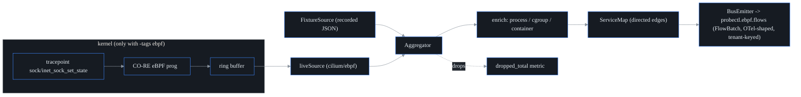

# eBPF host agent (S20)

The **probectl-ebpf-agent** provides zero-instrumentation **L3/L4 flow capture** and
a **live service map** — the shared host/L4 substrate later reused by the
security, segmentation, and cost planes (F11). It is **observe-only**: it loads
only observation programs and never enforcement (CLAUDE.md §7 guardrail 8). It
builds directly on the S19a feasibility spike — read
[`ebpf-feasibility.md`](ebpf-feasibility.md) for the kernel/CO-RE coverage matrix
and the go/no-go that shaped this design.

## Architecture — userspace core + a gated kernel loader

The agent is split so the bulk runs and is tested anywhere, kernel or not. A
pure-Go **userspace core** (the flow/service-edge model, the aggregator,
process/cgroup enrichment, the capability probe, the OTel mapping, and the bus
emitter) drives a pluggable **flow `Source`**. The live `Source` — a CO-RE eBPF
program loaded via `cilium/ebpf` into a ring buffer — is compiled in **only under
`-tags ebpf`**. Every other build uses the **`FixtureSource`** (recorded flows),
which is also the no-kernel CI path.



This split is deliberate (see `ebpf-feasibility.md` §3): the build host needs
`clang`, but the **target host needs only a BTF kernel + `CAP_BPF`**, and most CI
runners / macOS laptops can load no eBPF at all. The `-tags ebpf` files are a
separate, off-by-default compilation unit, so the default `make build` and CI
need **no eBPF toolchain and no extra dependency**.

## Building

| Build | Command | Source | Needs |
|---|---|---|---|
| Default (any OS) | `make build` | FixtureSource / stub | nothing extra |
| Live eBPF (Linux) | `make ebpf-agent` | CO-RE loader | clang + bpftool + libbpf headers + a BTF kernel |

The live build regenerates `vmlinux.h` from the running kernel's BTF and runs
`bpf2go`; it also needs the `cilium/ebpf` module, which the default build does
**not** pull in. One-time, on the build host:

```sh
go get github.com/cilium/ebpf      # add the loader dependency (only for -tags ebpf)
make ebpf-agent                    # bpftool + bpf2go + go build -tags ebpf
```

The generated bindings (`l4flow_bpfel.go`, `bpf/vmlinux.h`) are build artifacts —
they carry `//go:build ebpf` and are git-ignored, regenerated per build.

## Running

```sh
# No-kernel / CI / macOS: replay recorded flows.
PROBECTL_EBPF_TENANT_ID=<uuid> PROBECTL_EBPF_FIXTURE_PATH=flows.json probectl-ebpf-agent

# Live (Linux, built with -tags ebpf, as root or with CAP_BPF+CAP_PERFMON):
probectl-ebpf-agent -config /etc/probectl/ebpf-agent.yml
```

On start the agent logs a **capability probe** (BTF / ring buffer / CAP_BPF /
compiled-in) and the chosen mode, so an unsupported host is a decided, visible
state — never a silent failure. Example config:
[`deploy/agent/probectl-ebpf-agent.example.yml`](../deploy/agent/probectl-ebpf-agent.example.yml).

## Kernel compatibility

CO-RE needs a **BTF-exposing kernel** and the **BPF ring buffer**, both mainstream
from **Linux 5.8**. BTF-less kernels fall back to BTFHub or are reported
unavailable. Full matrix + distro coverage: [`ebpf-feasibility.md`](ebpf-feasibility.md)
§4. eBPF is **Linux-only**; on macOS/Windows run the agent inside a Linux VM.

## Privileges & the observe-only guarantee

Loading needs **`CAP_BPF` + `CAP_PERFMON`** (Linux ≥5.8) or `CAP_SYS_ADMIN`; the
capability probe and enrichment are read-only and need no privileges. The agent
attaches only tracepoints/kprobes and calls no traffic-altering helper — a guard
test (`observeonly_test.go`) parses the eBPF C sources and **fails the build** if
an enforcing program type or helper (`bpf_redirect`, `bpf_override_return`, …) is
ever introduced. probectl's eBPF layer watches; it is not a CNI and not an inline
IPS.

## Emission, OTel, and tenancy

Flow + service-edge batches are published to **`probectl.ebpf.flows`** as an
`ebpfv1.FlowBatch` protobuf, **keyed by tenant** (pooled tagging, F50). Field
names follow OpenTelemetry `source.*` / `destination.*` / `network.*` /
`process.*` / `container.*` conventions from first emission, so the OTLP layer
(S22) exposes them rather than remapping; `internal/otel.FlowAttributes` is the
canonical mapping and is held to the same conformance bar as results (S6).

## Self-observation (drops)

Ring-buffer backpressure is counted and surfaced as `dropped_total` on every
flush — a dropped flow is a correctness gap in an observability tool, so it is
never silent (S20 watch-out).

## Configuration keys

See [`configuration.md`](configuration.md#ebpf-host-agent-s20) for the full
`PROBECTL_EBPF_*` table.

## L7 visibility (S21)

The agent parses **application-protocol calls** — HTTP/1.1, HTTP/2, gRPC, DNS,
and Kafka — from plaintext, and rolls **per-call method / resource / status /
latency** onto each service edge (emitted as an `L7Call` plus the `l7_*` rollup
on `ServiceEdge`). Plaintext is obtained two ways:

- **Cleartext** traffic: parsed straight from socket reads/writes.
- **TLS** traffic: captured **before encryption / after decryption** via uprobes
  on the TLS library's `SSL_write` / `SSL_read` (no CA, no MITM). `SSL_read` is
  read at the *return* uprobe because the buffer fills on return.

Parsing is pure Go and kernel-independent (`internal/ebpf/l7`), driven by the
capture layer in production and by an L7 fixture (`PROBECTL_EBPF_L7_FIXTURE_PATH`)
in CI / demos. The OTel mapping (`internal/otel.L7CallAttributes`) emits `http.*`
/ `rpc.*` / `dns.*` / `messaging.*` attributes per protocol. Calls are attributed
to the connection's **client→server** edge regardless of which direction
completed them.

### uprobe / TLS-library coverage

| TLS stack | Symbols | Coverage |
|---|---|---|
| OpenSSL | `SSL_write` / `SSL_read` (read at return) | ✅ |
| BoringSSL | same `SSL_*` API | ✅ if symbols resolvable / ⚠️ if stripped/static |
| GnuTLS | `gnutls_record_send` / `gnutls_record_recv` | ✅ (attach the same way) |
| **Go `crypto/tls`** | no libssl — pure Go; `uretprobe` unsafe on Go | ⚠️ **separate strategy** (ret-offset disassembly + goroutine tracking — `ebpf-feasibility.md` §7) |
| Stripped / static, no symbols | — | ❌ socket-layer cleartext only |

Two limits carried from the S19a spike: **stripped/static binaries** break
uprobe symbol resolution (fall back to socket cleartext), and **Go-encrypted**
traffic needs its own capture path, not the OpenSSL one. A connection's full
5-tuple (and thus the exact edge) is resolved by correlating the SSL/fd to its
socket — the productionization step for the live L7 source.

## Scope & follow-ups

In scope for S20–S21: the agent, L3/L4 capture, the service map, **L7 parsing
(HTTP/1.1+2, gRPC, DNS, Kafka) with TLS-uprobe plaintext capture**, OTel emit,
and the kernel/uprobe matrix. Natural follow-ups (out of scope): IPv6 +
byte/packet counters; the **5-tuple↔SSL correlation** and the **Go-TLS** capture
path; a control-plane consumer draining `probectl.ebpf.flows` into ClickHouse + a
tenant-scoped service-map API for the pane (feeds S30 topology). Detection (S42),
segmentation validation (S46), TLS posture (S27), and cost (S44) build on this.
