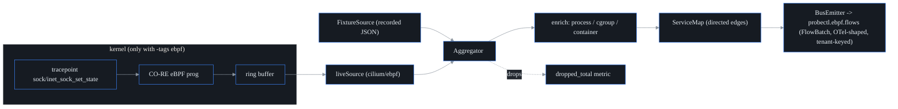

# eBPF host agent

## What it is

The **`probectl-ebpf-agent`** watches network activity **from inside the host's
kernel** — no sidecars, no app changes, no SDK to import. It gives you two things
with **zero instrumentation**:

- **L3/L4 flow capture** — every TCP connection a host makes or accepts, with the
  process and container behind it; and
- a **live service map** — the directed graph of "who talks to whom" built from
  those flows.

This is the shared host/L4 substrate the security, segmentation, and cost planes
later build on. The single most important thing to understand about it: it is
**observe-only**. It loads only *observation* programs and never *enforcement* —
it watches, it does not block, redirect, or modify a single packet. probectl's
eBPF layer is **not a CNI and not an inline IPS**. (This is a hard guardrail, and
a build-failing test enforces it — see below.)

> **New to eBPF?** eBPF lets you load tiny, sandboxed programs *into the running
> Linux kernel* that fire on kernel events (a socket changing state, a function
> being called) and report what they saw back to userspace. It's how modern tools
> see all network activity on a box without touching the applications. The kernel
> verifies these programs can't crash or hang it before letting them run.

## How it works — the path of a flow

Here's the whole pipeline, from a packet event in the kernel to a record on the
bus:



1. **Kernel hook.** A CO-RE eBPF program attaches to the stable
   `sock:inet_sock_set_state` tracepoint. Every time a TCP socket changes state,
   the program runs. It keeps the ones entering `ESTABLISHED` and writes the
   5-tuple plus the PID and command name into a **ring buffer**
   (`internal/ebpf/bpf/l4flow.bpf.c`). Using a *tracepoint* (whose arguments carry
   the tuple directly) instead of fishing fields out of kernel structs is
   deliberate — it sidesteps per-kernel struct-layout drift for the common path.
2. **Userspace read.** The Go **`liveSource`** (built on `cilium/ebpf`) drains the
   ring buffer.
3. **Aggregate.** The `Aggregator` folds raw connection events into directed
   **service edges** ("host A → host B:443, N connections").
4. **Enrich.** Each flow is tagged with its process, cgroup, and container — the
   read-only `/proc` lookups that turn a bare PID into "the `nginx` container".
5. **Emit.** The `BusEmitter` marshals a batch to protobuf and publishes it to
   **`probectl.ebpf.flows`**, keyed by tenant.

### Userspace core + a gated kernel loader

The agent is split in two on purpose, so the bulk of it runs and is tested
**anywhere — kernel or not**:

- A pure-Go **userspace core** does the flow/service-edge model, the aggregator,
  process/cgroup enrichment, the capability probe, the OTel mapping, and the bus
  emitter. It drives a pluggable flow **`Source`**.
- The **live `Source`** — the CO-RE eBPF program loaded into a ring buffer — is
  compiled in **only under the `-tags ebpf` build tag**. Every other build uses
  the **`FixtureSource`** (recorded flows replayed from JSON), which is also the
  no-kernel CI path.

**Why split it this way?** The build host needs `clang`; the *target* host needs
only a BTF-capable kernel and `CAP_BPF`. And most CI runners and macOS laptops
can't load eBPF at all. By making the `-tags ebpf` files a separate, off-by-
default compilation unit, the default `make build` and ordinary CI need **no eBPF
toolchain and no extra dependency** — yet the shipped agent image is still the
live build (see [Building](#building)).

## L7 visibility — application calls, including over TLS

Beyond raw connections, the agent can parse **application-protocol calls** —
HTTP/1.1, HTTP/2, gRPC, DNS, and Kafka — and roll **per-call method / resource /
status / latency** onto each service edge. Each call is emitted as an `L7Call`
plus an `l7_*` rollup on the `ServiceEdge`. Parsing is pure Go and kernel-
independent (`internal/ebpf/l7`), driven by the live capture layer in production
and by an L7 fixture (`PROBECTL_EBPF_L7_FIXTURE_PATH`) in CI and demos.

probectl gets the plaintext two ways:

- **Cleartext traffic:** parsed straight from socket reads/writes.
- **TLS traffic:** captured **before encryption / after decryption** via uprobes
  on the TLS library's `SSL_write` / `SSL_read` — **no CA, no man-in-the-middle**.
  (`SSL_read` is read at the *return* uprobe, because the destination buffer is
  only filled when the call returns.)

The OTel mapping (`internal/otel.L7CallAttributes`) emits `http.*` / `rpc.*` /
`dns.*` / `messaging.*` attributes per protocol. Calls are attributed to the
connection's **client→server** edge regardless of which direction completed them.

### Reading TLS plaintext is off by default and triple-gated

Reading application plaintext on a customer's host is PII-class, so live
TLS-plaintext capture (the "sslsniff" path) is **off by default** and requires
**three** explicit, independent statements before a single byte is captured (see
`internal/ebpf/l7policy.go`):

1. **`l7_capture_enabled: true`** — the master switch.
2. **`l7_capture_consent_tenant`** must equal the agent's bound tenant *exactly* —
   an explicit, per-tenant consent. (The agent is tenant-bound at registration, so
   this is a deliberate statement in *this* tenant's deployment config; absent or
   mismatched, capture stays off.)
3. **`l7_capture_scope`** — a non-empty **workload allowlist**: entries of the
   form `pid:<n>`, `exe:/abs/path`, or `cgroup:/abs/cgroup-dir`. Container/pod
   scoping is the `cgroup:` form (a container *is* a cgroup). An empty scope means
   capture refuses to start — **host-wide capture is not expressible.**

The allowlist is enforced **in the kernel**. Uprobes on a shared `libssl` fire for
*every* process that maps it, so the BPF program checks the in-kernel
`scope_tgids` / `scope_cgroups` maps and **drops a non-allowlisted process before
copying a byte** — that process's plaintext never enters the ring buffer at all.
`exe:` entries are re-resolved against `/proc` every 10 seconds, so restarts and
new workers of an opted-in binary stay in scope.

### Redaction is layered, and defaults closed

Even for an allowlisted workload, payload bodies are redacted by default
(`internal/ebpf/l7policy.go`). Redaction happens at two boundaries:

- **The kernel capture window** (`l7_capture_kernel_window`, default 1024 bytes)
  bounds how much plaintext per chunk may transit the ring buffer *at all* — body
  bytes past the window **never leave kernel space**. The BPF policy map's zero
  default is length-only, so an unprogrammed kernel ships **no** plaintext: it
  fails closed.
- **At the ring-buffer → userspace boundary**, on the only surviving copy, payload
  bodies are zeroed in place. This is `l7_capture_redaction: headers` (the
  default): protocol metadata (request line, headers) survives, the body is
  killed. (A consequence: HTTP/2 / gRPC call extraction is degraded under `headers`
  redaction, by design — the HPACK frames live in the zeroed region.)

The three redaction modes:

| Mode | What transits | What you can parse |
|---|---|---|
| `headers` (default) | metadata up to the header terminator; the body is zeroed | full L7 calls; HTTP/2-gRPC bodies degraded |
| `length` | **no payload bytes** — kernel window forced to 0; only chunk direction + true size (`DataEvent.Size`) | traffic *shape* only; no parsed L7 calls |
| `full` | everything (consented debugging only — still behind the enable+consent+scope gates) | full L7 calls including bodies |

Parser byte-counts reflect the *captured* window; `DataEvent.Size` always carries
the *true* chunk size, so loss-to-redaction is visible rather than silent.

## Capture limitations (measured, not hidden)

Two real blind spots exist today. Both are *documented and counted*, not papered
over:

- **IPv6:** `l4flow` captures **IPv4 only** right now — non-IPv4 sockets are
  filtered in the kernel. The blind spot is **measurable**: a per-CPU BPF counter
  is summed and surfaced as `filtered_non_ipv4_total` in the agent's flush
  telemetry, so an IPv6-heavy host shows a *rising count* instead of silent gaps.
  IPv6 is a planned extension — the tracepoint already carries the address family;
  it needs the 16-byte address path and a wider event struct.
- **Go's `crypto/tls`:** the L7 capture uprobes attach to the **system** TLS
  libraries (OpenSSL / BoringSSL / GnuTLS). **Go programs don't use libssl** — they
  ship their own TLS — so a Go process's L7 *plaintext* is **not captured**. This
  is a known gap (detailed in [`ebpf-feasibility.md`](ebpf-feasibility.md)): the
  established workaround disassembles the Go binary for `RET` offsets and tracks
  the goroutine ABI, a meaningfully more brittle path that's roadmapped
  separately. L4 flow and the service map still see Go processes fine — only their
  L7 plaintext is out of scope.

### TLS-library uprobe coverage

| TLS stack | Symbols | Coverage |
|---|---|---|
| OpenSSL | `SSL_write` / `SSL_read` (read at return) | ✅ |
| BoringSSL | same `SSL_*` API | ✅ if symbols resolvable / ⚠️ if stripped/static |
| GnuTLS | `gnutls_record_send` / `gnutls_record_recv` | ✅ (attaches the same way) |
| **Go `crypto/tls`** | no libssl — pure Go; `uretprobe` unsafe on Go | ⚠️ **separate strategy** (ret-offset disassembly + goroutine tracking — see [`ebpf-feasibility.md`](ebpf-feasibility.md)) |
| Stripped / static, no symbols | — | ❌ socket-layer cleartext only |

Two limits carry over from the feasibility study: **stripped or statically-linked
binaries** break uprobe symbol resolution (the agent falls back to socket
cleartext for those), and **Go-encrypted** traffic needs its own capture path.

## Privileges and the observe-only guarantee

Loading the programs needs **`CAP_BPF` + `CAP_PERFMON`** (Linux ≥ 5.8) or, on
older kernels, `CAP_SYS_ADMIN`. The capability probe and the enrichment lookups
are read-only and need no privileges.

The observe-only guarantee is enforced in code, not just by convention. The agent
attaches only tracepoints / kprobes / uprobes and calls no traffic-altering
helper. A guard test (`observeonly_test.go`) **parses the eBPF C sources and fails
the build** if anyone introduces an enforcing program type or a mutating helper
(`bpf_redirect`, `bpf_override_return`, `bpf_probe_write_user`, packet-rewrite
helpers, …). The test runs in the default build — no kernel, no clang needed — so
the invariant is checked on every commit.

## Emission, OTel, and tenancy

Flow and service-edge batches are published to **`probectl.ebpf.flows`** as an
`ebpfv1.FlowBatch` protobuf, **keyed by tenant** (pooled tagging). Field names
follow OpenTelemetry `source.*` / `destination.*` / `network.*` / `process.*` /
`container.*` conventions **from the first emission**, so the OTLP layer *exposes*
them rather than remapping. `internal/otel.FlowAttributes` is the canonical
mapping and is held to the same "no invented attribute names" conformance bar as
results.

### Self-observation (drops are never silent)

A dropped flow is a correctness gap in an observability tool, so it is never
hidden. Ring-buffer backpressure is counted and surfaced as `dropped_total` on
every flush (folded from the source's drop counter in `runtime.go`). The flush log
also carries `observed_total`, `l7_total`, `l7_attach_failures`, and
`filtered_non_ipv4_total` — probectl observes probectl.

## Tuning and kernel lockdown

`ring_buffer_bytes` (config, or `PROBECTL_EBPF_RING_BUFFER_BYTES`) sizes the
kernel ring buffer for the live source; it's rounded at load to a valid power-of-
two page multiple (default 16 MiB). Raise it on high-flow hosts to reduce ring-
buffer-full drops (which `dropped_total` will show you).

**Kernel lockdown:** if the kernel runs in lockdown **confidentiality** mode, the
`bpf()` syscall is blocked *even with* `CAP_BPF`. The capability probe reports this
explicitly (`lockdown="confidentiality"`, mode unavailable) and a load attempt
returns a clear message instead of a bare `EPERM`. Boot without
`lockdown=confidentiality` (integrity mode is fine) to run the agent.

## Kernel compatibility

CO-RE ("Compile Once – Run Everywhere") needs a **BTF-exposing kernel** and the
**BPF ring buffer**, both mainstream from **Linux 5.8** — that pair is the hard
floor. On a BTF-less kernel the capability probe reports eBPF **unavailable**
(the reason string points at BTFHub as a manual avenue; no automatic external-BTF
fallback ships today). The full matrix and distro coverage live in
[`ebpf-feasibility.md`](ebpf-feasibility.md). eBPF is **Linux-only**; on
macOS/Windows, run the agent inside a Linux VM.

On startup the agent logs a **capability probe** (BTF / ring buffer / CAP_BPF /
compiled-in) and the mode it chose, so an unsupported host is a *decided, visible*
state — never a silent failure.

## Kernel-matrix CI

Static checks aren't enough for kernel code, so the `ebpf-kernel-matrix` CI job
actually **loads and attaches** every BPF program on real LTS kernels (digest-
pinned `ghcr.io/cilium/ci-kernels` images) under QEMU via `vimto`. It runs the
live smoke: l4flow tracepoint attach, sslsniff uprobe attach (consented + scoped),
one full agent flush cycle, with object-digest verification on the load path.

The matrix is **5.15** and **6.6** on x86_64, **6.6 on arm64**, plus a **hardened
entry** on x86_64 that raises kernel lockdown to **integrity** inside the
ephemeral VM (`TestLiveHardenedLockdownIntegrity`, gated on
`PROBECTL_TEST_SET_LOCKDOWN=integrity`) and proves load+attach still works there
while the probe reports the mode truthfully (confidentiality is the blocking mode;
the test skips loudly if the CI kernel lacks the lockdown LSM — a secure-boot
distro-kernel image is the remaining infrastructure gap).

One arch nuance worth knowing: the live QEMU boot needs KVM for usable speed. The
x86_64 runners have `/dev/kvm` and run the **full live load+attach**; the arm64
runner (`ubuntu-24.04-arm`) has **no** KVM, and software emulation is too slow, so
on arm64 the job **compiles and digest-verifies the BPF objects but skips the live
boot**. That's still meaningful cross-arch coverage — it proves the arm64 objects
build through the exact path operators use (`make ebpf-agent`) — but the live
attach itself is exercised on x86_64. Bump the matrix when adopting a new LTS.

## Building

| Build | Command | Source | Needs |
|---|---|---|---|
| Default (any OS) | `make build` | FixtureSource / stub | nothing extra |
| Live eBPF (Linux) | `make ebpf-agent` | CO-RE loader | clang + bpftool + a BTF kernel (libbpf BPF headers are vendored in-repo under `internal/ebpf/bpf/headers/` — no `libbpf-dev` needed) |

**The shipped image is the live build.** Fixture mode is dev/test-only. The
shipped agent image is the live `-tags ebpf` build: `deploy/docker/Dockerfile.ebpf`
runs the same `bpf2go` + digest-generation path, and the release publishes
`probectl-ebpf-agent` from it. The `ebpf-image-live` CI job extracts the binary
from the built image and **fails unless its Go build metadata records
`-tags=ebpf`** — so a fixture-only image cannot ship unnoticed.

**Trust boundary (decided):** operator-supplied BPF objects are deliberately **not
supported**. The chain is: source → `bpf2go` (pinned `clang`) → objects **embedded
in the binary** → a SHA-256 manifest baked at the same build → `VerifyObjectDigest`
before any kernel load → the binary/image **cosign-signed** at release. The release
signature covers the objects + manifest *together*, so a swapped object can't ride
a signed binary. A static gate (`TestNoOperatorSuppliedBPFObjectPath`) trips if
anyone adds a filesystem/env object-load path.

The live build regenerates `vmlinux.h` from the running kernel's BTF, runs
`bpf2go`, and writes the SHA-256 manifest (`gendigests` → `bpf_digests_ebpf.go`)
that the loaders verify before **any** kernel load — a tampered or stale object
refuses to load. The `cilium/ebpf` loader dependency is already pinned in
`go.mod`; only the `-tags ebpf` files import it, so the default build never
compiles or links it. On the build host:

```sh
make ebpf-agent                    # bpftool + bpf2go + go build -tags ebpf
```

A single wrapper, `internal/ebpf/gen_bpf.sh`, is the one place the `bpf2go` flags
and the arch-compat shim live — `make ebpf-agent`, the Dockerfile, the CI jobs, and
`go generate` all route through it, so a build change touches one file instead of
drifting across many. The generated bindings (`l4flow_bpfel.go`, `bpf/vmlinux.h`)
carry `//go:build ebpf`, are git-ignored, and are regenerated per build.

## Installing

If this is your first probectl producer, start with
[`getting-started.md`](getting-started.md) (the control-plane + bus bring-up) and
[`deploying-agents.md`](deploying-agents.md) (the per-producer deployment
journeys, including this agent) — you're done when flow batches show up
downstream, not when the unit reports active. The sections below are the
agent-specific contract.

### Kubernetes

The `deploy/helm/probectl-agent` chart deploys the agent as a **DaemonSet** with
the privilege contract declared in the manifest: drop **all** capabilities and add
back only `CAP_BPF` / `CAP_PERFMON` (set `capabilityMode: legacy` for 5.4–5.7
kernels → `CAP_SYS_ADMIN`), a seccomp profile (`RuntimeDefault`; point
`seccomp.type: Localhost` at the installed default-deny profile for tighter
filtering), read-only root, the BTF host mount, and resource limits. Rendering
**fails closed**: no `tenantID`, or plaintext kafka without the explicit
`bus.allowPlaintext`, refuses to template. CI helm-lints, hardening-asserts, and
kubeconform-validates the chart on every run.

```sh
helm install probectl-agent deploy/helm/probectl-agent \
  --set tenantID=acme \
  --set 'bus.brokers={kafka.probectl.svc:9093}' \
  --set bus.tls.existingSecret=probectl-bus-tls
```

(In Kubernetes the container runs as uid 0 with everything dropped except the
minimal pair — Kubernetes grants added capabilities to root only, with no ambient-
capability support. The VM unit below instead runs **fully non-root** via ambient
capabilities.)

### VM / bare metal

`deploy/agent/install.sh` installs a local binary (air-gap friendly — downloads
nothing, never self-updates), creates the `probectl-agent` system user, installs
the hardened systemd unit, and writes a fail-closed sample config:

```sh
sudo deploy/agent/install.sh ./bin/probectl-ebpf-agent
$EDITOR /etc/probectl/ebpf-agent.yaml   # set tenant_id + brokers
sudo systemctl start probectl-ebpf-agent
```

### Hardened runtime profile

Run the agent with the **minimal capability set** and the shipped seccomp profile
— see [`deploy/agent/`](../deploy/agent/README.md): `CAP_BPF` + `CAP_PERFMON` on
kernels ≥ 5.8 (`CAP_SYS_ADMIN` only as the pre-5.8 fallback), `LimitMEMLOCK`, no
root, default-deny seccomp (`deploy/agent/seccomp.json`), plus a hardened systemd
unit and container/K8s `securityContext` examples.

## Running

```sh
# No-kernel / CI / macOS: replay recorded flows.
PROBECTL_EBPF_TENANT_ID=<uuid> PROBECTL_EBPF_FIXTURE_PATH=flows.json probectl-ebpf-agent

# Live (Linux, built with -tags ebpf, as root or with CAP_BPF+CAP_PERFMON):
probectl-ebpf-agent -config /etc/probectl/ebpf-agent.yaml
```

Example config:
[`deploy/agent/probectl-ebpf-agent.example.yml`](../deploy/agent/probectl-ebpf-agent.example.yml).

## Configuration keys

See [`configuration.md`](configuration.md#ebpf-host-agent) for the full
`PROBECTL_EBPF_*` table.

## Scope and follow-ups

In scope today: the agent, L3/L4 capture, the service map, **L7 parsing
(HTTP/1.1+2, gRPC, DNS, Kafka) with TLS-uprobe plaintext capture**, OTel emit, and
the kernel/uprobe matrix. On the consuming side, the control plane already drains
`probectl.ebpf.flows` on three independent, tenant-verified consumer groups: the
**topology** view (service edges feed the graph), **segmentation validation**
(declared policy vs observed traffic), and **NDR detection**. Natural follow-ups
(out of scope here): IPv6 + byte/packet counters; the **5-tuple↔SSL correlation**
and the **Go-TLS** capture path; and raw-flow retention in ClickHouse with a
flow-level query API. Detection, segmentation validation, TLS posture, and cost
all build on this layer.
