```mermaid
%%{init: {'theme':'base','themeVariables':{'background':'#0d1117','primaryColor':'#161b22','primaryTextColor':'#e6edf3','primaryBorderColor':'#3b82f6','lineColor':'#8b949e','secondaryColor':'#21262d','tertiaryColor':'#0d1117','clusterBkg':'#161b22','clusterBorder':'#30363d','fontFamily':'ui-monospace, SFMono-Regular, Menlo, monospace'},'flowchart':{'curve':'basis','nodeSpacing':55,'rankSpacing':55,'padding':12}}}%%
flowchart LR
  K["kernel: TCP state machine"] -->|"tracepoint sock/inet_sock_set_state"| P["eBPF prog (CO-RE)"]
  P -->|"5-tuple + pid/comm"| RB["BPF_MAP_TYPE_RINGBUF"]
  RB --> U["userspace loader (cilium/ebpf)"]
  U --> AGG["flow aggregation → ServiceEdge"]
  AGG --> ENR["enrich: k8s / cgroup / process"]
  ENR --> OTEL["emit OTel (resource + net semconv)"]
  U -. counts .-> DROPS["ring-buffer drop counter"]
```

# eBPF feasibility and coverage

This is the **portability and coverage reference** for probectl's eBPF host
agent: which kernels and TLS libraries are in or out, what the capture path looks
like, the overhead envelope to expect, and the safety guardrails. It captures the
design decisions that shaped the production agent
([`ebpf-agent.md`](ebpf-agent.md)) — read this when you want the *why* behind the
kernel floor, the ring-buffer choice, or the Go-TLS limitation.

> **Overlap note:** this document and [`ebpf-agent.md`](ebpf-agent.md) cover
> related ground — this one is the "what's possible and why" reference, the other
> is the "how to build, run, and operate it" guide. A future consolidation could
> merge the coverage matrices into a single appendix; for now they're kept
> separate by audience (design rationale vs operations).

---

## 1. The short version

**L3/L4 flow capture + a service map is well-trodden and portable** on modern
kernels via CO-RE; the toolchain (`cilium/ebpf` + `bpf2go`, pure Go, no cgo) fits
probectl's single-static-binary model. **L7-over-TLS is feasible but is the
genuinely hard, partial-coverage part** — and **Go-encrypted traffic is its own
sub-project**, not a library variant.

Three risks have to be **decided, not discovered**:

1. **BTF-less kernels.** CO-RE needs a BTF-exposing kernel. Most current distros
   ship it; some older/embedded ones do not. → a clean, decided "unsupported
   kernel" degradation, never a crash. (The shipped agent degrades immediately
   with the reason; the automatic BTFHub fallback this study floated was not
   shipped — see §4.)
2. **The Go-runtime TLS problem.** Go's `crypto/tls` does not call OpenSSL, and
   `uretprobe` is unsafe on Go binaries. Capturing Go plaintext needs binary
   disassembly + goroutine tracking — a separate strategy from the `SSL_write`
   uprobe used for C libraries.
3. **Stripped / statically-linked binaries.** Uprobe symbol resolution fails
   without symbols. → socket-layer plaintext only for those; document the gap per
   service.

None of these block L3/L4. Risks 1 and 3 are relevant only to the L7/TLS layer;
the L4 capture path is unaffected by them.

---

## 2. Why portability is the hard part for eBPF

eBPF is the **single least-portable component** in probectl. Unlike the canaries
(pure Go sockets) or the BGP analyzer (userspace Python), eBPF programs run *in
the kernel* and must cope with two kinds of drift:

- **per-kernel struct layout drift** — the same kernel struct has different field
  offsets across kernel versions. Solved by **CO-RE / BTF** (see §4).
- **per-binary symbol layout** — uprobes attach to symbols in a userspace binary,
  and those move per build and vanish when a binary is stripped (see §7).

Converting those two unknowns into a documented matrix is what keeps the agent
from hitting a multi-week portability surprise.

---

## 3. The two deployment realities the design must handle

Two facts about real environments drove the architecture, and they're worth
stating plainly because they explain the build/runtime split:

- **Build host ≠ target host.** The agent is built **once** (with `clang`, in
  CI/release) and shipped as a binary with the BPF object **embedded**; the
  *target* host needs only a BTF kernel + `CAP_BPF`, **not** `clang`. CO-RE is
  precisely what makes that split work — the program compiles once and relocates
  to the target kernel at load time.
- **No-kernel CI is the norm.** Most CI runners (and macOS dev laptops) cannot
  load eBPF at all. So the tests split into (a) userspace flow-aggregation unit
  tests that run anywhere, plus recorded-data fixtures, and (b) a privileged
  load+attach integration test gated behind a real BTF-kernel CI runner.

macOS/Windows note: eBPF is **Linux-only**. On a Mac the agent runs inside a Linux
VM — a documented constraint, not a gap.

---

## 4. Kernel / CO-RE / BTF coverage matrix

CO-RE ("Compile Once – Run Everywhere") compiles the program once against BTF type
information and **relocates field offsets at load time** against the *target*
kernel's BTF. The two hard requirements are **a BTF-exposing kernel** and **BPF
ring-buffer support**; both are mainstream from **Linux 5.8** onward, with some
distros backporting earlier.

| Platform | Ships kernel BTF by default? | Ring buffer (≥5.8)? | Support |
|---|---|---|---|
| Ubuntu 20.04 (HWE 5.8+), 22.04, 24.04 | yes | yes | ✅ supported |
| RHEL/Rocky/Alma 9.x | yes | yes | ✅ supported |
| RHEL/Rocky/Alma 8.x (4.18 kernel) | yes (8.2+) | **no** | ❌ below the ring-buffer floor — probe reports unavailable (a perf-buffer fallback was considered, not shipped) |
| Debian 11+, 12 | yes | yes | ✅ supported |
| Amazon Linux 2023; AL2 (recent kernels) | AL2023 yes; AL2 varies | AL2023 yes | ✅ / ⚠️ verify AL2 |
| SUSE SLES 15 SP3+ | yes | yes | ✅ supported |
| Container-Optimized OS / Bottlerocket / Talos | usually yes | yes | ✅ (verify per release) |
| Older / embedded / vendor kernels w/o `CONFIG_DEBUG_INFO_BTF` | **no** | maybe | ❌ probe reports unavailable (BTFHub is the manual avenue) |

**The decisions that came out of this matrix (and what actually shipped):**

- **Floor = ring buffer + BTF.** Treat **Linux 5.8** as the clean floor. The
  shipped agent detects both at startup and, when either is missing, **degrades
  gracefully** to "eBPF unavailable on this host" — one structured capability-probe
  log line with the reason — never crashing the agent or the node. The study
  proposed an automatic **BTFHub** external-BTF fallback before degrading; that
  path was **not shipped** — the probe's reason string names BTFHub as the manual
  avenue instead.
- **Perf-buffer fallback** for 4.x kernels that have BPF but not the ring buffer
  was considered (see §5) but **not shipped**: the agent requires the ring buffer,
  and a pre-5.8 kernel is reported unavailable rather than served a second capture
  path.
- **Architectures:** both `amd64` and `arm64`, matching probectl's dual-arch build.

---

## 5. Capture mechanism: ring buffer vs perf buffer

| | `BPF_MAP_TYPE_RINGBUF` (≥5.8) | `BPF_MAP_TYPE_PERF_EVENT_ARRAY` (older) |
|---|---|---|
| Shape | single MPSC buffer shared across CPUs | per-CPU buffers |
| Ordering | preserves event order | per-CPU only |
| Memory | one allocation | N×CPU allocations |
| Overhead | lower (fewer copies, reserve/commit API) | higher |
| Backpressure | reserve fails → counted drop | per-CPU overwrite/drop |

**Decision:** the ring buffer wins on every row, so it is the **only** capture
path the agent ships — the perf-buffer column stayed a contingency for a <5.8
fallback that was never built (a pre-5.8 kernel is reported unavailable instead).
Either way the non-negotiable held: **count and expose drops** as a first-class
metric — a silent drop is a correctness bug in an observability tool. (The agent
surfaces ring-buffer drops as `dropped_total`; see
[`ebpf-agent.md`](ebpf-agent.md).)

---

## 6. L3/L4 flow capture — the mechanism

The capture attaches to the **`sock:inet_sock_set_state` tracepoint** — a stable
kernel ABI that carries the 5-tuple and the socket state **directly**, so the
common path needs **no fragile CO-RE struct-field reads**. The program filters for
TCP sockets entering `ESTABLISHED` and emits `{pid, comm, saddr, daddr, sport,
dport, family, state}` to the ring buffer. Userspace reads the ring buffer and
folds events into directed **service edges**.

Using **tracepoint arguments** is the robust path: it avoids per-kernel `struct
sock` offset drift. Fields the tracepoint *doesn't* carry (cgroup id, netns,
byte/packet counts via `sock`/`tcp_sock`) are exactly what BTF + CO-RE relocate —
the structs needed for that are present in BTF on supported kernels. Identifiers
are modeled onto **OTel resource attributes from the first emission**, so the OTLP
layer projects them rather than retrofitting (the implementation is
`internal/ebpf/bpf/l4flow.bpf.c`).

---

## 7. Uprobe / TLS-plaintext coverage matrix

L7 visibility for **encrypted** traffic works by attaching **uprobes to the TLS
library's read/write functions** to read the plaintext buffer *before encryption /
after decryption* — **without a CA and without a man-in-the-middle**. Each library
exposes different symbols, so each needs its own attach.

| TLS stack | Probe symbols | Linking reality | Coverage |
|---|---|---|---|
| **OpenSSL** | `SSL_write` (entry) / `SSL_read` (**return** — buffer not filled at entry) | usually dynamic `libssl.so`; symbols present | ✅ strong |
| **BoringSSL** | same `SSL_*` API surface | common in Envoy/Chromium; often statically linked | ✅ if symbols resolvable / ⚠️ if stripped |
| **GnuTLS** | `gnutls_record_send` / `gnutls_record_recv` | dynamic `libgnutls.so` | ✅ |
| **NSS/NSPR** | `PR_Write` / `PR_Read` | dynamic | feasible — **not shipped** (no NSS attach in the agent today) |
| **Go `crypto/tls`** | **no libssl** — pure Go; `uretprobe` unsafe on Go | static in the app binary | ⚠️ **special case (below)** |
| Stripped / static (no symbols) | n/a | symbols absent | ❌ socket-layer plaintext only |

**The `SSL_read` subtlety:** at the *entry* of `SSL_read` the destination buffer
isn't populated yet — the plaintext must be copied at the **return** (`uretprobe`).
That's why the production program reads `SSL_write` at entry but `SSL_read` at
return.

**The Go problem (the one to plan around).** Go ships its own TLS implementation,
so the OpenSSL uprobe approach is **completely inapplicable**. Worse, `uretprobe`
does not work reliably on Go binaries because of Go's stack management and ABI. The
established technique is to **disassemble the target Go binary to locate `RET`
instruction offsets and attach uprobes there**, extract arguments per the **Go
register ABI (1.17+)**, and **track the goroutine ID** (goroutines aren't pinned
1:1 to OS threads) via DWARF/offset tables. This is a meaningfully more brittle
code path than the C-library case, with real Go-version sensitivity.

**The decisions for the L7/TLS layer:** ship the C-library uprobe path
(OpenSSL/BoringSSL/GnuTLS) first; treat **Go-TLS as an explicitly-scoped,
separately-tested module** with a documented version-sensitivity matrix; and for
stripped/static binaries with no resolvable symbols, fall back to **socket-layer
(plaintext L7) parsing only** and mark the edge's TLS-L7 coverage as "unavailable"
rather than silently missing it.

---

## 8. Overhead envelope

> **These are external published reference points for eBPF observability agents,
> not probectl's own measured numbers, and they are hardware- and
> workload-specific** — treat them as an order-of-magnitude expectation, not a
> spec. probectl's own measured userspace numbers and the live-kernel measurement
> method live in [`agent-overhead.md`](agent-overhead.md).

Commonly-cited envelopes for zero-instrumentation, flow/L4-scope eBPF telemetry:

- General eBPF telemetry overhead is often cited at **< 1% CPU**.
- Cilium/Hubble: roughly **0.1–0.3 of a CPU core** per node; Pixie: roughly
  **0.5–1 core** per node (Pixie does more — full L7 + Go).
- Microsoft Retina (observability-only, the closest model to probectl's agent)
  reports CPU that "barely moves" under moderate load.

**Expectation for the L4 + service-map scope (no L7):** comfortably in the
single-digit-percent CPU band under a defined load, with memory dominated by the
ring buffer plus the flow/edge aggregation tables. **L7/TLS uprobes cost more** (a
probe fires per call) and must be measured separately and made boundable /
sampleable.

The rule is **measure, don't trust the references**: the agent ships with a
reproducible userspace benchmark and a CI throughput tripwire, and a live-kernel
overhead test for the ring-buffer path — all documented in
[`agent-overhead.md`](agent-overhead.md).

---

## 9. Privileges, safety, and the observe-only guardrail

- **Privileges:** loading/attaching needs **`CAP_BPF` + `CAP_PERFMON`** (Linux
  ≥ 5.8) or, on older kernels, **`CAP_SYS_ADMIN`**. Document the minimal set; don't
  run the whole agent as root where the capability split is available.
- **Observe-only is a hard guardrail.** The agent loads **only** observability
  program types (tracepoints, kprobes, socket *observation*) and **never** attaches
  a policy-enforcing or traffic-dropping program. probectl's eBPF layer watches; it
  is not an inline IPS and not a CNI. This is enforced by a build-failing source-
  parsing test (`observeonly_test.go`).
- **Tenant scoping:** eBPF-derived flows/edges are tenant-scoped like every other
  signal — the agent is bound to one tenant at registration, and `tenant_id` is
  carried through the bus to the stores.
- **Drops are visible:** ring-buffer backpressure increments an exposed counter —
  "the dashboard is green because we dropped the events" is a failure mode probectl
  refuses to ship.
- **Untrusted input:** ring-buffer records are treated as untrusted; all userspace
  parsing is bounded (no unchecked lengths from kernel-supplied sizes).

---

## 10. Decision log

| # | Decision | Rationale |
|---|---|---|
| D1 | Use **`cilium/ebpf` + `bpf2go`** (pure Go, no cgo) | matches the single-static-binary model; embeds the compiled object; CO-RE-native |
| D2 | **Ring buffer only** (the perf-buffer <5.8 fallback was considered, dropped) | lower overhead + ordering; one codebase; pre-5.8 reports unavailable |
| D3 | **CO-RE + BTF**, graceful "unsupported" when BTF is absent (the automatic **BTFHub** fallback was deferred — the probe names it as the manual avenue) | portability across the distro matrix without per-kernel builds |
| D4 | L3/L4 via **stable tracepoints** first, CO-RE struct reads where required | minimizes per-kernel offset risk |
| D5 | **Go-TLS is a separate sub-module**, not an OpenSSL variant | Go ABI + uretprobe incompatibility |
| D6 | **Socket-layer fallback** for stripped/static binaries | uprobe symbol resolution will fail there |
| D7 | **CI = userspace unit tests + recorded fixtures**; privileged integration test behind a BTF-kernel runner | no-kernel CI is the norm |

The realistic cost risk is the **Go-TLS** path, contained by D5 plus explicit
coverage documentation.

---

## 11. Acceptance checklist (what the agent must do)

This is the definition-of-ready the production agent was held to:

1. **Startup capability probe** — detect BTF + ring buffer + capabilities +
   kernel lockdown, and on any miss degrade to a decided, logged "eBPF
   unavailable" state with the reason. (As shipped: no perf-buffer selection and
   no automatic BTFHub attempt — missing prerequisites degrade immediately, with
   BTFHub named in the reason as the manual avenue.)
2. **Drop accounting** — ring-buffer drops counted and exposed as a metric from day
   one.
3. **Capability-minimal runtime** — `CAP_BPF`+`CAP_PERFMON` where available;
   documented.
4. **Observe-only assertion** — a test/lint that fails if a non-observability
   (enforcing) program type is loaded.
5. **No-kernel CI path** — userspace flow-aggregation unit tests + recorded-fixture
   decode tests; privileged integration test isolated behind a BTF-kernel CI job.
6. **OTel-first identifiers** — model the flow/edge IDs onto OTel resource
   attributes now, so OTLP projects rather than retrofits.

For the L7/TLS layer specifically:

7. **C-library uprobes first** (OpenSSL/BoringSSL/GnuTLS), `SSL_read` captured at
   **return**.
8. **Go-TLS as its own module** — ret-offset disassembly + goroutine tracking +
   Go-version sensitivity; ship with a documented coverage matrix.
9. **Stripped/static fallback** — socket-layer plaintext only; mark TLS-L7 coverage
   "unavailable" on those edges (decided, not silently missing).

---

## References

- eBPF BPF-features-by-kernel matrix — https://github.com/iovisor/bcc/blob/master/docs/kernel-versions.md
- CO-RE / BTF portability — https://eunomia.dev/tutorials/38-btf-uprobe/
- TLS plaintext via uprobe — Pixie: https://blog.px.dev/ebpf-openssl-tracing/ · eunomia sslsniff: https://eunomia.dev/tutorials/30-sslsniff/ · eCapture: https://github.com/gojue/ecapture
- Go TLS + eBPF (the hard case) — https://speedscale.com/blog/ebpf-go-design-notes-1/
- `cilium/ebpf` (loader + bpf2go) — https://github.com/cilium/ebpf/releases
- Overhead references — Hubble/Cilium: https://www.cloudraft.io/blog/ebpf-based-network-observability-using-cilium-hubble
