# eBPF feasibility spike — S19a

> **Sprint:** S19a · **Milestone:** M7 · **De-risks:** F11 (eBPF host/L7 agent), S20 (L3/L4 flows + service map), S21 (L7 visibility)
> **Type:** time-boxed spike — the deliverable is *knowledge*, not production code.
> **Status:** ✅ complete. **Verdict: GO**, conditional on the three risk mitigations in §10–§11.
> **Author tooling note:** the proof in [`/spike/ebpf`](../spike/ebpf) is real, CO-RE, runnable on a privileged BTF kernel; it is intentionally **not** wired into the production build (see §3 and §12).

This document is the canonical input to S20. It defines what S20/S21 must build, which kernels and TLS libraries are in/out, what the capture path looks like, the expected overhead envelope, and the safety guardrails. S20 should treat §11 (scope adjustments) as its acceptance checklist.

---

## 1. Verdict

**GO.** Zero-instrumentation L3/L4 flow capture + a service map (S20) is well-trodden and portable on modern kernels via CO-RE; the toolchain (`cilium/ebpf` + `bpf2go`, pure Go, no cgo) fits probectl's single-static-binary model. L7-over-TLS (S21) is feasible but is the genuinely hard, partial-coverage part — and **Go-encrypted traffic is its own sub-project**, not a library variant.

Three risks must be *decided, not discovered* (per the sprint's charge). They are carried into §11:

1. **BTF-less kernels.** CO-RE needs a BTF-exposing kernel. Most current distros ship it; some older/embedded ones do not. → ship a BTFHub fallback path and a clean "unsupported kernel" degradation, not a crash.
2. **The Go-runtime TLS problem.** Go's `crypto/tls` does not call OpenSSL, and `uretprobe` is unsafe on Go binaries. Capturing Go plaintext needs binary disassembly + goroutine tracking — a separate strategy from the `SSL_write` uprobe used for C libraries.
3. **Stripped / statically-linked binaries.** Uprobe symbol resolution fails without symbols. → socket-layer plaintext only for those; document the gap explicitly per service.

None of these block S20. Two of the three (1, 3) are also relevant to S21 only for the L7/TLS layer; S20's L3/L4 capture is unaffected by them.

---

## 2. Why this spike exists

eBPF is the single least-portable component in probectl. Unlike the canaries (pure Go sockets) or the BGP analyzer (userspace Python), eBPF programs run in the kernel and must cope with **per-kernel struct layout drift** (solved by CO-RE/BTF) and **per-binary symbol layout** (uprobes). A 2–3 day spike converts those unknowns into a documented matrix so S20/S21 don't hit a multi-week portability surprise mid–Phase 2. The PRD calls this out directly: *"a feasibility spike precedes the agent build (M7)."*

---

## 3. What was actually exercised here (environments tried)

Honesty first: **the spike could not load a program in this build environment**, and that is itself a useful, representative data point — it is exactly the CI/sandbox case S20 must design for ("a recorded-data fixture path for CI without kernel access").

The environment was probed with `bpftool` and the kernel config. Captured evidence is checked in at [`/spike/ebpf/PROBE-RESULTS.txt`](../spike/ebpf/PROBE-RESULTS.txt). Summary:

| Capability | This environment | Needed to… | Result |
|---|---|---|---|
| Kernel | Linux **6.8.0**, `aarch64` | — | modern, arm64 |
| BTF exposed (`/sys/kernel/btf/vmlinux`) | **yes** (6.96 MB; reconstructs a 183,000-line `vmlinux.h`; `task_struct`/`sock_common`/`tcp_sock` all present) | CO-RE relocation | ✅ CO-RE viable |
| Kernel config | `CONFIG_DEBUG_INFO_BTF=y`, `CONFIG_BPF(_SYSCALL\|_JIT\|_EVENTS)=y`, `CONFIG_KPROBES=y`, `CONFIG_UPROBES=y` | load + attach kprobe/uprobe/tracepoint programs | ✅ all present |
| `clang` / LLVM | **absent** | compile the `.bpf.c` → BPF object | ❌ cannot build here |
| Go toolchain | **absent** | build the loader | ❌ cannot build here |
| Capabilities | **empty set** — no `cap_bpf`, `cap_perfmon`, `cap_sys_admin` | `bpf()` syscall load + attach | ❌ cannot load here |
| `tracefs` (`/sys/kernel/debug/tracing`) | permission denied | manual probe debugging | ❌ |

**Reading:** the *kernel* is fully eBPF-capable (every feature CO-RE/kprobe/uprobe needs is compiled in, and BTF is present). What is missing is the **build toolchain** (clang) and **runtime privilege** (`CAP_BPF`). That maps cleanly onto two real probectl deployment realities S20 must handle:

* **Build host ≠ target host.** The agent is built once (with clang, in CI/release) and shipped as a binary with the BPF object embedded; the *target* needs only a BTF kernel + `CAP_BPF`, not clang. CO-RE is precisely what makes that split work.
* **No-kernel CI.** Most CI runners (and this sandbox, and macOS dev laptops) cannot load eBPF. S20's tests therefore split into (a) userspace flow-aggregation unit tests that run anywhere, and (b) a privileged integration test gated behind a BTF-kernel CI runner, plus recorded-data fixtures for everything in between.

macOS/Windows note: eBPF is **Linux-only**. On the user's Mac the agent runs inside a Linux VM; this is a documented constraint, not a gap.

---

## 4. Kernel / CO-RE / BTF coverage matrix

CO-RE ("Compile Once – Run Everywhere") compiles the program once against BTF type information and relocates field offsets at load time against the *target* kernel's BTF. The two hard requirements are **a BTF-exposing kernel** and **BPF ring-buffer support**; both are mainstream from **Linux 5.8** onward, with some distro backports earlier ([bcc BPF-features-by-kernel](https://github.com/iovisor/bcc/blob/master/docs/kernel-versions.md), [eunomia CO-RE](https://eunomia.dev/tutorials/38-btf-uprobe/)).

| Platform | Ships kernel BTF by default? | Ring buffer (≥5.8)? | S20 support |
|---|---|---|---|
| Ubuntu 20.04 (HWE 5.8+), 22.04, 24.04 | yes | yes | ✅ supported |
| RHEL/Rocky/Alma 8.2+, 9.x | yes | 9.x yes; 8.x via perf-buffer fallback | ✅ supported |
| Debian 11+, 12 | yes | yes | ✅ supported |
| Amazon Linux 2023; AL2 (recent kernels) | AL2023 yes; AL2 varies | AL2023 yes | ✅ / ⚠️ verify AL2 |
| SUSE SLES 15 SP3+ | yes | yes | ✅ supported |
| Container-Optimized OS / Bottlerocket / Talos | usually yes | yes | ✅ (verify per release) |
| Older / embedded / vendor kernels w/o `CONFIG_DEBUG_INFO_BTF` | **no** | maybe | ⚠️ BTFHub fallback or unsupported |

**Decisions for S20:**

* **Floor = ring buffer + BTF.** Treat **Linux 5.8** as the clean floor. Detect BTF at startup; if absent, attempt the **BTFHub** external-BTF path; if that also fails, **degrade gracefully** to "eBPF unavailable on this host" (one structured log line + a host-capability flag surfaced to the control plane) — never crash the agent or the node.
* **Perf-buffer fallback** for 4.x kernels that have BPF but not the ring buffer (see §5). This is a build-time/load-time selection, not two codebases.
* **Architectures:** both `amd64` and `arm64` (this spike's kernel is arm64) — matches probectl's existing dual-arch build.

---

## 5. Capture mechanism: ring buffer vs perf buffer

| | `BPF_MAP_TYPE_RINGBUF` (≥5.8) | `BPF_MAP_TYPE_PERF_EVENT_ARRAY` (older) |
|---|---|---|
| Shape | single MPSC buffer shared across CPUs | per-CPU buffers |
| Ordering | preserves event order | per-CPU only |
| Memory | one allocation | N×CPU allocations |
| Overhead | lower (fewer copies, reserve/commit API) | higher |
| Backpressure | reserve fails → counted drop | per-CPU overwrite/drop |

**Decision:** ring buffer is the **default** (and the proof uses it). Keep a perf-buffer path only as the <5.8 fallback. **Either way, count and expose drops** as a first-class metric — S20's "Watch out for: ring-buffer backpressure (count + expose drops)" is non-negotiable; a silent drop is a correctness bug in an observability tool.

---

## 6. L3/L4 flow capture — the proof

The proof attaches to the **`sock:inet_sock_set_state` tracepoint** (stable kernel ABI; carries the 5-tuple + state directly, so no fragile CO-RE struct-field reads are needed for the common path), filters TCP→`ESTABLISHED`, and emits `{pid, comm, saddr, daddr, sport, dport, family, state}` to a ring buffer. Userspace reads the ring buffer and folds events into directed **service edges**.

```mermaid
%%{init: {'theme':'base','themeVariables':{'background':'#0d1117','primaryColor':'#161b22','primaryTextColor':'#e6edf3','primaryBorderColor':'#3b82f6','lineColor':'#8b949e','secondaryColor':'#21262d','tertiaryColor':'#0d1117','clusterBkg':'#161b22','clusterBorder':'#30363d','fontFamily':'ui-monospace, SFMono-Regular, Menlo, monospace'},'flowchart':{'curve':'basis','nodeSpacing':55,'rankSpacing':55,'padding':12}}}%%
flowchart LR
  K["kernel: TCP state machine"] -->|"tracepoint sock/inet_sock_set_state"| P["eBPF prog (CO-RE)"]
  P -->|"5-tuple + pid/comm"| RB["BPF_MAP_TYPE_RINGBUF"]
  RB --> U["userspace loader (cilium/ebpf)"]
  U --> AGG["flow aggregation → ServiceEdge"]
  AGG --> ENR["enrich: k8s / cgroup / process"]
  ENR --> OTEL["emit OTel (resource + net semconv)"]
  U -. counts .-> DROPS["ring-buffer drop counter"]
```

This is deliberately the *robust* path: tracepoint args avoid per-kernel `struct sock` offset drift. S20 will additionally need CO-RE struct reads for fields the tracepoint doesn't carry (e.g. cgroup id, netns, byte/packet counts via `sock`/`tcp_sock`) — those are exactly what BTF+CO-RE relocate, and the spike confirmed the needed structs are present in BTF (§3). Source: [`spike/ebpf/bpf/l4flow.bpf.c`](../spike/ebpf/bpf/l4flow.bpf.c) + [`spike/ebpf/main.go`](../spike/ebpf/main.go).

The captured events feed the **eBPFFlow / ServiceEdge** model S20 introduces. Identifiers should be modeled to map onto OTel resource attributes from first emission (the S6 discipline), so S22's OTLP/OBI exposure is a projection, not a retrofit.

---

## 7. Uprobe / TLS-plaintext coverage matrix (S21)

L7 visibility for **encrypted** traffic works by attaching **uprobes to the TLS library's read/write functions** to read the plaintext buffer *before encryption / after decryption*, without a CA or a man-in-the-middle ([Pixie](https://blog.px.dev/ebpf-openssl-tracing/), [eunomia sslsniff](https://eunomia.dev/tutorials/30-sslsniff/), [gojue/ecapture](https://github.com/gojue/ecapture)). Each library exposes different symbols, so each needs its own attach.

| TLS stack | Probe symbols | Linking reality | Coverage |
|---|---|---|---|
| **OpenSSL** | `SSL_write` (entry) / `SSL_read` (**return** — buffer not filled at entry) | usually dynamic `libssl.so`; symbols present | ✅ strong |
| **BoringSSL** | same `SSL_*` API surface | common in Envoy/Chromium; often statically linked | ✅ if symbols resolvable / ⚠️ if stripped |
| **GnuTLS** | `gnutls_record_send` / `gnutls_record_recv` | dynamic `libgnutls.so` | ✅ |
| **NSS/NSPR** | `PR_Write` / `PR_Read` | dynamic | ✅ (S21+ optional) |
| **Go `crypto/tls`** | **no libssl** — pure-Go; `uretprobe` unsafe on Go | static in the app binary | ⚠️ **special-case (see below)** |
| Stripped / static (no symbols) | n/a | symbols absent | ❌ socket-layer plaintext only |

**SSL_read subtlety:** at the *entry* of `SSL_read` the destination buffer is not yet populated; the plaintext must be copied at the **uretprobe (return)**. The proof ([`spike/ebpf/bpf/sslsniff.bpf.c`](../spike/ebpf/bpf/sslsniff.bpf.c)) demonstrates the simpler `SSL_write` entry case and documents the read-at-return requirement.

**The Go problem (the one to plan around).** Go ships its own TLS implementation, so the OpenSSL uprobe approach is *completely inapplicable*. Worse, `uretprobe` does not work reliably on Go binaries because of Go's stack management and ABI. The established technique ([Speedscale](https://speedscale.com/blog/ebpf-go-design-notes-1/), [eCapture GoTLS](https://github.com/gojue/ecapture)) is to **disassemble the target Go binary to locate `RET` instruction offsets and attach uprobes there**, extract arguments per the **Go register ABI (1.17+)**, and **track the goroutine ID** (goroutines are not pinned 1:1 to OS threads) via DWARF/offset tables. This is a meaningfully different, more brittle code path than the C-library case.

**Decisions for S21:** ship the C-library uprobe path (OpenSSL/BoringSSL/GnuTLS) first; treat **Go-TLS as an explicitly-scoped, separately-tested module** with documented version sensitivity; for stripped/static binaries with no resolvable symbols, fall back to **socket-layer (plaintext L7) parsing only** and mark the edge's TLS-L7 coverage as "unavailable" rather than silently missing it.

---

## 8. Overhead estimate + how S20 measures it

Published reference points for eBPF observability-only agents (zero-instrumentation, flow/L4 scope):

* **General eBPF telemetry: < 1% CPU** overhead is the commonly-cited envelope ([cloudraft / Hubble](https://www.cloudraft.io/blog/ebpf-based-network-observability-using-cilium-hubble)).
* **Cilium/Hubble: ~0.1–0.3 CPU core** per node (negligible per pod); **Pixie: ~0.5–1 CPU core** per node (it does more — full L7 + Go) ([cloudraft](https://www.cloudraft.io/blog/ebpf-based-network-observability-using-cilium-hubble)).
* **Microsoft Retina** (observability-only, the closest model to probectl's eBPF agent) reports CPU that "barely moves" under moderate load and ~47% less memory than alternatives ([Conf42 deep-dive](https://tldrecap.tech/posts/2026/conf42-cloud/ebpf-network-observability-deep-dive-retina-cilium/)).

**Estimate for S20 (L3/L4 + service map only, no L7):** comfortably in the **single-digit-percent CPU** band under a defined load, with memory dominated by the ring buffer + the flow/edge aggregation tables. L7/TLS uprobes (S21) cost more (a probe per call) and must be measured separately and boundable/sampleable.

**S20 must not take these on faith.** The spike hands S20 a concrete measurement obligation, reusing the **S18a perf harness** as the load driver:
1. Define a load (e.g. a fixed connections/sec + L4 throughput on the target host).
2. Measure agent CPU/RAM and **ring-buffer drop rate** at that load.
3. Gate S20's "Done when … verified low overhead (single-digit % CPU under a defined load)" on the measured number, recorded next to the S18a baseline.

---

## 9. Privileges, safety, and the observe-only guardrail

* **Privileges:** loading/attaching needs **`CAP_BPF` + `CAP_PERFMON`** (Linux ≥5.8) or, on older kernels, **`CAP_SYS_ADMIN`**. Document the minimal set; do not run the whole agent as root where the capability split is available. (This sandbox had *none* of these — hence no load.)
* **Observe-only is a hard guardrail (CLAUDE.md §7.8–§7.9).** S20/S21 load **only** observability program types (tracepoints, kprobes, socket *observation*). **Never** attach a policy-*enforcing* or traffic-dropping program. probectl's eBPF layer watches; it is not an inline IPS and not a CNI. This must be enforced in code review and asserted in tests.
* **Tenant scoping:** eBPF-derived flows/edges are tenant-scoped like every other signal — `tenant_id` resolved on the agent's bound tenant, carried through the bus to the stores (the agent is bound to one tenant at registration, S4).
* **Drops are visible:** ring-buffer backpressure increments an exposed counter; "the dashboard is green because we dropped the events" is a failure mode we refuse to ship.
* **Untrusted input:** treat ring-buffer records as untrusted; bound all userspace parsing (no unchecked lengths from kernel-supplied sizes).

---

## 10. Go / no-go + decision log

**Decision: GO for S20; GO for S21 with explicit, scoped coverage limits.**

| # | Decision | Rationale |
|---|---|---|
| D1 | Use **`cilium/ebpf` + `bpf2go`** (pure Go, no cgo) | matches the single-static-binary model; embeds the compiled object; CO-RE-native ([cilium/ebpf](https://github.com/cilium/ebpf/releases)) |
| D2 | **Ring buffer default**, perf-buffer fallback <5.8 | lower overhead + ordering; one codebase |
| D3 | **CO-RE + BTF**, with **BTFHub** fallback, then graceful "unsupported" | portability across the distro matrix without per-kernel builds |
| D4 | L3/L4 via **stable tracepoints** first, CO-RE struct reads where required | minimizes per-kernel offset risk |
| D5 | **Go-TLS is a separate S21 sub-module**, not an OpenSSL variant | Go ABI + uretprobe incompatibility |
| D6 | **Socket-layer fallback** for stripped/static binaries | uprobe symbol resolution will fail there |
| D7 | **CI = userspace unit tests + recorded fixtures**; privileged integration test behind a BTF-kernel runner | no-kernel CI is the norm (proven here) |

No scope was found that flips this to no-go. The realistic cost risk is **S21 Go-TLS**, which is contained by D5 + explicit coverage documentation.

---

## 11. Scope adjustments for S20 / S21 (acceptance checklist)

S20 should treat this as its definition-of-ready:

1. **Startup capability probe** — detect BTF (+ ring buffer + required CONFIGs); choose ring-buffer vs perf-buffer; on no-BTF, try BTFHub, else degrade to "eBPF unavailable" with a host-capability flag surfaced to the control plane. *(new, from D3/D4)*
2. **Drop accounting** — ring-buffer drops counted and exposed as a metric from day one. *(reinforces S20 "watch out")*
3. **Capability-minimal runtime** — `CAP_BPF`+`CAP_PERFMON` where available; documented. *(from §9)*
4. **Observe-only assertion** — a test/lint that fails if a non-observability (enforcing) program type is loaded. *(guardrail §7.8/§7.9)*
5. **No-kernel CI path** — userspace flow-aggregation unit tests + recorded-fixture decode tests; privileged integration test isolated behind a BTF-kernel CI job. *(from D7 / proven in §3)*
6. **OTel-first identifiers** — model eBPFFlow/ServiceEdge IDs onto OTel resource attributes now, so S22 projects rather than retrofits.

For S21 specifically:

7. **C-library uprobes first** (OpenSSL/BoringSSL/GnuTLS), `SSL_read` captured at **return**.
8. **Go-TLS as its own module** — ret-offset disassembly + goroutine tracking + Go-version sensitivity; ship with a documented coverage matrix.
9. **Stripped/static fallback** — socket-layer plaintext only; mark TLS-L7 coverage "unavailable" on those edges (decided, not silently missing).

---

## 12. The vertical proof

[`/spike/ebpf`](../spike/ebpf) contains a **real, CO-RE, runnable-on-a-BTF-kernel** proof and is **excluded from the production build** on purpose (separate Go module, not in `go.work`; not built/linted/tested by CI — it is throwaway de-risking code, per the sprint charter "not production code"):

* `bpf/l4flow.bpf.c` — CO-RE L3/L4 capture via the `inet_sock_set_state` tracepoint → ring buffer.
* `bpf/sslsniff.bpf.c` — minimal `SSL_write` uprobe demonstrating plaintext-before-encryption capture (the S21 path).
* `main.go` — a `cilium/ebpf` loader that loads, attaches, reads the ring buffer, and **fails with a clear message** when BTF/privileges are absent (i.e. here).
* `Makefile` + `README.md` — exact build/run steps on a privileged BTF kernel, and why it cannot run in this sandbox / macOS / CI.
* `PROBE-RESULTS.txt` — the captured `bpftool`/kernel-config evidence behind §3.

S20 supersedes this with the production `cmd/probectl-ebpf-agent`; nothing here is meant to be promoted as-is.

---

## References

* eBPF BPF-features-by-kernel matrix — https://github.com/iovisor/bcc/blob/master/docs/kernel-versions.md
* CO-RE / BTF portability — https://eunomia.dev/tutorials/38-btf-uprobe/ · https://oneuptime.com/blog/post/2026-01-07-ebpf-core-portable-programs/view
* TLS plaintext via uprobe — Pixie: https://blog.px.dev/ebpf-openssl-tracing/ · eunomia sslsniff: https://eunomia.dev/tutorials/30-sslsniff/ · eCapture: https://github.com/gojue/ecapture
* Go TLS + eBPF (the hard case) — https://speedscale.com/blog/ebpf-go-design-notes-1/
* `cilium/ebpf` (loader + bpf2go) — https://github.com/cilium/ebpf/releases
* Overhead references — Hubble/Cilium: https://www.cloudraft.io/blog/ebpf-based-network-observability-using-cilium-hubble · Retina deep-dive: https://tldrecap.tech/posts/2026/conf42-cloud/ebpf-network-observability-deep-dive-retina-cilium/
