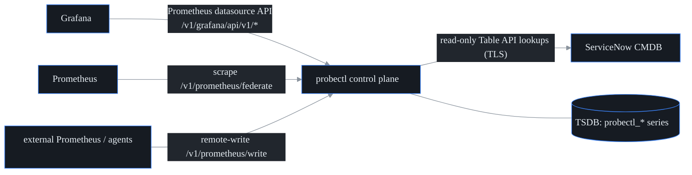

# Ecosystem integrations (S40, F30) — Grafana, Prometheus, ServiceNow CMDB

probectl slots into an existing observability stack instead of demanding to
replace it: Grafana queries probectl directly, Prometheus federates from or
remote-writes into it, and incidents/assets correlate to ServiceNow CIs.



## The tenant boundary (read this first)

Every surface here enforces **tenant first, then RBAC** (CLAUDE.md §7):

- Query expressions must be plain **series selectors**
  (`metric{label="value",...}`). PromQL functions/operators are rejected —
  *a query probectl cannot fully parse is a query it cannot tenant-scope.*
- The parsed selector's `tenant_id` matcher is **always overwritten** with the
  authenticated caller's tenant; in `tsdb=prometheus` mode only the canonical
  reconstruction is forwarded upstream, never raw caller input.
- Remote-write payloads are untrusted: size/series/sample/label caps, and every
  sample's `tenant_id` label is **forced** to the caller's tenant.
- RBAC: reads need `metrics.read`, remote-write needs `metrics.write`, CMDB
  lookups need `cmdb.read` (migration 0022; metrics.read predates S40).

## Grafana datasource

probectl exposes a Prometheus-compatible API subset at `/v1/grafana`, so add it
to Grafana **as a Prometheus datasource** — no plugin install:

1. Connections → Data sources → Add → Prometheus.
2. URL: `https://<probectl>/v1/grafana`. Set HTTP method POST.
3. Attach credentials for a probectl principal holding `metrics.read`
   (in dev mode, none needed).
4. "Save & test" — probectl answers Grafana's buildinfo + `1+1` health probes.

Provisioning-as-code: `deploy/grafana/provisioning/datasources/probectl.yml`.

Endpoints (all under `/v1/grafana/api/v1/`): `query`, `query_range` (GET +
form-POST, the way Grafana sends them), `series`, `labels`,
`label/{name}/values`, `status/buildinfo`, `metadata`. Range queries return the
raw stored samples in the window (no step interpolation); use Grafana
transformations for client-side math. The metric catalog is the `probectl_*`
namespace (results, devices, flows, BGP, threat — whatever the pipelines land
in the TSDB).

Modes: with the in-memory TSDB (lightweight mode) queries evaluate in-process;
with `PROBECTL_TSDB_MODE=prometheus` the canonical selector is forwarded to the
backing Prometheus/VictoriaMetrics and the response passes through.

## Prometheus federation (probectl → Prometheus)

`GET /v1/prometheus/federate?match[]=<selector>` serves the **latest sample**
of every matching series in the text exposition format — drop it into a
Prometheus scrape config:

```yaml
scrape_configs:
  - job_name: probectl
    honor_labels: true
    metrics_path: /v1/prometheus/federate
    params:
      "match[]": ["{__name__=~\"probectl_.*\"}"]
    scheme: https
    static_configs: [{ targets: ["probectl.example.com"] }]
```

Cardinality guard: a scrape matching more than the series cap (5000) fails
closed with an explicit error rather than melting the scraper — narrow the
selector (the S40 "watch out for").

## Prometheus remote-write (external → probectl)

`POST /v1/prometheus/write` accepts the standard snappy-compressed protobuf
WriteRequest, so an existing Prometheus (or vmagent/Alloy) can push metrics
into probectl:

```yaml
remote_write:
  - url: https://probectl.example.com/v1/prometheus/write
    # credentials for a principal holding metrics.write
```

Ingested samples land in probectl's TSDB tenant-tagged and immediately become
queryable/alertable like native series.

## ServiceNow CMDB correlation

Read-only: probectl looks up CIs, never writes to the CMDB. Configure:

```bash
export PROBECTL_CMDB_PROVIDER=servicenow
export PROBECTL_CMDB_URL=https://acme.service-now.com
export PROBECTL_CMDB_SECRET='integration-user:password'   # env only, never logged
# optional: PROBECTL_CMDB_TABLE=cmdb_ci  PROBECTL_CMDB_CACHE_TTL=10m
```

Surfaces: `GET /v1/cmdb/lookup?key=<ip|hostname>` (direct lookup),
`GET /v1/incidents/{id}/cis` (the incident's target + signal targets, resolved
tenant-scoped, correlated to CIs with deep links), and
`GET /v1/agents/{id}/ci` (asset correlation by agent hostname).

Behavior: lookups hit the Table API
(`ip_address=k^ORfqdn=k^ORname=k`, capped at 10 CIs) over verified TLS;
results (including misses) are TTL-cached; **a down CMDB serves stale cache and
never breaks core function** (guardrail 10); keys are canonicalized (case,
ports, schemes) and non-keys (CIDR prefixes, free text) are dropped.

Multi-tenant note: the CMDB endpoint/credential is deployment-level in S40;
correlation requests are tenant-scoped (a caller can only correlate its own
tenant's incidents/agents). Per-tenant CMDB configs ride the S41 secrets work.

## Testing

`go test ./internal/promapi ./internal/cmdb ./internal/control` covers: the
strict selector grammar (incl. injection attempts), tenant forcing, instant/
range/labels/series eval, cardinality caps, federation exposition, remote-write
decode limits + tenant forcing, the full Grafana request sequence against a
seeded TSDB (renders + cross-tenant leak canaries), RBAC route declarations +
401s, and the ServiceNow client/resolver vs an httptest Table-API double
(cache, stale-serve, negative cache, correlation).
