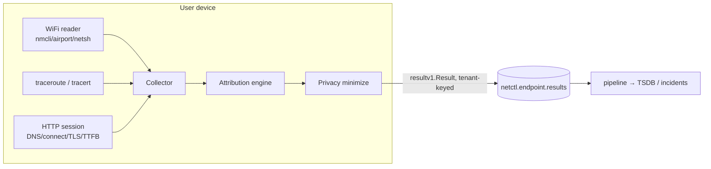

# Endpoint agent — last-mile / WiFi DEM (S37 · F16, F46)

`netctl-endpoint` is a lightweight, cross-OS (Linux/macOS/Windows) agent that runs
on a user's device and measures **last-mile experience** — the part of the path
netctl's server-side canaries can't see. It captures WiFi link health, the local
gateway, the ISP/last-mile path, and browser-session timings, then **attributes a
slowdown** to the closest impaired layer so an operator can answer the
hybrid-work question: *"is it us, or the user's WiFi/ISP?"*

It emits like every other agent — DEM results to the operator's own bus,
tenant-tagged — and **never phones home** (CLAUDE.md §7 guardrail 2).



## What it measures

| Signal | Fields | Source |
| ------ | ------ | ------ |
| **WiFi** | RSSI (dBm) / signal % / noise / link rate / band / channel; cellular RSRP/RSRQ/SINR | `nmcli` or `/proc/net/wireless` (Linux), `airport -I` (macOS), `netsh wlan` (Windows) |
| **Gateway** | reachable, RTT, loss | derived from the first (private) hop of the trace |
| **Last-mile** | per-hop RTT/loss; derived local / ISP-edge / beyond segments | `traceroute -n` (Unix), `tracert -d` (Windows) |
| **Session** | DNS / connect / TLS / TTFB / total to each target | Go `httptrace` over the hardened (cert-validating) client |

Every metric is **best-effort**: a device with no Wi-Fi, or an OS that doesn't
expose a field, degrades to "unavailable" (a `Have.*` flag distinguishes a
missing metric from a real zero) instead of reporting a false reading.

## Attribution — "is it WiFi/ISP or the network?"

The attribution engine (`internal/endpoint/attribution.go`, pure + exhaustively
tested) assesses each layer, then attributes the slowdown to the **closest
impaired layer**, walking outward from the device:

```
wifi  →  local (gateway/LAN)  →  isp (access edge)  →  network (beyond)
```

Closest-first is the crucial rule: a weak Wi-Fi link inflates the gateway, ISP,
and session numbers measured *through* it, so blaming "the network" when the real
fault is the user's Wi-Fi would be wrong. The causes:

- **`wifi`** — weak signal (RSSI ≤ −75 dBm, or signal ≤ 35% when only a percentage
  is available) / noise.
- **`local`** — the default gateway is unreachable, lossy, or high-RTT.
- **`isp`** — the first public hop (the ISP access edge) is high-RTT or lossy.
- **`network`** — the whole local path is healthy but a session is still slow:
  the fault is beyond the last mile (the service / wider network — *not* the
  user's WiFi or ISP).
- **`none`** — nothing impaired. **`unknown`** — a slow session with no path
  visibility to localize it.

Each verdict carries a confidence (0–1) and a human summary. Thresholds are
configurable (`thresholds:` in the config / `DefaultThresholds`).

## Privacy (runs on a user's device)

Minimization is a hard requirement. The agent keeps the **measurements** that
diagnose experience (signal / RTT / loss / timings — none of which identify a
person) and gates the **identifiers**:

| Field | Default | Why |
| ----- | ------- | --- |
| SSID (network name) | collected | low sensitivity (the user's own network) |
| **BSSID (AP MAC)** | **NOT collected** | geolocatable PII (public wardriving DBs map BSSID→location) |
| Gateway IP (RFC1918) | collected | local, low sensitivity |
| **Public last-mile hop IPs** | **NOT collected** | reveal the user's ISP & geography; the per-hop RTT/loss is kept, only the IP is dropped |

Minimization is **drop-on-collect**: a gated-off field is cleared *before* the
sample is mapped, emitted, or logged, so it never leaves the device. A
`StrictPrivacy()` preset collects no identifiers at all. The agent **discloses
exactly what it collects at every startup** (the disclosure banner). Use
`NETCTL_ENDPOINT_COLLECT_*` (see [`configuration.md`](configuration.md)) to tune.

## Cross-OS collection matrix

| Capability | Linux | macOS | Windows | Fallback |
| ---------- | ----- | ----- | ------- | -------- |
| WiFi RSSI/SSID/band | `nmcli` → `/proc/net/wireless` | `airport -I` | `netsh wlan` (signal %→dBm) | unavailable (wired) |
| Last-mile path | `traceroute -n` | `traceroute -n` | `tracert -d` | unavailable |
| Session timings | httptrace | httptrace | httptrace | (always available) |

The per-OS readers are **build-tag gated** (`wifi_linux.go`, `wifi_darwin.go`,
`wifi_windows.go`, `wifi_unsupported.go`, `netprobe_unix.go`,
`netprobe_windows.go`), each defining `newPlatformWiFiCollector` /
`newPlatformLastMileCollector` so the package always compiles on every OS
(verified by the `endpoint-cross` CI build). Their **output parsers are portable
and fixture-tested** on every platform — the same discipline used for the eBPF
kernel layer and the browser worker: a fully-tested core, thin gated edges.

## Result schema → pipeline

A sample maps onto the canonical `canary.Result` envelope (`ToResults`), one
result per signal, typed `endpoint.attribution` / `.wifi` / `.gateway` /
`.lastmile` / `.session`. Numeric fields become Metrics (TSDB series),
identifiers/labels become Attributes (OTel attributes, no cardinality blow-up).
The **attribution result is the headline** — its `endpoint.cause` attribute is
the WiFi/ISP/network verdict. Results are published to `netctl.endpoint.results`
as `resultv1.Result`, tenant-keyed, so they flow through the same pipeline → TSDB
/ incident path as every other canary.

## Deploy

Ship the single static binary to managed devices (MDM/Intune/Jamf). It needs no
elevated privileges: it uses the OS's own `traceroute`/`tracert` and read-only
Wi-Fi queries. Point it at the bus (Kafka in a fleet, or the lightweight memory
bus in a single-node dev deploy) with a tenant id.

## Notes & deferrals (flagged)

- **Architecture (flagged):** gateway health is derived from the first hop of the
  last-mile trace rather than a separate privileged ping — simpler, no raw
  sockets. A dedicated low-overhead gateway probe is a possible refinement.
- **Emission:** the agent publishes to `netctl.endpoint.results`; wiring the
  pipeline consumer to also subscribe to that topic (TSDB landing) is a small
  follow-up, mirroring how the eBPF agent's topic consumer was incremental (S20).
- **Out of scope (per sprint):** full real-user monitoring (RUM, S47b) and deep
  packet capture. For roaming devices behind NAT, a future option is to forward
  over the tenant-bound mTLS agent gRPC stream instead of the bus.
