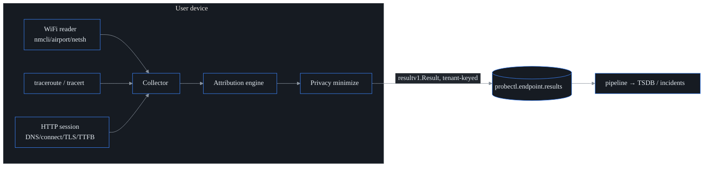

# Endpoint agent — last-mile / WiFi DEM

## What it is

`probectl-endpoint` is a lightweight, cross-OS (Linux / macOS / Windows) agent
that runs **on a user's own device** and measures the **last mile** — the part of
the path that probectl's server-side canaries physically cannot see. Your data-
center probes can tell you the service is up; they can't tell you that a
particular remote employee's Wi-Fi is weak or their home ISP is dropping packets.
This agent fills that gap.

It captures four things from where the user actually sits — Wi-Fi link health,
the local gateway, the ISP / last-mile path, and browser-session timings — and
then does the part that makes it useful: it **attributes a slowdown to the
closest impaired layer**, so an operator can finally answer the hybrid-work
question, *"is it us, or the user's Wi-Fi / ISP?"*

It behaves like every other probectl agent: it emits DEM results to the
operator's **own** bus, tenant-tagged, and it **never phones home**. This is
"Digital Experience Monitoring" (DEM) done on-device and sovereignty-respecting.



## What it measures

| Signal | Fields | Source |
| ------ | ------ | ------ |
| **WiFi** | RSSI (dBm) / signal % / noise / link rate / band / channel; cellular RSRP/RSRQ/SINR | `nmcli` or `/proc/net/wireless` (Linux), `airport -I` (macOS), `netsh wlan` (Windows) |
| **Gateway** | reachable, RTT, loss | derived from the first (private) hop of the trace |
| **Last-mile** | per-hop RTT/loss; derived local / ISP-edge / beyond segments | `traceroute -n` (Unix), `tracert -d` (Windows) |
| **Session** | DNS / connect / TLS / TTFB / total to each target | Go `httptrace` over the hardened (cert-validating) client |

Every metric is **best-effort**. A device with no Wi-Fi, or an OS that doesn't
expose a given field, degrades that field to "unavailable" rather than reporting
a false reading. A `Have.*` flag travels with each signal so the rest of the
system can tell *"we didn't measure this"* apart from *"we measured this and it
was zero"* — an important distinction when the absence of a value is itself the
diagnosis.

## Attribution — "is it Wi-Fi / ISP or the network?"

This is the headline feature. The attribution engine
(`internal/endpoint/attribution.go`, pure logic and exhaustively tested) assesses
each layer, then blames the **closest impaired layer**, walking outward from the
device:

```
wifi  →  local (gateway/LAN)  →  isp (access edge)  →  network (beyond)
```

**Why closest-first is the whole point:** a weak Wi-Fi link inflates the gateway,
ISP, *and* session numbers that are all measured *through* that link. If you
naively looked at the slow session and blamed "the network," you'd be wrong — the
real fault is the user's Wi-Fi, and the downstream numbers are just collateral.
Walking outward and stopping at the first impaired layer avoids that trap.

The verdicts (`endpoint.cause`):

- **`wifi`** — weak signal (RSSI ≤ −75 dBm, or signal ≤ 35% when only a
  percentage is available) or noise.
- **`local`** — the default gateway is unreachable, lossy, or high-RTT.
- **`isp`** — the first public hop (the ISP access edge) is high-RTT or lossy.
- **`network`** — the whole local path is healthy but a session is still slow, so
  the fault is **beyond** the last mile (the service or wider network — explicitly
  *not* the user's Wi-Fi or ISP).
- **`none`** — nothing impaired.
- **`unknown`** — a slow session, but no path visibility to localize it.

Each verdict carries a confidence (0–1) and a human-readable summary. The cutoffs
are configurable (`thresholds:` in config, defaulting to `DefaultThresholds` —
where the −75 dBm and 35% values above come from).

## Privacy — it runs on someone's personal device

Because the agent lives on an end user's device, **data minimization is a hard
requirement, not a setting**. The principle: keep the **measurements** that
diagnose experience (signal, RTT, loss, timings — none of which identify a
person) and **gate the identifiers**.

| Field | Default | Why |
| ----- | ------- | --- |
| SSID (network name) | collected | low sensitivity (the user's own network) |
| **BSSID (AP MAC)** | **NOT collected** | geolocatable PII — public wardriving databases map BSSID → physical location |
| Gateway IP (RFC1918) | collected | local, low sensitivity |
| **Public last-mile hop IPs** | **NOT collected** | reveal the user's ISP and geography; the per-hop RTT/loss is kept, only the IP is dropped |

Two properties make this trustworthy:

- **Drop-on-collect.** A gated-off field is cleared *before* the sample is ever
  mapped, emitted, or logged — so it never leaves the device, not even into a log
  line. There's also a `StrictPrivacy()` preset that collects **no** identifiers
  at all, for high-governance fleets.
- **Disclosure at startup.** The agent prints **exactly what it collects** every
  time it starts (the disclosure banner) — transparency is part of running
  software on someone's machine. Tune it with `PROBECTL_ENDPOINT_COLLECT_*` (see
  [`configuration.md`](configuration.md)).

## Cross-OS collection matrix

| Capability | Linux | macOS | Windows | Fallback |
| ---------- | ----- | ----- | ------- | -------- |
| WiFi RSSI/SSID/band | `nmcli` → `/proc/net/wireless` | `airport -I` | `netsh wlan` (signal %→dBm) | unavailable (wired) |
| Last-mile path | `traceroute -n` | `traceroute -n` | `tracert -d` | unavailable |
| Session timings | httptrace | httptrace | httptrace | (always available) |

The per-OS readers are **build-tag gated** (`wifi_linux.go`, `wifi_darwin.go`,
`wifi_windows.go`, `wifi_unsupported.go`, `netprobe_unix.go`,
`netprobe_windows.go`), each defining `newPlatformWiFiCollector` /
`newPlatformLastMileCollector` so the package **compiles on every OS** (the
`endpoint-cross` CI build proves it). The pattern mirrors the eBPF and browser
layers: a fully-tested portable core with thin, gated platform edges — the
fragile per-OS bit is small, and the **output parsers are portable and
fixture-tested** on every platform.

## Result schema → pipeline

A sample maps onto the canonical `canary.Result` envelope (`ToResults`), one
result per signal, typed `endpoint.attribution` / `.wifi` / `.gateway` /
`.lastmile` / `.session`. Numeric fields become Metrics (TSDB series);
identifiers and labels become Attributes (OTel attributes — no cardinality
blow-up). The **attribution result is the headline**: its `endpoint.cause`
attribute *is* the Wi-Fi / ISP / network verdict.

Results are published to **`probectl.endpoint.results`** as a `resultv1.Result`,
tenant-keyed, so they flow through the **same** pipeline → TSDB / incident path as
every other canary — the control-plane result consumer drains them on its own
consumer group alongside `probectl.network.results`.

## Deploy

Ship the single static binary to managed devices via your MDM (Intune, Jamf). It
needs **no elevated privileges**: it uses the OS's own `traceroute` / `tracert`
and read-only Wi-Fi queries. Point it at the bus (Kafka in a fleet, or the
lightweight in-memory bus for a single-node dev deploy) with a tenant id.

First deployment? The cross-producer journey — control plane, bus, and each
agent's enrollment-or-bus path — lives in
[`deploying-agents.md`](deploying-agents.md) (start at
[`getting-started.md`](getting-started.md) if nothing is running yet). You're
done when the device shows up in `GET /v1/endpoints` with an attribution
verdict — not when the process starts.

## Notes and deferrals

- **Gateway-health derivation (flagged):** gateway health is derived from the
  first hop of the last-mile trace rather than a separate privileged ping — it's
  simpler and needs no raw sockets. A dedicated low-overhead gateway probe is a
  possible future refinement.
- **Out of scope (by design):** full real-user monitoring (RUM) and deep packet
  capture. For roaming devices behind NAT, a future option is to forward results
  over the tenant-bound mTLS agent gRPC stream instead of the bus.

## The fleet surface

Endpoint results are additionally retained as a tenant-scoped, in-memory
**snapshot** (the latest result per signal type per endpoint, bounded per tenant
and per-agent session targets, evicting the stalest) by the endpoint-view
consumer, and served at `GET /v1/endpoints` (RBAC `agent.read` — endpoints *are*
DEM agents; a `collector_running=false` flag distinguishes an unwired consumer
from a genuinely empty fleet).

The web surface lives at `/endpoints`: a fleet list (attribution verdict first —
"slow: WiFi / ISP / network" — with Wi-Fi strength, gateway and ISP-edge RTT, a
cause filter, and search) and a per-endpoint detail (Wi-Fi link, gateway / local
network, last-mile segments, browser sessions, and the per-layer attribution
scores).

**Privacy display contract:** identifiers the agent withheld (SSID / BSSID /
gateway IP / public hops) are absent from the results, and the UI renders that
absence **honestly** — "withheld (privacy)" — never a re-derived or fabricated
value. The snapshot rebuilds from the stream after a restart; longer history
lives in the TSDB series the pipeline writes.
