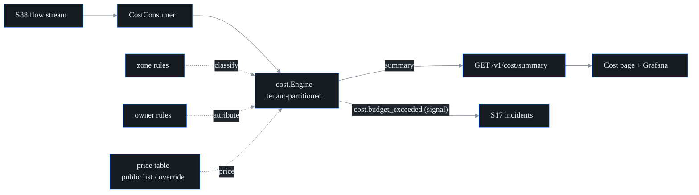

# FinOps / egress cost observability (S44, F41)

probectl puts dollars on the network: it correlates the flow stream it
already collects (S38) with operator-declared zone/ownership maps and PUBLIC
cloud pricing into per-service / per-team cost attribution, cross-AZ/region
"chatty service" detection, hourly cost trends, and monthly budget alerts
with Org/Team showback.

Three ground rules (the S44 watch-outs):

1. **Volume × public pricing, not billing.** Cloud billing APIs vary and lag,
   so the engine prices observed egress volume against list rates. It is an
   attribution and detection tool — full cloud-billing reconciliation is out
   of scope by design.
2. **Degrade gracefully.** No price table → volume-only mode: bytes are still
   attributed, dollars are never invented, and `priced=false` is surfaced
   everywhere. No zone rules → locality classes are unknown and the UI says
   so.
3. **Pricing freshness/AUP.** The embedded defaults are representative list
   rates from public pricing pages with an as-of date and a license note;
   operators override them with their provider's current or negotiated rates.
   The as-of date is always displayed — staleness is visible, never hidden.

## How traffic is classified and priced

| Class | Meaning | Default rate ($/GiB) |
|---|---|---|
| `same_zone` | both ends map to one zone | 0 (free on major clouds) |
| `inter_az` | same region, different zones | 0.01 |
| `inter_region` | different regions | 0.02 |
| `internet_egress` | source mapped, destination public | 0.09 |
| `unknown` | zones unmapped | unpriced (volume tracked) |

Zone and ownership mapping are operator-declared (subnet layouts are
deployment-specific and never guessable):

```sh
# CIDR → zone (region derived from the trailing zone letter, or explicit zone/region)
export PROBECTL_COST_ZONES="10.0.1.0/24=us-east-1a,10.0.2.0/24=us-east-1b,10.9.0.0/16=eu-west-1a"
# CIDR → service:team (attribution + showback)
export PROBECTL_COST_SERVICES="10.0.1.0/24=checkout:payments,10.0.2.0/24=inventory:logistics"
# Monthly USD budgets; a breach raises ONE cost-plane signal per month
export PROBECTL_COST_BUDGETS="team:payments=500,service:checkout=120"
```

Pricing override (JSON, the `PriceTable` shape — malformed files fail
startup; silently mispriced data is worse than none):

```json
{
  "per_gib": { "inter_az": 0.01, "inter_region": 0.02, "internet_egress": 0.08 },
  "source": "negotiated rates, FY26 agreement",
  "as_of": "2026-06-01",
  "license": "internal"
}
```

## Outputs

- `GET /v1/cost/summary` (`metrics.read`) — totals, by-class/service/team
  breakdowns, top chatty zone pairs (≥ 1 GiB of paid cross-AZ/region traffic
  flags `chatty`), 7-day hourly trend, budget status, and the honesty flags
  (`cost_running`, `priced`, `zones_mapped`) + pricing provenance.
- **Budget alerts**: crossing a monthly budget raises a `cost.budget_exceeded`
  signal (plane `cost`) into the incident pipeline — once per budget per
  month (alert-fatigue control), re-armed on month rollover. Signals only:
  probectl never throttles traffic or touches the bill (guardrail 9).
- **Cost page** (`/cost`): the light native summary — totals + pricing
  provenance, team showback, chatty cross-AZ conversations, budget status,
  with explicit volume-only / zones-unmapped notices. Deep dashboarding is
  federated to **Grafana** via the S40 datasource (the Surface declaration):
  cost series ride the same flow analytics the datasource already exposes.

## Mechanics



All state is tenant-partitioned (guardrail 1); attribution maps are bounded
(overflow lumps into `(other)`); unscoped flow records are dropped at the
boundary. The engine is rebuilt from the stream on restart — durable cost
series belong to the TSDB/Grafana path.

## Configuration

| Variable | Default | Purpose |
|---|---|---|
| `PROBECTL_COST_ENABLED` | `true` | the engine + consumer (local-only processing) |
| `PROBECTL_COST_ZONES` | (none) | CIDR→zone rules (`cidr=zone[/region],…`) |
| `PROBECTL_COST_SERVICES` | (none) | CIDR→`service:team` attribution rules |
| `PROBECTL_COST_BUDGETS` | (none) | monthly USD budgets (`team:payments=500,…`) |
| `PROBECTL_COST_PRICES_FILE` | (none) | JSON price-table override (embedded public list rates otherwise) |
| `PROBECTL_COST_PRICED` | `true` | `false` = volume-only mode (no pricing at all) |
