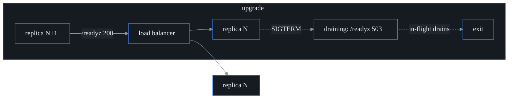

# Zero-downtime lifecycle (S34 · F28)

probectl is built to upgrade at scale without an outage: the control plane is
stateless replicas behind a load balancer, migrations are additive (expand/
contract), the agent fleet rolls out version-by-version, and every step has a
rollback. This page is the operator contract.

## Rolling control-plane upgrade

The control plane holds no durable state — all state is in Postgres/ClickHouse/
the TSDB — so replicas are interchangeable and upgrade by **replace, not restart-
in-place**:

1. Apply migrations first (additive — safe for the still-running release N; see
   below).
2. Roll replicas one at a time. On `SIGTERM`/`SIGINT` a replica **flips `/readyz`
   to `503 draining` immediately**, so the load balancer stops routing new
   requests to it, then it drains in-flight requests within
   `PROBECTL_SHUTDOWN_TIMEOUT` before exiting (`/healthz` stays `200` throughout —
   the process is still serving, just not accepting new traffic).
3. Bring up the replacement; it serves once `/readyz` is `200` (DB reachable, not
   draining).

Because release N and N+1 run side-by-side during the roll, **both must work
against the same schema** — which the migration policy guarantees.

## Migrations: expand/contract (the rollback contract)

A zero-downtime upgrade (and a rollback) requires that **release N's schema works
with both N's code and N-1's code**. So migrations are **additive within a
release**; a destructive or rewriting change is split across releases:

- **Expand** (release N): add the new column/table/index (nullable or with a
  default), backfill, and start writing both shapes.
- **Contract** (release N+1, after nothing reads the old shape): drop the old
  column/constraint.

Forbidden in a single migration — and rejected by the **migration-gate**
(`make migration-gate`, a CI job over `internal/store/migrate` walking every
embedded `*.sql`):

| Rejected | Why | Do instead |
| -------- | --- | ---------- |
| `DROP TABLE` / `DROP COLUMN` | N-1 code still uses it | drop in the next release |
| `ALTER COLUMN … TYPE` | table rewrite + lock; breaks N-1 | add a new column, backfill, switch |
| `RENAME COLUMN`/`TABLE` | N-1 code references the old name | add the new name, backfill, drop later |
| `ADD COLUMN … NOT NULL` without `DEFAULT` | rewrite fails on existing rows; N-1 inserts break | add nullable or give a `DEFAULT` |
| `ALTER COLUMN … SET NOT NULL` | locks/fails | add a `NOT VALID` check, `VALIDATE` later |
| `TRUNCATE` | destroys data | — |

Allowed (and used throughout): `CREATE TABLE/INDEX IF NOT EXISTS`, `ADD COLUMN IF
NOT EXISTS …` (nullable or defaulted), `DROP POLICY`/`DROP INDEX`, `ADD CONSTRAINT
… NOT VALID`, RLS enable/force. Migrations remain **idempotent** (safe re-run) and
each applies in its own transaction under an advisory lock (one applier wins; the
rest find the schema already current).

**Rollback** is then just rolling the replicas back to N — its code already works
against N+1's additive schema. (The contract migration that removes the old shape
is deferred to a later release precisely so this holds.)

## Agent version skew (N/N-1)

The control plane is the authority on agent↔control compatibility. At
registration it checks the agent's version against its own with the **N/N-1
window** (`internal/lifecycle`):

- same major version, **minor skew ≤ `PROBECTL_AGENT_SKEW_WINDOW`** (default 1) →
  compatible, in **both** directions (an N agent ↔ N+1 control plane and an N+1
  agent ↔ N control plane both work);
- a wider skew, a major mismatch, or an agent below `PROBECTL_AGENT_MIN_VERSION` →
  rejected with gRPC `FailedPrecondition` ("upgrade required" — distinct from a
  transient error, so the agent surfaces it rather than hot-looping);
- a dev/unpinned build (`0.0.0-dev`) on either side skips the check.

This means a fleet can run mixed N and N+1 agents during a rollout, and a control-
plane upgrade never strands a one-version-behind agent.

| control \ agent | N-1 | N | N+1 | N±2 |
| --------------- | --- | - | --- | --- |
| **N** | ✅ | ✅ | ✅ | ❌ (upgrade) |

## Staged fleet rollout (cohorts + pace)

A new agent version is promoted **ring by ring**, not all at once. `internal/
lifecycle` assigns each agent to a **cohort** by a stable hash of its id (so an
agent never flaps between rings): a small **canary**, then **early**, then the
**main** fleet. A `Rollout` carries the target version and a `Stage` the operator
advances one ring at a time, watching health between steps:

`DesiredVersion(agentID)` returns the target once the agent's cohort is released,
otherwise its current version. The cohort split is configurable (default 5%
canary / 20% early). Agent self-update delivery (advertising the desired version
over the config stream) is the follow-up wire-up; this sprint ships the cohort +
pace model + the version-skew enforcement that makes a staged roll safe.

## Configuration

See [`configuration.md`](configuration.md#agent-transport-s4) for the
`PROBECTL_AGENT_SKEW_WINDOW` / `PROBECTL_AGENT_MIN_VERSION` keys and
`PROBECTL_SHUTDOWN_TIMEOUT` (the drain window).

## Out of scope

Multi-region active-active HA + DR failover (RPO/RTO) is **S-EE2**; per-tenant
backup/restore + verifiable deletion is **S-T5/F55**. This sprint is single-region
rolling upgrades, migration safety, version skew, and the staged-rollout model.
