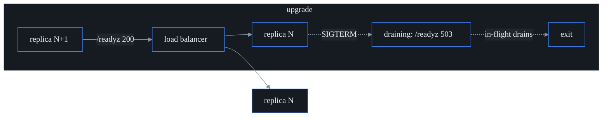

# Zero-downtime lifecycle

The goal of this page: **upgrade probectl at scale without an outage, and be able
to roll back at every step.** Four things make that possible, and the sections
below are each one of them — the control plane is stateless replicas behind a load
balancer, migrations are additive (expand/contract), the agent fleet rolls out
version by version, and nothing is irreversible until you choose to make it so.

If you remember one rule, remember this one: during any rolling upgrade, the old
release (N) and the new release (N+1) are *running side by side*, so everything
they share — the database schema, the agent protocol — must work for both at once.
Every constraint below falls out of that rule.

## Rolling control-plane upgrade

The control plane holds no durable state of its own — all state lives in Postgres,
ClickHouse, and the TSDB. That's what makes replicas interchangeable, and it's why
they upgrade by **replace, not restart-in-place**:

1. Apply migrations first (they are additive, so they're safe for the
   still-running release N — see the next section).
2. Roll replicas one at a time. On `SIGTERM`/`SIGINT` a replica **flips `/readyz`
   to `503 draining` immediately** — so the load balancer stops sending it new
   requests — then drains its in-flight requests within `PROBECTL_SHUTDOWN_TIMEOUT`
   before exiting. (`/healthz` stays `200` the whole time: the process is still
   *serving*, it's just no longer *accepting* new traffic. The two probes mean
   different things on purpose.)
3. Bring up the replacement; it starts serving once `/readyz` is `200` — meaning
   the database is reachable and it's not draining.

Because N and N+1 run side by side during the roll, **both must work against the
same schema**, which the migration policy below guarantees.

## Migrations: expand/contract (the rollback contract)

This is the heart of zero-downtime. A safe upgrade *and* a safe rollback both
require one thing: **release N's schema has to work with both N's code and N−1's
code.** You get that by never making a destructive change in a single step.
Instead you split it across two releases:

- **Expand** (release N): add the new column/table/index (nullable, or with a
  default), backfill it, and start writing *both* the old and new shapes.
- **Contract** (release N+1, once nothing reads the old shape anymore): drop the
  old column/constraint.

Anything that would break N−1 mid-roll is forbidden in a single migration, and the
**migration gate** rejects it automatically (`make migration-gate`, a standing CI
job: the checker in `internal/store/migrate` walks every embedded `*.sql` in
`migrations/`):

| Rejected | Why | Do instead |
| -------- | --- | ---------- |
| `DROP TABLE` / `DROP COLUMN` | N-1 code still uses it | drop in the next release |
| `ALTER COLUMN … TYPE` | table rewrite + lock; breaks N-1 | add a new column, backfill, switch |
| `RENAME COLUMN`/`TABLE` | N-1 code references the old name | add the new name, backfill, drop later |
| `ADD COLUMN … NOT NULL` without `DEFAULT` | rewrite fails on existing rows; N-1 inserts break | add nullable or give a `DEFAULT` |
| `ALTER COLUMN … SET NOT NULL` | locks/fails | add a `NOT VALID` check, `VALIDATE` later |
| `TRUNCATE` | destroys data | — |

Allowed (and used throughout): `CREATE TABLE/INDEX IF NOT EXISTS`, `ADD COLUMN IF
NOT EXISTS …` (nullable or defaulted), `DROP POLICY`/`DROP INDEX`, `ADD CONSTRAINT
… NOT VALID`, RLS enable/force. Migrations remain **idempotent** (safe re-run) and
each applies in its own transaction under an advisory lock (one applier wins; the
rest find the schema already current).

**Rollback** is then trivial: roll the replicas back to N. N's code already works
against N+1's additive schema, because the schema only *added* — it didn't remove
anything N depends on. (The contract migration that finally removes the old shape
is deliberately deferred to a later release precisely so this stays true.)

## Agent version skew

The control plane is the authority on whether an agent is compatible. At
registration it compares the agent's version to its own using an **N/N−1 window**
(`internal/lifecycle`):

- Same major version, with a **minor skew ≤ `PROBECTL_AGENT_SKEW_WINDOW`**
  (default 1) → compatible, in *both* directions: an N agent talking to an N+1
  control plane works, and so does an N+1 agent talking to an N control plane.
- A wider skew, a major-version mismatch, or an agent below
  `PROBECTL_AGENT_MIN_VERSION` → rejected with gRPC `FailedPrecondition` and an
  "upgrade required" message. (That status is deliberately distinct from a
  *transient* error, so the agent surfaces it to an operator instead of
  hot-looping forever trying to reconnect.)
- A dev/unpinned build (`0.0.0-dev`) on either side skips the check entirely.

The payoff: a fleet can run a *mix* of N and N+1 agents during a rollout, and
upgrading the control plane never strands an agent that's one version behind.

| control \ agent | N−1 | N | N+1 | N±2 |
| --------------- | --- | - | --- | --- |
| **N** | yes | yes | yes | no (upgrade) |

## Staged fleet rollout (cohorts + pace)

You don't push a new agent version to the whole fleet at once — you promote it
**ring by ring**, watching health between rings. `internal/lifecycle` assigns each
agent to a **cohort** by a stable hash of its id (stable so an agent never flaps
between rings from one evaluation to the next): a small **canary** ring first,
then **early**, then the **main** fleet. A `Rollout` carries the target version
and a `Stage` that the operator advances one ring at a time:

`DesiredVersion(agentID)` returns the target version once that agent's cohort has
been released, and the agent's current version otherwise. The cohort split is
configurable (default 5% canary / 20% early, leaving the remaining ~75% as the
main fleet). Note the boundary: this is the cohort + pace *model* plus the
version-skew enforcement that makes a staged roll safe to attempt. Actually
*delivering* a self-update to the agent (advertising the desired version down to
it) is a separate follow-up.

## Configuration

See [`configuration.md`](configuration.md) for the `PROBECTL_AGENT_SKEW_WINDOW`
and `PROBECTL_AGENT_MIN_VERSION` keys (agent-transport section) and
`PROBECTL_SHUTDOWN_TIMEOUT` (the drain window).

## Out of scope

This page is about *single-region* rolling upgrades: migration safety, version
skew, and the staged-rollout model. Two related-but-separate concerns live
elsewhere: multi-region active-active HA and disaster-recovery failover (RPO/RTO)
are in [`multi-region.md`](multi-region.md), and per-tenant backup/restore plus
verifiable deletion are a separate compliance capability.
