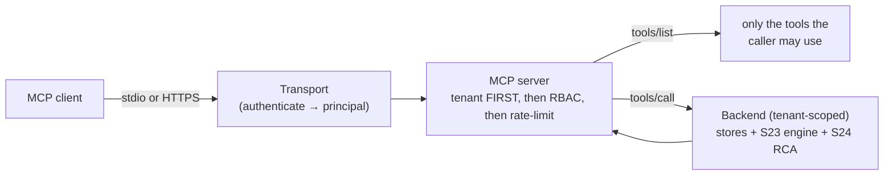

# MCP server (S25)

netctl ships a **Model Context Protocol** server so AI clients (e.g. Claude
Desktop) can query netctl directly. It exposes **read-only**, **tenant- and
RBAC-scoped** tools over two transports — **stdio** (local) and **HTTP** (network,
TLS + bearer-authenticated). It is a thin, dependency-free JSON-RPC 2.0 server.

## Security model — tenant first, then RBAC



An MCP caller is **bound to a single tenant** (the token determines it). Every
call enforces the boundary at the MCP layer:

1. **Tenant first** — a tenantless principal is rejected; no tool takes a tenant
   argument, so a call cannot cross tenants.
2. **Then RBAC** — `tools/list` returns only the tools the caller's permissions
   allow, and `tools/call` re-checks the tool's permission (an out-of-scope caller
   gets `forbidden`, never data).
3. The backend then runs through the **tenant-scoped stores + the S23 query layer**
   (which enforces tenant→RBAC again — defense in depth), so a tool can never
   return another tenant's data.

Tool calls are **rate-limited per tenant**. The tools are **read-only** (no action
tools — CLAUDE.md §7 guardrail 8); write/remediation is deferred to S-EE5 as
proposal-only.

## Tools (initial catalog)

| Tool                  | Permission      | Description                                                        |
| --------------------- | --------------- | ----------------------------------------------------------------- |
| `list_tests`          | `test.read`     | List the tenant's synthetic tests/canaries.                       |
| `get_path`            | `test.read`     | Most recent discovered path to a target (hops, loss, latency).    |
| `get_bgp_events`      | `events.read`   | Recent BGP/routing events for a prefix or origin AS.              |
| `query_flows`         | `events.read`   | Network flow / service-map records (eBPF).                        |
| `get_incident`        | `incident.read` | One incident with its full cross-plane timeline.                  |
| `correlate_incident`  | `incident.read` | Which planes contributed to an incident + the timeline.          |
| `explain_degradation` | `ai.query`      | RCA on a natural-language question → a cited, RBAC-scoped cause.  |

Each tool advertises a documented JSON-Schema input. The catalog + schemas + auth
model are the stable contract other sprints append tools to (security/cost/SLO/
topology, then S-EE5's proposal-only `propose_remediation`). Tools whose backing
store is not wired in a deployment (e.g. flows/BGP without ClickHouse) return an
empty result with a note rather than failing.

## Transports & auth

**Tokens.** A control-plane bearer token (`mcp_tokens`) maps to a tenant + the
owning user's effective RBAC. Like sessions, only the token's **hash** is stored
(never the token), and the lookup is pre-tenant. Mint one with:

```
netctl-control mcp-token --user <user-uuid> [--tenant <id>] [--name laptop]
```

**stdio** (local — for Claude Desktop). The client spawns the binary; the token
comes from `NETCTL_MCP_TOKEN`. Logs go to stderr so stdout stays a clean JSON-RPC
channel:

```
NETCTL_MCP_TOKEN=<token> NETCTL_DATABASE_URL=... netctl-control mcp-stdio
```

Example Claude Desktop config:

```json
{
  "mcpServers": {
    "netctl": {
      "command": "netctl-control",
      "args": ["mcp-stdio"],
      "env": { "NETCTL_MCP_TOKEN": "...", "NETCTL_DATABASE_URL": "..." }
    }
  }
}
```

**HTTP** (network-exposed). Enabled by config; **TLS-only and bearer-authenticated**
— never exposed as plaintext when network-reachable (CLAUDE.md §7 guardrail 12).
POST a JSON-RPC request with `Authorization: Bearer <token>`. See
[`configuration.md`](configuration.md) for the `NETCTL_MCP_*` keys.

## Methods

Standard MCP: `initialize`, `tools/list`, `tools/call`, `ping`, and the
`notifications/initialized` notification. Tool results carry both a text rendering
and `structuredContent`; a tool-level failure is an `isError` result (so the model
can read it), while protocol/auth failures are JSON-RPC errors.
