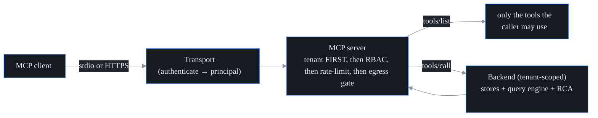

# MCP server

## What it is

probectl ships a **Model Context Protocol (MCP)** server so AI clients — Claude
Desktop, an agent framework, your own tool-using app — can query probectl
directly, in the client's own "call a tool" idiom. It exposes a small catalog of
**read-and-propose**, **tenant- and RBAC-scoped** tools over two transports:

- **stdio** — local; the client spawns the probectl binary and talks over
  stdin/stdout (how Claude Desktop runs it).
- **HTTP** — network-reachable; TLS-only and bearer-authenticated.

Under the hood it's a thin, dependency-free JSON-RPC 2.0 server speaking MCP
revision `2024-11-05`. The tools are mostly read-only; the one write-ish tool is
**proposal-only** and can never act on its own (details below).

## Security model: tenant first, then RBAC



An MCP caller is **bound to a single tenant** — the token it presents determines
which one. Every call enforces the boundary at the MCP layer
(`internal/ai/mcp/server.go`), in order:

1. **Tenant first.** A principal with no tenant is rejected. No tool takes a tenant
   argument, so a call *cannot express* "another tenant's data" (the same
   by-construction property as the query layer — see `docs/ai-query.md`).
2. **Then RBAC.** `tools/list` returns only the tools the caller's permissions
   allow — an out-of-scope caller doesn't even *see* a tool it can't use.
   `tools/call` re-checks the tool's permission (out of scope → `forbidden`, never
   data).
3. **Then rate-limit.** Tool calls are rate-limited per tenant (default
   `120`/minute, `PROBECTL_MCP_RATE_PER_MIN`), so one tenant can't exhaust the
   server.
4. **Then the egress gate.** Returning tool output to an external AI client *is*
   tenant data leaving the platform, so each `tools/call` passes the shared egress
   gate — per-tenant consent, redaction, audit (its own section below).
5. **Then the backend** runs through the **tenant-scoped stores + the semantic
   query engine**, which enforce tenant → RBAC *again*. That's defense in depth: a
   tool can't return another tenant's data even if a layer above had a bug.

## Tools (initial catalog)

| Tool                  | Permission             | Description                                                              |
| --------------------- | ---------------------- | ------------------------------------------------------------------------ |
| `list_tests`          | `test.read`            | List the tenant's synthetic tests/canaries.                              |
| `get_path`            | `test.read`            | Most recently discovered path to a target (hops, per-hop loss/latency).  |
| `get_bgp_events`      | `events.read`          | Recent BGP/routing events for a prefix or origin AS.                     |
| `query_flows`         | `events.read`          | Network flow / service-map records (eBPF).                               |
| `get_incident`        | `incident.read`        | One incident with its full cross-plane timeline.                         |
| `correlate_incident`  | `incident.read`        | Which planes contributed to an incident, plus the signal timeline.       |
| `explain_degradation` | `ai.query`             | RCA on a natural-language question → a cited, RBAC-scoped root cause.     |
| `propose_remediation` | `remediation.propose`  | **Propose-only.** Files a `proposed` suggestion a human must approve.     |

Each tool advertises a documented JSON-Schema input (`internal/ai/mcp/tools.go`),
which is the stable contract. Tools whose backing store isn't wired in a deployment
(e.g. flows/BGP without ClickHouse) return an empty result with a note rather than
failing — so a client gets a clean "nothing here" instead of an error.

**About `propose_remediation`.** This is the one tool that writes anything, and it
is built so it *cannot* be dangerous. It only ever creates a `state=proposed`
suggestion — a reroute suggestion, a traffic-shift suggestion, a ticket, or a
trustctl renewal request — that a human must approve through the authenticated UI.
The MCP path can never approve or execute; probectl never executes autonomously
(see `docs/remediation.md`). So the worst an injected prompt can do through this
tool is *file a suggestion someone then has to look at*. `TestProposeRemediationToolIsProposalOnly`
(`internal/ai/mcp/mcp_test.go`) pins that guarantee — including a structural check
that the catalog contains **no** approve/execute/apply tool at all. Note: the
proposal backend is the commercially licensed guarded-remediation feature, attached
at the editions seam — it is live only on the **HTTP** transport of a licensed
server. On the lightweight **stdio** transport (and on an unlicensed deployment)
the tool is inert: calling it returns a clear "remediation is not enabled" error
result instead of acting.

## Transports and auth

**Tokens.** A control-plane bearer token (table `mcp_tokens`) maps to a tenant plus
the owning user's effective RBAC. As with sessions, only the token's **hash** is
stored (never the token itself), and the lookup happens before tenant scoping is
applied. Mint one with:

```sh
probectl-control mcp-token --user <user-uuid> [--tenant <id>] [--name laptop]
```

The secret is printed once. The token acts *as that user* — it carries exactly that
user's permissions, no more.

### stdio (local — e.g. Claude Desktop)

The client spawns the binary; the token comes from `PROBECTL_MCP_TOKEN`. Logs go to
**stderr** so stdout stays a clean JSON-RPC channel.

The local-trust model is worth being explicit about. The **binary authenticates the
token before it serves anything**: `mcp-stdio` resolves `PROBECTL_MCP_TOKEN` against
the `mcp_tokens` store and refuses to start on a missing or invalid token
(`runMCPStdio` in `cmd/probectl-control/mcp.go`). What stdio *deliberately* trusts
is the **local invoking process**: anyone who can spawn the binary with that env var
**is** the principal the token names — workstation process isolation is the
boundary, exactly like any local CLI credential (think `kubectl`'s kubeconfig).
Tenant scoping and RBAC still apply to every call; the transport grants no extra
privilege.

```sh
PROBECTL_MCP_TOKEN=<token> PROBECTL_DATABASE_URL=... probectl-control mcp-stdio
```

Example Claude Desktop config:

```json
{
  "mcpServers": {
    "probectl": {
      "command": "probectl-control",
      "args": ["mcp-stdio"],
      "env": { "PROBECTL_MCP_TOKEN": "...", "PROBECTL_DATABASE_URL": "..." }
    }
  }
}
```

### HTTP (network-reachable)

Enabled by config and **TLS-only and bearer-authenticated** — never plaintext when
network-reachable (the platform's TLS-everywhere guardrail). Set
`PROBECTL_MCP_HTTP_ADDR` together with `PROBECTL_MCP_TLS_CERT_FILE` and
`PROBECTL_MCP_TLS_KEY_FILE`; setting the address without the TLS files **fails
config validation** on purpose, so the endpoint can't come up anonymous. Then POST
a JSON-RPC request with `Authorization: Bearer <token>`. See
[`configuration.md`](configuration.md) for the `PROBECTL_MCP_*` keys.

## Methods

Standard MCP: `initialize`, `tools/list`, `tools/call`, `ping`, and the
`notifications/initialized` notification. A tool result carries both a text
rendering and `structuredContent`. A **tool-level** failure comes back as an
`isError` result (so the model can read the message and recover), while
**protocol/auth** failures are JSON-RPC errors.

## External-AI egress: consent, redaction, audit

An MCP caller is an **external AI client**, so returning tool output means tenant
telemetry is leaving the platform. Every `tools/call` therefore rides **the same
egress gate** as the remote RCA model and the authoring model
(`internal/ai.EgressGate`, built by the control plane's one gate constructor — the
same consent source, redaction policy, and audit sink on every surface; see
`docs/ai-egress.md`):

- **Consent (default deny).** The tenant must have opted in via
  `tenant_governance.ai_remote_egress` — the *same* per-tenant consent that gates
  remote-model RCA. Without it, `tools/call` returns an `isError` result explaining
  the requirement, the tool never runs, and the denial is audited. (`tools/list`
  and `initialize` still work — *discovery* isn't egress.)
- **Redaction.** A result is rendered to JSON once, masked by the redaction policy
  (secrets always; IPs/PII by default; hostnames + custom patterns per config), and
  the **redacted** form is what reaches the client — both the text and the
  `structuredContent`. Masking runs on the JSON encoding with deterministic tokens,
  so the document stays valid and values stay correlatable.
- **Audit.** Every call — allowed or denied, and *why* — lands in the tenant's
  tamper-evident audit stream as `mcp.tool_call` (actor, tool, outcome), plus an
  `ai.remote_egress` event (`surface = mcp`) on each allowed call that returns
  data.

Crucially, the egress gate is a **required constructor argument** of `mcp.New` —
there is no gate-less constructor, and a nil gate denies every tool call (fail
closed). A gate-less MCP server simply can't exist, so no future transport can
bypass consent/redaction/audit.

## What it deliberately does not do

- **No tenant argument, anywhere.** Isolation is by construction, not by a
  parameter a caller could set.
- **No autonomous action.** The only write tool is proposal-only and human-gated;
  the server never executes a remediation.
- **No anonymous network exposure.** The HTTP transport refuses to start without
  TLS, and every call is bearer-authenticated and consent-gated.

## See also

- `docs/ai-query.md` — the semantic query engine the tools read through.
- `docs/ai-rca.md` — the RCA that `explain_degradation` invokes.
- `docs/ai-egress.md` — the consent/redaction/audit gate every tool call rides.
- `docs/remediation.md` — the human-gated proposal workflow `propose_remediation` files into.
- `docs/configuration.md` — the `PROBECTL_MCP_*` keys.
