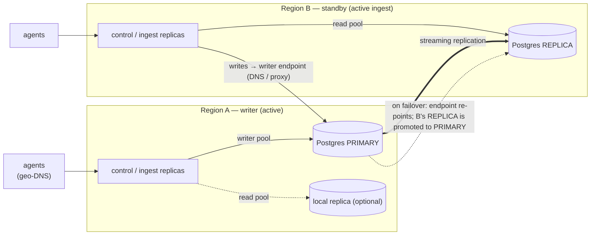

# Multi-region / active-active HA (S-EE2, F33)

probectl runs **active-active across regions**: every region runs
interchangeable, stateless control-plane + ingest replicas, all serving traffic
at once. Durable state is **one PostgreSQL primary (writer)** with streaming
replicas in the other regions. A region failover promotes a standby and
re-points the writer; the control plane fences writes during the transition so
a split-brain write can never corrupt state.

This is the honest Postgres model: there is exactly one writable primary at a
time. "Active-active" describes the **control-plane tier** (active everywhere);
the database is **single-writer with read replicas** — the correct, conflict-free
design for PostgreSQL. (A multi-writer global database is explicitly out of
scope; PRD §4 pins Postgres.)

**Edition:** the mechanics + docs are **core** — stateless replicas are inherent
to S1/S34, and the split-brain fence protects any deployment. The validated
failover **runbooks + support** are the Enterprise entitlement (`ha_support`).

---

## Topology

- **Regional ingest:** agents connect to the nearest region (geo-DNS / their
  configured endpoint). Each region's replicas ingest locally; tenant-tagged
  data converges in the replicated stores. A region outage sheds its agents to
  the next-nearest region.
- **Writer endpoint:** a single DNS name / proxy (e.g. a managed-DB failover
  endpoint, Patroni + a VIP, or PgBouncer/HAProxy tracking the leader) that
  always resolves to the current primary. `PROBECTL_DATABASE_URL` points here.
- **Read endpoint (optional):** `PROBECTL_DATABASE_READ_URL` points at the
  local replica for read locality. Reads route there; writes always go to the
  writer endpoint. (Read-routing is opt-in per query path via `DB.ReadPool()`;
  by default reads use the writer, so nothing breaks if unset.)

## Replication model & RPO

The Postgres replication mode sets the achievable RPO. probectl behaves
identically either way — it is a deployment choice:

| Mode (`PROBECTL_REPLICATION_MODE`) | RPO | Trade-off |
|---|---|---|
| `sync` | **0** — no committed data lost on failover | higher write latency (commit waits for a standby) |
| `async` (default) | ≈ replication lag at the moment of failure | lower write latency; a small bounded data-loss window |

Replica lag is observable: `/readyz` reports `cluster.reader.lag_seconds` and
the metric `probectl_cluster_replica_lag_seconds{region=…}`. For an RPO-0
guarantee, run `sync` with at least one synchronous standby.

## Split-brain fencing (the safety core)

Two failure modes must never silently corrupt state. The control plane probes
the writer endpoint every 5s and **fails writes closed** (HTTP 503
`writer_unavailable`, `Retry-After`) when the writer is not provably the current
primary — while **reads keep serving** and **telemetry ingest never pauses**
(degrade to read-only, never lose data):

1. **Writer endpoint points at a read-only standby** (a half-finished failover)
   — detected by `pg_is_in_recovery()`.
2. **Writer endpoint points at a stale ex-primary** (a partitioned old primary
   still in primary-role) — detected by a monotonic **promotion epoch** in the
   `cluster_state` table. Every promotion calls `cluster_promote(region)` which
   bumps the epoch; the new epoch replicates to the standbys. A replica that
   already follows the new primary carries the higher epoch, so a writer
   endpoint still pointing at the old primary (lower epoch) is fenced. A lower
   epoch can **never** reclaim the writer role — the high-water mark is
   monotonic.

The fence is the app-layer complement to whatever failover controller you run
(Patroni, a managed DB, etc.): even if the writer endpoint briefly resolves to
the wrong node during a flip, probectl will not write to it.

## RTO

RTO = failover detection + standby promotion + writer-endpoint repoint +
probectl re-probe (≤ one 5s cycle). The dominant terms are your Postgres
failover controller's detection + promotion times. probectl resumes writes
automatically on the next probe once the endpoint resolves to the promoted
primary — no probectl restart required.

## ⚠ The RPO/RTO targets are PROVISIONAL — sign-off required

Per CLAUDE.md §2, numeric SLO targets are a **human-owned open decision**.
These are recorded so the failover gate is runnable end to end; they await
explicit sign-off. Set them via `PROBECTL_RPO_SECONDS` / `PROBECTL_RTO_SECONDS`
(surfaced on `/readyz` and in this table together).

| Target | Provisional value | Determined by |
|---|---|---|
| **RPO** | `0` with `sync`; else ≈ lag (target ≤ 5 s) | replication mode + standby health |
| **RTO** | ≤ **60 s** | DB failover controller detect+promote + a 5 s probe |

## Per-region data residency (governance)

`PROBECTL_RESIDENCY` records the default data-residency region; per-tenant
residency is an S-T2 property (siloed tenants pin their stores to a region).
Cross-region replication of a residency-restricted tenant's data must respect
its residency — for strict tenants, use **siloed isolation** (S-T2) with the
silo stores confined to the permitted region rather than replicating them
globally.

## Operating it

- **Health/status:** `/readyz` carries the cluster view (region, writer role,
  `writes_usable`, replica lag). The node stays **ready (200) for reads** during
  a failover; `writes_usable:false` tells operators/automation writes paused.
- **Metrics:** `probectl_cluster_writes_usable`, `probectl_cluster_writer_role`
  (writer=1 / reader=0 / stale=-1 / unknown=-2 — alert on `< 1`),
  `probectl_cluster_epoch`, `probectl_cluster_replica_lag_seconds`, all labeled
  by `region`.
- **Failover:** see `docs/runbooks/region-failover.md`.
- **Config:** see `docs/configuration.md` → "Multi-region / HA".

## Out of scope

A multi-writer global database (CockroachDB/Yugabyte-style); a probectl-operated
hosted SaaS; FedRAMP authorization. The control plane is region-agnostic and
stateless — scaling out a region is adding replicas.
