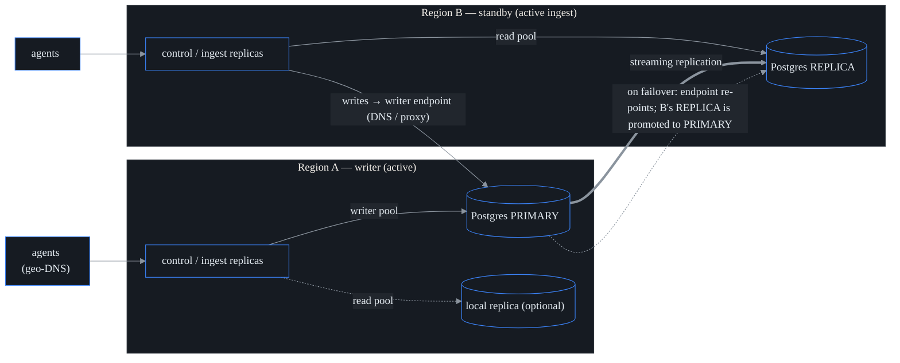

# Multi-region / active-active HA

probectl runs **active-active across regions** — but it's worth being precise
about what that phrase does and does not mean here, because it's the source of
most confusion about HA databases.

- The **control-plane tier is active everywhere**: every region runs
  interchangeable, *stateless* control-plane and ingest replicas, all serving
  traffic at the same time.
- The **database is single-writer with read replicas**: durable state is one
  PostgreSQL primary (the writer), with streaming replicas in the other regions.

That split is deliberate and it's the *honest* Postgres model. There is exactly
one writable primary at any instant — which is the correct, conflict-free design
for PostgreSQL. A multi-writer global database (the CockroachDB/Yugabyte style) is
explicitly out of scope. On failover, a standby is promoted and the writer
endpoint re-points to it; during that transition the control plane **fences
writes** so a split-brain situation can never corrupt state. (Fencing is explained
in detail below — it is the safety core of this whole design.)

**Edition note:** the *mechanics* and these docs are **core/free** — stateless
replicas are inherent to how the control plane is built, and the split-brain
fence protects any deployment, single-region or not. What's an Enterprise
entitlement (`ha_support`) is the *validated failover runbooks and support*, not
the code.

---

## Topology

- **Regional ingest:** agents connect to the nearest region (geo-DNS / their
  configured endpoint). Each region's replicas ingest locally; tenant-tagged
  data converges in the replicated stores. A region outage sheds its agents to
  the next-nearest region.
- **Writer endpoint:** a single DNS name / proxy (e.g. a managed-DB failover
  endpoint, Patroni + a VIP, or PgBouncer/HAProxy tracking the leader) that
  always resolves to the current primary. `PROBECTL_DATABASE_URL` points here.
- **Read endpoint (optional):** `PROBECTL_DATABASE_READ_URL` points at the
  local replica for read locality. Reads route there; writes always go to the
  writer endpoint. (Read-routing is opt-in per query path via `DB.ReadPool()`;
  by default reads use the writer, so nothing breaks if unset.)

## Replication model & RPO

The Postgres replication mode sets the achievable RPO. probectl behaves
identically either way — it is a deployment choice:

| Mode (`PROBECTL_REPLICATION_MODE`) | RPO | Trade-off |
|---|---|---|
| `sync` | **0** — no committed data lost on failover | higher write latency (commit waits for a standby) |
| `async` (default) | ≈ replication lag at the moment of failure | lower write latency; a small bounded data-loss window |

Replica lag is observable: `/readyz` reports `cluster.reader.lag_seconds` and
the metric `probectl_cluster_replica_lag_seconds{region=…}`. For an RPO-0
guarantee, run `sync` with at least one synchronous standby.

## Split-brain fencing (the safety core)

"Split-brain" is the nightmare of any failover system: two nodes both believe
they are the primary and both accept writes, silently diverging. probectl's
defense is an app-layer fence that refuses to write unless the target is
*provably* the current primary. The control plane probes the writer endpoint
every 5 seconds and **fails writes closed** (HTTP 503 `writer_unavailable`, with a
`Retry-After`) whenever it can't prove that — while **reads keep serving** and
**telemetry ingest never pauses**. The principle: degrade to read-only, never lose
or corrupt data.

There are two specific failure modes it catches:

1. **The writer endpoint points at a read-only standby** — a half-finished
   failover. Detected directly by `pg_is_in_recovery()` returning true.
2. **The writer endpoint points at a stale ex-primary** — an old primary that got
   partitioned off but is still in primary-role and would happily accept writes.
   This is caught by a monotonic **promotion epoch** stored in the `cluster_state`
   table. Every promotion calls the `cluster_promote(region)` function, which bumps
   the epoch, and that new epoch replicates out to the standbys. A replica that
   already follows the *new* primary carries the higher epoch — so a writer
   endpoint still pointing at the *old* primary (lower epoch) is detected as stale
   and fenced. Because the epoch is a monotonic high-water mark, a lower epoch can
   **never** reclaim the writer role.

This fence is the application-layer complement to whatever failover controller you
actually run (Patroni, a managed database, etc.): even if your endpoint briefly
resolves to the wrong node mid-flip, probectl will not write to it.

## RTO

RTO = failover detection + standby promotion + writer-endpoint repoint +
probectl re-probe (≤ one 5s cycle). The dominant terms are your Postgres
failover controller's detection + promotion times. probectl resumes writes
automatically on the next probe once the endpoint resolves to the promoted
primary — no probectl restart required.

## The RPO/RTO targets are provisional — not yet validated

RPO (how much data you can lose) and RTO (how long recovery takes) are *numeric
SLO targets*. The values below are engineering estimates recorded so the
failover gate is runnable end to end — they become committed numbers only once
validated failover runs back them. They are configurable via
`PROBECTL_RPO_SECONDS` / `PROBECTL_RTO_SECONDS` (surfaced together on `/readyz`
and in this table).

| Target | Provisional value | Determined by |
|---|---|---|
| **RPO** | `0` with `sync`; else ≈ lag (target ≤ 5 s) | replication mode + standby health |
| **RTO** | ≤ **60 s** | DB failover controller detect+promote + a 5 s probe |

## Per-region data residency

`PROBECTL_RESIDENCY` records the *default* data-residency region for the
deployment. Per-tenant residency is a property of a siloed tenant — a siloed
tenant pins its stores to a region (see [`isolation.md`](isolation.md)). The rule
to internalize: cross-region replication of a residency-restricted tenant's data
must respect that residency. So for a strict tenant, don't replicate its data
globally — use **siloed isolation** with the silo stores confined to the permitted
region.

## Operating it

- **Health/status:** `/readyz` carries the cluster view (region, writer role,
  `writes_usable`, replica lag). The node stays **ready (200) for reads** during a
  failover; `writes_usable: false` tells operators and automation that writes
  paused.
- **Metrics:** `probectl_cluster_writes_usable`, `probectl_cluster_writer_role`
  (writer=1 / reader=0 / stale=-1 / unknown=-2 — alert on `< 1`),
  `probectl_cluster_epoch`, and `probectl_cluster_replica_lag_seconds`, all
  labeled by `region`.
- **Failover:** see [`runbooks/region-failover.md`](runbooks/region-failover.md).
- **Config:** see [`configuration.md`](configuration.md) → "Multi-region / HA".

## Out of scope

A multi-writer global database (CockroachDB/Yugabyte-style); a probectl-operated
hosted SaaS; FedRAMP authorization. The control plane is region-agnostic and
stateless — scaling out a region is adding replicas.
