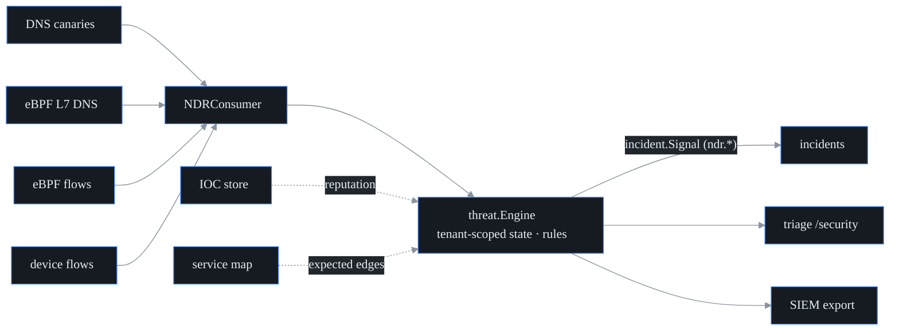

# NDR-lite detection engine

## What this is

The threat-intel layer (see [`threat-intel.md`](threat-intel.md)) catches
*known-bad* things by name. This engine catches *suspicious-looking behavior* — patterns that look
like an attack even when no name is on a list yet. That is the "NDR" idea:
**Network Detection and Response**, the behavioral half of threat detection.
If threat-intel is a guard holding a wanted list, this engine is the guard who
knows everyone's *habits* — it can't name the intruder, but it knows nobody in
this building walks the halls at 3 a.m. checking every door handle.

probectl's version is **NDR-lite**: it runs behavioral detectors over telemetry
the platform **already collects** — DNS lookups (from synthetic DNS canaries and
eBPF L7), flow records (device flows and eBPF flows), TLS posture, threat-intel,
and the topology service map — and turns suspicious patterns into
**confidence-scored signals** that flow into incidents, the triage surface, and
the SIEM.

It lives in `internal/threat/` — the engine in `ndr.go`, the rule model in
`rules.go`, the default ruleset in `rules/ndr-default.yaml`.

### The one rule that shapes everything: signals, never blocks

Like threat-intel, this engine is **never an IPS** — detection is a signal,
never an enforcement action, one of probectl's
[non-negotiables](../CONTRIBUTING.md#non-negotiables). (An **IPS** — intrusion
*prevention* system — sits inline and drops traffic it dislikes.) probectl
does not block traffic, terminate connections, or act inline. The engine emits
`incident.Signal` values and nothing else — there is literally no enforcement
code path in the package. A behavioral detector firing on a public network will
sometimes be wrong, and a tool that auto-blocks on "looks weird" is a tool that
takes down production. So probectl flags; a human decides.

## Status: on by default

The engine ships **on** (`PROBECTL_NDR_ENABLED` defaults to `true`; set it to
`false` to turn it off). Unlike threat-intel, it is safe to run by default
because it makes **no outbound calls** — it only processes telemetry probectl
already gathered locally (sovereignty-safe). Threat-intel enrichment, which
*does* reach out to feeds, stays a separate opt-in.

## The detectors

Each detector watches for one shape of bad behavior. All thresholds are
tunable per the rule model (no code change required). Two terms recur:
**C2** (command-and-control — the attacker's server that compromised hosts
report to) and **exfiltration** (smuggling data out of the network).

| Kind | Behavior detected | Key tunables |
|---|---|---|
| `dns_dga` | many distinct high-entropy ("algorithmically generated") lookups from one source | `min_names`, `entropy`, `ratio`, `window_s` |
| `dns_exfil` | high unique-subdomain volume under one domain (payload smuggled in query names) | `min_queries`, `qname_bytes`, `unique_ratio`, `window_s` |
| `beaconing` | metronome-regular callbacks to one dst:port (a C2 heartbeat); confidence rises with regularity and with the destination's threat-intel reputation | `min_samples`, `max_jitter`, `min_interval_s`, `max_interval_s` |
| `egress_volume` | egress bytes far above the source's own moving-average baseline | `min_samples`, `spike_factor`, `min_bytes` |
| `egress_intel` | egress to Tor exits / IOC-listed hosts / configured bad ASNs | `min_confidence`, `lists.bad_asns` |
| `lateral` | east-west fan-out on service ports; **topology-known service relationships are excluded** | `fanout`, `window_s`, `lists.ports` |

A few of these reward a closer look at the mechanism:

- **`beaconing`** measures *jitter* — the coefficient of variation
  (stddev ÷ mean) of the gaps between callbacks (`intervalStats` in `ndr.go`).
  Malware phoning home tends to be suspiciously regular; a human browsing is
  not. Low jitter plus a known-bad destination is a strong signal.
- **`dns_dga`** scores the **Shannon entropy** of the first DNS label —
  entropy measures how random a string is, in bits per character. Random
  strings like `x7f3q9zk.example` carry more bits-per-character than real words
  (and the engine only counts labels at least 10 characters long), which is the
  fingerprint of domain-generation-algorithm malware — a **DGA** invents
  thousands of throwaway rendezvous names so defenders can't blocklist one.
- **`egress_volume`** compares a flow against the source's own **EWMA**
  (exponentially-weighted moving average — a running average that weights
  recent samples more) baseline, and crucially updates that baseline *after*
  judging, so a spike can never quietly raise its own bar. Each host gets a
  personal speed limit derived from its own history, not a fleet-wide one.
- **`lateral`** watches **east-west** traffic — host-to-host inside the
  network, as opposed to north-south traffic in and out of it — and excludes
  destinations that the topology service map already knows are normal
  neighbors, so expected service-to-service traffic does not read as an
  attacker spreading sideways.

## False-positive management is the product

The hard part of NDR is *not* detecting things — it is detecting them without
drowning the analyst. Every layer here is tunable without touching code:

1. **Cold-start guards** — a detector will not judge until it has a minimum
   number of samples/names; an empty baseline never fires. (In `observeDGA`,
   for instance, a window with fewer than `min_names` distinct names is skipped
   outright.)
2. **Confidence scoring** — each detection carries `detector.confidence`
   (the rule's base, plus evidence strength, plus a threat-intel boost) and the
   evidence itself (`beacon.jitter`, `dns.generated_ratio`, `egress.ratio`, …)
   so the analyst sees *why* it fired.
3. **Suppression** — a per-`(rule, tenant, entity)` re-fire window
   (`suppress`): once an entity trips a rule, it stays quiet until the window
   passes, so a persisting behavior re-raises *occasionally*, not on every
   single observation. A snooze, not a dismissal — the behavior is still
   watched, it just stops paging.
4. **Detection-as-code** — rules are Sigma-style versioned YAML (Sigma is the
   SOC convention of writing detections as declarative, shareable rule files).
   Override any rule by ID (including `enabled: false` to switch one off) or
   add new ones.

## Detection-as-code

The embedded default ruleset lives at `internal/threat/rules/ndr-default.yaml`
and ships with the binary (the engine works out of the box). Operators overlay
it by pointing `PROBECTL_NDR_RULES_DIR` at a directory of `*.yaml`/`*.yml`
files. A rule in your directory with the **same `id`** as a default
**replaces** that default; a new `id` **adds** a detector:

```yaml
# /etc/probectl/ndr/tuning.yaml
rules:
  - id: ndr-beaconing-default     # same id → REPLACES the default
    version: 2                    # bump on every change
    kind: beaconing
    name: Periodic beaconing (tuned)
    severity: warning
    base_confidence: 45
    suppress: 4h
    thresholds: { min_samples: 12, max_jitter: 0.08, min_interval_s: 10, max_interval_s: 3600 }
  - id: ndr-egress-intel-default
    version: 2
    kind: egress_intel
    name: Egress to hostile infrastructure
    severity: critical
    base_confidence: 60
    suppress: 30m
    lists: { bad_asns: ["64496"] }
```

A malformed rules directory **fails startup** (fail closed — tuning the
operator believes is live must actually be live, not silently dropped). Rules
are validated in `validateRules`: non-empty unique IDs, a known `kind`,
`version >= 1`, `severity` in `{info, warning, critical}`,
`base_confidence` in `0..100`, and a non-negative `suppress`. Two rules
sharing one ID *in a single file* is treated as an operator mistake and
rejected, not guessed at — silently picking one would mean some tuning the
operator wrote is not in force.

## Pipeline



Every observation and every piece of detector state is **partitioned by
tenant** (`tenantState` in `ndr.go`); a record without a `tenant_id` is dropped
at the boundary, so one tenant's entities can never influence another's
detections (tenant isolation is the outermost boundary — see
[`security/tenant-isolation.md`](security/tenant-isolation.md)). State is
**bounded** — per-tenant entity maps
cap out and evict the stalest entry, and windows are fixed-size rings — so a
cardinality flood cannot exhaust memory. The whole engine is rebuildable from
the stream; nothing here is the durable record.

The threat-intel store and the topology map are **optional** context: a `nil`
intel source or topology source simply disables the respective boost/exclusion
(graceful degradation), it never errors.

## Configuration

| Variable | Default | Purpose |
|---|---|---|
| `PROBECTL_NDR_ENABLED` | `true` | the engine + consumers (local-only processing) |
| `PROBECTL_NDR_RULES_DIR` | (none) | detection-as-code overlay directory (`*.yaml`/`*.yml`) |

Detections surface as `ndr.<kind>` threat-plane signals in three places: the
**Security** triage view (`/security`) with rule/confidence/evidence
provenance, the incident timeline, and the SIEM export. They share the
detection store with threat-intel matches, because both are recognized by one
signal recognizer (see [`threat-intel.md`](threat-intel.md)).
