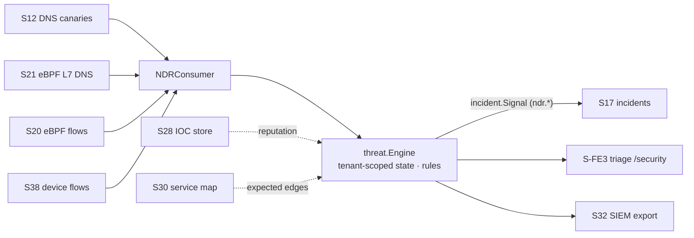

# NDR-lite detection engine (S42, F37)

probectl's behavioral threat detection runs over the substrate the platform
already collects — DNS lookups (S12 canaries + S21 eBPF L7), flow records
(S38), eBPF flows (S20), TLS posture (S27), threat-intel (S28), and the
topology service map (S30). It is **NDR-lite by design**: confidence-scored
**signals** into incidents, the triage surface, and the SIEM — **never an
IPS** (CLAUDE.md §7 guardrail 9: probectl does not block traffic, terminate
connections, or act inline).

It is ON by default (`PROBECTL_NDR_ENABLED=false` turns it off): it makes no
outbound calls and processes only locally-collected telemetry
(sovereignty-safe). Threat-intel enrichment stays a separate opt-in (S28).

## The detectors

| Kind | Behavior detected | Key tunables |
|---|---|---|
| `dns_dga` | many distinct high-entropy ("generated") lookups from one source | `min_names`, `entropy`, `ratio`, `window_s` |
| `dns_exfil` | high unique-subdomain volume under one domain (payload in qnames) | `min_queries`, `qname_bytes`, `unique_ratio`, `window_s` |
| `beaconing` | metronome-regular callbacks to one dst:port (C2 heartbeat); confidence rises with regularity and the destination's intel reputation | `min_samples`, `max_jitter`, `min_interval_s`, `max_interval_s` |
| `egress_volume` | egress bytes far above the source's own EWMA baseline | `min_samples`, `spike_factor`, `min_bytes` |
| `egress_intel` | egress to Tor exits / IOC-listed hosts / configured bad ASNs | `min_confidence`, `lists.bad_asns` |
| `lateral` | east-west fan-out on service ports; **topology-known service relationships are excluded** | `fanout`, `window_s`, `lists.ports` |

## False-positive management (first-class)

The S42 make-or-break. Every layer is tunable without code:

1. **Cold-start guards** — minimum sample/name counts before a detector may
   judge; an empty baseline never fires.
2. **Confidence scoring** — each detection carries `detector.confidence`
   (rule base + evidence strength + intel boost) and the evidence itself
   (`beacon.jitter`, `dns.generated_ratio`, `egress.ratio`, …) so the analyst
   sees *why* it fired.
3. **Suppression** — per `(rule, tenant, entity)` re-fire window (`suppress`);
   a persisting behavior re-raises after the window, not every observation.
4. **Detection-as-code** — Sigma-style versioned YAML; override any rule by ID
   (including `enabled: false`) or add new ones.

## Detection-as-code

The embedded default ruleset lives at `internal/threat/rules/ndr-default.yaml`.
Operators overlay it from `PROBECTL_NDR_RULES_DIR`:

```yaml
# /etc/probectl/ndr/tuning.yaml
rules:
  - id: ndr-beaconing-default     # same id → REPLACES the default
    version: 2                    # bump on every change
    kind: beaconing
    name: Periodic beaconing (tuned)
    severity: warning
    base_confidence: 45
    suppress: 4h
    thresholds: { min_samples: 12, max_jitter: 0.08, min_interval_s: 10, max_interval_s: 3600 }
  - id: ndr-egress-intel-default
    version: 2
    kind: egress_intel
    name: Egress to hostile infrastructure
    severity: critical
    base_confidence: 60
    suppress: 30m
    lists: { bad_asns: ["64496"] }
```

A malformed rules directory **fails startup** (fail closed — tuning the
operator believes is live must actually be live). Rules are validated:
unique IDs, known kinds, `version >= 1`, sane severity/confidence.

## Pipeline



Every observation and every piece of detector state is tenant-partitioned
(guardrail 1); records without a `tenant_id` are dropped at the boundary.
State is bounded (per-tenant entity caps, stalest evicted; capped windows) and
rebuildable from the stream.

## Configuration

| Variable | Default | Purpose |
|---|---|---|
| `PROBECTL_NDR_ENABLED` | `true` | the engine + consumers (local-only processing) |
| `PROBECTL_NDR_RULES_DIR` | (none) | detection-as-code overlay directory (`*.yaml`/`*.yml`) |

Detections surface as `ndr.<kind>` threat-plane signals: in the **Security**
triage view (S-FE3) with rule/confidence/evidence provenance, on the incident
timeline (S17), and in the SIEM export (S32).
