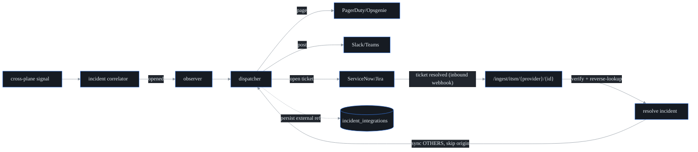

# On-call + ITSM integration

**What this is.** probectl correlates faults into incidents — but the team's
*workflow* lives in the tools they already run: PagerDuty/Opsgenie for paging,
Slack/Teams for chat, ServiceNow/Jira for tickets. This feature mirrors a probectl
incident into those tools: it **pages on-call**, **posts to chat**, and **opens +
bidirectionally syncs tickets**.

Two boundaries to keep in mind. First, probectl stays the **system of record** for
the incident; these connectors are a thin, best-effort *mirror*. Second, a
connector only ever pages or posts or opens a ticket — it never auto-blocks or
auto-remediates. (Notification is confidence in the incident, not control over the
network.) The code is in `internal/notify`, wired from `internal/control/notify.go`.

**Off by default.** A connector is an *outbound* connection to the operator's
tooling, so the whole feature stays off unless `PROBECTL_NOTIFY_CONNECTORS` is set
(sovereignty / no surprise egress).

## Connectors

| Provider | Capability | On open | On resolve | Inbound (status-sync back) |
| -------- | ---------- | ------- | ---------- | -------------------------- |
| **PagerDuty** | page | Events API v2 `trigger` (dedup key `probectl-<id>`) | `resolve` (same dedup key) | resolve/ack via the portable contract |
| **Opsgenie** | page | Alerts API create (alias `probectl-<id>`) | close-by-alias | resolve/ack via the portable contract |
| **Slack** | chat | post "incident opened" | post "incident resolved" | — |
| **Teams** | chat | post "incident opened" | post "incident resolved" | — |
| **ServiceNow** | ticket | create incident (Table API) | set state Resolved (state `6`) | native Business-Rule POST, or the portable contract |
| **Jira** | ticket | create issue (REST v2) | transition to Done (default transition `31`) | native issue webhook, or the portable contract |

Routing is **per-tenant**: a connector is registered against one tenant id and
only ever fires for incidents of that tenant.

## Lifecycle + mapping



- **Open** — when a signal opens a *new* incident, the correlator's observer calls
  the dispatcher, which pages / posts / opens-a-ticket on each of the tenant's
  connectors and records the external reference (ticket id / page dedup key) in
  `incident_integrations`. A correlated *follow-up* signal does **not** re-page.
- **Resolve (outbound)** — resolving an incident (via the API, or an inbound
  webhook) syncs the resolution to every linked connector.
- **Resolve (inbound)** — an ITSM / on-call system posts to
  `POST /ingest/itsm/{provider}/{id}`; probectl verifies the delivery, maps the
  external ref back to the incident, resolves it, and syncs the *other* systems.

## Idempotency

Ticket creation and paging are **idempotent**. A `UNIQUE (tenant, incident,
connector)` link row means an incident is opened at most once per connector, so a
delivery retry or a control-plane restart never double-pages or duplicates a
ticket — the dispatcher checks for an existing link before opening. Pager
connectors additionally pass a stable `dedup_key` / `alias` derived from the
incident id (`probectl-<id>`), so even a duplicate trigger coalesces server-side.

## Bidirectional sync + loop protection

The tricky case: an on-call engineer closes the ServiceNow ticket. probectl
resolves the incident and syncs that resolution to the *other* connectors — but
**never echoes it back to its origin** (the ServiceNow ticket is already closed;
re-closing it could ping-pong forever between two systems). The dispatch carries
the origin as its `source`, and the dispatcher skips that connector when fanning
out — while still marking the origin's link `resolved` so the mirror stays
accurate (`Dispatcher.Resolved(..., source)`). A duplicate inbound webhook for an
already-resolved incident is a no-op.

## Inbound contract + security

`POST /ingest/itsm/{provider}/{id}` is an ingest surface (mounted off `/v1`, like
the change webhook). It authenticates **each delivery**, not a session:

- Include `X-Probectl-Signature: sha256=<hmac-of-body-under-secret>` **or**
  `X-Probectl-Token: <secret>` (constant-time compared). An unsigned, forged, or
  wrong-token delivery is rejected with `401` **before any state change** (fail
  closed). Verification routes through `internal/crypto` (`crypto.Verify` /
  `crypto.ConstantTimeEqual`).
- The delivery is **bound to the credential's tenant** (`id` → tenant), never a
  value from the payload — so one tenant can never resolve another's incident,
  even with the same external ref (RLS + a tenant-scoped reverse lookup).
- The body is treated as untrusted and is size-limited (1 MiB).

probectl understands ServiceNow (`{"sys_id","state"}`, state `6`/`7` = resolved)
and Jira (`statusCategory.key == "done"`) shapes natively; **every** provider
(including PagerDuty / Opsgenie) also supports the portable contract:

```json
{ "external_ref": "probectl-<incident-id>", "status": "resolved" }
```

Outbound delivery uses the hardened, certificate-validating HTTP client (TLS is
never disabled); the provider credential is sent only as an auth header and is
never logged.

## Configuration

See [`configuration.md`](configuration.md#on-call--itsm-integration) for the
key reference. Example (a tenant paging PagerDuty + ticketing Jira, with inbound
sync from Jira):

```
PROBECTL_NOTIFY_CONNECTORS=00000000-0000-0000-0000-000000000001|pagerduty|https://events.pagerduty.com/v2/enqueue|<routing-key>,00000000-0000-0000-0000-000000000001|jira|https://acme.atlassian.net/rest/api/2/issue?project=OPS&resolve_transition=31|alice@acme.com:<api-token>
PROBECTL_NOTIFY_INBOUND=jira1:00000000-0000-0000-0000-000000000001:jira:<webhook-secret>
```

## Out of scope

probectl is **not** a SIEM (see [`siem.md`](siem.md)) and **not** a CMDB; it does
not own on-call schedules or escalation policies (those stay in PagerDuty /
Opsgenie). Connectors mirror the incident outward — there is no auto-remediation
here.
