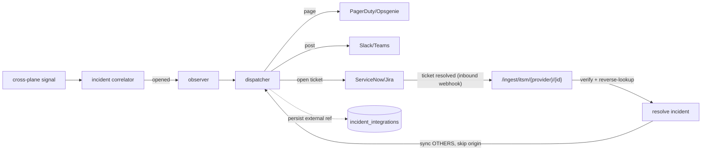

# On-call + ITSM integration (S33 · F27)

netctl mirrors its incidents into the operational tooling a team already runs:
it **pages on-call**, **posts to chat**, and **opens + bidirectionally syncs
tickets**. netctl stays the system of record for the incident — these connectors
are a thin, best-effort mirror, and netctl never auto-blocks or auto-remediates.

Off by default. A connector is an **outbound connection** to the operator's
tooling, so the feature is OFF unless `NETCTL_NOTIFY_CONNECTORS` is set.

## Connectors

| Provider | Capability | On open | On resolve | Inbound (status-sync back) |
| -------- | ---------- | ------- | ---------- | -------------------------- |
| **PagerDuty** | page | Events API `trigger` (dedup key `netctl-<id>`) | `resolve` (same dedup key) | resolve/ack via the portable contract |
| **Opsgenie** | page | Alerts API create (alias `netctl-<id>`) | close-by-alias | resolve/ack via the portable contract |
| **Slack** | chat | post "incident opened" | post "incident resolved" | — |
| **Teams** | chat | post "incident opened" | post "incident resolved" | — |
| **ServiceNow** | ticket | create incident (Table API) | set state Resolved | native Business-Rule POST, or portable contract |
| **Jira** | ticket | create issue (REST v2) | transition to Done | native issue webhook, or portable contract |

Routing is **per-tenant**: a connector only ever fires for incidents of its own
tenant.

## Lifecycle + mapping



- **Open** — when a signal opens a *new* incident, the correlator's observer calls
  the dispatcher, which pages/posts/opens-a-ticket on each of the tenant's
  connectors and records the external reference (ticket id / page dedup key) in
  `incident_integrations`. A correlated *follow-up* signal does not re-page.
- **Resolve (outbound)** — resolving an incident (via the API, or an inbound
  webhook) syncs the resolution to every linked connector.
- **Resolve (inbound)** — an ITSM/on-call system posts to
  `POST /ingest/itsm/{provider}/{id}`; netctl verifies the delivery, maps the
  external ref back to the incident, resolves it, and syncs the *other* systems.

## Idempotency

Ticket creation and paging are **idempotent**. A `UNIQUE (tenant, incident,
connector)` link row means an incident is opened at most once per connector, so a
delivery retry or a control-plane restart never double-pages or duplicates a
ticket. Pager connectors additionally pass a stable `dedup_key`/`alias` derived
from the incident id, so even a duplicate trigger coalesces server-side.

## Bidirectional sync + loop protection

When a resolution **arrives from one system** (e.g. an on-call engineer closes the
ServiceNow ticket), netctl resolves the incident and syncs the resolution to the
*other* connectors — but **never echoes it back to its origin**. The dispatch
carries the origin as its source; the originating connector is skipped (its link is
still marked resolved so the mirror stays accurate). This prevents two systems from
ping-ponging an incident forever. A duplicate inbound webhook for an
already-resolved incident is a no-op.

## Inbound contract + security

`POST /ingest/itsm/{provider}/{id}` is an ingest surface (mounted off `/v1`, like
the change webhook). It authenticates **each delivery** rather than a session:

- Include `X-Netctl-Signature: sha256=<hmac-of-body-under-secret>` **or**
  `X-Netctl-Token: <secret>` (constant-time compared). An unsigned, forged, or
  wrong-token delivery is rejected with `401` **before any state change**
  (fail closed).
- The delivery is **bound to the credential's tenant** (`id` → tenant), never a
  value from the payload — one tenant can never resolve another's incident, even
  with the same external ref (RLS + tenant-scoped reverse lookup).
- The body is treated as untrusted and size-limited.

netctl understands ServiceNow (`{"sys_id","state"}`, state 6/7 = resolved) and Jira
(`statusCategory.key == "done"`) shapes natively; **every** provider (including
PagerDuty/Opsgenie) also supports the portable contract:

```json
{ "external_ref": "netctl-<incident-id>", "status": "resolved" }
```

Outbound delivery uses the hardened, certificate-validating HTTP client (TLS is
never disabled); the provider credential is sent only as an auth header and is
never logged.

## Configuration

See [`configuration.md`](configuration.md#on-call--itsm-integration-s33) for the
key reference. Example (a tenant paging PagerDuty + ticketing Jira, with inbound
sync from Jira):

```
NETCTL_NOTIFY_CONNECTORS=00000000-0000-0000-0000-000000000001|pagerduty|https://events.pagerduty.com/v2/enqueue|<routing-key>,00000000-0000-0000-0000-000000000001|jira|https://acme.atlassian.net/rest/api/2/issue?project=OPS&resolve_transition=31|alice@acme.com:<api-token>
NETCTL_NOTIFY_INBOUND=jira1:00000000-0000-0000-0000-000000000001:jira:<webhook-secret>
```

## Out of scope

netctl is **not** a SIEM ([S32](siem.md)) and **not** a CMDB (S40); it does not
own on-call schedules or escalation policies (those live in PagerDuty/Opsgenie).
Connectors are confidence in the incident, not control over the network — there is
no auto-remediation here.
