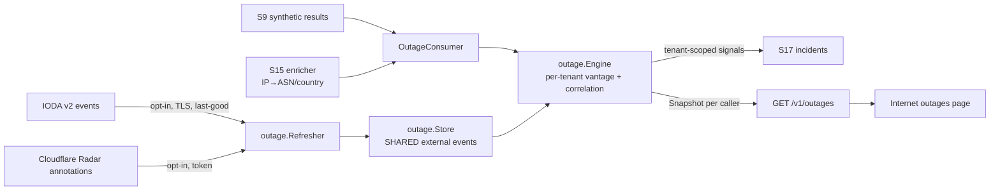

# Collective internet-outage view (S47a, F19)

probectl answers "is it us, or is the internet broken?" by joining two
things it can honestly know:

1. **Public outage signals** — IODA (Georgia Tech) and the Cloudflare Radar
   outage annotations, fetched **opt-in**, ingested **once** (shared, never
   tenant-owned), cached with last-good kept on failure.
2. **Your own vantage points** — the synthetic-result stream your agents
   already produce. When several distinct targets inside one external scope
   (an ISP's ASN, a country) start failing together, that is a
   **vantage-detected outage**; when a failing test sits inside an active
   external event's scope, that is a **correlation** ("your checkout test is
   failing because AS64500 is melting").

The honesty contract (the S47a watch-out):

> **Coverage = your vantage points + public open data.** probectl does not
> operate a global probe fleet and never pretends to. Every response carries
> coverage notes; degraded modes (feeds off, enrichment off) are stated, not
> papered over.

## The outage-signal model (the contract)

One normalized `Event` for every source:

| Field | Meaning |
|---|---|
| `source` | `ioda` \| `cloudflare_radar` \| `vantage` |
| `scope` | the join key: `{kind: asn\|country\|region, code, name}` (e.g. `AS15169`, `BR`) |
| `severity` / `confidence` | documented heuristics from source scores — not vendor-calibrated probabilities |
| `start` / `end` | event window; empty `end` = ongoing |
| `evidence_url` | deep link into IODA / the Radar outage center |

External events are **shared** (public data). Everything derived from
customer telemetry — vantage events, `affected_tests` — is **tenant-scoped**
and computed per caller (guardrail 1).

## Detection + correlation semantics

- **Vantage detection** (per tenant, per scope, 15 min window): fires when
  ≥2 **distinct** targets are failing (≥50% failure rate each over ≥2
  samples) and they are ≥50% of the scope's observed targets. Latched per
  episode; clears on recovery and re-arms. One target failing alone is never
  an outage — that is what alerts (S16) are for.
- **Correlation**: a failing result whose peer resolves into the scope of an
  active external event raises `outage.external_correlated` — once per
  (tenant, event), with the affected test as evidence.
- Both are **signals** into the incident pipeline (plane `outage`, severity
  warning) — situational awareness, never a pager storm, never an action
  (guardrail 9).

Scope resolution (peer IP → ASN/country) rides the S15 open-data enricher
(`PROBECTL_FLOW_ENRICH_ASN`). Without it the external view still renders and
the response says plainly that vantage detection + correlation are off.

## Feeds, AUP, sovereignty

`PROBECTL_OUTAGE_FEEDS_ENABLED=false` by default: enabling it makes outbound
fetches (no-phone-home, guardrail 2). Fetches are hardened-TLS, bodies are
untrusted input with size caps, and a down/rate-limited feed keeps its
last-good events (guardrails 10, 12). Per-feed AUP/provenance is tracked and
served (relevant to MSP resale):

| Feed | License / terms | Commercial use |
|---|---|---|
| `ioda` | IODA data-usage terms (academic project; attribution: "IODA, Georgia Institute of Technology") | unknown — confirm before resale |
| `cloudflare_radar` | CC BY-NC 4.0 (attribution: "Cloudflare Radar"); API token required | **restricted** (non-commercial) |

## Configuration

| Variable | Default | Purpose |
|---|---|---|
| `PROBECTL_OUTAGE_ENABLED` | `true` | the local engine (vantage detection + correlation; no outbound calls) |
| `PROBECTL_OUTAGE_FEEDS_ENABLED` | `false` | **opt-in** public feeds (outbound fetches) |
| `PROBECTL_OUTAGE_FEEDS` | (all) | which feeds to load: `ioda`, `cloudflare_radar` |
| `PROBECTL_OUTAGE_REFRESH` | `10m` | feed refresh cadence |
| `PROBECTL_OUTAGE_RETENTION` | `48h` | event window kept/queried |
| `PROBECTL_OUTAGE_RADAR_TOKEN` | (none) | Cloudflare API token (secret-ref resolvable); radar is omitted without it |

Out of scope by design: owning a global probe/BGP fleet (PRD won't-have) —
the view leans on your vantages + open data, and says so.
