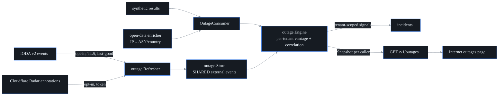

# Collective internet-outage view

**What this is.** The feature that answers "is it us, or is the internet broken?"
When a test starts failing, the operator needs to know whether the fault is inside
their network or out in some ISP / region they don't control. probectl answers
that by joining two things it can *honestly* know — and being explicit about the
limits of both. It lives in `internal/outage`, surfaced at `GET /v1/outages`.

The two inputs:

1. **Public outage signals** — IODA (Georgia Tech) and the Cloudflare Radar outage
   annotations. These are fetched **opt-in**, ingested **once** (shared across all
   tenants, never tenant-owned data), and cached so a feed failure keeps the
   last-good events instead of going blank.
2. **Your own vantage points** — the synthetic-result stream your agents already
   produce. When several *distinct* targets inside one external scope (an ISP's
   ASN, a country) start failing together, that is a **vantage-detected outage**.
   When one of your failing tests sits inside the scope of an *active external
   event*, that is a **correlation** ("your checkout test is failing because
   AS64500 is melting").

The honesty contract — the thing that keeps this feature truthful:

> **Coverage = your vantage points + public open data.** probectl does not operate
> a global probe fleet and never pretends to. Every response carries coverage
> notes; degraded modes (feeds off, enrichment off) are stated plainly, not papered
> over.

That is why the API always returns `scope_resolution` and emits notes like "IP→ASN
enrichment is off — vantage detection and impact correlation are unavailable": a
view built on partial data must say so.

## The outage-signal model (the contract)

One normalized `Event` for every source:

| Field | Meaning |
|---|---|
| `source` | `ioda` \| `cloudflare_radar` \| `vantage` |
| `scope` | the join key: `{kind: asn\|country\|region, code, name}` (e.g. `AS15169`, `BR`) |
| `severity` / `confidence` | documented heuristics derived from source scores — not vendor-calibrated probabilities |
| `start` / `end` | event window; empty `end` = ongoing |
| `evidence_url` | deep link into IODA / the Radar outage center |

External events are **shared** (public data). Everything derived from customer
telemetry — vantage events, `affected_tests` — is **tenant-scoped** and computed
per caller: tenant isolation is the outermost boundary (a project
[non-negotiable](../CONTRIBUTING.md#non-negotiables)). The engine partitions all
customer-derived state by tenant, and a tenant's `Snapshot` can reach nothing
from any other tenant.

## Detection + correlation semantics

The thresholds are deliberately conservative — internet weather is *situational
awareness*, not a pager. (All values live in `engine.go`.)

- **Vantage detection** (per tenant, per scope, 15-minute window): fires when
  **≥2 distinct** targets in the scope are failing (each ≥50% failure rate over
  ≥2 samples) *and* those failing targets are ≥50% of the scope's observed
  targets. The episode is latched (it won't re-fire while live), clears on
  recovery (failing ratio drops below 25%), and then re-arms. One target failing
  alone is **never** an outage — that case is what ordinary alerting is for.
- **Correlation**: a failing result whose peer IP resolves into the scope of an
  active external event raises `outage.external_correlated` — once per
  `(tenant, event)`, carrying the affected test as evidence.

Both are **signals** into the incident pipeline (plane `outage`, severity
`warning`) — situational awareness, never a pager storm, and never an automated
action: detection is a signal, not an IPS, so probectl never blocks traffic on
the back of one.

Scope resolution (peer IP → ASN / country) rides the open-data enricher, gated by
`PROBECTL_FLOW_ENRICH_ASN`. Without it the external view still renders, and the
response says plainly that vantage detection and correlation are off.

## Feeds, AUP, sovereignty

`PROBECTL_OUTAGE_FEEDS_ENABLED=false` by default: turning it on is what makes the
outbound fetches, so the no-phone-home default holds. Fetches use a hardened,
certificate-validating TLS client; fetched bodies are untrusted input with size
caps; and a down or rate-limited feed keeps its last-good events rather than
breaking the view. Per-feed AUP / provenance is tracked and served, which matters
for MSP resale:

| Feed | License / terms | Commercial use |
|---|---|---|
| `ioda` | IODA data-usage terms (academic project; attribution: "IODA, Georgia Institute of Technology") | unknown — confirm before resale |
| `cloudflare_radar` | CC BY-NC 4.0 (attribution: "Cloudflare Radar"); API token required | **restricted** (non-commercial) |

## Configuration

| Variable | Default | Purpose |
|---|---|---|
| `PROBECTL_OUTAGE_ENABLED` | `true` | the local engine (vantage detection + correlation; no outbound calls) |
| `PROBECTL_OUTAGE_FEEDS_ENABLED` | `false` | **opt-in** public feeds (outbound fetches) |
| `PROBECTL_OUTAGE_FEEDS` | (all) | which feeds to load: `ioda`, `cloudflare_radar` |
| `PROBECTL_OUTAGE_REFRESH` | `10m` | feed refresh cadence |
| `PROBECTL_OUTAGE_RETENTION` | `48h` | event window kept / queried |
| `PROBECTL_OUTAGE_RADAR_TOKEN` | (none) | Cloudflare API token (secret-ref resolvable); Radar is omitted without it |

`GET /v1/outages` requires the `metrics.read` permission (it reads the synthetic /
metrics plane).

Out of scope by design: owning a global probe / BGP fleet. The view leans on your
vantages plus open data — and says so.
