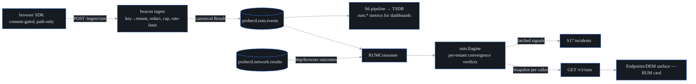

# RUM convergence (S47b, F20)

probectl's real-user monitoring exists for ONE question: **when something
breaks, are real users actually affected?** Synthetic tests answer "can a
robot reach it"; RUM answers "are humans hurting". The convergence verdict
joins both, per (app, host):

| Verdict | Meaning |
|---|---|
| `healthy` | neither plane degraded |
| `user_impact_confirmed` | synthetics AND real users degraded — the page-worthy case |
| `synthetic_only_no_user_impact` | synthetics red, users fine — a canary, not a crisis (wording deliberate: *no user impact **observed***) |
| `user_only_synthetic_blind` | users degraded, synthetics green — your synthetic coverage has a blind spot |

Verdict transitions raise warning signals into incidents (plane `rum`):
`rum.user_impact_correlated` and `rum.user_impact_unseen_by_synthetics` —
latched per episode, re-armed on recovery. Healthy and synthetic-only states
never page from the RUM plane (alerting/SLOs own those stories).

## The beacon contract (schema v1)

`POST /ingest/rum` — mounted OUTSIDE the session-authenticated API (the
change-webhook model): each beacon authenticates itself with its **app key**
and is bound to the KEY's configured tenant, never the payload's. The key is
an identifier, not a secret (it ships in page source, like every RUM
product's site key) — it scopes and rate-limits; it grants no read access.

```json
{"v": 1, "key": "pk_storefront", "consent": true,
 "host": "web.acme.example", "page": "/checkout/12345",
 "browser": "chrome",
 "vitals": {"ttfb_ms": 120, "fcp_ms": 900, "lcp_ms": 1800, "cls": 0.02, "inp_ms": 180, "load_ms": 2400},
 "errors": 0, "failed_requests": 0, "sdk": "0.1.0"}
```

`host` is the synthetic↔RUM join key (synthetic http/browser tests against
the same host complete the convergence). Vitals follow web-vitals naming;
attributes are stored under OTel semconv names where one exists (`url.path`,
`browser.name`). Beacons normalize into the **canonical result schema**
(`canary_type: "rum"`) on `probectl.rum.events` — so RUM rides the existing
pipeline into the TSDB (Grafana dashboards get `rum.*` metrics for free).

## Privacy (the watch-out — enforced server-side, fail closed)

The SDK minimizes; the **server enforces** (the trust boundary is the
server, and it assumes a hostile client):

- **No consent → rejected.** `consent: true` must be explicit.
- **Unknown fields → rejected.** The strict decoder refuses any payload
  carrying fields outside the schema — a beacon smuggling `user_id`,
  `email`, or `ip` never ingests, structurally.
- **URLs re-redacted server-side**: query strings + fragments stripped,
  volatile path segments (numbers, UUIDs, long hex) collapsed to `:id` —
  privacy and bounded page-group cardinality in one pass.
- **No IP, no user agent stored** — the schema has no place to put them;
  `browser` is family-level only (chrome/firefox/safari/edge/other).
- **Client clocks untrusted** — the stored timestamp is the server's.
- Rejection counters (`rejected_no_consent`, …) are served at `/v1/rum` so
  the operator SEES what is being dropped — and the coverage note states the
  inverse honestly: *absence of RUM data is not proof of health* (opted-out
  users and uninstrumented apps are invisible).

The browser SDK (`web/public/probectl-rum.js`, < 2 KiB) sends nothing until
your consent hook calls `window.probectlRUM.consent()`, honors DNT/GPC by
never arming, uses passive PerformanceObservers + one `sendBeacon` on
pagehide (no performance tax), and transmits the page **path only**.

```html
<script src="https://probectl.example/probectl-rum.js"
        data-key="pk_storefront"
        data-endpoint="https://probectl.example/ingest/rum" defer></script>
<script>
  // after your consent banner accepts:
  window.probectlRUM.consent()
</script>
```

## Ingest hardening (guardrail 12)

App-key auth (unknown key → 401, attributed rejection counters per tenant),
16 KiB size cap (413), per-key token-bucket rate limit (429 + Retry-After),
strict untrusted-input parsing, CORS wildcard on this write-only,
credential-less endpoint only (browsers post cross-origin; `text/plain`
sendBeacon avoids preflights, OPTIONS answers the rest).

## Degradation semantics

RUM is called degraded only with **≥20 views in the 15m window** AND (error
rate ≥10% OR p75 LCP ≥4000ms — the web-vitals "poor" line). A trickle of
views is never called an outage. Synthetic degraded = ≥50% failures over ≥2
samples for the host (web-facing types: http/https/browser).



## Configuration

| Variable | Default | Purpose |
|---|---|---|
| `PROBECTL_RUM_ENABLED` | `false` | the beacon ingest + convergence engine (an inbound surface — opt-in) |
| `PROBECTL_RUM_APPS` | (none) | app-key registry: `pk_key1=tenant/app,pk_key2=tenant2/app2` (enabled-but-empty fails startup) |
| `PROBECTL_RUM_RATE_PER_MIN` | `300` | per-key beacon rate limit (0 = unlimited) |

Out of scope by design (PRD): full APM — no traces, no session replay, no
user journeys. RUM here is page-level vitals + errors, converged with
synthetics.
