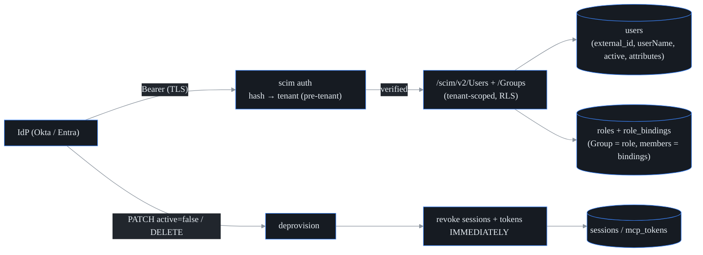
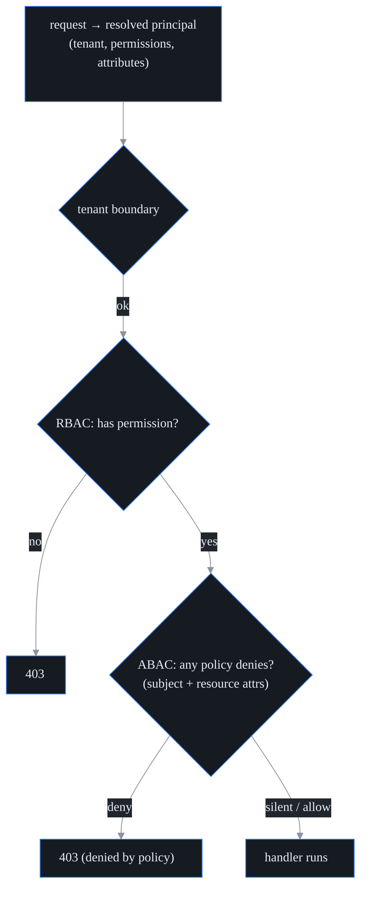

# Enterprise identity: SCIM 2.0 + ABAC + directory integration

probectl extends the SSO/RBAC foundation with **SCIM 2.0** user/group lifecycle
provisioning, **ABAC** (attribute policies layered over RBAC), and the
directory-integration path that Entra ID / Okta actually use (SCIM push + OIDC
SSO).

Two ideas carry the whole feature:

1. an IdP can **provision and — critically — deprovision** users, and a
   deprovision revokes access *immediately*;
2. an attribute policy can **narrow** what an RBAC role grants — never widen
   it.

Where this sits relative to login: OIDC SSO (see
[`auth/self-hosted-idp.md`](auth/self-hosted-idp.md)) gets a user *in the
door*; SCIM is what assigns and removes their *access*.
probectl does not read group claims off the login token — group membership
arrives via SCIM.

## SCIM 2.0 provisioning

The IdP calls `/scim/v2/*` with a **per-tenant SCIM bearer token.** Like
sessions and MCP tokens, the lookup is **pre-tenant** — the token *selects its
own tenant*, and only the token's hash is stored. All provisioning is then
tenant-scoped by row-level security (RLS), so one tenant's IdP can never touch
another tenant's directory.



Endpoints (mounted at `/scim/v2`, outside the `/v1` API, in
`internal/control/scim.go`):

- **Users** — `POST` (provision), `GET` (list with a `userName eq` filter plus
  `startIndex`/`count`), `GET/{id}`, `PUT/{id}`, `PATCH/{id}`, `DELETE/{id}`.
- **Groups** — `POST`, `GET`, `GET/{id}`, `PATCH/{id}` (member add/remove),
  `DELETE`. A SCIM **Group maps to a probectl role**, and group membership is a
  role binding — that is the **group-sync mapping** that gives users their
  permissions.
- **Discovery** — `GET /scim/v2/ServiceProviderConfig`.

Conformance details, because IdPs are strict: responses use the
`application/scim+json` media type and the SCIM error envelope
(`urn:…:Error`, with the HTTP status carried *as a string*); `201` on create,
`409`/`uniqueness` on a duplicate `userName`, `404` for an unknown id, `204` on
delete. PATCH deliberately tolerates the divergent ways IdPs encode
"deactivate" — Okta's valueless `replace` carrying `{"active":false}`, and
Entra's `path:"active"` with the string `"False"` (the parser in
`internal/scim/patch.go` accepts both a JSON bool and a quoted string).

### Deprovision → immediate revocation

This is the part to get right. When a user is **deactivated**
(`active=false` via PATCH or PUT) or **DELETE**d, probectl deletes **all of
that user's sessions** and revokes their MCP tokens in the same request
(`revokeUserAccess` in `internal/control/scim.go`). The next request on a
deprovisioned session fails to resolve and returns `401` — there is **no TTL
window** to wait out. This does not depend on any cache; it is a direct session
delete keyed by `(tenant_id, user_id)`, so it takes effect at once.

### Minting a SCIM token

An operator mints the per-tenant bearer token with the control-plane CLI (the
IdP then pastes it into its provisioning config). The token is shown once:

```
probectl-control scim-token --tenant <tenant-uuid> --name okta
```

## ABAC over RBAC

ABAC is a **third** check, after the tenant boundary and after RBAC. The mental
model: **RBAC is the baseline grant; ABAC can only take away from it.** RBAC
says "this role may write tests"; ABAC can add "…but not if the subject is a
contractor." The model is **deny-override** — an `allow` policy is just a silent
permit (RBAC already permitted), so ABAC can never widen access beyond what
RBAC granted (`internal/auth/abac.go`).



A **Policy** applies to a permission (or `*` for any) and matches when **every**
listed subject attribute and **every** listed resource attribute equals the
request's value. Among matching policies the highest `priority` decides, and a
`deny` wins ties. Subject attributes come from the user's SCIM-provisioned
`attributes` (e.g. `department`) plus a derived `mfa` flag — both attached to
the principal at request time (`loadSubjectAttributes` in
`internal/control/auth.go`). So policies can express things like:

- "contractors cannot write" — deny `test.write` when `department=contractor`;
- "step-up MFA for incident changes" — deny `incident.write` when `mfa=false`;
- "delegated admin within an org" — a resource-scope policy on `org` (role
  bindings already carry an `org`/`team`/`project` scope; see the `scope_type`
  column in migration `0003_rbac.sql`).

Policies are managed at `/v1/abac/policies` (`GET` gated by `directory.read`;
`POST` and `DELETE` by `directory.write`) and cached per tenant for a short TTL
(30 seconds), with policy CRUD invalidating that tenant's cache
(`internal/control/abac.go`). The cache is a performance shortcut only —
because deprovision deletes sessions directly, a deprovisioned user is locked
out at once regardless of any cached policy.

## Directory connectors

Entra ID and Okta integrate via the **standard path probectl already
supports**: **OIDC SSO** (per-tenant IdP) for login, and **SCIM push** for
lifecycle and group sync. No additional connector is needed for these IdPs.

## Permissions added

`directory.read` / `directory.write` gate the directory-admin surface — SCIM
tokens, ABAC policies, and the user/group lifecycle — i.e. delegated admin
*within* a tenant. They are seeded to the admin role (migration
`0018_scim_abac.sql`).

## Security guardrails upheld

- **Tenant-first, then RBAC, then ABAC** on every protected path.
- **Immediate revocation** on deprovision — no stale sessions or tokens.
- **Pre-tenant bearer** with hash-only token storage; a cross-tenant SCIM call
  is rejected.
- **TLS** on the API; SCIM bodies are size-limited and validated as untrusted
  input.
- **Audited** — every provision/update/deprovision and every policy change
  writes an audit event.

## Out of scope (deferred)

LDAP/AD **pull** connectors and **SAML** (OIDC is implemented; Entra/Okta use
SCIM push + OIDC); SCIM bulk/sort/etag; and full resource-attribute plumbing
into every handler (the ABAC resource model and role-binding scopes exist, but
wiring per-handler resource attributes is incremental). BYOK/governance is
tracked separately as an Enterprise-tier feature.
