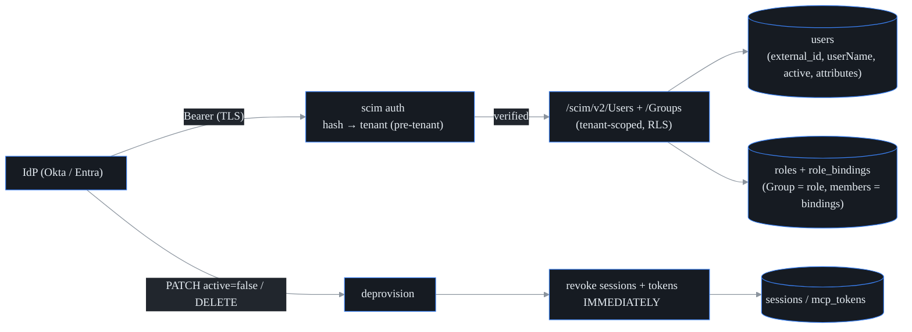
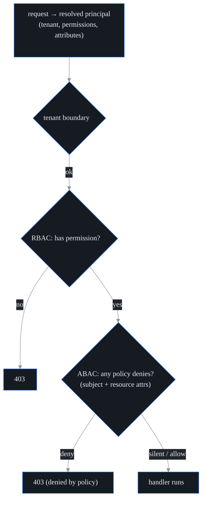

# Enterprise identity: SCIM 2.0 + ABAC + directory integration (S31 · F25)

probectl extends the S18 SSO/RBAC foundation with **SCIM 2.0** user/group lifecycle
provisioning, **ABAC** (attribute policies layered over RBAC), and the
directory-integration path that Entra ID / Okta actually use (SCIM push +
OIDC SSO). The two pillars are: an IdP can **provision and — critically —
deprovision** users (deprovision revokes access *immediately*), and an
attribute policy can **narrow** what an RBAC role grants.

## SCIM 2.0 provisioning

The IdP calls `/scim/v2/*` with a **per-tenant SCIM bearer token**. Like sessions
and MCP tokens, the lookup is **pre-tenant** — the token selects its own tenant —
and only the token's hash is stored. All provisioning is then tenant-scoped (RLS),
so one tenant's IdP can never touch another's directory.



Endpoints:

- **Users** — `POST` (provision), `GET` (list with `userName eq` filter +
  `startIndex`/`count`), `GET/{id}`, `PUT/{id}`, `PATCH/{id}`, `DELETE/{id}`.
- **Groups** — `POST`, `GET`, `GET/{id}`, `PATCH/{id}` (member add/remove), `DELETE`.
  A SCIM **Group maps to a probectl role**; group membership is a role binding —
  this is the **group-sync mapping**.
- **Discovery** — `GET /scim/v2/ServiceProviderConfig`.

Conformance details (IdPs are strict): responses use `application/scim+json` and
the SCIM error envelope (`urn:…:Error`, status as a string); `201` on create,
`409`/`uniqueness` on a duplicate `userName`, `404` for an unknown id, `204` on
delete. PATCH handles the divergent IdP encodings of "deactivate" — Okta's
valueless `replace` with `{"active":false}` and Entra's `path:"active"` with the
string `"False"`.

### Deprovision → immediate revocation (the watch-out)

When a user is **deactivated** (`active=false` via PATCH/PUT) or **DELETE**d, probectl
deletes **all of that user's sessions** and revokes their MCP tokens in the same
request. The next request on a deprovisioned session fails to resolve and returns
`401` — there is no TTL window. (This does not depend on any cache; it is a direct
session delete.)

### Minting a SCIM token

An operator mints the per-tenant bearer token with the control-plane CLI (the IdP
pastes it into its provisioning config). The token is shown once.

```
probectl-control scim-token --tenant <tenant-uuid> --name okta
```

## ABAC over RBAC

ABAC is a **third** check after the tenant boundary and RBAC. RBAC is the baseline
grant; ABAC **narrows** it with tenant-scoped attribute policies (it never widens
access beyond RBAC). The model is **deny-override**.



A **Policy** applies to a permission (or `*`) and matches when **every** listed
subject attribute and **every** listed resource attribute equals the request's
value; among matching policies the highest `priority` decides and a `deny` wins
ties. Subject attributes come from the user's SCIM-provisioned `attributes` (e.g.
`department`) plus a derived `mfa` flag — so policies express things like:

- "contractors cannot write" — deny `test.write` when `department=contractor`.
- "step-up MFA for incident changes" — deny `incident.write` when `mfa=false`.
- "delegated admin within an org" — a resource-scope policy on `org` (role
  bindings already carry an org/team/project scope).

Policies are managed at `/v1/abac/policies` (gated by `directory.read`/`directory.write`)
and cached per tenant for a short TTL (policy CRUD invalidates the cache).

## Directory connectors

Entra ID and Okta integrate via the **standard path probectl already supports**:
**OIDC SSO** (S18, per-tenant IdP) for login + **SCIM push** for lifecycle and
group sync. No additional connector is needed for these IdPs.

## Permissions added

`directory.read` / `directory.write` gate the directory-admin surface (SCIM tokens,
ABAC policies, user/group lifecycle) — delegated admin within a tenant. They are
seeded to the admin role.

## Security guardrails upheld

- **Tenant-first, then RBAC, then ABAC** on every protected path (§1, §5).
- **Immediate revocation** on deprovision — no stale sessions/tokens (the watch-out).
- **Pre-tenant bearer**, hash-only token storage; cross-tenant SCIM is rejected (§6, §1).
- **TLS** on the API; SCIM bodies are size-limited + validated (untrusted input).
- **Audited** — every provision/update/deprovision + policy change writes an audit event.

## Out of scope (deferred)

LDAP/AD **pull** connectors and **SAML** (OIDC is implemented; Entra/Okta use SCIM
push + OIDC); SCIM bulk/sort/etag; full resource-attribute plumbing into every
handler (the ABAC resource model + role-binding scopes exist; per-handler resource
attributes are incremental). BYOK/governance is S-EE3.
