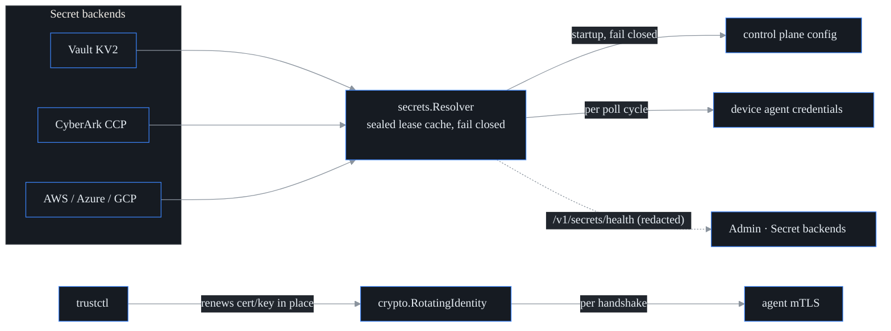

# Secrets integration (S41, F31)

probectl resolves device, source, and integration credentials from enterprise
secret backends — HashiCorp Vault, CyberArk CCP, AWS Secrets Manager, Azure
Key Vault, GCP Secret Manager — instead of keeping plaintext in config files
or long-lived environment variables. The same sprint closes the trustctl loop:
agents present **trustctl-issued machine identities** for mTLS, and pick up
in-place certificate renewals without a restart.

Three guarantees (CLAUDE.md §7 guardrails 3, 6, 12 + the S41 contract):

1. **No plaintext at rest.** References resolve in memory at use time. The
   resolver's lease cache stores values only AES-256-GCM-sealed (via the
   `internal/crypto` provider) under an ephemeral per-process key.
2. **Short-lived leases.** A resolved value is served from cache for the lease
   TTL (default 5 m), then re-resolved — rotated upstream secrets apply
   without restarts. Device credentials re-resolve on **every poll cycle /
   stream reconnect**.
3. **Fail closed.** An unreachable backend or unresolvable reference is an
   error — never an empty, partial, or stale credential. A rotated-away secret
   stops being used at lease expiry.

## Secret references

Anywhere probectl accepts a credential value, the value may be a reference:

| Form | Backend |
|---|---|
| `env:NAME` | process environment |
| `vault:<mount>/<path>#<field>` | Vault KV v2 |
| `cyberark:<query>` (e.g. `Safe=NetOps;Object=snmp-core`; `#username` selects UserName) | CyberArk CCP |
| `aws:<secret-id>[#<json-field>]` | AWS Secrets Manager |
| `azure:<vault-name>/<secret-name>` | Azure Key Vault |
| `gcp:<project>/<secret>[/<version>]` | GCP Secret Manager |
| `literal:<value>` | escape hatch for a literal that starts with a scheme |

Anything else is a literal and passes through unchanged, so existing
configurations keep working.

## Backend access configuration (environment only)

Backend access settings come from the **environment only** — never probectl
config files. All calls ride TLS with certificate verification (guardrail 12);
no cloud SDKs are linked (stdlib HTTP + SigV4/OAuth2/JWT via `internal/crypto`).

| Backend | Variables |
|---|---|
| Vault | `PROBECTL_SECRETS_VAULT_ADDR`, then `PROBECTL_SECRETS_VAULT_TOKEN` **or** `_ROLE_ID` + `_SECRET_ID` (AppRole, re-login at ⅔ TTL); optional `_NAMESPACE` |
| CyberArk CCP | `PROBECTL_SECRETS_CYBERARK_URL`, `_APP_ID`; optional client cert `_CERT_FILE` + `_KEY_FILE` (+ `_CA_FILE`) |
| AWS | `AWS_REGION` (or `AWS_DEFAULT_REGION`), `AWS_ACCESS_KEY_ID`, `AWS_SECRET_ACCESS_KEY`; optional `AWS_SESSION_TOKEN` |
| Azure | `AZURE_TENANT_ID`, `AZURE_CLIENT_ID`, `AZURE_CLIENT_SECRET` (client-credentials grant) |
| GCP | `GOOGLE_APPLICATION_CREDENTIALS` (service-account key file; RS256 JWT-bearer grant) |

A *misconfigured* backend (e.g. a CyberArk cert that does not load, an
unreadable GCP key file) fails startup — fail closed, not silent skip. An
*unconfigured* backend simply leaves its scheme unavailable.

## What resolves where

**Control plane** (at startup, before anything consumes the config; any
failure aborts startup): `PROBECTL_OIDC_CLIENT_SECRET`, `PROBECTL_CMDB_SECRET`,
`PROBECTL_AI_MODEL_TOKEN`, `PROBECTL_SIEM_TOKEN`, and the `secret` parts of
`PROBECTL_CHANGE_WEBHOOKS`, `PROBECTL_NOTIFY_CONNECTORS`,
`PROBECTL_NOTIFY_INBOUND`. (OTLP ingest tokens are probectl-issued inbound
tokens, not external credentials — they stay direct.)

**Device agent** (per poll cycle / per gNMI reconnect): every
`PROBECTL_DEVICE_CRED_<NAME>_*` field value, e.g.

```sh
export PROBECTL_SECRETS_VAULT_ADDR=https://vault.acme.example:8200
export PROBECTL_SECRETS_VAULT_ROLE_ID=...  PROBECTL_SECRETS_VAULT_SECRET_ID=...
# SNMPv3 credential "core-sw" — references, not material:
export PROBECTL_DEVICE_CRED_CORE_SW_USERNAME=monitor
export PROBECTL_DEVICE_CRED_CORE_SW_AUTH_PROTO=sha256
export PROBECTL_DEVICE_CRED_CORE_SW_AUTH_PASS='vault:kv/netops/snmp#auth'
export PROBECTL_DEVICE_CRED_CORE_SW_PRIV_PROTO=aes
export PROBECTL_DEVICE_CRED_CORE_SW_PRIV_PASS='vault:kv/netops/snmp#priv'
```

A failed re-resolution **skips the poll cycle** (`cred_errors` counter, warn
log) rather than polling with stale material.

## Observability

`GET /v1/secrets/health` (directory read) returns per-backend counters, live
lease counts, last success, and the last **redacted** error — never secret
material; reference fragments are masked (`vault:kv/x#…`). The Admin page
renders this as the **Secret backends** card, with
`resolver_running=false` distinguishing an unwired resolver from an idle one.

## trustctl machine identities (agent mTLS)

The agent's client certificate is loaded through `crypto.RotatingIdentity`:
the cert file's mtime/size are checked (at most every 10 s) on handshake, so a
trustctl renewal written **in place** is presented on the next connection —
including gRPC reconnects — with no agent restart. An optional SPIFFE URI
prefix pins the identity: a renewal carrying the wrong identity is refused
(the last attested pair keeps serving; a parse-failed mid-write renewal is
also skipped). Server-side, `ServerMTLSConfigRotating` gives the
agent-transport listener the same rotation behavior.



## Operational notes

- Lease TTL: `secrets.DefaultLease` (5 m). Health counters are process-local.
- Errors and health snapshots never contain secret material; backend HTTP
  bodies are never echoed into errors (status codes only).
- The cache key is per-process and ephemeral: a restart re-resolves everything.
- BYOK / per-tenant key management UX builds on this in S-EE3 (out of scope here).
