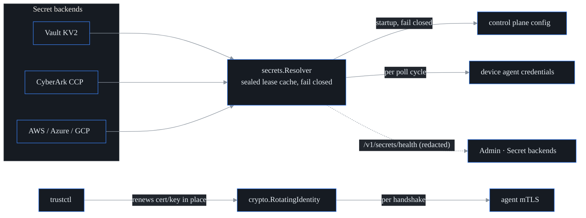

# Secrets integration

**What this is.** probectl never needs you to paste a database password, an SNMP
credential, or an API token into a config file. Anywhere it accepts a secret, you
can instead hand it a *reference* — a short string like
`vault:kv/netops/snmp#auth` — and probectl resolves the real material from your
enterprise secret store at the moment it is needed. Supported backends:
HashiCorp Vault, CyberArk CCP, AWS Secrets Manager, Azure Key Vault, and GCP
Secret Manager.

The same machinery closes the loop with **trustctl** (the sibling
certificate/identity product): agents present trustctl-issued machine identities
for mTLS and pick up in-place certificate renewals without restarting.

This serves three of the project's security
[non-negotiables](../CONTRIBUTING.md): crypto only through `internal/crypto`,
no hardcoded or logged secrets, and TLS on every channel.

## Three guarantees

1. **No plaintext at rest.** References resolve in memory, at use time. The
   resolver's short-lived lease cache holds values only AES-256-GCM-sealed (via
   the `internal/crypto` provider) under an ephemeral per-process key — so even a
   memory dump of the cache yields ciphertext, and a restart re-resolves
   everything fresh.
2. **Short-lived leases.** A resolved value is served from cache for the lease
   TTL (default 5 minutes), then re-resolved. Rotate a secret upstream and the
   new value applies without restarting probectl. Device credentials re-resolve
   even more often — on **every poll cycle or stream reconnect**.
3. **Fail closed.** An unreachable backend or an unresolvable reference is an
   **error** — never an empty, partial, or stale credential silently substituted.
   A secret that has been rotated away stops being used at lease expiry.

## Secret references

Anywhere probectl accepts a credential value, that value may be a reference:

| Form | Backend |
|---|---|
| `env:NAME` | process environment |
| `vault:<mount>/<path>#<field>` | Vault KV v2 |
| `cyberark:<query>` (e.g. `Safe=NetOps;Object=snmp-core`; `#username` selects UserName) | CyberArk CCP |
| `aws:<secret-id>[#<json-field>]` | AWS Secrets Manager |
| `azure:<vault-name>/<secret-name>` | Azure Key Vault |
| `gcp:<project>/<secret>[/<version>]` | GCP Secret Manager |
| `literal:<value>` | escape hatch for a literal that happens to start with a scheme |

Anything that does not match a scheme is treated as a literal and passes through
unchanged — so existing plaintext configurations keep working while you migrate.

## Backend access configuration (environment only)

How probectl *reaches* each backend is configured through the **environment
only** — never probectl config files, so the access credentials themselves never
sit in a file probectl reads. Every backend call rides TLS with certificate
verification — never disabled. No cloud SDKs are linked in: it is stdlib HTTP plus
SigV4 / OAuth2 / JWT signing through `internal/crypto`.

| Backend | Variables |
|---|---|
| Vault | `PROBECTL_SECRETS_VAULT_ADDR`, then `PROBECTL_SECRETS_VAULT_TOKEN` **or** `_ROLE_ID` + `_SECRET_ID` (AppRole, re-login at ⅔ of TTL); optional `_NAMESPACE` |
| CyberArk CCP | `PROBECTL_SECRETS_CYBERARK_URL`, `_APP_ID`; optional client cert `_CERT_FILE` + `_KEY_FILE` (+ `_CA_FILE`) |
| AWS | `AWS_REGION` (or `AWS_DEFAULT_REGION`), `AWS_ACCESS_KEY_ID`, `AWS_SECRET_ACCESS_KEY`; optional `AWS_SESSION_TOKEN` |
| Azure | `AZURE_TENANT_ID`, `AZURE_CLIENT_ID`, `AZURE_CLIENT_SECRET` (client-credentials grant) |
| GCP | `GOOGLE_APPLICATION_CREDENTIALS` (service-account key file; RS256 JWT-bearer grant) |

A *misconfigured* backend (a CyberArk client cert that will not load, an
unreadable GCP key file) **fails startup** — fail closed, not a silent skip. A
backend you simply did not configure leaves its scheme unavailable, which is
fine.

## What resolves where

**Control plane** — resolved at startup, before anything consumes the config, and
any failure aborts startup: `PROBECTL_OIDC_CLIENT_SECRET`, `PROBECTL_CMDB_SECRET`,
`PROBECTL_AI_MODEL_TOKEN`, `PROBECTL_SIEM_TOKEN`, and the `secret` parts of
`PROBECTL_CHANGE_WEBHOOKS`, `PROBECTL_NOTIFY_CONNECTORS`, and
`PROBECTL_NOTIFY_INBOUND`. (OTLP ingest tokens are probectl-issued *inbound*
tokens, not external credentials, so they are configured directly.)

**Device agent** — resolved per poll cycle / per gNMI reconnect: every
`PROBECTL_DEVICE_CRED_<NAME>_*` field value. For example:

```sh
export PROBECTL_SECRETS_VAULT_ADDR=https://vault.acme.example:8200
export PROBECTL_SECRETS_VAULT_ROLE_ID=...  PROBECTL_SECRETS_VAULT_SECRET_ID=...
# SNMPv3 credential "core-sw" — references, not material:
export PROBECTL_DEVICE_CRED_CORE_SW_USERNAME=monitor
export PROBECTL_DEVICE_CRED_CORE_SW_AUTH_PROTO=sha256
export PROBECTL_DEVICE_CRED_CORE_SW_AUTH_PASS='vault:kv/netops/snmp#auth'
export PROBECTL_DEVICE_CRED_CORE_SW_PRIV_PROTO=aes
export PROBECTL_DEVICE_CRED_CORE_SW_PRIV_PASS='vault:kv/netops/snmp#priv'
```

A failed re-resolution **skips the poll cycle** (incrementing a `cred_errors`
counter and logging a warning) rather than polling a device with stale material.

## Observability

`GET /v1/secrets/health` returns per-backend counters, live lease counts, last
success time, and the last error — **redacted**: never any secret material, and
reference fragments are masked (`vault:kv/x#…`). The Admin UI renders this as the
**Secret backends** card; a `resolver_running=false` flag distinguishes an
unwired resolver from one that is simply idle.

## trustctl machine identities (agent mTLS)

The agent's client certificate is loaded through `crypto.RotatingIdentity`. On
each handshake it checks the cert file's mtime and size (at most every 10
seconds), so a trustctl renewal **written in place** is presented on the next
connection — including gRPC reconnects — with no agent restart. An optional
SPIFFE URI prefix pins the identity: a renewal carrying the *wrong* identity is
refused (the last attested key pair keeps serving; a half-written renewal caught
mid-write is also skipped). On the server side, `ServerMTLSConfigRotating` gives
the agent-transport listener the same hot-rotation behavior.



## Operational notes

- Lease TTL is `secrets.DefaultLease` (5 minutes). Health counters are
  process-local.
- Errors and health snapshots never contain secret material; backend HTTP
  response bodies are never echoed into errors (status codes only).
- The cache key is per-process and ephemeral: a restart re-resolves everything.
- Per-tenant key management / BYOK builds on this same resolver — see
  [byok.md](byok.md).
