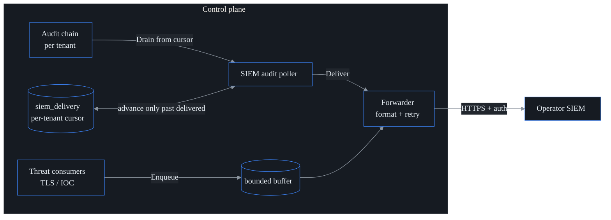

# SIEM export (S32 · F26)

probectl forwards its **audit stream** and **threat-plane signals** to a SOC's SIEM.
It is a **forwarder, not a SIEM**: events are rendered into a standard wire format
and pushed over hardened TLS. probectl never blocks traffic and is not an IPS — a
threat finding is a confidence-scored *signal* the SIEM correlates (guardrail 9).

Off by default. Enabling it opens an **outbound connection** to the operator's
SIEM (sovereignty / no-phone-home), so it is explicit, config-gated, and OFF unless
`PROBECTL_SIEM_ENABLED=true`.

## What is forwarded

| Source | Category | Severity | Notes |
| ------ | -------- | -------- | ----- |
| **Audit log** (config changes, logins, data-access) | `audit` | info; `warning` on a failed/denied outcome | drained from the tamper-evident audit chain (S19), tenant-scoped, **PII/secret redacted** |
| **Threat signals** — TLS/cert posture (S27), IOC matches (S28) | `threat` | mapped from the signal's severity | the same confidence-scored signals that build incidents |

Both map onto one canonical `siem.Event` (`internal/siem`), so every format carries
the same fields: time, **tenant**, category, action, severity, actor, target,
outcome, message, and attributes.

## Wire formats

Selectable via `PROBECTL_SIEM_FORMAT` (or the preset default):

- **`syslog`** — RFC 5424 with structured data (`[probectl@32473 tenant="…" …]`).
- **`cef`** — ArcSight CEF (`CEF:0|probectl|probectl|…`), tenant in `cs1`.
- **`ecs`** — Elastic Common Schema JSON (`event.*`, `organization.id` = tenant).
- **`otlp`** — OTLP/HTTP logs JSON (resource attr `probectl.tenant_id`).

## Presets

`PROBECTL_SIEM_PRESET` adapts the auth header + default format to a target SIEM. The
**endpoint is operator-supplied** (the HEC / ingest / Elasticsearch URL):

| Preset | Auth header | Default format |
| ------ | ----------- | -------------- |
| `splunk` | `Authorization: Splunk <token>` | cef |
| `sentinel` | `Authorization: Bearer <token>` | cef |
| `elastic` | `Authorization: ApiKey <token>` | ecs |
| `chronicle` | `Authorization: Bearer <token>` | otlp |
| `generic` | `Authorization: Bearer <token>` (if set) | cef |

## Delivery guarantees (no drops)



- **Audit path** — `SIEMAuditPoller` drains each tenant's audit events from a
  **durable per-tenant cursor** (`siem_delivery`, RLS-scoped). The cursor advances
  **only past events the SIEM acknowledged**, so a restart resumes exactly where it
  paused — no drops, and (modulo a crash window) no re-sends.
- **Threat path** — consumers **enqueue** signals into a bounded buffer; when it is
  full, producers **block** (backpressure) rather than drop. A worker delivers with
  exponential-backoff retry.
- **Outage handling** — a SIEM outage pauses the cursor (the poller commits whatever
  was delivered and resumes next tick); the buffer applies backpressure. Nothing is
  silently discarded.

## Governance & redaction

Exported audit events are scrubbed of secrets/PII before they leave the network: a
built-in denylist (`password`, `token`, `secret`, `api_key`, `authorization`,
`cookie`, `private_key`, `client_secret`, `ssn`, …) plus any keys in
`PROBECTL_SIEM_REDACT_KEYS`. Redacted values become `[redacted]`; the key is kept so
the SIEM still sees the shape of the event.

## Security

- **TLS out** — delivery uses the hardened, certificate-validating HTTP client
  (validation is never disabled). The ingest token is sent only as an auth header,
  never in a URL.
- **Tenant isolation** — the audit poller drains **inside each tenant's RLS scope**;
  the tenant on every exported record is the drained scope's tenant, never a value
  from the event body. One tenant's data can never be forwarded under another's id.
- **Secrets** — the ingest token is runtime config; inject it from a secret manager,
  never commit it, and it is never logged.

## Configuration

See [`configuration.md`](configuration.md#siem-export-s32) for the full key table.
Minimal Splunk HEC example:

```
PROBECTL_SIEM_ENABLED=true
PROBECTL_SIEM_PRESET=splunk
PROBECTL_SIEM_ENDPOINT=https://splunk.example:8088/services/collector/raw
PROBECTL_SIEM_TOKEN=<hec-token>
```
