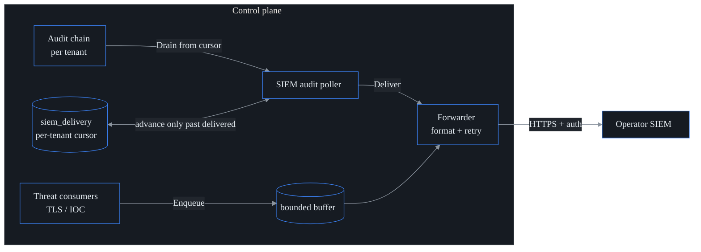

# SIEM export

**What this is.** A SOC runs its own SIEM (Splunk, Sentinel, Elastic, Chronicle)
and wants probectl's security-relevant events flowing into it. This feature
forwards two streams — probectl's **audit log** and its **threat-plane signals** —
into that SIEM, rendered in a standard wire format and pushed over hardened TLS.

The important framing: it is a **forwarder, not a SIEM**. probectl does not store,
search, or correlate these events for you, and it never blocks traffic or acts as
an IPS. A threat finding is a confidence-scored *signal* that the SIEM correlates
(detection is a signal, never an enforcement action — one of probectl's
[non-negotiables](../CONTRIBUTING.md#non-negotiables)). The code is `internal/siem`
(pure — formatters, senders, a buffered forwarder), driven by `internal/control`
which maps `audit.Event` + `incident.Signal` onto the canonical `siem.Event`.

**Off by default.** Enabling it opens an *outbound* connection to the operator's
SIEM, so it is explicit and config-gated — off unless `PROBECTL_SIEM_ENABLED=true`
(sovereignty / no-phone-home).

## What is forwarded

| Source | Category | Severity | Notes |
| ------ | -------- | -------- | ----- |
| **Audit log** (config changes, logins, data-access) | `audit` | `info`; `warning` on a failed / denied outcome | drained from the tamper-evident audit chain, tenant-scoped, **PII / secret redacted** |
| **Threat signals** — TLS / cert posture, IOC matches | `threat` | mapped from the signal's severity | the same confidence-scored signals that build incidents |

Both map onto one canonical `siem.Event`, so every output format carries the same
fields: time, **tenant**, category, action, severity, actor, target, outcome,
message, and attributes.

## Wire formats

Selectable via `PROBECTL_SIEM_FORMAT` (or the preset's default):

- **`syslog`** — RFC 5424 with structured data (`[probectl@32473 tenant="…" …]`).
- **`cef`** — ArcSight CEF (`CEF:0|probectl|probectl|…`), tenant in `cs1`.
- **`ecs`** — Elastic Common Schema JSON (`event.*`, `organization.id` = tenant).
- **`otlp`** — OTLP/HTTP logs JSON (resource attr `probectl.tenant_id`).

## Presets

`PROBECTL_SIEM_PRESET` adapts the auth header + the default format to a target
SIEM. The **endpoint is operator-supplied** (the HEC / ingest / Elasticsearch URL):

| Preset | Auth header | Default format |
| ------ | ----------- | -------------- |
| `splunk` | `Authorization: Splunk <token>` | cef |
| `sentinel` | `Authorization: Bearer <token>` | cef |
| `elastic` | `Authorization: ApiKey <token>` | ecs |
| `chronicle` | `Authorization: Bearer <token>` | otlp |
| `generic` | `Authorization: Bearer <token>` (if set) | cef |

## Delivery guarantees (no drops)

A SIEM is a security audit destination, so the design rule is: **never silently
drop an event.** The two streams reach that guarantee by different means.



- **Audit path** — `SIEMAuditPoller` drains each tenant's audit events from a
  **durable per-tenant cursor** (`siem_delivery`, RLS-scoped). It drains one page
  per short transaction and advances the committed cursor **only past events the
  SIEM acknowledged**. So a restart resumes exactly where it paused — no drops,
  and (outside a narrow crash window) no re-sends.
- **Threat path** — consumers **enqueue** signals into a bounded buffer; when it
  is full, producers **block** (backpressure) rather than drop. A worker delivers
  with exponential-backoff retry.
- **Outage handling** — a SIEM outage pauses the cursor (the poller commits
  whatever was delivered and resumes next tick); the buffer applies backpressure.
  Nothing is silently discarded.

## Governance & redaction

Exported audit events are scrubbed of secrets / PII before they leave the network.
A built-in case-insensitive denylist (`password`, `passwd`, `secret`, `token`,
`api_key`, `apikey`, `authorization`, `cookie`, `private_key`, `client_secret`,
`ssn`) plus any keys in `PROBECTL_SIEM_REDACT_KEYS` are matched on the audit
record's `data` keys. A redacted value becomes `[redacted]` — the key is kept, so
the SIEM still sees the *shape* of the event without the sensitive value.

## Security

- **TLS out** — delivery uses the hardened, certificate-validating HTTP client
  (`crypto.HardenedHTTPClient`); validation is never disabled. The ingest token is
  sent only as an auth header, never in a URL.
- **Tenant isolation** — the audit poller drains **inside each tenant's RLS scope**;
  the tenant stamped on every exported record is the drained scope's tenant, never
  a value from the event body. One tenant's data can never be forwarded under
  another's id.
- **Secrets** — the ingest token is runtime config; inject it from a secret
  manager, never commit it, and it is never logged.

## Configuration

See [`configuration.md`](configuration.md#siem-export) for the full key table.
Minimal Splunk HEC example:

```
PROBECTL_SIEM_ENABLED=true
PROBECTL_SIEM_PRESET=splunk
PROBECTL_SIEM_ENDPOINT=https://splunk.example:8088/services/collector/raw
PROBECTL_SIEM_TOKEN=<hec-token>
```
