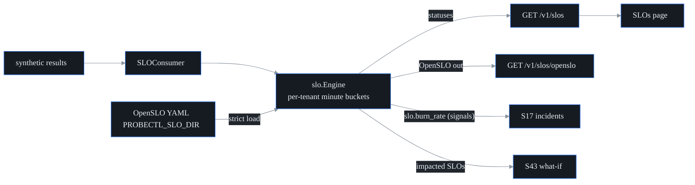

# SLO + business-impact engine (S45, F42)

probectl speaks exec-grade reliability language over the network planes:
**OpenSLO-compatible** SLI/SLO definitions evaluated per tenant over the
synthetic-result stream, **error budgets**, **multi-window multi-burn-rate
alerts** (the Google SRE method), and service/team (business-unit) mapping —
with lossless OpenSLO import/export so definitions move freely between
probectl and other OpenSLO tooling.

## OpenSLO conformance (the watch-out: conform, don't diverge)

Definitions are OpenSLO v1 documents (`apiVersion: openslo/v1`, `kind: SLO`),
restricted to the subset probectl evaluates:

- `ratioMetric` indicators (good/total) with `metricSource.type: probectl`
- `budgetingMethod: Occurrences`
- exactly one **rolling** `timeWindow` (`30d`, `7d`, `12h`, …)
- exactly one objective `target` in (0,1)

Anything outside the subset is **rejected loudly at load** (strict field
checking included) — never silently dropped. Export emits the original
document back (lossless round-trip; the round-trip test enforces it).

```yaml
apiVersion: openslo/v1
kind: SLO
metadata:
  name: checkout-availability
  displayName: Checkout availability
  labels:
    team: payments            # the business-unit mapping (showback)
spec:
  service: checkout
  indicator:
    metadata: { name: checkout-probe-success }
    spec:
      ratioMetric:
        good:
          metricSource:
            type: probectl
            spec: { canary_type: http, target: checkout.acme.example, outcome: success }
        total:
          metricSource:
            type: probectl
            spec: { canary_type: http, target: checkout.acme.example }
  timeWindow: [{ duration: 30d, isRolling: true }]
  budgetingMethod: Occurrences
  objectives: [{ target: 0.99 }]
```

`target` supports a trailing `*` prefix wildcard (`api.*`); `canary_type`
empty matches any probe type. Definitions load from `PROBECTL_SLO_DIR`
(multi-document YAML allowed); a malformed or duplicate definition **fails
startup** — an SLO the operator believes is tracked must actually be.

## Error budgets + multi-window burn-rate alerts

Burn rate = `errorRate(window) / (1 − target)`, so burn 1 spends exactly the
budget over the SLO window. Alerts require **both** a long and a short window
over the threshold (the multi-window AND — the long window proves it's
sustained, the short window proves it's still happening), which is what kills
noisy *and* slow alerts (the second watch-out):

| Tier | Long | Short | Burn ≥ | Severity |
|---|---|---|---|---|
| fast | 1h | 5m | 14.4 | critical (page) |
| medium | 6h | 30m | 6 | critical (page) |
| slow | 3d | 6h | 1 | warning (ticket) |

Breaches raise `slo.burn_rate` signals (plane `slo`) into the incident
pipeline, **latched per window per episode** (one signal when it starts
firing; re-armed when the long window clears — hysteresis prevents flapping).

**Cold start** (the third watch-out): an SLO with fewer than 50 events in its
full window never alerts and reports `cold_start: true` — an empty baseline
is not an outage. The gate is on full-window history, not per-alert-window
density, so low-cadence probes (one every few minutes) still get fast alerts.

## Surfaces

- `GET /v1/slos` (`metrics.read`) — tenant-scoped statuses: attainment,
  error budget remaining, total events, cold-start flag, per-window burn
  rates + firing state. `slo_running=false` = engine unwired.
- `GET /v1/slos/openslo` — the loaded definitions as an OpenSLO v1 YAML
  stream (definitions are deployment-level config; statuses are per tenant).
- **SLOs page** (`/slos`): the exec dashboard — attainment vs objective,
  error-budget bar, burn-rate badges, service/team labels, honest cold-start
  and not-wired states.
- **What-if integration** (S43 seam, closed): failure simulations now report
  `impacted_slos` — the SLOs whose service or probe target sits in the blast
  radius.



## Configuration

| Variable | Default | Purpose |
|---|---|---|
| `PROBECTL_SLO_ENABLED` | `true` | the engine + consumer (local-only) |
| `PROBECTL_SLO_DIR` | (none) | OpenSLO YAML definitions directory (empty = zero SLOs, honestly reported) |

Out of scope by design: app-level SLOs (probectl correlates the network
planes; it does not own application instrumentation).
