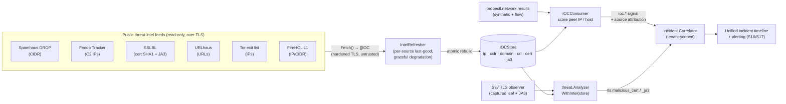

# Threat-intel enrichment (S28 · F38)

probectl can match observed network activity — peer IPs, target hostnames, server
**certificates**, and client **JA3** fingerprints — against public **threat-intel
feeds**, surfacing matches as **confidence-scored, source-attributed threat-plane
signals** that correlate into the unified incident timeline (S16/S17).

This is a **signal, not an IPS** (CLAUDE.md §7 guardrail 9): a match is scored,
tunable, and suppressible — probectl **never blocks traffic** and never acts inline.

## Status

**Off by default.** Enabling it makes outbound fetches to the configured feeds, so
it is gated behind `PROBECTL_THREATINTEL_ENABLED` (sovereignty / no-phone-home —
guardrail 2). When disabled, no feed is contacted and no IOC code runs.

## How it works

Threat-intel reuses the **S15 open-data framework** and its AUP/provenance model.
Feed adapters normalize each public feed into **IOCs**; a shared, tenant-agnostic
**IOC store** is rebuilt atomically on each refresh; the threat plane scores
already-captured observations against it. Feeds are **ingested once and shared**;
a match lands on a **tenant-scoped** incident record, so the tenant boundary is
enforced where the match lands (PRD §3).

### The two scoring paths

- **IP / host** (`IOCConsumer`, over `probectl.network.results`): every result's peer
  address is scored. An IP is matched exactly and against any **containing CIDR**;
  a hostname target is matched against the domain feed. A `:port` is stripped first.
- **Certificate / JA3** (`threat.Analyzer.WithIntel`, the **S27 tie**): the
  already-captured leaf cert's **SHA1 fingerprint** (`crypto.CertSHA1`) and the
  client **JA3** are scored against SSLBL. This reuses S27's captured TLS — it
  **never re-handshakes**.

### Severity from confidence

A feed's confidence maps to incident severity (always tunable downstream):

| Confidence | Severity   |
| ---------- | ---------- |
| ≥ 80       | `critical` |
| 60–79      | `warning`  |
| < 60       | `info`     |

So a botnet-C2 IP (confidence 90) is `critical`, while a Tor-exit IP (confidence
50) is an `info` context signal rather than an alarm.

Every signal carries provenance attributes so an analyst sees **why** it fired and
can tune/suppress it: `intel.source`, `intel.category`, `intel.type`,
`intel.indicator`, `intel.confidence`, and `intel.license`.

## Feeds & AUP matrix

Each feed carries machine-readable provenance/AUP (the `Descriptor().AUP` from
S15). As with open-data enrichment, these terms are **not a constraint on private
development or single-tenant OSS use** — they gate only **commercial / MSP resale**
(CLAUDE.md §2, PRD §10.3). Resolve redistribution terms before enabling provider
mode commercially.

| Feed | `name` | IOC type | Category | Confidence | License / terms | Commercial use |
| ---- | ------ | -------- | -------- | ---------- | --------------- | -------------- |
| **Spamhaus DROP** | `spamhaus_drop` | CIDR | spam / hijacked netblocks | 90 | Spamhaus DROP (free) | allowed-with-attribution |
| **Feodo Tracker** (abuse.ch) | `feodo_tracker` | IP | botnet C2 | 90 | abuse.ch CC0 | allowed |
| **SSLBL certs** (abuse.ch) | `sslbl` | cert SHA1 | malicious cert | 95 | abuse.ch CC0 | allowed |
| **SSLBL JA3** (abuse.ch) | `sslbl_ja3` | JA3 | malicious JA3 | 85 | abuse.ch CC0 | allowed |
| **URLhaus** (abuse.ch) | `urlhaus` | URL | malware URL | 85 | abuse.ch CC0 | allowed |
| **Tor exit list** | `tor_exit` | IP | tor exit | 50 | Tor Project (CC0) | allowed |
| **FireHOL level 1** | `firehol_level1` | IP / CIDR | aggregate blocklist | 75 | aggregate (mixed terms) | **restricted** |

> **FireHOL** aggregates many upstream feeds with **mixed licenses** — it is marked
> `restricted` for resale; verify upstream terms before commercial redistribution.

Set `PROBECTL_THREATINTEL_FEEDS` to a comma-separated subset of the `name` column, or
leave it empty to load all built-in feeds.

## Reliability & accuracy caveats

- **Graceful degradation** (guardrail 10): the refresher keeps each source's
  **last-good** IOCs. A feed that is down, rate-limited, or malformed leaves the
  prior indicators in place and never empties the store or breaks a core path.
- **Freshness:** indicators are only as current as the last successful refresh
  (`PROBECTL_THREATINTEL_REFRESH`, default 6h). A signal reflects feed state at
  refresh time, not real time.
- **False positives:** public feeds carry stale or shared-infrastructure entries
  (e.g. a CDN IP once used for C2; a Tor exit is not inherently malicious). Treat
  matches as **leads to triage**, weigh `intel.confidence`, and tune/suppress noisy
  sources. This is **enrichment**, not adjudication.
- **Untrusted input:** every feed is fetched over **TLS with certificate validation
  (never disabled)** and parsed as **untrusted** — malformed indicators are skipped
  (guardrails 10, 12).

## Configuration

| Variable                     | Default | Description                                                            |
| ---------------------------- | ------- | --------------------------------------------------------------------- |
| `PROBECTL_THREATINTEL_ENABLED` | `false` | master switch (outbound feed fetches); off ⇒ no IOC code runs         |
| `PROBECTL_THREATINTEL_REFRESH` | `6h`    | feed refresh cadence                                                   |
| `PROBECTL_THREATINTEL_FEEDS`   | (all)   | comma-separated feed names to load; empty ⇒ all built-in feeds        |

## Security guardrails upheld

- **Signal, not IPS** — confidence-scored, tunable, suppressible; no inline block (§9).
- **No phone-home** — off by default; outbound only when explicitly enabled (§2).
- **Tenant-scoped** — feeds shared (ingested once); matches land on tenant-scoped
  incidents; the consumer carries each result's `tenant_id` (§1).
- **Graceful + untrusted** — last-good caching; TLS-verified fetch; untrusted parse (§10, §12).
- **AUP/provenance tracked** per feed for MSP/commercial resale (§2, §10).
- **FIPS crypto abstraction** — the cert SHA1 fingerprint goes through
  `crypto.CertSHA1`; no hash primitive is imported outside `internal/crypto` (§3).

## The triage surface (S-FE3)

Attributed matches are retained as tenant-scoped, in-memory **detections**
(newest first, bounded per tenant; recognized from threat-plane signals
carrying `intel.*` provenance, so S42's NDR detections land in the same store
without a new pipeline) and served at `GET /v1/threat/detections`
(RBAC `threat.read`; `detections_running` honesty flag). Each detection
carries the flagged entity, the matched indicator, the attributing feed with
**confidence + category + license (verbatim provenance)**, and the correlated
**incident id** — the pivot into the incident timeline
(`/incidents?incident=<id>` is a supported deep link). The web surface lives
on `/security` above the certificate inventory: severity/source/text filters,
a provenance detail view that states plainly that feeds can list benign
infrastructure and that probectl never blocks (guardrail 9). The durable
trail remains the incident + SIEM export; the store rebuilds from the stream.
