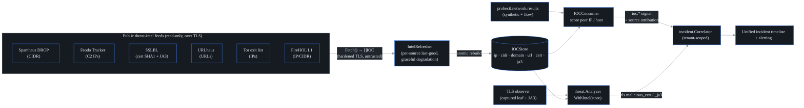

# Threat-intel enrichment

## What this is

Think of probectl as a security guard who already watches everyone walking
through the building. Threat-intel enrichment hands that guard a **wanted
list** — public feeds of known-bad IP addresses, hostnames, malicious server
certificates, and malicious TLS client fingerprints (JA3). When something
probectl already saw on the network matches an entry on that list, probectl
raises a flag.

Concretely: probectl matches observed network activity — peer IPs, target
hostnames, server **certificates**, and client **JA3** fingerprints (a JA3 is
a hash of *how* a TLS client introduces itself in its handshake — which
protocol versions, ciphers, and extensions it offers — so the same malware
family fingerprints the same even when its server addresses change) — against
public **threat-intel feeds**, and surfaces each match as a
**confidence-scored, source-attributed threat-plane signal** that lands on the
unified incident timeline.

It lives in `internal/opendata` (the feed adapters and the shared indicator
store) and `internal/control/threatintel.go` (the consumer that scores live
results and raises signals).

### The one rule that shapes everything: a signal, not an IPS

probectl **never blocks traffic and never sits inline.** A match is a *lead* —
scored, tunable, and suppressible — not an enforcement action (detection is a
signal, never an IPS — one of probectl's
[non-negotiables](../CONTRIBUTING.md#non-negotiables)). The wanted list tells
the guard "keep an
eye on that person"; it does not let the guard slam a door. Why hold this line?
Because an inline blocker that acts on a noisy public feed will eventually drop
legitimate traffic (a CDN that once hosted malware, a Tor exit that is not
actually attacking you). probectl is an observability tool: it tells a human
*why* to look, and the human decides.

## Status: off by default

Enabling threat-intel makes **outbound fetches** to the configured feeds. That
crosses probectl's default of zero outbound calls (the no-phone-home
[non-negotiable](../CONTRIBUTING.md#non-negotiables)), so it is gated
behind `PROBECTL_THREATINTEL_ENABLED` and ships **off**. When disabled, no feed
is ever contacted and no indicator-matching code runs — verified in
`BuildThreatIntel`, which returns `(nil, nil, false)` unless the flag is set
(`internal/control/threatintel.go`).

## How it works

Threat-intel reuses the open-data enrichment framework (`internal/opendata`)
and its provenance/acceptable-use model. The flow has three moving parts:

1. **Feed adapters** each fetch one public feed over hardened TLS and normalize
   its lines into **IOCs** (indicators of compromise — a wanted-list entry: one
   value known or believed to be malicious) — a normalized
   `{type, value, source, category, confidence, license}` record
   (`internal/opendata/feeds.go`).
2. A shared, **tenant-agnostic `IOCStore`** is rebuilt **atomically** on every
   refresh (`internal/opendata/intelstore.go`). "Atomically" means the new
   index is built off to the side and swapped in under a lock, so a query never
   sees a half-loaded list.
3. The **threat plane scores already-captured observations** against that store
   and emits a tenant-scoped signal for each hit.

Feeds are **ingested once and shared** across all tenants (the wanted list is
the same for everyone — fetching one copy per tenant would just hammer the
public feeds for identical bytes). The match itself lands on a
**tenant-scoped** incident record, so the tenant boundary is enforced *where
the match lands*, not in the shared store.

### The two scoring paths

There are two independent places where a captured observation meets the wanted
list:

- **IP / host** (`IOCConsumer`, over the `probectl.network.results` topic): for
  every result, probectl takes the peer address and scores it. An IP is matched
  two ways — exactly, and against any **containing CIDR** block (a CIDR like
  `198.51.100.0/24` names a whole range of addresses at once, so a single
  bad `/24` flags every address inside it). A hostname target is matched
  exactly (lowercased) against any **domain-type** indicators in the store —
  the index exists and is scored, though none of today's built-in feeds emit
  `domain` indicators (they emit IPs, CIDRs, URLs, and cert/JA3 fingerprints).
  A trailing `:port` is stripped first (`peerHost` uses
  `net.SplitHostPort`), so `198.51.100.7:443` scores as `198.51.100.7`.
- **Certificate / JA3** (`threat.Analyzer.WithIntel`, in
  `internal/threat/analyze.go`): the **already-captured** leaf certificate's
  **SHA-1 fingerprint** (a short hash that uniquely identifies one exact
  certificate, computed via `crypto.CertSHA1`) and the client's
  **JA3** are scored against the SSLBL feeds. This reuses TLS data probectl
  already observed — it **never re-handshakes** with the target.

The "already captured" part matters: probectl is not making new connections to
test things. It scores what it saw passively, which keeps it observe-only —
checking the guard's own camera footage against the list, never knocking on
doors to take new photographs.

### Severity comes from feed confidence

Each feed entry carries a confidence number (0–100) — the feed's own estimate
of how certain the listing is. probectl maps that to an
incident severity (`severityForConfidence`), and that severity is always
tunable downstream:

| Confidence | Severity   |
| ---------- | ---------- |
| >= 80      | `critical` |
| 60–79      | `warning`  |
| < 60       | `info`     |

So a botnet-C2 IP (confidence 90) becomes a `critical` incident, while a
Tor-exit IP (confidence 50) becomes an `info` context note rather than an
alarm. (**C2** is command-and-control — the attacker's coordination server;
a **Tor exit** is the last relay of the Tor anonymity network, used by plenty
of legitimate people.) That gradient is deliberate: not everything on a public
list deserves a page at 3 a.m.

Every signal carries provenance attributes so an analyst can see **why** it
fired and can tune or suppress it: `intel.source`, `intel.category`,
`intel.type`, `intel.indicator`, `intel.confidence`, and `intel.license`
(emitted in `iocSignal`).

## Feeds and acceptable-use matrix

Each feed carries machine-readable provenance and acceptable-use (AUP) terms in
its `Descriptor().AUP` (`internal/opendata/feeds.go`) — *provenance* is where
the data came from; the *AUP* (acceptable-use policy) is what its publisher
permits you to do with it. As with open-data
enrichment, **these terms are not a constraint on private development or
single-tenant open-source use** — they gate only **commercial / MSP resale**
(reselling probectl to many customers; see [`editions.md`](editions.md)).
Resolve redistribution terms before enabling provider mode commercially.

| Feed | `name` | IOC type | Category | Confidence | License / terms | Commercial use |
| ---- | ------ | -------- | -------- | ---------- | --------------- | -------------- |
| **Spamhaus DROP** | `spamhaus_drop` | CIDR | spam / hijacked netblocks | 90 | Spamhaus DROP (free) | allowed-with-attribution |
| **Feodo Tracker** (abuse.ch) | `feodo_tracker` | IP | botnet C2 | 90 | abuse.ch CC0 | allowed |
| **SSLBL certs** (abuse.ch) | `sslbl` | cert SHA1 | malicious cert | 95 | abuse.ch CC0 | allowed |
| **SSLBL JA3** (abuse.ch) | `sslbl_ja3` | JA3 | malicious JA3 | 85 | abuse.ch CC0 | allowed |
| **URLhaus** (abuse.ch) | `urlhaus` | URL | malware URL | 85 | abuse.ch CC0 | allowed |
| **Tor exit list** | `tor_exit` | IP | tor exit | 50 | Tor Project (CC0) | allowed |
| **FireHOL level 1** | `firehol_level1` | IP / CIDR | aggregate blocklist | 75 | aggregate (mixed terms) | **restricted** |

> **FireHOL** aggregates many upstream feeds with **mixed licenses**, so its
> descriptor marks it `restricted` for resale (`CommercialRestricted`). Verify
> upstream terms before commercial redistribution.

Set `PROBECTL_THREATINTEL_FEEDS` to a comma-separated subset of the `name`
column, or leave it empty to load all built-in feeds.

## Reliability and accuracy caveats

- **Graceful degradation** — a down or rate-limited external source must never
  break core function: the `IntelRefresher` keeps
  each source's **last-good** indicators. A feed that is down, rate-limited, or
  malformed leaves the prior indicators in place — it never empties the store
  and never breaks a core path. (See `Refresh` in `intelrefresher.go`: a failed
  `Fetch` logs a warning and the union is rebuilt from the retained sets.) A
  slightly stale wanted list still catches wanted people; an emptied one
  catches nobody.
- **Freshness:** indicators are only as current as the last successful refresh
  (`PROBECTL_THREATINTEL_REFRESH`, default 6h). A signal reflects feed state at
  refresh time, not real time.
- **False positives:** public feeds carry stale or shared-infrastructure
  entries (a CDN IP once used for C2; a Tor exit is not inherently malicious).
  Treat matches as **leads to triage**, weigh `intel.confidence`, and
  tune/suppress noisy sources. This is **enrichment**, not adjudication —
  context added to what you saw, never a verdict on it.
- **Untrusted input:** every feed is fetched over **TLS with certificate
  validation (never disabled)** via `crypto.HardenedHTTPClient` and parsed as
  **untrusted** — malformed indicators are skipped, not trusted. A compromised
  feed is itself a threat vector; the parser assumes so.

## Configuration

| Variable                       | Default | Description                                                     |
| ------------------------------ | ------- | --------------------------------------------------------------- |
| `PROBECTL_THREATINTEL_ENABLED` | `false` | master switch (outbound feed fetches); off ⇒ no indicator code runs |
| `PROBECTL_THREATINTEL_REFRESH` | `6h`    | feed refresh cadence                                            |
| `PROBECTL_THREATINTEL_FEEDS`   | (all)   | comma-separated feed names to load; empty ⇒ all built-in feeds  |

## Security guardrails upheld

These are probectl's standing
[non-negotiables](../CONTRIBUTING.md#non-negotiables), as they apply here:

- **Signal, not IPS** — confidence-scored, tunable, suppressible; no inline
  block.
- **No phone-home** — off by default; outbound only when explicitly enabled.
- **Tenant-scoped** — feeds are shared (ingested once); matches land on
  tenant-scoped incidents, carrying each result's `tenant_id`.
- **Graceful and untrusted** — last-good caching; TLS-verified fetch; untrusted
  parse.
- **AUP/provenance tracked** per feed for MSP/commercial resale.
- **FIPS crypto abstraction** — the cert SHA-1 fingerprint goes through
  `crypto.CertSHA1`; no hash primitive is imported outside `internal/crypto`.

## The triage surface

Attributed matches are also retained as tenant-scoped, in-memory **detections**
(newest first, bounded per tenant). The recognizer keys on threat-plane signals
that carry `intel.*` provenance — and the same store accepts the NDR-lite
detector signals (see [`ndr.md`](ndr.md)) without a separate pipeline, because
both flow through one recognizer (`DetectionFromSignal` in
`internal/threat/detections.go`).

They are served at `GET /v1/threat/detections` (RBAC `threat.read`; the
response carries a `detections_running` honesty flag so a caller can tell the
store is wired — distinguishing "nothing detected" from "nobody was watching").
Each detection carries the flagged entity, the matched
indicator, the attributing feed with **confidence + category + license
(verbatim provenance)**, and the correlated **incident id** — the pivot into
the incident timeline (`/incidents?incident=<id>` is a supported deep link).

The web surface lives on `/security`, above the certificate inventory:
severity/source/text filters, plus a provenance detail view that states plainly
that feeds can list benign infrastructure and that probectl never blocks.
The detection store is in-memory and rebuilds from the stream;
the durable trail is the incident record plus the SIEM export
(see [`siem.md`](siem.md)).
