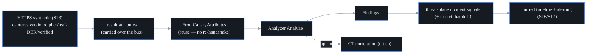

# TLS / certificate observability (S27)

probectl analyzes TLS/cert posture from the data it ALREADY captures — the HTTP
synthetic canary (S13) and eBPF L7 (S21) — so it never re-handshakes (the S27
watch-out). It is the trustctl-adjacent security win, cheap because the handshake
is captured for free.

## Flow

## What it flags

From the captured handshake + leaf certificate: **expired** / **expiring-soon**
(configurable window) / **not-yet-valid** certs, **self-signed**, **weak RSA keys**
(< 2048 bits), **deprecated TLS** (1.0 / 1.1), **weak ciphers** (RC4 / 3DES / NULL /
EXPORT / MD5), and an **untrusted chain** (the capturer's verification failed).
Each finding is severity-scored and surfaced as a **threat-plane incident signal**
— it is a SIGNAL, not an IPS (probectl never blocks traffic; CLAUDE.md §7
guardrail 9).

## trustctl handoff

A certificate finding builds a **trustctl handoff** payload — subject, issuer,
SANs, serial, expiry, reason — and, when `PROBECTL_TRUSTCTL_URL` is set, a one-click
deep-link (`<trustctl>/renew?domain=…&serial=…`) carried in the signal attributes
for renewal / replacement.

## CT correlation (opt-in)

When enabled (`PROBECTL_CT_ENABLED=true`), probectl correlates a leaf's serial against
**Certificate Transparency** logs (crt.sh by default) and flags a serial absent
from CT as a low-severity issuance anomaly. It is **off by default** — an external
fetch (sovereignty / no-phone-home) — and it respects crt.sh's AUP / rate limits
and **degrades gracefully** (a down or throttled CT source is a no-op, never an
error that breaks posture). See [`configuration.md`](configuration.md).

## Coverage caveat

The HTTP synthetic path observes the certificate probectl's own client sees. The
eBPF L7 path (S21) observes server-side TLS, but a **Go server's TLS terminates in
the Go runtime**, so capturing it needs Go-runtime uprobes (the S21 caveat) — TLS
from Go servers can be invisible to the eBPF path until those uprobes land. The
synthetic path is unaffected.

## Out of scope

Malicious-cert / JA3 threat-intel correlation (S28 / S42 via SSLBL); full NDR
detections (S42). JA3 / JA3S are surfaced as observed fields, not scored here.

## The posture surface (S-FE2)

The analyzed posture is retained as a tenant-scoped, in-memory **inventory**
(latest posture per target, bounded per tenant, clean certs included) and
served at `GET /v1/tls/posture` (RBAC `threat.read`, migration 0023;
`collector_running=false` distinguishes an unwired collector from an empty
fleet). The web surface lives at `/security`: the certificate inventory
(filterable by issuer/SAN text and by flag — expired/expiring/weak/self-signed/
CT/intel), an **expiring-soon worklist** (≤30 days, soonest first), and a
per-cert detail view whose **trustctl handoff is the S27 analyzer's payload
verbatim** (copy JSON + deep link via the payload's own URL) — never re-derived
client-side. The inventory rebuilds from the result stream after a restart.
